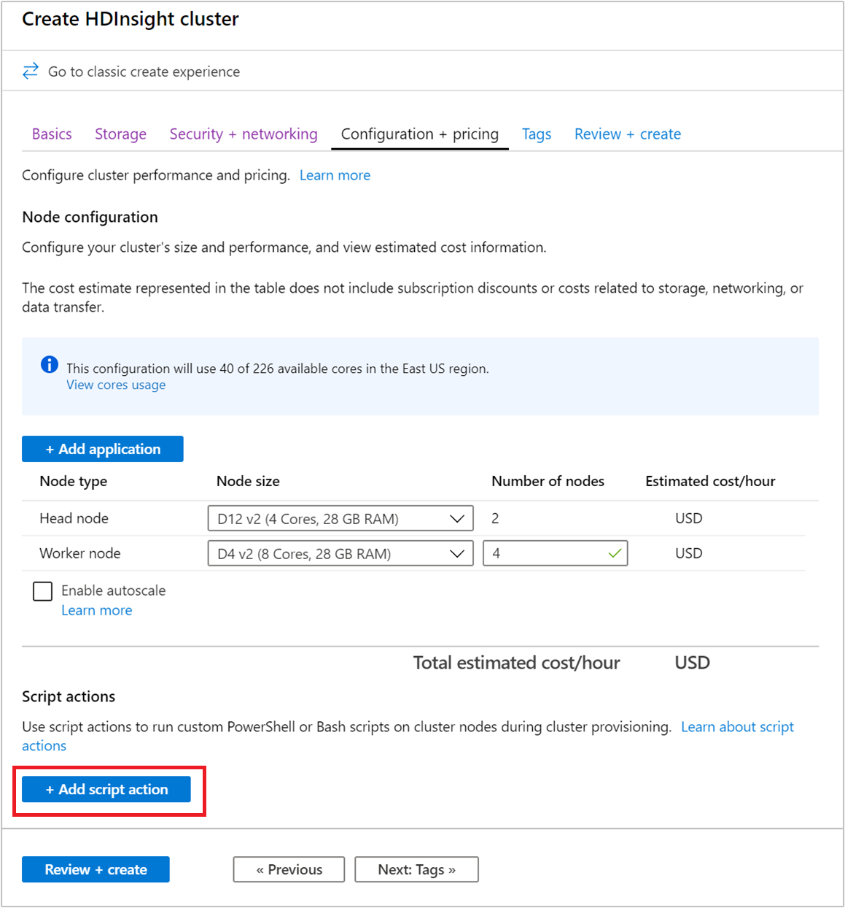
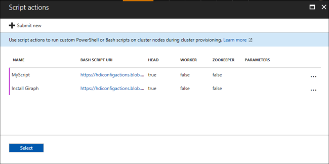
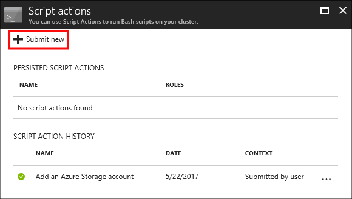
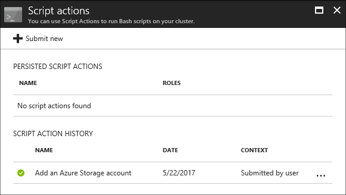
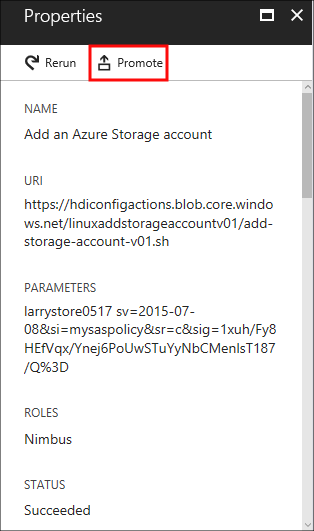

# Customize Azure HDInsight clusters by using script actions

Azure HDInsight provides a configuration method called **script actions** that invoke custom scripts to customize the cluster. These scripts are used to install additional components and change configuration settings. Script actions can be used during or after cluster creation.

Script actions can also be published to the Azure Marketplace as an HDInsight application. For more information on HDInsight applications, see [Publish an HDInsight application in the Azure Marketplace](hdinsight-apps-publish-applications.md).

## Permissions

For a domain-joined HDInsight cluster, there are two Apache Ambari permissions that are required when you use script actions with the cluster:

* **AMBARI.RUN\_CUSTOM\_COMMAND**. The Ambari Administrator role has this permission by default.
* **CLUSTER.RUN\_CUSTOM\_COMMAND**. Both the HDInsight Cluster Administrator and Ambari Administrator have this permission by default.

For more information on working with permissions with domain-joined HDInsight, see [Manage HDInsight clusters with Enterprise Security Package](./domain-joined/apache-domain-joined-manage.md).

## Access control

If you aren't the administrator or owner of your Azure subscription, your account must have at least Contributor access to the resource group that contains the HDInsight cluster.

Someone with at least Contributor access to the Azure subscription must have previously registered the provider. Provider registration happens when a user with Contributor access to the subscription creates a resource. For without creating a resource, see [register a provider by using REST](https://msdn.microsoft.com/library/azure/dn790548.aspx).

Get more information on working with access management:

* [Get started with access management in the Azure portal](../role-based-access-control/overview.md)
* [Use role assignments to manage access to your Azure subscription resources](../role-based-access-control/role-assignments-portal.md)

## Understand script actions

A script action is Bash script that runs on the nodes in an HDInsight cluster. Characteristics and features of script actions are as follows:

* Must be stored on a URI that's accessible from the HDInsight cluster. The following are possible storage locations:

    * For regular clusters:

      * ADLS Gen1: The service principal HDInsight uses to access Data Lake Storage must have read access to the script. The URI format for scripts stored in Data Lake Storage Gen1 is 
      `adl://DATALAKESTOREACCOUNTNAME.azuredatalakestore.net/path_to_file`.

      * A blob in an Azure Storage account that's either the primary or additional storage account for the HDInsight cluster. HDInsight is granted access to both of these types of storage accounts during cluster creation.

        > [!IMPORTANT]  
        > Do not rotate the storage key on this Azure Storage account, as it will cause subsequent script actions with scripts stored there to fail.

      * A public file-sharing service accessible through http:// paths. Examples are Azure Blob, GitHub, OneDrive. For example URIs, see [Example script action scripts](#example-script-action-scripts).

     * For clusters with ESP, the wasb:// or wasbs:// or http[s]:// URIs are supported.

* Can be restricted to run on only certain node types. Examples are head nodes or worker nodes.

* Can be persisted or `ad hoc`.

    Persisted script actions must have a unique name. Persisted scripts are used to customize new worker nodes added to the cluster through scaling operations. A persisted script might also apply changes to another node type when scaling operations occur. An example is a head node.

    `Ad hoc` scripts aren't persisted. Script actions used during cluster creation are automatically persisted. They aren't applied to worker nodes added to the cluster after the script has run. Then you can promote an `ad hoc` script to a persisted script or demote a persisted script to an `ad hoc` script. Scripts that fail aren't persisted, even if you specifically indicate that they should be.

* Can accept parameters that are used by the script during execution.

* Run with root-level privileges on the cluster nodes.

* Can be used through the Azure portal, Azure PowerShell, Azure  CLI, or HDInsight .NET SDK.

The cluster keeps a history of all scripts that have been run. The history helps when you need to find the ID of a script for promotion or demotion operations.

> [!IMPORTANT]  
> There's no automatic way to undo the changes made by a script action. Either manually reverse the changes or provide a script that reverses them.

### Script action in the cluster creation process

Script actions used during cluster creation are slightly different from script actions run on an existing cluster:

* The script is automatically persisted.

* A failure in the script can cause the cluster creation process to fail.

The following diagram illustrates when script action runs during the creation process:

![HDInsight cluster customization and stages during cluster creation][img-hdi-cluster-states]

The script runs while HDInsight is being configured. The script runs in parallel on all the specified nodes in the cluster. It runs with root privileges on the nodes.

You can do operations like stopping and starting services, including Apache Hadoop-related services. If you stop services, ensure Ambari and other Hadoop-related services are running before the script finishes. These required services determine the health and state of the cluster while it's being created.

During cluster creation, you can use many script actions at once. These scripts are invoked in the order in which they were specified.

> [!IMPORTANT]  
> Script actions must finish within 60 minutes, or they time out. During cluster provisioning, the script runs concurrently with other setup and configuration processes. Competition for resources such as CPU time or network bandwidth might cause the script to take longer to finish than it does in your development environment.
>
> To minimize the time it takes to run the script, avoid tasks like downloading and compiling applications from the source. Precompile applications and store the binary in Azure Storage.

### Script action on a running cluster

A script failure on an already running cluster doesn't automatically cause the cluster to change to a failed state. After a script finishes, the cluster should return to a running state. Even if the cluster has a running state, the failed script might have broken things. For example, a script might delete files needed by the cluster.

Scripts actions run with root privileges. Ensure you understand what a script does before you apply it to your cluster.

When you apply a script to a cluster, the cluster state changes from **Running** to **Accepted**. Then it changes to **HDInsight configuration** and, finally, back to **Running** for successful scripts. The script status is logged in the script action history. This information tells you whether the script succeeded or failed. For example, the `Get-AzHDInsightScriptActionHistory` PowerShell cmdlet shows the status of a script. It returns information similar to the following text:

    ScriptExecutionId : 635918532516474303
    StartTime         : 8/14/2017 7:40:55 PM
    EndTime           : 8/14/2017 7:41:05 PM
    Status            : Succeeded

> [!IMPORTANT]  
> If you change the cluster user, admin, password after the cluster is created, script actions run against this cluster might fail. If you have any persisted script actions that target worker nodes, these scripts might fail when you scale the cluster.

## Example script action scripts

Script action scripts can be used through the following utilities:

* Azure portal
* Azure PowerShell
* Azure CLI
* HDInsight .NET SDK

HDInsight provides scripts to install the following components on HDInsight clusters:

| Name | Script |
| --- | --- |
| Add an Azure Storage account |`https://hdiconfigactions.blob.core.windows.net/linuxaddstorageaccountv01/add-storage-account-v01.sh`. See [Add additional storage accounts to HDInsight](hdinsight-hadoop-add-storage.md). |
| Install Hue |`https://hdiconfigactions.blob.core.windows.net/linuxhueconfigactionv02/install-hue-uber-v02.sh`. See [Install and use Hue on HDInsight Hadoop clusters](hdinsight-hadoop-hue-linux.md). |
| Preload Hive libraries |`https://hdiconfigactions.blob.core.windows.net/linuxsetupcustomhivelibsv01/setup-customhivelibs-v01.sh`. See [Add custom Apache Hive libraries when creating your HDInsight cluster](hdinsight-hadoop-add-hive-libraries.md). |

## Script action during cluster creation

This section explains the different ways you can use script actions when you create an HDInsight cluster.

### Use a script action during cluster creation from the Azure portal

1. Start to create a cluster as described in [Create Linux-based clusters in HDInsight by using the Azure portal](hdinsight-hadoop-create-linux-clusters-portal.md). From the **Configuration + pricing** tab, select **+ Add script action**.

    

1. Use the __Select a script__ entry to select a premade script. To use a custom script, select __Custom__. Then provide the __Name__ and __Bash script URI__ for your script.

    

    The following table describes the elements on the form:

    | Property | Value |
    | --- | --- |
    | Select a script | To use your own script, select __Custom__. Otherwise, select one of the provided scripts. |
    | Name |Specify a name for the script action. |
    | Bash script URI |Specify the URI of the script. |
    | Head/Worker/ZooKeeper |Specify the nodes on which the script is run: **Head**, **Worker**, or **ZooKeeper**. |
    | Parameters |Specify the parameters, if required by the script. |

    Use the __Persist this script action__ entry to make sure that the script is applied during scaling operations.

1. Select __Create__ to save the script. Then you can use __+ Submit new__ to add another script.

    

    When you're done adding scripts, you return to the **Configuration + pricing** tab.

1. Complete the remaining cluster creation steps as usual.

### Use a script action from Azure Resource Manager templates

Script actions can be used with Azure Resource Manager templates. For an example, see [Create HDInsight Linux Cluster and run a script action](https://azure.microsoft.com/resources/templates/hdinsight-linux-run-script-action/).

In this example, the script action is added by using the following code:

```json
"scriptActions": [
    {
        "name": "setenvironmentvariable",
        "uri": "[parameters('scriptActionUri')]",
        "parameters": "headnode"
    }
]
```

Get more information on how to deploy a template:

* [Deploy resources with Resource Manager templates and Azure PowerShell](https://docs.microsoft.com/azure/azure-resource-manager/resource-group-template-deploy)

* [Deploy resources with Resource Manager templates and the Azure CLI](https://docs.microsoft.com/azure/azure-resource-manager/resource-group-template-deploy-cli)

### Use a script action during cluster creation from Azure PowerShell

In this section, you use the [Add-AzHDInsightScriptAction](https://docs.microsoft.com/powershell/module/az.hdinsight/add-azhdinsightscriptaction) cmdlet to invoke scripts to customize a cluster. Before you start, make sure you install and configure Azure PowerShell. To use these PowerShell commands, you need the [AZ Module](https://docs.microsoft.com/powershell/azure/overview).

The following script shows how to apply a script action when you create a cluster by using PowerShell:

[!code-powershell[main](../../powershell_scripts/hdinsight/use-script-action/use-script-action.ps1?range=5-90)]

It can take several minutes before the cluster is created.

### Use a script action during cluster creation from the HDInsight .NET SDK

The HDInsight .NET SDK provides client libraries that make it easier to work with HDInsight from a .NET application. For a code sample, see [Script Actions](https://docs.microsoft.com/dotnet/api/overview/azure/hdinsight?view=azure-dotnet#script-actions).

## Script action to a running cluster

This section explains how to apply script actions to a running cluster.

### Apply a script action to a running cluster from the Azure portal

1. Sign in to the [Azure portal](https://portal.azure.com) and locate your cluster.

1. From the default view, under **Settings**, select **Script actions**.

1. From the top of the **Script actions** page, select **+ Submit new**.

    

1. Use the __Select a script__ entry to select a premade script. To use a custom script, select __Custom__. Then provide the __Name__ and __Bash script URI__ for your script.

    

    The following table describes the elements on the form:

    | Property | Value |
    | --- | --- |
    | Select a script | To use your own script, select __custom__. Otherwise, select a provided script. |
    | Name |Specify a name for the script action. |
    | Bash script URI |Specify the URI of the script. |
    | Head/Worker/Zookeeper |Specify the nodes on which the script is run: **Head**, **Worker**, or **ZooKeeper**. |
    | Parameters |Specify the parameters, if required by the script. |

    Use the __Persist this script action__ entry to make sure the script is applied during scaling operations.

1. Finally, select the **Create** button to apply the script to the cluster.

### Apply a script action to a running cluster from Azure PowerShell

To use these PowerShell commands, you need the [AZ Module](https://docs.microsoft.com/powershell/azure/overview). The following example shows how to apply a script action to a running cluster:

[!code-powershell[main](../../powershell_scripts/hdinsight/use-script-action/use-script-action.ps1?range=105-117)]

After the operation finishes, you receive information similar to the following text:

    OperationState  : Succeeded
    ErrorMessage    :
    Name            : Giraph
    Uri             : https://hdiconfigactions.blob.core.windows.net/linuxgiraphconfigactionv01/giraph-installer-v01.sh
    Parameters      :
    NodeTypes       : {HeadNode, WorkerNode}

### Apply a script action to a running cluster from the Azure CLI

Before you start, make sure you install and configure the Azure CLI. Ensure you have the latest version. For more information, see [Install the Azure CLI](https://docs.microsoft.com/cli/azure/install-azure-cli).

1. Authenticate to your Azure subscription:

    ```azurecli
    az login
    ```

1. Apply a script action to a running cluster:

    ```azurecli
    az hdinsight script-action execute --cluster-name CLUSTERNAME --name SCRIPTNAME --resource-group RESOURCEGROUP --roles ROLES
    ```

    Valid roles are `headnode`, `workernode`, `zookeepernode`, `edgenode`. If the script should be applied to several node types, separate the roles by a space. For example, `--roles headnode workernode`.

    To persist the script, add `--persist-on-success`. You can also persist the script later by using `az hdinsight script-action promote`.

### Apply a script action to a running cluster by using REST API

See [Cluster REST API in Azure HDInsight](https://msdn.microsoft.com/library/azure/mt668441.aspx).

### Apply a script action to a running cluster from the HDInsight .NET SDK

For an example of using the .NET SDK to apply scripts to a cluster, see [Apply a Script Action against a running Linux-based HDInsight cluster](https://github.com/Azure-Samples/hdinsight-dotnet-script-action).

## View history and promote and demote script actions

### The Azure portal

1. Sign in to the [Azure portal](https://portal.azure.com) and locate your cluster.

1. From the default view, under **Settings**, select **Script actions**.

1. A history of scripts for this cluster displays on the script actions section. This information includes a list of persisted scripts. The following screenshot shows that the Solr script has been run on this cluster. The screenshot doesn't show any persisted scripts.

    

1. Select a script from the history to display the **Properties** section for this script. From the top of the screen, you can rerun the script or promote it.

    

1. You can also select the ellipsis, **...**, to the right of entries on the script actions section to do actions.

    

### Azure PowerShell

| cmdlet | Function |
| --- | --- |
| `Get-AzHDInsightPersistedScriptAction` |Retrieve information on persisted script actions. This cmdlet doesn't undo the actions done by a script, it only removes the persisted flag.|
| `Get-AzHDInsightScriptActionHistory` |Retrieve a history of script actions applied to the cluster or details for a specific script. |
| `Set-AzHDInsightPersistedScriptAction` |Promote an `ad hoc` script action to a persisted script action. |
| `Remove-AzHDInsightPersistedScriptAction` |Demote a persisted script action to an `ad hoc` action. |

The following example script demonstrates using the cmdlets to promote and then demote a script.

[!code-powershell[main](../../powershell_scripts/hdinsight/use-script-action/use-script-action.ps1?range=123-140)]

### Azure CLI

| Command | Description |
| --- | --- |
| [`az hdinsight script-action delete`](https://docs.microsoft.com/cli/azure/hdinsight/script-action?view=azure-cli-latest#az-hdinsight-script-action-delete) |Deletes a specified persisted script action of the cluster. This command doesn't undo the actions done by a script, it only removes the persisted flag.|
|[`az hdinsight script-action execute`](https://docs.microsoft.com/cli/azure/hdinsight/script-action?view=azure-cli-latest#az-hdinsight-script-action-execute)|Execute script actions on the specified HDInsight cluster.|
| [`az hdinsight script-action list`](https://docs.microsoft.com/cli/azure/hdinsight/script-action?view=azure-cli-latest#az-hdinsight-script-action-list) |Lists all the persisted script actions for the specified cluster. |
|[`az hdinsight script-action list-execution-history`](https://docs.microsoft.com/cli/azure/hdinsight/script-action?view=azure-cli-latest#az-hdinsight-script-action-list-execution-history)|Lists all scripts' execution history for the specified cluster.|
|[`az hdinsight script-action promote`](https://docs.microsoft.com/cli/azure/hdinsight/script-action?view=azure-cli-latest#az-hdinsight-script-action-promote)|Promotes the specified ad-hoc script execution to a persisted script.|
|[`az hdinsight script-action show-execution-details`](https://docs.microsoft.com/cli/azure/hdinsight/script-action?view=azure-cli-latest#az-hdinsight-script-action-show-execution-details)|Gets the script execution detail for the given script execution ID.|

### HDInsight .NET SDK

For an example of using the .NET SDK to retrieve script history from a cluster, promote or demote scripts, see [
Apply a Script Action against a running Linux-based HDInsight cluster](https://github.com/Azure-Samples/hdinsight-dotnet-script-action).

> [!NOTE]  
> This example also demonstrates how to install an HDInsight application by using the .NET SDK.

## Next steps

* [Develop script action scripts for HDInsight](hdinsight-hadoop-script-actions-linux.md)
* [Add additional storage to an HDInsight cluster](hdinsight-hadoop-add-storage.md)
* [Troubleshoot script actions](troubleshoot-script-action.md)

[img-hdi-cluster-states]: ./media/hdinsight-hadoop-customize-cluster-linux/cluster-provisioning-states.png "Stages during cluster creation"
