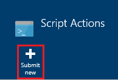
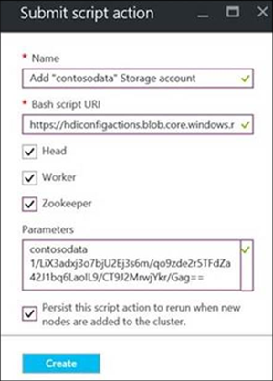
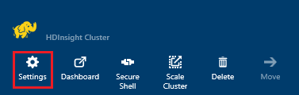
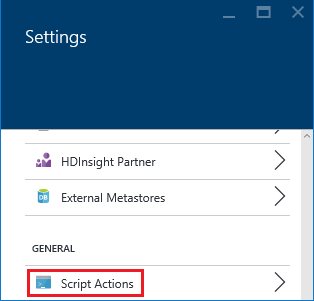
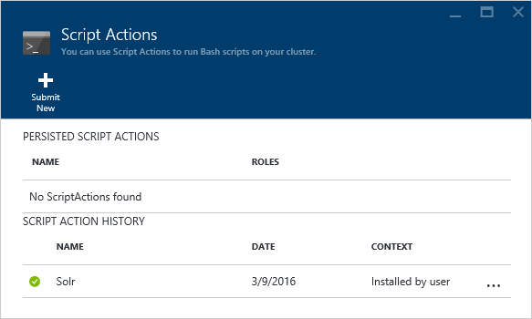
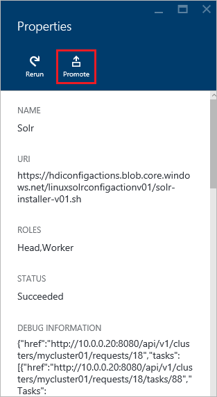

---
title: Customize HDInsight clusters using script actions | Microsoft Docs
description: Learn how to add custom components to Linux-based HDInsight clusters using Script Actions. Script Actions are Bash scripts that on the cluster nodes, and can be used to customize the cluster configuration or add additional services and utilities like Hue, Solr, or R.
services: hdinsight
documentationcenter: ''
author: Blackmist
manager: jhubbard
editor: cgronlun
tags: azure-portal

ms.assetid: 48e85f53-87c1-474f-b767-ca772238cc13
ms.service: hdinsight
ms.custom: hdinsightactive
ms.workload: big-data
ms.tgt_pltfrm: na
ms.devlang: na
ms.topic: article
ms.date: 03/10/2017
ms.author: larryfr

---
# Customize Linux-based HDInsight clusters using Script Action

HDInsight provides a configuration option called **Script Action** that invokes custom scripts that customize the cluster. These scripts can be used during cluster creation, or on an already running cluster, and are used to install additional components or change configuration settings.

> [!IMPORTANT]
> The ability to use script actions on an already running cluster is only available for Linux-based HDInsight clusters.
>
> Linux is the only operating system used on HDInsight version 3.4 or greater. For more information, see [HDInsight Deprecation on Windows](hdinsight-component-versioning.md#hdi-version-33-nearing-deprecation-date).


Script actions can also be published to the Azure Marketplace as an HDInsight application. Some of the examples in this document show how you can install an HDInsight application using script action commands from PowerShell and the .NET SDK. For more information on HDInsight applications, see [Publish HDInsight applications into the Azure Marketplace](hdinsight-apps-publish-applications.md).

## Permissions

If you are using a domain-joined HDInsight cluster, there are two Ambari permissions that are required when using script actions with the cluster:

* **AMBARI.RUN\_CUSTOM\_COMMAND**: The Ambari Administrator role has this permission by default.
* **CLUSTER.RUN\_CUSTOM\_COMMAND**: Both the HDInsight Cluster Administrator and Ambari Administrator have this permission by default.

For more information on working with permissions with domain-joined HDInsight, see [Manage domain-joined HDInsight clusters](hdinsight-domain-joined-manage.md).

## Access control

If you use an Azure subscription where you are not the administrator/owner, such as a company owned subscription, you must verify that your Azure account has at least **Contributor** access to the Azure resource group that contains the HDInsight cluster.

Additionally, if you are creating an HDInsight cluster, someone with at least **Contributor** access to the Azure subscription must have previously registered the provider for HDInsight. Provider registration happens when a user with Contributor access to the subscription creates a resource for the first time on the subscription. It can also be accomplished without creating a resource by [registering a provider using REST](https://msdn.microsoft.com/library/azure/dn790548.aspx).

For more information on working with access management, see the following documents:

* [Get started with access management in the Azure portal](../active-directory/role-based-access-control-what-is.md)
* [Use role assignments to manage access to your Azure subscription resources](../active-directory/role-based-access-control-configure.md)

## Understanding Script Actions

A Script Action is simply a Bash script that you provide a URI to, and parameters for. The script runs on nodes in the HDInsight cluster. The following are characteristics and features of script actions.

* Must be stored on a URI that is accessible from the HDInsight cluster. The following are possible storage locations:

    * An **Azure Data Lake Store** account that is accessible by the HDInsight cluster. For information on using Azure Data Lake Store with HDInsight, see [Create an HDInsight cluster with Data Lake Store](../data-lake-store/data-lake-store-hdinsight-hadoop-use-portal.md).

        When using a script stored in Data Lake Store, the URI format is `adl://DATALAKESTOREACCOUNTNAME.azuredatalakestore.net/path_to_file`.

        > [!NOTE]
        > The service principal HDInsight uses to access Data Lake Store must have read access to the script.

    * A blob in an **Azure Storage account** that is either the primary or additional storage account for the HDInsight cluster. Since HDInsight is granted access to both of these types of storage accounts during cluster creation, these provide a way to use a non-public script action.

    * An public file sharing service such as an Azure Blob, GitHub, OneDrive, Dropbox, etc.

        For examples of the URI for scripts stored in blob container (publicly readable,) see the [Example script action scripts](#example-script-action-scripts) section.

        > [!WARNING]
        > HDInsight only supports __General purpose__ Azure Storage accounts. It does not currently support the __Blob storage__ account type.

* Can be restricted to **run on only certain node types**, for example head nodes or worker nodes.

  > [!NOTE]
  > When used with HDInsight Premium, you can specify that the script should be used on the edge node.

* Can be **persisted** or **ad hoc**.

    **Persisted** scripts are scripts that are applied to worker nodes and run automatically on new nodes created when scaling up a cluster.

    A persisted script might also apply changes to another node type, such as a head node, but from a functionality perspective the only reason to persist a script is so it applies to new worker nodes created when a cluster is scaled out.

  > [!IMPORTANT]
  > Persisted script actions must have a unique name.

    **Ad hoc** scripts are not persisted; however, you can subsequently promote an ad hoc script to a persisted script, or demote a persisted script to an ad hoc script.

  > [!IMPORTANT]
  > Script actions used during cluster creation are automatically persisted.
  >
  > Scripts that fail are not persisted, even if you specifically indicate that they should be.

* Can accept **parameters** that are used by the script during execution.
* Run with **root level privileges** on the cluster nodes.
* Can be used through the **Azure portal**, **Azure PowerShell**, **Azure CLI**, or **HDInsight .NET SDK**

To assist in understanding what scripts have been applied to a cluster, and in determining the ID of scripts for promotion or demotion, the cluster keeps a history of all scripts that have been ran.

> [!IMPORTANT]
> There is no automatic way to undo the changes made by a script action. If you need to reverse the effects of a script, you must understand what changes were made and manually reverse them (or provide a script action that reverses them.)


### Script Action in the cluster creation process

Script Actions used during cluster creation are slightly different from script actions ran on an existing cluster:

* The script is **automatically persisted**.
* A **failure** in the script can cause the cluster creation process to fail.

The following diagram illustrates when Script Action is executed during the creation process:

![HDInsight cluster customization and stages during cluster creation][img-hdi-cluster-states]

The script runs while HDInsight is being configured. At this stage, the script runs in parallel on all the specified nodes in the cluster, and runs with root privileges on the nodes.

> [!NOTE]
> Because the script runs with root level privilege on the cluster nodes, you can perform operations like stopping and starting services, including Hadoop-related services. If you stop services, you must ensure that the Ambari service and other Hadoop-related services are up and running before the script finishes running. These services are required to successfully determine the health and state of the cluster while it is being created.


During cluster creation, you can specify multiple script actions that are invoked in the order in which they were specified.

> [!IMPORTANT]
> Script actions must complete within 60 minutes, or timeout. During cluster provisioning, the script runs concurrently with other setup and configuration processes. Competition for resources such as CPU time or network bandwidth may cause the script to take longer to finish than it does in your development environment.
>
> To minimize the time it takes to run the script, avoid tasks such as downloading and compiling applications from source. Instead, pre-compile the application and store the binary in Azure Storage so that it can quickly be downloaded to the cluster.


### Script action on a running cluster

Unlike script actions used during cluster creation, a failure in a script ran on an already running cluster does not automatically cause the cluster to change to a failed state. Once a script completes, the cluster should return to a "running" state.

> [!IMPORTANT]
> This does not mean that your running cluster is immune to scripts that do bad things. For example, a script could delete files needed by the cluster, change configuration so that services fail, etc.
>
> Scripts actions run with root privileges, so you should make sure that you understand what a script does before applying it to your cluster.

When applying a script to a cluster, the cluster state changes to from **Running** to **Accepted**, then **HDInsight configuration**, and finally back to **Running** for successful scripts. The script status is logged in the script action history, and you can use this to determine if the script succeeded or failed. For example, the `Get-AzureRmHDInsightScriptActionHistory` PowerShell cmdlet can be used to view the status of a script. It returns information similar to the following:

    ScriptExecutionId : 635918532516474303
    StartTime         : 2/23/2016 7:40:55 PM
    EndTime           : 2/23/2016 7:41:05 PM
    Status            : Succeeded

> [!NOTE]
> If you have changed the cluster user (admin) password after the cluster was created, this may cause script actions ran against this cluster to fail. If you have any persisted script actions that target worker nodes, these may fail when you add nodes to the cluster through resize operations.

## Example Script Action scripts

Script Action scripts can be used from the Azure portal, Azure PowerShell, Azure CLI, or the HDInsight .NET SDK. HDInsight provides scripts to install the following components on HDInsight clusters:

| Name | Script |
| --- | --- |
| **Add an Azure Storage account** |https://hdiconfigactions.blob.core.windows.net/linuxaddstorageaccountv01/add-storage-account-v01.sh. See [Add additional storage to an HDInsight cluster](hdinsight-hadoop-add-storage.md). |
| **Install Hue** |https://hdiconfigactions.blob.core.windows.net/linuxhueconfigactionv02/install-hue-uber-v02.sh. See [Install and use Hue on HDInsight clusters](hdinsight-hadoop-hue-linux.md). |
| **Install R** |https://hdiconfigactions.blob.core.windows.net/linuxrconfigactionv01/r-installer-v01.sh. See [Install and use R on HDInsight clusters](hdinsight-hadoop-r-scripts-linux.md). |
| **Install Solr** |https://hdiconfigactions.blob.core.windows.net/linuxsolrconfigactionv01/solr-installer-v01.sh. See [Install and use Solr on HDInsight clusters](hdinsight-hadoop-solr-install-linux.md). |
| **Install Giraph** |https://hdiconfigactions.blob.core.windows.net/linuxgiraphconfigactionv01/giraph-installer-v01.sh. See [Install and use Giraph on HDInsight clusters](hdinsight-hadoop-giraph-install-linux.md). |
| **Pre-load Hive libraries** |https://hdiconfigactions.blob.core.windows.net/linuxsetupcustomhivelibsv01/setup-customhivelibs-v01.sh. See [Add Hive libraries on HDInsight clusters](hdinsight-hadoop-add-hive-libraries.md) |

## Use a Script Action during cluster creation

This section provides examples on the different ways you can use script actions when creating an HDInsight cluster- from the Azure portal, using an Azure Resource Manager template, using PowerShell CMDlets, and using the .NET SDK.

### Use a Script Action during cluster creation from the Azure portal

1. Start creating a cluster as described at [Create Hadoop clusters in HDInsight](hdinsight-hadoop-provision-linux-clusters.md).
2. Under **Optional Configuration**, for the **Script Actions** blade, click **add script action** to provide details about the script action, as shown below:

    

    | Property | Value |
    | --- | --- |
    | Name |Specify a name for the script action. |
    | Script URI |Specify the URI to the script that is invoked to customize the cluster. |
    | Head/Worker |Specify the nodes (**Head**, **Worker**, or **ZooKeeper**) on which the customization script is run. |
    | Parameters |Specify the parameters, if required by the script. |

    Press ENTER to add more than one script action to install multiple components on the cluster.

3. Click **Select** to save the configuration and continue with cluster creation.

### Use a Script Action from Azure Resource Manager templates
In this section, we use Azure Resource Manager templates to create an HDInsight cluster and also use a script action to install custom components (R, in this example) on the cluster. This section provides a sample template to create a cluster using script action.

> [!NOTE]
> The steps in this section demonstrate creating a cluster using a script action. For an example of creating a cluster from a template using an HDInsight application, see [Install custom HDInsight applications](hdinsight-apps-install-custom-applications.md).

#### Before you begin

* For information about configuring a workstation to run HDInsight Powershell cmdlets, see [Install and configure Azure PowerShell](/powershell/azure/overview).
* For instructions on how to create templates, see [Authoring Azure Resource Manager templates](../azure-resource-manager/resource-group-authoring-templates.md).
* If you have not previously used Azure PowerShell with Resource Manager, see [Using Azure PowerShell with Azure Resource Manager](../azure-resource-manager/powershell-azure-resource-manager.md).

#### Create clusters using Script Action

1. Copy the following template to a location on your computer. This template installs Giraph on the headnodes as well as worker nodes in the cluster. You can also verify if the JSON template is valid. Paste your template content into [JSONLint](http://jsonlint.com/), an online JSON validation tool.

            {
            "$schema": "http://schema.management.azure.com/schemas/2015-01-01/deploymentTemplate.json#",
            "contentVersion": "1.0.0.0",
            "parameters": {
                "clusterLocation": {
                    "type": "string",
                    "defaultValue": "West US",
                    "allowedValues": [ "West US" ]
                },
                "clusterName": {
                    "type": "string"
                },
                "clusterUserName": {
                    "type": "string",
                    "defaultValue": "admin"
                },
                "clusterUserPassword": {
                    "type": "securestring"
                },
                "sshUserName": {
                    "type": "string",
                    "defaultValue": "username"
                },
                "sshPassword": {
                    "type": "securestring"
                },
                "clusterStorageAccountName": {
                    "type": "string"
                },
                "clusterStorageAccountResourceGroup": {
                    "type": "string"
                },
                "clusterStorageType": {
                    "type": "string",
                    "defaultValue": "Standard_LRS",
                    "allowedValues": [
                        "Standard_LRS",
                        "Standard_GRS",
                        "Standard_ZRS"
                    ]
                },
                "clusterStorageAccountContainer": {
                    "type": "string"
                },
                "clusterHeadNodeCount": {
                    "type": "int",
                    "defaultValue": 1
                },
                "clusterWorkerNodeCount": {
                    "type": "int",
                    "defaultValue": 2
                }
            },
            "variables": {
            },
            "resources": [
                {
                    "name": "[parameters('clusterStorageAccountName')]",
                    "type": "Microsoft.Storage/storageAccounts",
                    "location": "[parameters('clusterLocation')]",
                    "apiVersion": "2015-05-01-preview",
                    "dependsOn": [ ],
                    "tags": { },
                    "properties": {
                        "accountType": "[parameters('clusterStorageType')]"
                    }
                },
                {
                    "name": "[parameters('clusterName')]",
                    "type": "Microsoft.HDInsight/clusters",
                    "location": "[parameters('clusterLocation')]",
                    "apiVersion": "2015-03-01-preview",
                    "dependsOn": [
                        "[concat('Microsoft.Storage/storageAccounts/', parameters('clusterStorageAccountName'))]"
                    ],
                    "tags": { },
                    "properties": {
                        "clusterVersion": "3.2",
                        "osType": "Linux",
                        "clusterDefinition": {
                            "kind": "hadoop",
                            "configurations": {
                                "gateway": {
                                    "restAuthCredential.isEnabled": true,
                                    "restAuthCredential.username": "[parameters('clusterUserName')]",
                                    "restAuthCredential.password": "[parameters('clusterUserPassword')]"
                                }
                            }
                        },
                        "storageProfile": {
                            "storageaccounts": [
                                {
                                    "name": "[concat(parameters('clusterStorageAccountName'),'.blob.core.windows.net')]",
                                    "isDefault": true,
                                    "container": "[parameters('clusterStorageAccountContainer')]",
                                    "key": "[listKeys(resourceId('Microsoft.Storage/storageAccounts', parameters('clusterStorageAccountName')), '2015-05-01-preview').key1]"
                                }
                            ]
                        },
                        "computeProfile": {
                            "roles": [
                                {
                                    "name": "headnode",
                                    "targetInstanceCount": "[parameters('clusterHeadNodeCount')]",
                                    "hardwareProfile": {
                                        "vmSize": "Large"
                                    },
                                    "osProfile": {
                                        "linuxOperatingSystemProfile": {
                                            "username": "[parameters('sshUserName')]",
                                            "password": "[parameters('sshPassword')]"
                                        }
                                    },
                                    "scriptActions": [
                                        {
                                            "name": "installGiraph",
                                            "uri": "https://hdiconfigactions.blob.core.windows.net/linuxgiraphconfigactionv01/giraph-installer-v01.sh",
                                            "parameters": ""
                                        }
                                    ]
                                },
                                {
                                    "name": "workernode",
                                    "targetInstanceCount": "[parameters('clusterWorkerNodeCount')]",
                                    "hardwareProfile": {
                                        "vmSize": "Large"
                                    },
                                    "osProfile": {
                                        "linuxOperatingSystemProfile": {
                                            "username": "[parameters('sshUserName')]",
                                            "password": "[parameters('sshPassword')]"
                                        }
                                    },
                                    "scriptActions": [
                                        {
                                            "name": "installR",
                                            "uri": "https://hdiconfigactions.blob.core.windows.net/linuxrconfigactionv01/r-installer-v01.sh",
                                            "parameters": ""
                                        }
                                    ]
                                }
                            ]
                        }
                    }
                }
            ],
            "outputs": {
                "cluster":{
                    "type" : "object",
                    "value" : "[reference(resourceId('Microsoft.HDInsight/clusters',parameters('clusterName')))]"
                }
            }
        }
2. Start Azure PowerShell and Log in to your Azure account. After providing your credentials, the command returns information about your account.

        Add-AzureRmAccount

        Id                             Type       ...
        --                             ----
        someone@example.com            User       ...
3. If you have multiple subscriptions, provide the subscription id you wish to use for deployment.

        Select-AzureRmSubscription -SubscriptionID <YourSubscriptionId>

    > [!NOTE]
    > You can use `Get-AzureRmSubscription` to get a list of all subscriptions associated with your account, which includes the subscription Id for each one.

4. If you do not have an existing resource group, create a new resource group. Provide the name of the resource group and location that you need for your solution. A summary of the new resource group is returned.

        New-AzureRmResourceGroup -Name myresourcegroup -Location "West US"

        ResourceGroupName : myresourcegroup
        Location          : westus
        ProvisioningState : Succeeded
        Tags              :
        Permissions       :
                            Actions  NotActions
                            =======  ==========
                            *
        ResourceId        : /subscriptions/######/resourceGroups/ExampleResourceGroup

5. To create a new deployment for your resource group, run the **New-AzureRmResourceGroupDeployment** command and provide the necessary parameters. The parameters include a name for your deployment, the name of your resource group, and the path or URL to the template you created. If your template requires any parameters, you must pass those parameters as well. In this case, the script action to install R on the cluster does not require any parameters.

        New-AzureRmResourceGroupDeployment -Name mydeployment -ResourceGroupName myresourcegroup -TemplateFile <PathOrLinkToTemplate>

    You are prompted to provide values for the parameters defined in the template.

1. When the resource group has been deployed, a summary of the deployment is displayed.

          DeploymentName    : mydeployment
          ResourceGroupName : myresourcegroup
          ProvisioningState : Succeeded
          Timestamp         : 8/17/2015 7:00:27 PM
          Mode              : Incremental
          ...

2. If your deployment fails, you can use the following cmdlets to get information about the failures.

        Get-AzureRmResourceGroupDeployment -ResourceGroupName myresourcegroup -ProvisioningState Failed

### Use a Script Action during cluster creation from Azure PowerShell

In this section, we use the [Add-AzureRmHDInsightScriptAction](https://msdn.microsoft.com/library/mt603527.aspx) cmdlet to invoke scripts by using Script Action to customize a cluster. Before proceeding, make sure you have installed and configured Azure PowerShell. For information about configuring a workstation to run HDInsight PowerShell cmdlets, see [Install and configure Azure PowerShell](/powershell/azure/overview).

Perform the following steps:

1. Open the Azure PowerShell console and use the following to log in to your Azure subscription and declare some PowerShell variables:

        # LOGIN TO ZURE
        Login-AzureRmAccount

        # PROVIDE VALUES FOR THESE VARIABLES
        $subscriptionId = "<SubscriptionId>"        # ID of the Azure subscription
        $clusterName = "<HDInsightClusterName>"            # HDInsight cluster name
        $storageAccountName = "<StorageAccountName>"    # Azure storage account that hosts the default container
        $storageAccountKey = "<StorageAccountKey>"      # Key for the storage account
        $containerName = $clusterName
        $location = "<MicrosoftDataCenter>"                # Location of the HDInsight cluster. It must be in the same data center as the storage account.
        $clusterNodes = <ClusterSizeInNumbers>            # The number of nodes in the HDInsight cluster.
        $resourceGroupName = "<ResourceGroupName>"      # The resource group that the HDInsight cluster is created in

2. Specify the configuration values (such as nodes in the cluster) and the default storage to be used.

        # SPECIFY THE CONFIGURATION OPTIONS
        Select-AzureRmSubscription -SubscriptionId $subscriptionId
        $config = New-AzureRmHDInsightClusterConfig
        $config.DefaultStorageAccountName="$storageAccountName.blob.core.windows.net"
        $config.DefaultStorageAccountKey=$storageAccountKey

3. Use **Add-AzureRmHDInsightScriptAction** cmdlet to invoke the script. The following example uses a script that installs Giraph on the cluster:

        # INVOKE THE SCRIPT USING THE SCRIPT ACTION FOR HEADNODE AND WORKERNODE
        $config = Add-AzureRmHDInsightScriptAction -Config $config -Name "Install Giraph"  -NodeType HeadNode -Uri https://hdiconfigactions.blob.core.windows.net/linuxgiraphconfigactionv01/giraph-installer-v01.sh
        $config = Add-AzureRmHDInsightScriptAction -Config $config -Name "Install Giraph"  -NodeType WorkerNode -Uri https://hdiconfigactions.blob.core.windows.net/linuxgiraphconfigactionv01/giraph-installer-v01.sh

    The **Add-AzureRmHDInsightScriptAction** cmdlet takes the following parameters:

    | Parameter | Definition |
    | --- | --- |
    | Config |Configuration object to which script action information is added. |
    | Name |Name of the script action. |
    | NodeType |Specifies the node on which the customization script is run. The valid values are **HeadNode** (to install on the head node), **WorkerNode** (to install on all the data nodes), or **ZookeeperNode** (to install on the zookeeper node). |
    | Parameters |Parameters required by the script. |
    | Uri |Specifies the URI to the script that is executed. |

4. Set the admin/HTTPS user for the cluster:

        $httpCreds = get-credential

    When prompted, enter 'admin' as the name, and provide a password.

5. Set the SSH credentials:

        $sshCreds = get-credential

    When prompted, enter the SSH user name and password. If you want to secure the SSH account with a certificate instead of a password, use a blank password and set `$sshPublicKey` to the contents of the certificate public key you wish to use. For example:

        $sshPublicKey = Get-Content .\path\to\public.key -Raw

6. Finally, create the cluster:

        New-AzureRmHDInsightCluster -config $config -clustername $clusterName -DefaultStorageContainer $containerName -Location $location -ResourceGroupName $resourceGroupName -ClusterSizeInNodes $clusterNodes -HttpCredential $httpCreds -SshCredential $sshCreds -OSType Linux

    If you are using a public key to secure your SSH account, you must also specify `-SshPublicKey $sshPublicKey` as a parameter.

It can take several minutes before the cluster is created.

### Use a Script Action during cluster creation from the HDInsight .NET SDK

The HDInsight .NET SDK provides client libraries that makes it easier to work with HDInsight from a .NET application. For a code sample, see [Create Linux-based clusters in HDInsight using the .NET SDK](hdinsight-hadoop-create-linux-clusters-dotnet-sdk.md#use-script-action).

## Apply a Script Action to a running cluster

This section provides examples on the different ways you can apply script actions to a running HDInsight cluster; from the Azure portal, using PowerShell CMDlets, using the cross-platform Azure CLI, and using the .NET SDK. The persisted script action used in this section adds an existing Azure storage account to a running cluster. You can also use other script actions, See [Example Script Action scripts](#example-script-action-scripts).

### Apply a Script Action to a running cluster from the Azure portal

1. From the [Azure portal](https://portal.azure.com), select your HDInsight cluster.

2. From the HDInsight cluster blade, select the **Script Actions** tile.

    

   > [!NOTE]
   > You can also select **All settings** and then select **Script Actions** from the Settings blade.

3. From the top of the Script Actions blade, select **Submit new**.

    

4. From the Add Script Action blade, enter the following information.

   * **Name**: The friendly name to use for this Script Action. In this example, `Add Storage account`.

   * **SCRIPT URI**: The URI to the script. In this example, `https://hdiconfigactions.blob.core.windows.net/linuxaddstorageaccountv01/add-storage-account-v01.sh`

   * **Head**, **Worker**, and **Zookeeper**: Check the nodes that this script should be applied to. In this example, Head, Worker and Zookeeper are checked.

   * **PARAMETERS**: If the script accepts parameters, enter them here. In this example, enter the storage account name, and the storage account key:

       

       On the screenshot, `contosodata` is an existing Azure Storage account, the second line is the Storage account key.

   * **PERSISTED**: Check this entry if you want to persist the script so it is applied to new worker nodes when you scale up the cluster.

5. Finally, use the **Create** button to apply the script to the cluster.

### Apply a Script Action to a running cluster from Azure PowerShell

Before proceeding, make sure you have installed and configured Azure PowerShell. For information about configuring a workstation to run HDInsight PowerShell cmdlets, see [Install and configure Azure PowerShell](/powershell/azure/overview).

1. Open the Azure PowerShell console and use the following to log in to your Azure subscription and declare some PowerShell variables:

        # LOGIN TO ZURE
        Login-AzureRmAccount

        # PROVIDE VALUES FOR THESE VARIABLES
        $clusterName = "<HDInsightClusterName>"            # HDInsight cluster name
        $saName = "<ScriptActionName>"                  # Name of the script action
        $saURI = "<URI to the script>"                  # The URI where the script is located
        $nodeTypes = "headnode", "workernode"

   > [!NOTE]
   > If using an HDInsight Premium cluster, you can use a nodetype of `"edgenode"` to run the script on the edge node.

2. Use the following command to apply the script to the cluster:

        Submit-AzureRmHDInsightScriptAction -ClusterName $clusterName -Name $saName -Uri $saURI -NodeTypes $nodeTypes -PersistOnSuccess

    Once the job completes, you should receive information similar to the following:

        OperationState  : Succeeded
        ErrorMessage    :
        Name            : Giraph
        Uri             : https://hdiconfigactions.blob.core.windows.net/linuxgiraphconfigactionv01/giraph-installer-v01.sh
        Parameters      :
        NodeTypes       : {HeadNode, WorkerNode}

### Apply a Script Action to a running cluster from the Azure CLI

Before proceeding, make sure you have installed and configured the Azure CLI. For more information, see [Install the Azure CLI](../cli-install-nodejs.md).

[!INCLUDE [use-latest-version](../../includes/hdinsight-use-latest-cli.md)]

1. Open a shell session, terminal, command-prompt or other command line for your system and use the following command to switch to Azure Resource Manager mode.

        azure config mode arm

2. Use the following to authenticate to your Azure subscription.

        azure login

3. Use the following command to apply a script action to a running cluster

        azure hdinsight script-action create <clustername> -g <resourcegroupname> -n <scriptname> -u <scriptURI> -t <nodetypes>

    If you omit parameters for this command, you are prompted for them. If the script you specify with `-u` accepts parameters, you can specify them using the `-p` parameter.

    Valid **nodetypes** are **headnode**, **workernode**, and **zookeeper**. If the script should be applied to multiple node types, specify the types separated by a ';'. For example, `-n headnode;workernode`.

    To persist the script, add the `--persistOnSuccess`. You can also persist the script at a later date by using `azure hdinsight script-action persisted set`.

    Once the job completes, you receive output similar to the following.

        info:    Executing command hdinsight script-action create
        + Executing Script Action on HDInsight cluster
        data:    Operation Info
        data:    ---------------
        data:    Operation status:
        data:    Operation ID:  b707b10e-e633-45c0-baa9-8aed3d348c13
        info:    hdinsight script-action create command OK

### Apply a Script Action to a running cluster using REST API

See [Run Script Actions on a running cluster](https://msdn.microsoft.com/library/azure/mt668441.aspx).

### Apply a Script Action to a running cluster from the HDInsight .NET SDK

For an example of using the .NET SDK to apply scripts to a cluster, see [https://github.com/Azure-Samples/hdinsight-dotnet-script-action](https://github.com/Azure-Samples/hdinsight-dotnet-script-action).

## View history, promote, and demote Script Actions

### Using the Azure portal

1. From the [Azure portal](https://portal.azure.com), select your HDInsight cluster.

2. From the HDInsight cluster blade, select **Settings**.

    

3. From the Settings blade, select **Script Actions**.

    

4. A list of the persisted scripts, as well as a history of scripts applied to the cluster, is displayed on the Script Actions blade. In the screenshot below, you can see that the Solr script has been ran on this cluster, but that no script actions have been persisted.

    

5. Selecting a script from the history displays the Properties blade for this script. From the top of the blade, you can rerun the script or promote it.

    

6. You can also use the **...** to the right of entries on the Script Actions blade to perform actions such as rerun, persist, or (for persisted actions,) delete.

    

### Using Azure PowerShell

| Use the following... | To ... |
| --- | --- |
| Get-AzureRmHDInsightPersistedScriptAction |Retrieve information on persisted script actions |
| Get-AzureRmHDInsightScriptActionHistory |Retrieve a history of script actions applied to the cluster, or details for a specific script |
| Set-AzureRmHDInsightPersistedScriptAction |Promotes an ad hoc script action to a persisted script action |
| Remove-AzureRmHDInsightPersistedScriptAction |Demotes a persisted script action to an ad hoc action |

> [!IMPORTANT]
> Using `Remove-AzureRmHDInsightPersistedScriptAction` does not undo the actions performed by a script, it only removes the persisted flag so that the script is not ran on new worker nodes added to the cluster.

The following example script demonstrates using the cmdlets to promote, then demote a script.

    # Get a history of scripts
    Get-AzureRmHDInsightScriptActionHistory -ClusterName mycluster

    # From the list, we want to get information on a specific script
    Get-AzureRmHDInsightScriptActionHistory -ClusterName mycluster -ScriptExecutionId 635920937765978529

    # Promote this to a persisted script
    # Note: the script must have a unique name to be promoted
    # if the name is not unique, you receive an error
    Set-AzureRmHDInsightPersistedScriptAction -ClusterName mycluster -ScriptExecutionId 635920937765978529

    # Demote the script back to ad hoc
    # Note that demotion uses the unique script name instead of
    # execution ID.
    Remove-AzureRmHDInsightPersistedScriptAction -ClusterName mycluster -Name "Install Giraph"

### Using the Azure CLI

| Use the following... | To ... |
| --- | --- |
| `azure hdinsight script-action persisted list <clustername>` |Retrieve a list of persisted script actions |
| `azure hdinsight script-action persisted show <clustername> <scriptname>` |Retrieve information on a specific persisted script action |
| `azure hdinsight script-action history list <clustername>` |Retrieve a history of script actions applied to the cluster |
| `azure hdinsight script-action history show <clustername> <scriptname>` |Retrieve information on a specific script action |
| `azure hdinsight script action persisted set <clustername> <scriptexecutionid>` |Promotes an ad hoc script action to a persisted script action |
| `azure hdinsight script-action persisted delete <clustername> <scriptname>` |Demotes a persisted script action to an ad hoc action |

> [!IMPORTANT]
> Using `azure hdinsight script-action persisted delete` does not undo the actions performed by a script, it only removes the persisted flag so that the script is not ran on new worker nodes added to the cluster.

### Using the HDInsight .NET SDK

For an example of using the .NET SDK to retrieve script history from a cluster, promote or demote scripts, see [https://github.com/Azure-Samples/hdinsight-dotnet-script-action](https://github.com/Azure-Samples/hdinsight-dotnet-script-action).

> [!NOTE]
> This example also demonstrates how to install an HDInsight application using the .NET SDK.

## Support for open-source software used on HDInsight clusters

The Microsoft Azure HDInsight service is a flexible platform that enables you to build big-data applications in the cloud by using an ecosystem of open-source technologies formed around Hadoop. Microsoft Azure provides a general level of support for open-source technologies, as discussed in the **Support Scope** section of the [Azure Support FAQ website](https://azure.microsoft.com/support/faq/). The HDInsight service provides an additional level of support for some of the components, as described below.

There are two types of open-source components that are available in the HDInsight service:

* **Built-in components** - These components are pre-installed on HDInsight clusters and provide core functionality of the cluster. For example, YARN ResourceManager, the Hive query language (HiveQL), and the Mahout library belong to this category. A full list of cluster components is available in [What's new in the Hadoop cluster versions provided by HDInsight?](hdinsight-component-versioning.md).
* **Custom components** - You, as a user of the cluster, can install or use in your workload any component available in the community or created by you.

> [!WARNING]
> Components provided with the HDInsight cluster are fully supported and Microsoft Support helps to isolate and resolve issues related to these components.
>
> Custom components receive commercially reasonable support to help you to further troubleshoot the issue. This might result in resolving the issue OR asking you to engage available channels for the open source technologies where deep expertise for that technology is found. For example, there are many community sites that can be used, like: [MSDN forum for HDInsight](https://social.msdn.microsoft.com/Forums/azure/en-US/home?forum=hdinsight), [http://stackoverflow.com](http://stackoverflow.com). Also Apache projects have project sites on [http://apache.org](http://apache.org), for example: [Hadoop](http://hadoop.apache.org/).

The HDInsight service provides several ways to use custom components. Regardless of how a component is used or installed on the cluster, the same level of support applies. Below is a list of the most common ways that custom components can be used on HDInsight clusters:

1. Job submission - Hadoop or other types of jobs that execute or use custom components can be submitted to the cluster.

2. Cluster customization - During cluster creation, you can specify additional settings and custom components that are installed on the cluster nodes.

3. Samples - For popular custom components, Microsoft and others may provide samples of how these components can be used on the HDInsight clusters. These samples are provided without support.

## Troubleshooting

You can use Ambari web UI to view information logged by script actions. If the script is used during cluster creation, and cluster creation failed due to an error in the script, the logs are also available in the default storage account associated with the cluster. This section provides information on how to retrieve the logs using both these options.

### Using the Ambari Web UI

1. In your browser, navigate to https://CLUSTERNAME.azurehdinsight.net. Replace CLUSTERNAME with the name of your HDInsight cluster.

    When prompted, enter the admin account name (admin) and password for the cluster. You may have to re-enter the admin credentials in a web form.

2. From the bar at the top of the page, select the **ops** entry. This shows a list of current and previous operations performed on the cluster through Ambari.

    

3. Find the entries that have **run\_customscriptaction** in the **Operations** column. These are created when the Script Actions are ran.

    

    Select this run\customscriptaction entry and drill down through the links to view the STDOUT and STDERR output. This output is generated when the script runs, and may contain useful information.

### Access logs from the default storage account

If the cluster creation failed due to an error in script action, the script action logs can still be accessed directly from the default storage account associated with the cluster.

* The storage logs are available at `\STORAGE_ACOCUNT_NAME\DEFAULT_CONTAINER_NAME\custom-scriptaction-logs\CLUSTER_NAME\DATE`.

    

    Under this, the logs are organized separately for headnode, workernode, and zookeeper nodes. Some examples are:

    * **Headnode** - `<uniqueidentifier>AmbariDb-hn0-<generated_value>.cloudapp.net`

    * **Worker node** - `<uniqueidentifier>AmbariDb-wn0-<generated_value>.cloudapp.net`

    * **Zookeeper node** - `<uniqueidentifier>AmbariDb-zk0-<generated_value>.cloudapp.net`

* All stdout and stderr of the corresponding host is uploaded to the storage account. There is one **output-\*.txt** and **errors-\*.txt** for each script action. The output-*.txt file contains information about the URI of the script that got run on the host. For example

        'Start downloading script locally: ', u'https://hdiconfigactions.blob.core.windows.net/linuxrconfigactionv01/r-installer-v01.sh'

* It's possible that you repeatedly create a script action cluster with the same name. In such case, you can distinguish the relevant logs based on the DATE folder name. For example, the folder structure for a cluster (mycluster) created on different dates appears similar to the following:

    * `\STORAGE_ACOCUNT_NAME\DEFAULT_CONTAINER_NAME\custom-scriptaction-logs\mycluster\2015-10-04`

    * `\STORAGE_ACOCUNT_NAME\DEFAULT_CONTAINER_NAME\custom-scriptaction-logs\mycluster\2015-10-05`

* If you create a script action cluster with the same name on the same day, you can use the unique prefix to identify the relevant log files.

* If you create a cluster at the end of the day, it's possible that the log files span across two days. In such cases, you see two different date folders for the same cluster.

* Uploading log files to the default container can take up to 5 mins, especially for large clusters. So, if you want to access the logs, you should not immediately delete the cluster if a script action fails.

### Ambari watchdog

> [!WARNING]
> Do not change the password for the Ambari Watchdog (hdinsightwatchdog) on your Linux-based HDInsight cluster. Changing the password for this account breaks the ability to run new script actions on the HDInsight cluster.

### Cannot import name BlobService

__Symptoms__: The script action fails, and an error similar to the following is displayed when you view the operation in Ambari:

```
Traceback (most recent call list):
  File "/var/lib/ambari-agent/cache/custom_actions/scripts/run_customscriptaction.py", line 21, in <module>
    from azure.storage.blob import BlobService
ImportError: cannot import name BlobService
```

__Cause__: This error occurs if you upgrade the Python Azure Storage client that is included with the HDInsight cluster. HDInsight expects Azure Storage client 0.20.0.

__Resolution__: To resolve this error, manually connect to each cluster node using `ssh` and use the following command to reinstall the correct storage client version:

```
sudo pip install azure-storage==0.20.0
```

For information on connecting to the cluster with SSH, see [Use SSH with HDInsight](hdinsight-hadoop-linux-use-ssh-unix.md).

### History doesn't show scripts used during cluster creation

If your cluster was created before March 15th, 2016, you may not see an entry in Script Action history for any scripts used during cluster creation. However, if you resize the cluster after March 15th, 2016, the scripts using during cluster creation appears in history as they are applied to new nodes in the cluster as part of the resize operation.

There are two exceptions:

* If your cluster was created before September 1st, 2015. This is when Script Actions were introduced, so any cluster created before this date could not have used Script Actions for cluster creation.

* If you used multiple Script Actions during cluster creation, and used the same name for multiple scripts, or the same name, same URI, but different parameters for multiple scripts. In these cases, you receive the following error.

    No new script actions can be executed on this cluster due to conflicting script names in existing scripts. Script names provided at cluster create must be all unique. Existing scripts will still be executed on resize.

## Next steps

See the following for information and examples on creating and using scripts to customize a cluster:

* [Develop Script Action scripts for HDInsight](hdinsight-hadoop-script-actions-linux.md)
* [Install and use Solr on HDInsight clusters](hdinsight-hadoop-solr-install-linux.md)
* [Install and use Giraph on HDInsight clusters](hdinsight-hadoop-giraph-install-linux.md)
* [Add additional storage to an HDInsight cluster](hdinsight-hadoop-add-storage.md)

[img-hdi-cluster-states]: ./media/hdinsight-hadoop-customize-cluster-linux/HDI-Cluster-state.png "Stages during cluster creation"
