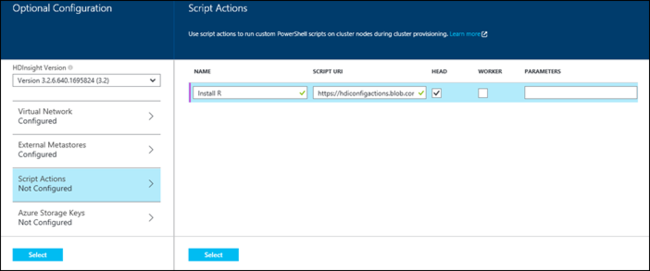

<properties
	pageTitle="Customize HDInsight Clusters using script actions | Microsoft Azure"
	description="Learn how to customize HDInsight clusters using Script Action."
	services="hdinsight"
	documentationCenter=""
	authors="nitinme"
	manager="paulettm"
	editor="cgronlun"
	tags="azure-portal"/>

<tags
	ms.service="hdinsight"
	ms.workload="big-data"
	ms.tgt_pltfrm="na"
	ms.devlang="na"
	ms.topic="article"
	ms.date="10/02/2015"
	ms.author="nitinme"/>

# Customize HDInsight clusters using Script Action (Windows)

HDInsight provides a configuration option called **Script Action** that invokes custom scripts, which define the customization to be performed on the cluster during the creation process. These scripts can be used to install additional software on a cluster, or to change the configuration of applications on a cluster.

[AZURE.INCLUDE [hdinsight-azure-preview-portal](../../includes/hdinsight-azure-preview-portal.md)]

* [Customize HDInsight clusters using Script Action](hdinsight-hadoop-customize-cluster-v1.md)

> [AZURE.NOTE] The information in this article is specific to Windows-based HDInsight clusters. For a version of this article that is specific to Linux-based clusters, see [Customize HDInsight clusters using Script Action (Linux)](hdinsight-hadoop-customize-cluster-linux.md)

HDInsight clusters can be customized in a variety of other ways as well, such as including additional Azure Storage accounts, changing the Hadoop configuration files (core-site.xml, hive-site.xml, etc.), or adding shared libraries (e.g., Hive, Oozie) into common locations in the cluster. These customizations can be done through Azure PowerShell, the Azure HDInsight .NET SDK, or the Azure Preview portal. For more information, see [Create Hadoop clusters in HDInsight ][hdinsight-provision-cluster].

## Script Action in the cluster creation process

Script Action is only used while a clusters is in the process of being created. The following diagram illustrates when Script Action is executed during the creation process:

![HDInsight cluster customization and stages during cluster creation][img-hdi-cluster-states]

When the script is running, the cluster enters the **ClusterCustomization** stage. At this stage, the script is run under the system admin account, in parallel on all the specified nodes in the cluster, and provides full admin privileges on the nodes.

> [AZURE.NOTE] Because you have admin privileges on the cluster nodes during the **ClusterCustomization** stage, you can use the script to perform operations like stopping and starting services, including Hadoop-related services. So, as part of the script, you must ensure that the Ambari services and other Hadoop-related services are up and running before the script finishes running. These services are required to successfully ascertain the health and state of the cluster while it is being created. If you change any configuration on the cluster that affects these services, you must use the helper functions that are provided. For more information about helper functions, see [Develop Script Action scripts for HDInsight][hdinsight-write-script].

The output and the error logs for the script are stored in the default Storage account you specified for the cluster. The logs are stored in a table with the name **u<\cluster-name-fragment><\time-stamp>setuplog**. These are aggregate logs from the script run on all the nodes (head node and worker nodes) in the cluster.

Each cluster can accept multiple script actions that are invoked in the order in which they are specified. A script can be ran on the head node, the worker nodes, or both.

HDInsight provides several scripts to install the following components on HDInsight clusters:

Name | Script
----- | -----
**Install Spark** | https://hdiconfigactions.blob.core.windows.net/sparkconfigactionv03/spark-installer-v03.ps1. See [Install and use Spark on HDInsight clusters][hdinsight-install-spark].
**Install R** | https://hdiconfigactions.blob.core.windows.net/rconfigactionv02/r-installer-v02.ps1. See [Install and use R on HDInsight clusters][hdinsight-install-r].
**Install Solr** | https://hdiconfigactions.blob.core.windows.net/solrconfigactionv01/solr-installer-v01.ps1. See [Install and use Solr on HDInsight clusters](hdinsight-hadoop-solr-install.md).
- **Install Giraph** | https://hdiconfigactions.blob.core.windows.net/giraphconfigactionv01/giraph-installer-v01.ps1. See [Install and use Giraph on HDInsight clusters](hdinsight-hadoop-giraph-install.md).

## Call scripts using the Azure Preview Portal

**From the Azure Preview portal**

1. Start creating a cluster as described at [Create Hadoop clusters in HDInsight](hdinsight-provision-clusters.md#portal).
2. Under Optional Configuration, for the **Script Actions** blade, click **add script action** to provide details about the script action, as shown below:

	

	<table border='1'>
		<tr><th>Property</th><th>Value</th></tr>
		<tr><td>Name</td>
			<td>Specify a name for the script action.</td></tr>
		<tr><td>Script URI</td>
			<td>Specify the URI to the script that is invoked to customize the cluster. s</td></tr>
		<tr><td>Head/Worker</td>
			<td>Specify the nodes (**Head** or **Worker**) on which the customization script is run.</b>.
		<tr><td>Parameters</td>
			<td>Specify the parameters, if required by the script.</td></tr>
	</table>

	Press ENTER to add more than one script action to install multiple components on the cluster.

3. Click **Select** to save the script action configuration and continue with cluster creation.

## Call scripts using Azure PowerShell

This following PowerShell script demonstrates how to install Spark on Windows based HDInsight cluster.  To install other software, you will need to replace the script file in the script:

In this section, we use the **<a href = "http://msdn.microsoft.com/library/dn858088.aspx" target="_blank">Add-AzureHDInsightScriptAction</a>** cmdlet to invoke scripts by using Script Action to customize a cluster. Before proceeding, make sure you have installed and configured Azure PowerShell. For information on configuring a workstation to run Azure PowerShell cmdlets for HDInsight, see [Install and configure Azure PowerShell][powershell-install-configure].

Perform the following steps:

1. Open an Azure PowerShell window and declare the following variables:

		# Provide values for these variables
		$subscriptionName = "<SubscriptionName>"		# Name of the Azure subscription
		$clusterName = "<HDInsightClusterName>"			# HDInsight cluster name
		$storageAccountName = "<StorageAccountName>"	# Azure Storage account that hosts the default container
		$storageAccountKey = "<StorageAccountKey>"      # Key for the Storage account
		$containerName = $clusterName
		$location = "<MicrosoftDataCenter>"				# Location of the HDInsight cluster. It must be in the same data center as the Storage account.
		$clusterNodes = <ClusterSizeInNumbers>			# Number of nodes in the HDInsight cluster
		$version = "<HDInsightClusterVersion>"          # For example, "3.2"

2. Specify the configuration values such as nodes in the cluster and the default storage to be used.

		# Specify the configuration options
		Select-AzureSubscription $subscriptionName
		$config = New-AzureHDInsightClusterConfig -ClusterSizeInNodes $clusterNodes
		$config.DefaultStorageAccount.StorageAccountName="$storageAccountName.blob.core.windows.net"
		$config.DefaultStorageAccount.StorageAccountKey=$storageAccountKey
		$config.DefaultStorageAccount.StorageContainerName=$containerName

3. Use the **Add-AzureHDInsightScriptAction** cmdlet to add a script action to cluster configuration. Later, when the cluster is being created, the script action gets executed.

		# Add a script action to the cluster configuration
		$config = Add-AzureHDInsightScriptAction -Config $config -Name "Install Spark" -ClusterRoleCollection HeadNode -Uri https://hdiconfigactions.blob.core.windows.net/sparkconfigactionv03/spark-installer-v03.ps1

	**Add-AzureHDInsightScriptAction** cmdlet takes the following parameters:

	<table style="border-color: #c6c6c6; border-width: 2px; border-style: solid; border-collapse: collapse;">
	<tr>
	<th style="border-color: #c6c6c6; border-width: 2px; border-style: solid; border-collapse: collapse; width:90px; padding-left:5px; padding-right:5px;">Parameter</th>
	<th style="border-color: #c6c6c6; border-width: 2px; border-style: solid; border-collapse: collapse; width:550px; padding-left:5px; padding-right:5px;">Definition</th></tr>
	<tr>
	<td style="border-color: #c6c6c6; border-width: 2px; border-style: solid; border-collapse: collapse; padding-left:5px;">Config</td>
	<td style="border-color: #c6c6c6; border-width: 2px; border-style: solid; border-collapse: collapse; padding-left:5px; padding-right:5px;">The configuration object to which script action information is added.</td></tr>
	<tr>
	<td style="border-color: #c6c6c6; border-width: 2px; border-style: solid; border-collapse: collapse; padding-left:5px;">Name</td>
	<td style="border-color: #c6c6c6; border-width: 2px; border-style: solid; border-collapse: collapse; padding-left:5px;">Name of the script action.</td></tr>
	<tr>
	<td style="border-color: #c6c6c6; border-width: 2px; border-style: solid; border-collapse: collapse; padding-left:5px;">ClusterRoleCollection</td>
	<td style="border-color: #c6c6c6; border-width: 2px; border-style: solid; border-collapse: collapse; padding-left:5px;">Specifies the nodes on which the customization script is run. The valid values are HeadNode (to install on the head node) or DataNode (to install on all the data nodes). You can use either or both values.</td></tr>
	<tr>
	<td style="border-color: #c6c6c6; border-width: 2px; border-style: solid; border-collapse: collapse; padding-left:5px;">Uri</td>
	<td style="border-color: #c6c6c6; border-width: 2px; border-style: solid; border-collapse: collapse; padding-left:5px;">Specifies the URI to the script that is executed.</td></tr>
	<tr>
	<td style="border-color: #c6c6c6; border-width: 2px; border-style: solid; border-collapse: collapse; padding-left:5px;">Parameters</td>
	<td style="border-color: #c6c6c6; border-width: 2px; border-style: solid; border-collapse: collapse; padding-left:5px;">Parameters required by the script. The sample script used in this topic does not require any parameters, and hence you do not see this parameter in the snippet above.
	</td></tr>
	</table>

4. Finally, start creating a customized cluster with Spark installed.  

		# Start creating a cluster with Spark installed
		New-AzureHDInsightCluster -Config $config -Name $clusterName -Location $location -Version $version

When prompted, enter the credentials for the cluster. It can take several minutes before the cluster is created.

## Call scripts using .NET SDK 

The following sample demonstrates how to install Spark on Windows based HDInsight cluster. To install other software, you will need to replace the script file in the code.

**To create a HDInsight cluster with Spark** 

1. Create a C# console application in Visual Studio.
2. From the Nuget Package Manager Console, run the following command.

		Install-Package Microsoft.Azure.Management.HDInsight -Pre
		Install-Package Microsoft.Azure.Common.Authentication -Pre

2. Use the following using statements in the Program.cs file:

		using System;
		using System.Security;
		using Microsoft.Azure.Management.HDInsight;
		using Microsoft.Azure.Management.HDInsight.Models;
		
		using Microsoft.Azure;
		using Microsoft.Azure.Common.Authentication;
		using Microsoft.Azure.Common.Authentication.Factories;
		using Microsoft.Azure.Common.Authentication.Models;

3. Place the code in the class with the following:

        private static HDInsightManagementClient _hdiManagementClient;

        private static Guid SubscriptionId = new Guid("<YourAzureSubscriptionID>");
        private const string ResourceGroupName = "<ExistingAzureResourceGroupName>";
        private const string NewClusterName = "<NewAzureHDInsightClusterName>";
        private const int NewClusterNumNodes = <NumberOfClusterNodes>;
        private const string NewClusterLocation = "East US";
        private const string NewClusterVersion = "3.2";
        private const string ExistingStorageName = "<ExistingAzureStorageAccountName>";
        private const string ExistingStorageKey = "<ExistingAzureStorageAccountKey>";
        private const string ExistingContainer = "<ExistingAzureBlobStorageContainer>";
        private const HDInsightClusterType NewClusterType = HDInsightClusterType.Hadoop;
        private const OSType NewClusterOSType = OSType.Windows;
        private const string NewClusterUsername = "<HttpUserName>";
        private const string NewClusterPassword = "<HttpUserPassword>";

        static void Main(string[] args)
        {
            System.Console.WriteLine("Running");

            var tokenCreds = GetTokenCloudCredentials();
            var subCloudCredentials = GetSubscriptionCloudCredentials(tokenCreds, SubscriptionId);

            _hdiManagementClient = new HDInsightManagementClient(subCloudCredentials);

            CreateCluster();

        }

        private static void CreateCluster()
        {
            var parameters = new ClusterCreateParameters
            {
                ClusterSizeInNodes = NewClusterNumNodes,
                Location = NewClusterLocation,
                ClusterType = NewClusterType,
                OSType = NewClusterOSType,
                Version = NewClusterVersion,

                DefaultStorageAccountName = ExistingStorageName,
                DefaultStorageAccountKey = ExistingStorageKey,
                DefaultStorageContainer = ExistingContainer,

                UserName = NewClusterUsername,
                Password = NewClusterPassword,
            };

            ScriptAction sparkScriptAction = new ScriptAction("Install Spark",
                new Uri("https://hdiconfigactions.blob.core.windows.net/sparkconfigactionv03/spark-installer-v03.ps1"), "");

            parameters.ScriptActions.Add(ClusterNodeType.HeadNode, new System.Collections.Generic.List<ScriptAction> { sparkScriptAction });
            parameters.ScriptActions.Add(ClusterNodeType.WorkerNode, new System.Collections.Generic.List<ScriptAction> { sparkScriptAction });

            _hdiManagementClient.Clusters.Create(ResourceGroupName, NewClusterName, parameters);
        }

        public static SubscriptionCloudCredentials GetTokenCloudCredentials(string username = null, SecureString password = null)
        {
            var authFactory = new AuthenticationFactory();

            var account = new AzureAccount { Type = AzureAccount.AccountType.User };

            if (username != null && password != null)
                account.Id = username;

            var env = AzureEnvironment.PublicEnvironments[EnvironmentName.AzureCloud];

            var accessToken =
                authFactory.Authenticate(account, env, AuthenticationFactory.CommonAdTenant, password, ShowDialog.Auto)
                    .AccessToken;

            return new TokenCloudCredentials(accessToken);
        }

        public static SubscriptionCloudCredentials GetSubscriptionCloudCredentials(SubscriptionCloudCredentials creds, Guid subId)
        {
            return new TokenCloudCredentials(subId.ToString(), ((TokenCloudCredentials)creds).Token);
        }

4. Press **F5** to run the application.

## Support for open-source software used on HDInsight clusters
The Microsoft Azure HDInsight service is a flexible platform that enables you to build big-data applications in the cloud by using an ecosystem of open-source technologies formed around Hadoop. Microsoft Azure provides a general level of support for open-source technologies, as discussed in the **Support Scope** section of the <a href="http://azure.microsoft.com/support/faq/" target="_blank">Azure Support FAQ website</a>. The HDInsight service provides an additional level of support for some of the components, as described below.

There are two types of open-source components that are available in the HDInsight service:

- **Built-in components** - These components are pre-installed on HDInsight clusters and provide core functionality of the cluster. For example, YARN ResourceManager, the Hive query language (HiveQL), and the Mahout library belong to this category. A full list of cluster components is available in <a href="http://azure.microsoft.com/documentation/articles/hdinsight-component-versioning/" target="_blank">What's new in the Hadoop cluster versions provided by HDInsight?</a>.
- **Custom components** - You, as a user of the cluster, can install or use in your workload any component available in the community or created by you.

Built-in components are fully supported, and Microsoft Support will help to isolate and resolve issues related to these components.

> [AZURE.WARNING] Components provided with the HDInsight cluster are fully supported and Microsoft Support will help to isolate and resolve issues related to these components.
>
> Custom components receive commercially reasonable support to help you to further troubleshoot the issue. This might result in resolving the issue OR asking you to engage available channels for the open source technologies where deep expertise for that technology is found. For example, there are many community sites that can be used, like: [MSDN forum for HDInsight](https://social.msdn.microsoft.com/Forums/azure/en-US/home?forum=hdinsight), [http://stackoverflow.com](http://stackoverflow.com). Also Apache projects have project sites on [http://apache.org](http://apache.org), for example: [Hadoop](http://hadoop.apache.org/), [Spark](http://spark.apache.org/).

The HDInsight service provides several ways to use custom components. Regardless of how a component is used or installed on the cluster, the same level of support applies. Below is a list of the most common ways that custom components can be used on HDInsight clusters:

1. Job submission - Hadoop or other types of jobs that execute or use custom components can be submitted to the cluster.
2. Cluster customization - During cluster creation, you can specify additional settings and custom components that will be installed on the cluster nodes.
3. Samples - For popular custom components, Microsoft and others may provide samples of how these components can be used on the HDInsight clusters. These samples are provided without support.

## Develop Script Action scripts

See [Develop Script Action scripts for HDInsight][hdinsight-write-script].

## See also

- [Create Hadoop clusters in HDInsight][hdinsight-provision-cluster] provides instructions on how to create an HDInsight cluster by using other custom options.
- [Develop Script Action scripts for HDInsight][hdinsight-write-script]
- [Install and use Spark on HDInsight clusters][hdinsight-install-spark]
- [Install and use R on HDInsight clusters][hdinsight-install-r]
- [Install and use Solr on HDInsight clusters](hdinsight-hadoop-solr-install.md).
- [Install and use Giraph on HDInsight clusters](hdinsight-hadoop-giraph-install.md).

[hdinsight-install-spark]: hdinsight-hadoop-spark-install.md
[hdinsight-install-r]: hdinsight-hadoop-r-scripts.md
[hdinsight-write-script]: hdinsight-hadoop-script-actions.md
[hdinsight-provision-cluster]: hdinsight-provision-clusters.md
[powershell-install-configure]: ../install-configure-powershell.md

[img-hdi-cluster-states]: ./media/hdinsight-hadoop-customize-cluster/HDI-Cluster-state.png "Stages during cluster creation"
