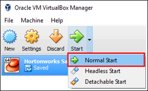

<properties
	pageTitle="Use a Hadoop sandbox to learn about Hadoop | Microsoft Azure"
	description="To start learning about using the Hadoop ecosystem, you can set up a Hadoop sandbox from Hortonworks on an Azure virtual machine. "
	keywords="hadoop emulator,hadoop sandbox"
	editor="cgronlun"
	manager="jhubbard"
	services="hdinsight"
	authors="nitinme"
	documentationCenter=""
	tags="azure-portal"/>

<tags
	ms.service="hdinsight"
	ms.workload="big-data"
	ms.tgt_pltfrm="na"
	ms.devlang="na"
	ms.topic="article"
	ms.date="08/24/2016"
	ms.author="nitinme"/>

# Get started in the Hadoop ecosystem with a Hadoop sandbox on a virtual machine

Learn how to install the Hadoop sandbox from Hortonworks on a virtual machine to learn about the Hadoop ecosystem. The sandbox provides a local development environment to learn about Hadoop, Hadoop Distributed File System (HDFS), and job submission.

## Prerequisites

* [Oracle VirtualBox](https://www.virtualbox.org/)

Once you are familiar with Hadoop, you can start using Hadoop on Azure by creating an HDInsight cluster. For more information on how to get started, see [Get started with Hadoop on HDInsight](hdinsight-hadoop-linux-tutorial-get-started.md).

## Download and install the virtual machine

1. From [http://hortonworks.com/downloads/#sandbox](http://hortonworks.com/downloads/#sandbox), select the __DOWNLOAD FOR VIRTUALBOX__ item for HDP 2.4 on Hortonworks Sandbox. You will be prompted to register with Hortonworks before the download begins.

    

2. From the same web page, select the __VirtualBox Install Guide__ for HDP 2.4 on Hortonworks Sandbox. This will download a PDF containing installation instructions for the virtual machine.

    

## Start the virtual machine

1. Start VirtualBox, select the Hortonworks Sandbox, select __Start__, and then __Normal Start__.

    

2. Once the virtual machine has finished the boot process, it will display login instructions. Open a web browser and navigate to the URL displayed (usually http://127.0.0.1:8888).

## Set passwords

1. From the __get started__ step of the Hortonworks Sandbox page, select __View Advanced Options__. Use the information on this page to login to the sandbox using SSH. Use the name and password provided.

    > [AZURE.NOTE] If you do not have an SSH client installed, you can use the web-based SSH provided at by the virtual machine at __http://localhost:4200/__.

    The first time you connect using SSH, you will be prompted to change the password for the root account. Enter a new password, which will be used when you login using SSH in the future.

2. Once logged in, enter the following command:

        ambari-admin-password-reset
    
    When prompted, provide a password for the Ambari admin account. This will be used when you access the Ambari Web UI.

## Use the hive command

1. From an SSH connection to the sandbox, use the following command to start the Hive shell:

        hive

2. Once the shell has started, use the following to view the tables that are provided with the sandbox:

        show tables;

3. Use the following to retrieve 10 rows from the `sample_07` table:

        select * from sample_07 limit 10;

## Next steps

* [Learn how to use Visual Studio with the Hortonworks Sandbox](hdinsight-hadoop-emulator-visual-studio.md)
* [Learning the ropes of the Hortonworks Sandbox](http://hortonworks.com/hadoop-tutorial/learning-the-ropes-of-the-hortonworks-sandbox/)
* [Hadoop tutorial - Getting started with HDP](http://hortonworks.com/hadoop-tutorial/hello-world-an-introduction-to-hadoop-hcatalog-hive-and-pig/)