# Use the Azure Data Lake tools for Visual Studio with the Hortonworks Sandbox

Azure Data Lake includes tools for working with generic Apache Hadoop clusters. This document provides the steps needed to use the Data Lake tools with the Hortonworks Sandbox running in a local virtual machine.

Using the Hortonworks Sandbox allows you to work with Hadoop locally on your development environment. After you have developed a solution and want to deploy it at scale, you can then move to an HDInsight cluster.

## Prerequisites

* The Hortonworks Sandbox, running in a virtual machine on your development environment. This document was written and tested with the sandbox running in Oracle VirtualBox. For information on setting up the sandbox, see the [Get started with the Hortonworks sandbox.](hadoop/apache-hadoop-emulator-get-started.md) document.

* Visual Studio.

* The [Azure SDK for .NET](https://azure.microsoft.com/downloads/) 2.7.1 or later.

* The [Azure Data Lake tools for Visual Studio](https://www.microsoft.com/download/details.aspx?id=49504).

## Configure passwords for the sandbox

Make sure that the Hortonworks Sandbox is running. Then follow the steps in the [Get started in the Hortonworks Sandbox](hadoop/apache-hadoop-emulator-get-started.md#set-sandbox-passwords) document. These steps configure the password for the SSH `root` account, and the Apache Ambari `admin` account. These passwords are used when you connect to the sandbox from Visual Studio.

## Connect the tools to the sandbox

1. Open Visual Studio, select **View**, and then select **Server Explorer**.

2. From **Server Explorer**, right-click the **HDInsight** entry, and then select **Connect to HDInsight Emulator**.

    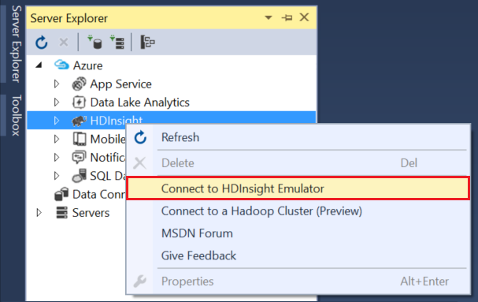

3. From the **Connect to HDInsight Emulator** dialog box, enter the password that you configured for Ambari.

    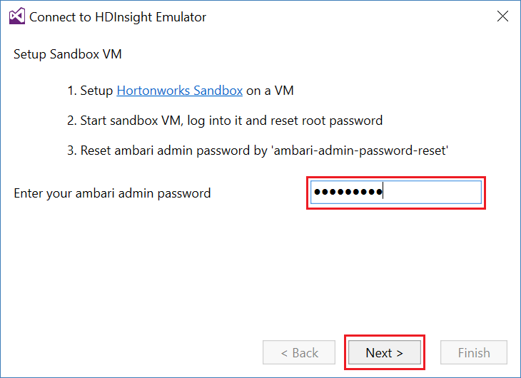

    Select **Next** to continue.

4. Use the **Password** field to enter the password you configured for the `root` account. Leave the other fields at the default value.

    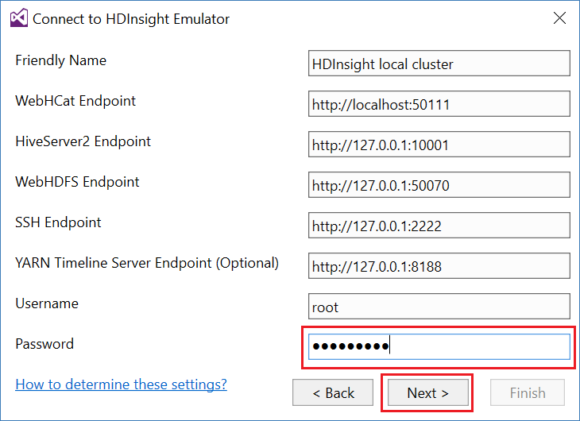

    Select **Next** to continue.

5. Wait for validation of the services to finish. In some cases, validation may fail and prompt you to update the configuration. If validation fails, select **Update**, and wait for the configuration and verification for the service to finish.

    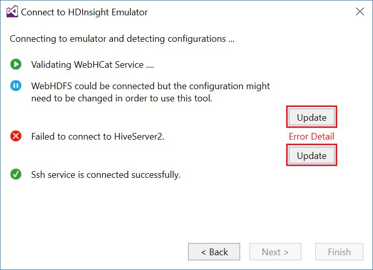

    > [!NOTE]  
    > The update process uses Ambari to modify the Hortonworks Sandbox configuration to what is expected by the Data Lake tools for Visual Studio.

6. After validation has finished, select **Finish** to complete configuration.
    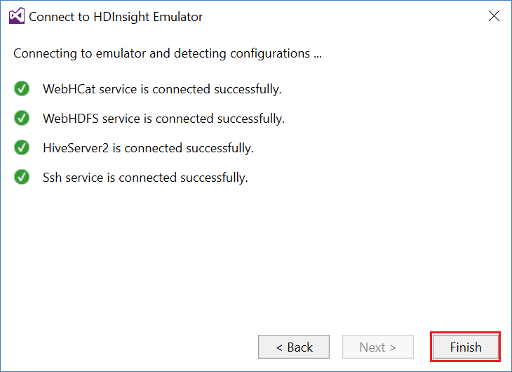

     >[!NOTE]  
     > Depending on the speed of your development environment, and the amount of memory allocated to the virtual machine, it can take several minutes to configure and validate the services.

After following these steps, you now have an **HDInsight local cluster** entry in Server Explorer, under the **HDInsight** section.

## Write an Apache Hive query

Hive provides a SQL-like query language (HiveQL) for working with structured data. Use the following steps to learn how to run on-demand queries against the local cluster.

1. In **Server Explorer**, right-click the entry for the local cluster that you added previously, and then select **Write a Hive Query**.

    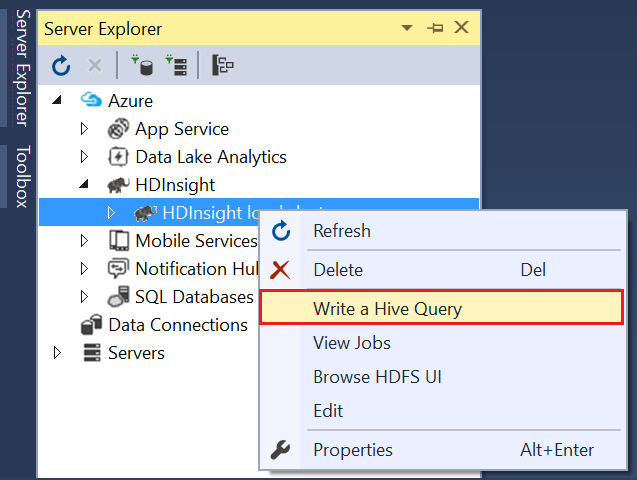

    A new query window appears. Here you can quickly write and submit a query to the local cluster.

2. In the new query window, enter the following command:

        select count(*) from sample_08;

    To run the query, select **Submit** at the top of the window. Leave the other values (**Batch** and server name) at the default values.

    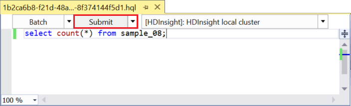

    You can also use the drop-down menu next to **Submit** to select **Advanced**. Advanced options allow you to provide additional options when you submit the job.

    

3. After you submit the query, the job status appears. The job status displays information about the job as it is processed by Hadoop. **Job State** provides the status of the job. The state is updated periodically, or you can use the refresh icon to refresh the state manually.

    

    After the **Job State** changes to **Finished**, a Directed Acyclic Graph (DAG) is displayed. This diagram describes the execution path that was determined by Tez when processing the Hive query. Tez is the default execution engine for Hive on the local cluster.

    > [!NOTE]  
    > Apache Tez is also the default when you are using Linux-based HDInsight clusters. It is not the default on Windows-based HDInsight. To use it there, you must add the line `set hive.execution.engine = tez;` to the beginning of your Hive query.

    Use the **Job Output** link to view the output. In this case, it is 823, the number of rows in the sample_08 table. You can view diagnostics information about the job by using the **Job Log** and **Download YARN Log** links.

4. You can also run Hive jobs interactively by changing the **Batch** field to **Interactive**. Then select **Execute**.

    

    An interactive query streams the output log generated during processing to the **HiveServer2 Output** window.

    > [!NOTE]  
    > The information is the same that is available from the **Job Log** link after a job has finished.

    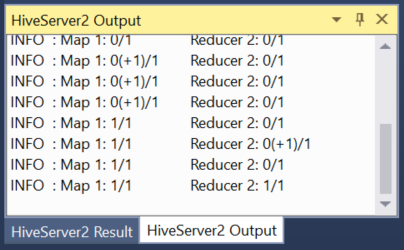

## Create a Hive project

You can also create a project that contains multiple Hive scripts. Use a project when you have related scripts or want to store scripts in a version control system.

1. In Visual Studio, select **File**, **New**, and then **Project**.

2. From the list of projects, expand **Templates**, expand **Azure Data Lake**, and then select **HIVE (HDInsight)**. From the list of templates, select **Hive Sample**. Enter a name and location, and then select **OK**.

    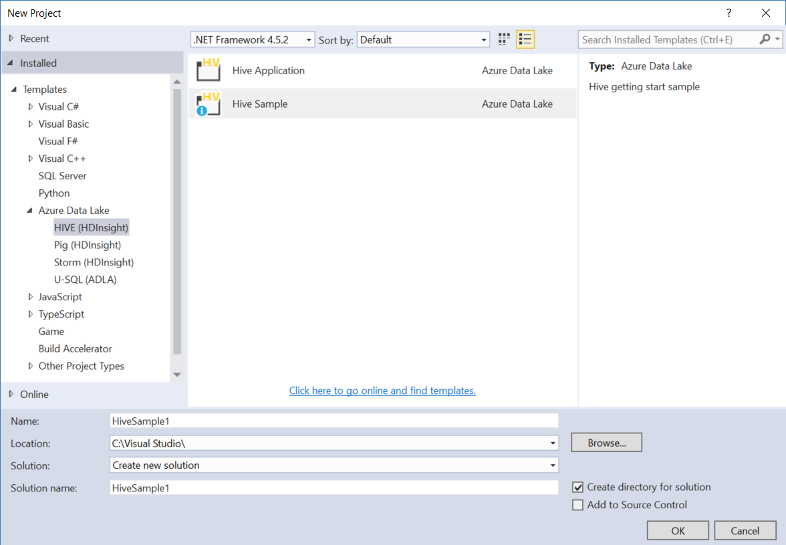

The **Hive Sample** project contains two scripts, **WebLogAnalysis.hql** and **SensorDataAnalysis.hql**. You can submit these scripts by using the same **Submit** button at the top of the window.

## Create an Apache Pig project

While Hive provides a SQL-like language for working with structured data, Pig works by performing transformations on data. Pig provides a language (Pig Latin) that allows you to develop a pipeline of transformations. To use Pig with the local cluster, follow these steps:

1. Open Visual Studio, and select **File**, **New**, and then **Project**. From the list of projects, expand **Templates**, expand **Azure Data Lake**, and then select **Pig (HDInsight)**. From the list of templates, select **Pig Application**. Enter a name, location, and then select **OK**.

    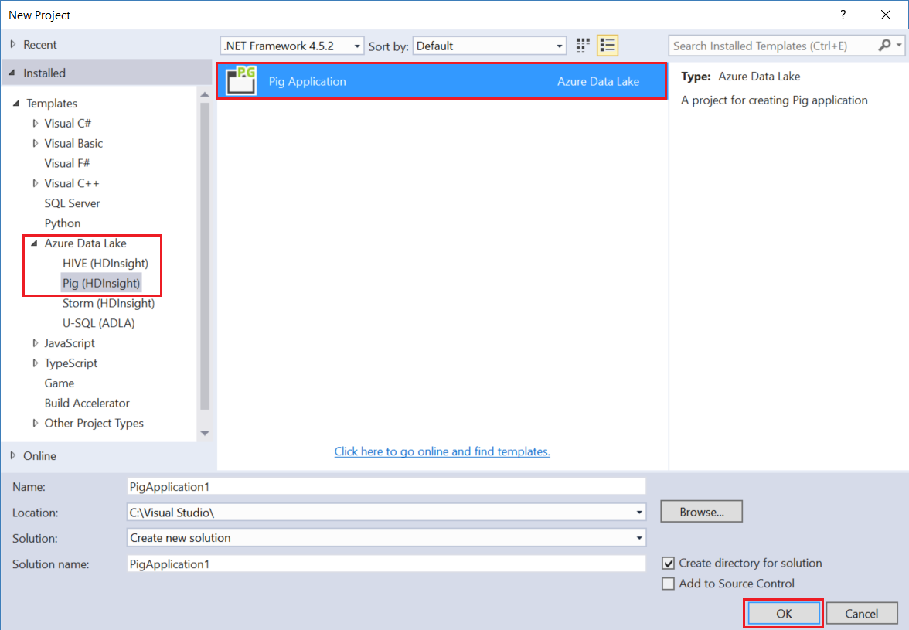

2. Enter the following text as the contents of the **script.pig** file that was created with this project.

        a = LOAD '/demo/data/Website/Website-Logs' AS (
            log_id:int,
            ip_address:chararray,
            date:chararray,
            time:chararray,
            landing_page:chararray,
            source:chararray);
        b = FILTER a BY (log_id > 100);
        c = GROUP b BY ip_address;
        DUMP c;

    While Pig uses a different language than Hive, how you run the jobs is consistent between both languages, through the **Submit** button. Selecting the drop-down beside **Submit** displays an advanced submit dialog box for Pig.

    

3. The job status and output is also displayed, the same as a Hive query.

    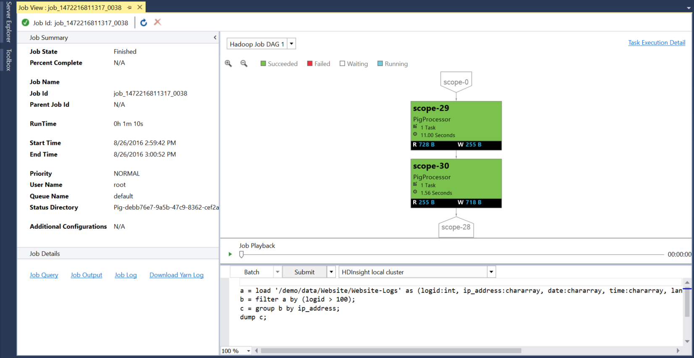

## View jobs

Data Lake tools also allow you to easily view information about jobs that have been run on Hadoop. Use the following steps to see the jobs that have been run on the local cluster.

1. From **Server Explorer**, right-click the local cluster, and then select **View Jobs**. A list of jobs that have been submitted to the cluster is displayed.

    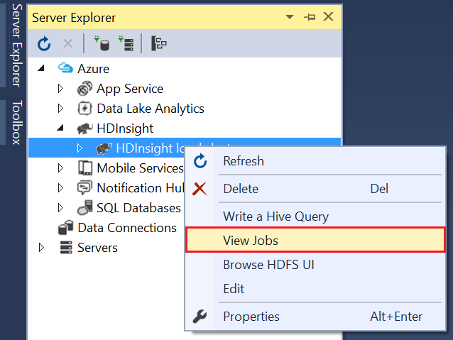

2. From the list of jobs, select one to view the job details.

    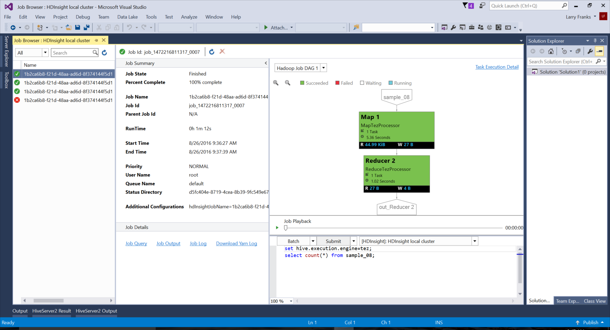

    The information displayed is similar to what you see after running a Hive or Pig query, including links to view the output and log information.

3. You can also modify and resubmit the job from here.

## View Hive databases

1. In **Server Explorer**, expand the **HDInsight local cluster** entry, and then expand **Hive Databases**. The **Default** and **xademo** databases on the local cluster are displayed. Expanding a database shows the tables within the database.

    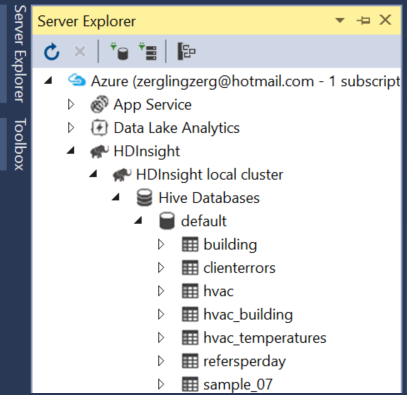

2. Expanding a table displays the columns for that table. To quickly view the data, right-click a table, and select **View Top 100 Rows**.

    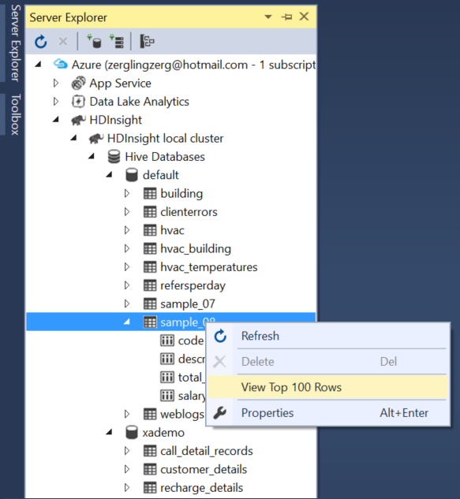

### Database and table properties

You can view the properties of a database or table. Selecting **Properties** displays details for the selected item in the properties window. For example, see the information shown in the following screenshot:

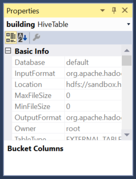

### Create a table

To create a table, right-click a database, and then select **Create Table**.

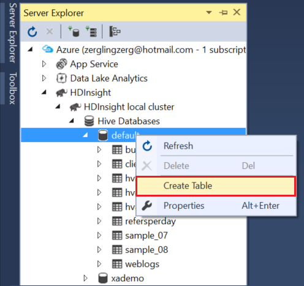

You can then create the table using a form. At the bottom of the following screenshot, you can see the raw HiveQL that is used to create the table.

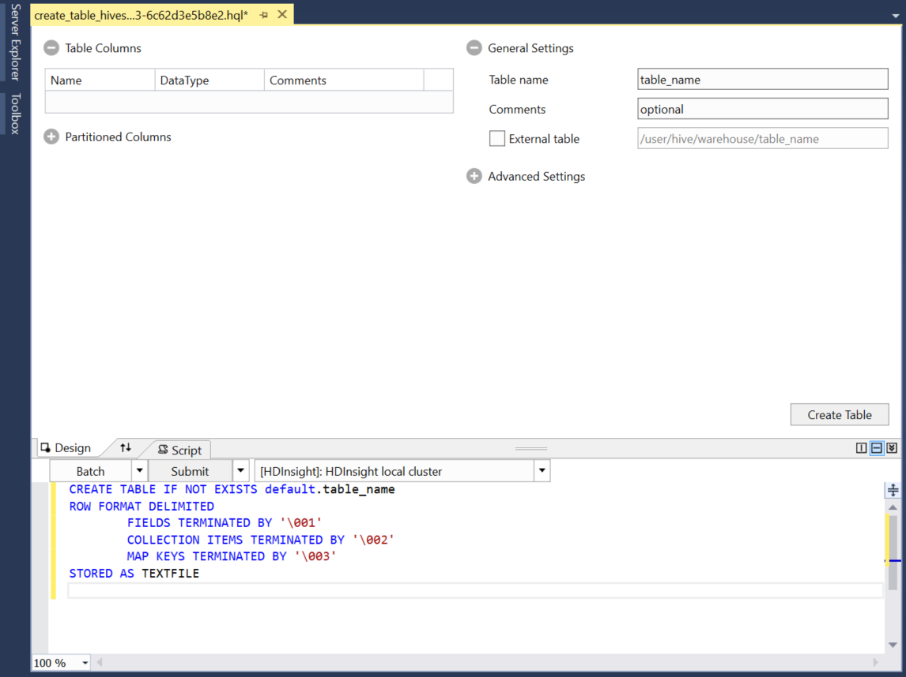

## Next steps

* [Learning the ropes of the Hortonworks Sandbox](https://hortonworks.com/hadoop-tutorial/learning-the-ropes-of-the-hortonworks-sandbox/)
* [Apache Hadoop tutorial - Getting started with HDP](https://hortonworks.com/hadoop-tutorial/hello-world-an-introduction-to-hadoop-hcatalog-hive-and-pig/)
