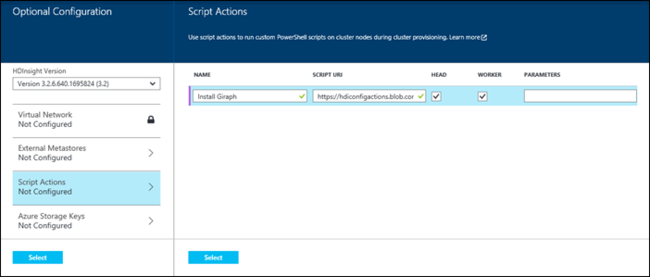
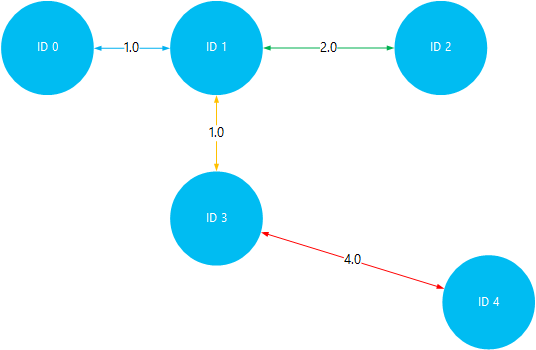

<properties
	pageTitle="Install and use Giraph on Hadoop clusters in HDInsight | Microsoft Azure"
	description="Learn how to customize HDInsight cluster with Giraph, and how to use Giraph."
	services="hdinsight"
	documentationCenter=""
	authors="nitinme"
	manager="paulettm"
	editor="cgronlun"
	tags="azure-portal"/>

<tags
	ms.service="hdinsight"
	ms.workload="big-data"
	ms.tgt_pltfrm="na"
	ms.devlang="na"
	ms.topic="article"
	ms.date="02/05/2016"
	ms.author="nitinme"/>

# Install and use Giraph in HDInsight

Learn how to customize Windows based HDInsight cluster with Giraph using Script Action, and how to use Giraph to process large-scale graphs. For information on using Giraph with a Linux-based cluster, see [Install Giraph on HDInsight Hadoop clusters (Linux)](hdinsight-hadoop-giraph-install-linux.md).
 
You can install Giraph on any type of cluster (Hadoop, Storm, HBase, Spark) on Azure HDInsight by using *Script Action*. A sample script to install Giraph on an HDInsight cluster is available from a read-only Azure storage blob at [https://hdiconfigactions.blob.core.windows.net/giraphconfigactionv01/giraph-installer-v01.ps1](https://hdiconfigactions.blob.core.windows.net/giraphconfigactionv01/giraph-installer-v01.ps1). The sample script works only with HDInsight cluster version 3.1. For more information on HDInsight cluster versions, see [HDInsight cluster versions](hdinsight-component-versioning.md).

**Related articles**

- [Install Giraph on HDInsight Hadoop clusters (Linux)](hdinsight-hadoop-giraph-install-linux.md)
- [Create Hadoop clusters in HDInsight](hdinsight-provision-clusters.md): general information on creating HDInsight clusters.
- [Customize HDInsight cluster using Script Action][hdinsight-cluster-customize]: general information on customizing HDInsight clusters using Script Action.
- [Develop Script Action scripts for HDInsight](hdinsight-hadoop-script-actions.md).

## What is Giraph?

<a href="http://giraph.apache.org/" target="_blank">Apache Giraph</a> allows you to perform graph processing by using Hadoop, and can be used with Azure HDInsight. Graphs model relationships between objects, such as the connections between routers on a large network like the Internet, or relationships between people on social networks (sometimes referred to as a social graph). Graph processing allows you to reason about the relationships between objects in a graph, such as:

- Identifying potential friends based on your current relationships.
- Identifying the shortest route between two computers in a network.
- Calculating the page rank of webpages.

## Install Giraph using portal

1. Start creating a cluster by using the **CUSTOM CREATE** option, as described at [Create Hadoop clusters in HDInsight](hdinsight-provision-clusters.md#portal).
2. On the **Script Actions** page of the wizard, click **add script action** to provide details about the script action, as shown below:

	

	<table border='1'>
		<tr><th>Property</th><th>Value</th></tr>
		<tr><td>Name</td>
			<td>Specify a name for the script action. For example, <b>Install Giraph</b>.</td></tr>
		<tr><td>Script URI</td>
			<td>Specify the Uniform Resource Identifier (URI) to the script that is invoked to customize the cluster. For example, <i>https://hdiconfigactions.blob.core.windows.net/giraphconfigactionv01/giraph-installer-v01.ps1</i></td></tr>
		<tr><td>Node Type</td>
			<td>Specify the nodes on which the customization script is run. You can choose <b>All nodes</b>, <b>Head nodes only</b>, or <b>Worker nodes only</b>.
		<tr><td>Parameters</td>
			<td>Specify the parameters, if required by the script. The script to install Giraph does not require any parameters, so you can leave this blank.</td></tr>
	</table>

	You can add more than one script action to install multiple components on the cluster. After you have added the scripts, click the checkmark to start creating the cluster.

## Use Giraph

We use the SimpleShortestPathsComputation example to demonstrate the basic <a href = "http://people.apache.org/~edwardyoon/documents/pregel.pdf">Pregel</a> implementation for finding the shortest path between objects in a graph. Use the following steps to upload the sample data and the sample jar, run a job by using the SimpleShortestPathsComputation example, and then view the results.

1. Upload a sample data file to Azure Blob storage. On your local workstation, create a new file named **tiny_graph.txt**. It should contain the following lines:

		[0,0,[[1,1],[3,3]]]
		[1,0,[[0,1],[2,2],[3,1]]]
		[2,0,[[1,2],[4,4]]]
		[3,0,[[0,3],[1,1],[4,4]]]
		[4,0,[[3,4],[2,4]]]

	Upload the tiny_graph.txt file to the primary storage for your HDInsight cluster. For instructions on how to upload data, see [Upload data for Hadoop jobs in HDInsight](hdinsight-upload-data.md).

	This data describes a relationship between objects in a directed graph, by using the format [source\_id, source\_value,[[dest\_id], [edge\_value],...]]. Each line represents a relationship between a **source\_id** object and one or more **dest\_id** objects. The **edge\_value** (or weight) can be thought of as the strength or distance of the connection between **source_id** and **dest\_id**.

	Drawn out, and using the value (or weight) as the distance between objects, the above data might look like this:

	

4. Run the SimpleShortestPathsComputation example. Use the following Azure PowerShell cmdlets to run the example by using the tiny_graph.txt file as input. 

    [AZURE.INCLUDE [upgrade-powershell](../../includes/hdinsight-use-latest-powershell.md)]

		$clusterName = "clustername"
		# Giraph examples jar
		$jarFile = "wasbs:///example/jars/giraph-examples.jar"
		# Arguments for this job
		$jobArguments = "org.apache.giraph.examples.SimpleShortestPathsComputation",
		                "-ca", "mapred.job.tracker=headnodehost:9010",
		                "-vif", "org.apache.giraph.io.formats.JsonLongDoubleFloatDoubleVertexInputFormat",
		                "-vip", "wasbs:///example/data/tiny_graph.txt",
		                "-vof", "org.apache.giraph.io.formats.IdWithValueTextOutputFormat",
		                "-op",  "wasbs:///example/output/shortestpaths",
		                "-w", "2"
		# Create the definition
		$jobDefinition = New-AzureHDInsightMapReduceJobDefinition
		  -JarFile $jarFile
		  -ClassName "org.apache.giraph.GiraphRunner"
		  -Arguments $jobArguments

		# Run the job, write output to the Azure PowerShell window
		$job = Start-AzureHDInsightJob -Cluster $clusterName -JobDefinition $jobDefinition
		Write-Host "Wait for the job to complete ..." -ForegroundColor Green
		Wait-AzureHDInsightJob -Job $job
		Write-Host "STDERR"
		Get-AzureHDInsightJobOutput -Cluster $clusterName -JobId $job.JobId -StandardError
		Write-Host "Display the standard output ..." -ForegroundColor Green
		Get-AzureHDInsightJobOutput -Cluster $clusterName -JobId $job.JobId -StandardOutput

	In the above example, replace **clustername** with the name of your HDInsight cluster that has Giraph installed.

5. View the results. Once the job has finished, the results will be stored in two output files in the __wasbs:///example/out/shotestpaths__ folder. The files are called __part-m-00001__ and __part-m-00002__. Perform the following steps to download and view the output:

		$subscriptionName = "<SubscriptionName>"       # Azure subscription name
		$storageAccountName = "<StorageAccountName>"   # Azure Storage account name
		$containerName = "<ContainerName>"             # Blob storage container name

		# Select the current subscription
		Select-AzureSubscription $subscriptionName

		# Create the Storage account context object
		$storageAccountKey = Get-AzureStorageKey $storageAccountName | %{ $_.Primary }
		$storageContext = New-AzureStorageContext -StorageAccountName $storageAccountName -StorageAccountKey $storageAccountKey

		# Download the job output to the workstation
		Get-AzureStorageBlobContent -Container $containerName -Blob example/output/shortestpaths/part-m-00001 -Context $storageContext -Force
		Get-AzureStorageBlobContent -Container $containerName -Blob example/output/shortestpaths/part-m-00002 -Context $storageContext -Force

	This will create the __example/output/shortestpaths__ directory structure in the current directory on your workstation, and download the two output files to that location.

	Use the __Cat__ cmdlet to display the contents of the files:

		Cat example/output/shortestpaths/part*

	The output should appear similar to the following:

		0	1.0
		4	5.0
		2	2.0
		1	0.0
		3	1.0

	The SimpleShortestPathComputation example is hard coded to start with object ID 1 and find the shortest path to other objects. So the output should be read as `destination_id distance`, where distance is the value (or weight) of the edges traveled between object ID 1 and the target ID.

	Visualizing this, you can verify the results by traveling the shortest paths between ID 1 and all other objects. Note that the shortest path between ID 1 and ID 4 is 5. This is the total distance between ID 1 and 3, and then ID 3 and 4.

	

## Install Giraph using Aure PowerShell

See [Customize HDInsight clusters using Script Action](hdinsight-hadoop-customize-cluster.md#call_scripts_using_powershell).  The sample demonstrates how to install Spark using Azure PowerShell. You need to customize the script to use [https://hdiconfigactions.blob.core.windows.net/giraphconfigactionv01/giraph-installer-v01.ps1](https://hdiconfigactions.blob.core.windows.net/giraphconfigactionv01/giraph-installer-v01.ps1).

## Install Giraph using .NET SDK

See [Customize HDInsight clusters using Script Action](hdinsight-hadoop-customize-cluster.md#call_scripts_using_azure_powershell). The sample demonstrates how to install Spark using the .NET SDK. You need to customize the script to use [https://hdiconfigactions.blob.core.windows.net/giraphconfigactionv01/giraph-installer-v01.ps1](https://hdiconfigactions.blob.core.windows.net/giraphconfigactionv01/giraph-installer-v01.ps1).

## See also

- [Install Giraph on HDInsight Hadoop clusters (Linux)](hdinsight-hadoop-giraph-install-linux.md)
- [Create Hadoop clusters in HDInsight](hdinsight-provision-clusters.md): general information on creating HDInsight clusters.
- [Customize HDInsight cluster using Script Action][hdinsight-cluster-customize]: general information on customizing HDInsight clusters using Script Action.
- [Develop Script Action scripts for HDInsight](hdinsight-hadoop-script-actions.md).
- [Install and use Spark on HDInsight clusters][hdinsight-install-spark]: Script Action sample about installing Spark.
- [Install R on HDInsight clusters][hdinsight-install-r]: Script Action sample about installing R.
- [Install Solr on HDInsight clusters](hdinsight-hadoop-solr-install.md): Script Action sample about installing Solr.

[tools]: https://github.com/Blackmist/hdinsight-tools
[aps]: http://azure.microsoft.com/documentation/articles/install-configure-powershell/

[powershell-install]: ../powershell-install-configure.md
[hdinsight-provision]: hdinsight-provision-clusters.md
[hdinsight-install-r]: hdinsight-hadoop-r-scripts.md
[hdinsight-install-spark]: hdinsight-hadoop-spark-install.md
[hdinsight-cluster-customize]: hdinsight-hadoop-customize-cluster.md
