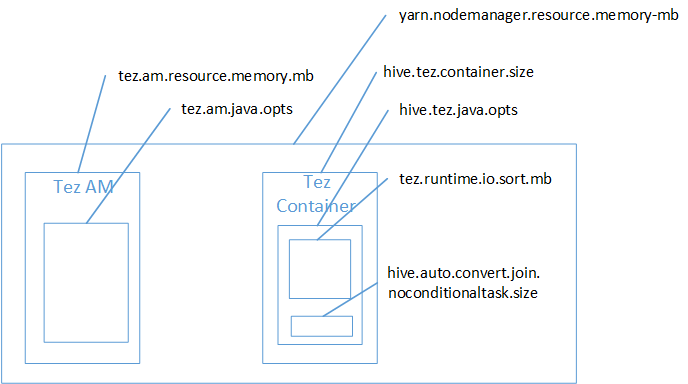

# Fix an Apache Hive out of memory error in Azure HDInsight

Learn how to fix an Apache Hive out of memory (OOM) error when processing large tables by configuring Hive memory settings.

## Run Apache Hive query against large tables

A customer ran a Hive query:

```sql
SELECT
    COUNT (T1.COLUMN1) as DisplayColumn1,
    …
    …
    ….
FROM
    TABLE1 T1,
    TABLE2 T2,
    TABLE3 T3,
    TABLE5 T4,
    TABLE6 T5,
    TABLE7 T6
where (T1.KEY1 = T2.KEY1….
    …
    …
```

Some nuances of this query:

* T1 is an alias to a large table, TABLE1, which has lots of STRING column types.
* Other tables aren't that large but do have many columns.
* All tables are joining each other, in some cases with multiple columns in TABLE1 and others.

The Hive query took 26 minutes to finish on a 24 node A3 HDInsight cluster. The customer noticed the following warning messages:

    Warning: Map Join MAPJOIN[428][bigTable=?] in task 'Stage-21:MAPRED' is a cross product
    Warning: Shuffle Join JOIN[8][tables = [t1933775, t1932766]] in Stage 'Stage-4:MAPRED' is a cross product

By using the Apache Tez execution engine. The same query ran for 15 minutes, and then threw the following error:

    Status: Failed
    Vertex failed, vertexName=Map 5, vertexId=vertex_1443634917922_0008_1_05, diagnostics=[Task failed, taskId=task_1443634917922_0008_1_05_000006, diagnostics=[TaskAttempt 0 failed, info=[Error: Failure while running task:java.lang.RuntimeException: java.lang.OutOfMemoryError: Java heap space
        at
    org.apache.hadoop.hive.ql.exec.tez.TezProcessor.initializeAndRunProcessor(TezProcessor.java:172)
        at org.apache.hadoop.hive.ql.exec.tez.TezProcessor.run(TezProcessor.java:138)
        at
    org.apache.tez.runtime.LogicalIOProcessorRuntimeTask.run(LogicalIOProcessorRuntimeTask.java:324)
        at
    org.apache.tez.runtime.task.TezTaskRunner$TaskRunnerCallable$1.run(TezTaskRunner.java:176)
        at
    org.apache.tez.runtime.task.TezTaskRunner$TaskRunnerCallable$1.run(TezTaskRunner.java:168)
        at java.security.AccessController.doPrivileged(Native Method)
        at javax.security.auth.Subject.doAs(Subject.java:415)
        at org.apache.hadoop.security.UserGroupInformation.doAs(UserGroupInformation.java:1628)
        at
    org.apache.tez.runtime.task.TezTaskRunner$TaskRunnerCallable.call(TezTaskRunner.java:168)
        at
    org.apache.tez.runtime.task.TezTaskRunner$TaskRunnerCallable.call(TezTaskRunner.java:163)
        at java.util.concurrent.FutureTask.run(FutureTask.java:262)
        at java.util.concurrent.ThreadPoolExecutor.runWorker(ThreadPoolExecutor.java:1145)
        at java.util.concurrent.ThreadPoolExecutor$Worker.run(ThreadPoolExecutor.java:615)
        at java.lang.Thread.run(Thread.java:745)
    Caused by: java.lang.OutOfMemoryError: Java heap space

The error remains when using a bigger virtual machine (for example, D12).

## Debug the out of memory error

Our support and engineering teams together found one of the issues causing the out of memory error was a [known issue described in the Apache JIRA](https://issues.apache.org/jira/browse/HIVE-8306):

"When hive.auto.convert.join.noconditionaltask = true we check noconditionaltask.size and if the sum  of tables sizes in the map join is less than noconditionaltask.size the plan would generate a Map join, the issue with this is that the calculation doesn't take into account the overhead introduced by different HashTable implementation as results if the sum of input sizes is smaller than the noconditionaltask size by a small margin queries will hit OOM."

The **hive.auto.convert.join.noconditionaltask** in the hive-site.xml file was set to **true**:

```xml
<property>
    <name>hive.auto.convert.join.noconditionaltask</name>
    <value>true</value>
    <description>
            Whether Hive enables the optimization about converting common join into mapjoin based on the input file size.
            If this parameter is on, and the sum of size for n-1 of the tables/partitions for a n-way join is smaller than the
            specified size, the join is directly converted to a mapjoin (there is no conditional task).
    </description>
</property>
```

It's likely map join was the cause of the Java Heap Space out of memory error. As explained in the blog post [Hadoop Yarn memory settings in HDInsight](https://docs.microsoft.com/archive/blogs/shanyu/hadoop-yarn-memory-settings-in-hdinsight), when Tez execution engine is used the heap space used actually belongs to the Tez container. See the following image describing the Tez container memory.



As the blog post suggests, the following two memory settings define the container memory for the heap: **hive.tez.container.size** and **hive.tez.java.opts**. From our experience, the out of memory exception doesn't mean the container size is too small. It means the Java heap size (hive.tez.java.opts) is too small. So whenever you see out of memory, you can try to increase **hive.tez.java.opts**. If needed you might have to increase **hive.tez.container.size**. The **java.opts** setting should be around 80% of **container.size**.

> [!NOTE]  
> The setting **hive.tez.java.opts** must always be smaller than **hive.tez.container.size**.

Because a D12 machine has 28 GB memory, we decided to use a container size of 10 GB (10240 MB) and assign 80% to java.opts:

    SET hive.tez.container.size=10240
    SET hive.tez.java.opts=-Xmx8192m

With the new settings, the query successfully ran in under 10 minutes.

## Next steps

Getting an OOM error doesn't necessarily mean the container size is too small. Instead, you should configure the memory settings so that the heap size is increased and is at least 80% of the container memory size. For optimizing Hive queries, see [Optimize Apache Hive queries for Apache Hadoop in HDInsight](hdinsight-hadoop-optimize-hive-query.md).
