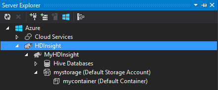

<properties
	pageTitle="Use C# with Hive and Pig on Hadoop in HDInsight | Microsoft Azure"
	description="Learn how to use C# user-defined functions (UDF) with Hive and Pig streaming in Azure HDInsight."
	services="hdinsight"
	documentationCenter=""
	authors="Blackmist"
	manager="paulettm"
	editor="cgronlun"
	tags="azure-portal"/>

<tags
	ms.service="hdinsight"
	ms.workload="big-data"
	ms.tgt_pltfrm="na"
	ms.devlang="dotnet"
	ms.topic="article"
	ms.date="07/12/2016"
	ms.author="larryfr"/>

#Use C# user-defined functions with Hive and Pig streaming on Hadoop in HDInsight

Hive and Pig are great for working with data in Azure HDInsight, but sometimes you need a more general-purpose language. Both Hive and Pig allow you to call external code through user-defined functions (UDFs) or streaming.

In this document, learn how to use C# with Hive and Pig.

##Prerequisites

* Windows 7 or newer.

* Visual Studio with the following versions:

	* Visual Studio 2012 Professional/Premium/Ultimate with [Update 4](http://www.microsoft.com/download/details.aspx?id=39305)

	* Visual Studio 2013 Community/Professional/Premium/Ultimate with [Update 4](https://www.microsoft.com/download/details.aspx?id=44921)

	* Visual Studio 2015

* Hadoop on HDInsight cluster - see [Provision an HDInsight cluster](hdinsight-provision-clusters.md) for steps to create a cluster

* Hadoop Tools for Visual Studio. See [Get started using HDInsight Hadoop Tools for Visual Studio](hdinsight-hadoop-visual-studio-tools-get-started.md) for steps on installing and configuring the tools.

##.NET on HDInsight

The .NET common language runtime (CLR) and frameworks are installed by default on Windows-based HDInsight clusters. This allows you to use C# applications with Hive and Pig streaming (data is passed between Hive/Pig and the C# application via stdout/stdin).

Currently there is no support for running .NET Framework applications on Linux-based HDInsight clusters.

##.NET and streaming

Streaming involves Hive and Pig passing data to an external application over stdout, and receiving the results over stdin. For C# applications, this is most easily accomplished via `Console.ReadLine()` and `Console.WriteLine()`.

Since Hive and Pig need to invoke the application at run time, the **Console Application** template should be used for your C# projects.

##Hive and C&#35;

###Create the C# project

1. Open Visual Studio and create a new solution. For the project type, select **Console Application**, and name the new project **HiveCSharp**.

2. Replace the contents of **Program.cs** with the following:

        using System;
        using System.Security.Cryptography;
        using System.Text;
        using System.Threading.Tasks;

        namespace HiveCSharp
        {
            class Program
            {
                static void Main(string[] args)
                {
                    string line;
                    // Read stdin in a loop
                    while ((line = Console.ReadLine()) != null)
                    {
                        // Parse the string, trimming line feeds
                        // and splitting fields at tabs
                        line = line.TrimEnd('\n');
                        string[] field = line.Split('\t');
                        string phoneLabel = field[1] + ' ' + field[2];
                        // Emit new data to stdout, delimited by tabs
                        Console.WriteLine("{0}\t{1}\t{2}", field[0], phoneLabel, GetMD5Hash(phoneLabel));
                    }
                }
                /// 

                /// Returns an MD5 hash for the given string
                /// 

                /// <param name="input">string value</param>
                /// <returns>an MD5 hash</returns>
                static string GetMD5Hash(string input)
                {
                    // Step 1, calculate MD5 hash from input
                    MD5 md5 = System.Security.Cryptography.MD5.Create();
                    byte[] inputBytes = System.Text.Encoding.ASCII.GetBytes(input);
                    byte[] hash = md5.ComputeHash(inputBytes);

                    // Step 2, convert byte array to hex string
                    StringBuilder sb = new StringBuilder();
                    for (int i = 0; i < hash.Length; i++)
                    {
                        sb.Append(hash[i].ToString("x2"));
                    }
                    return sb.ToString();
                }
            }
        }

3. Build the project.

###Upload to storage

1. In Visual Studio, open **Server Explorer**.

3. Expand **Azure**, and then expand **HDInsight**.

4. If prompted, enter your Azure subscription credentials, and then click **Sign In**.

5. Expand the HDInsight cluster that you wish to deploy this application to, and then expand **Default Storage Account**.

	

6. Double-click **Default Container** for the cluster. This will open a new window that displays the contents of the default container.

7. Click the upload icon, and then browse to the **bin\debug** folder for the **HiveCSharp** project. Finally, select the **HiveCSharp.exe** file and click **Ok**.

	

8. Once the upload has finished, you will be able to use the application from a Hive query.

###Hive query

1. In Visual Studio, open **Server Explorer**.

2. Expand **Azure**, and then expand **HDInsight**.

5. Right-click the cluster that you deployed the **HiveCSharp** application to, and then select **Write a Hive Query**.

6. Use the following for the Hive query:

		add file wasbs:///HiveCSharp.exe;

		SELECT TRANSFORM (clientid, devicemake, devicemodel)
		USING 'HiveCSharp.exe' AS
		(clientid string, phoneLabel string, phoneHash string)
		FROM hivesampletable
		ORDER BY clientid LIMIT 50;

    This selects the `clientid`, `devicemake`, and `devicemodel` fields from `hivesampletable`, and passes the fields to the HiveCSharp.exe application. The query expects the application to return three fields, which are stored as `clientid`, `phoneLabel`, and `phoneHash`. The query also expects to find HiveCSharp.exe in the root of the default storage container (`add file wasbs:///HiveCSharp.exe`).

5. Click **Submit** to submit the job to the HDInsight cluster. The **Hive Job Summary** window will open.

6. Click **Refresh** to refresh the summary until **Job Status** changes to **Completed**. To view the job output, click **Job Output**.

##Pig and C&#35;

###Create the C# project

1. Open Visual Studio and create a new solution. For the project type, select **Console Application**, and name the new project **PigUDF**.

2. Replace the contents of the **Program.cs** file with the following:

		using System;

		namespace PigUDF
		{
		    class Program
		    {
		        static void Main(string[] args)
		        {
		            string line;
				    // Read stdin in a loop
				    while ((line = Console.ReadLine()) != null)
		            {
		                // Fix formatting on lines that begin with an exception
		                if(line.StartsWith("java.lang.Exception"))
		                {
		                    // Trim the error info off the beginning and add a note to the end of the line
		                    line = line.Remove(0, 21) + " - java.lang.Exception";
		                }
		                // Split the fields apart at tab characters
		                string[] field = line.Split('\t');
		                // Put fields back together for writing
		                Console.WriteLine(String.Join("\t",field));
		            }
		        }
		    }
		}

	This application will parse the lines sent from Pig, and reformat lines that begin with `java.lang.Exception`.

3. Save **Program.cs**, and then build the project.

###Upload the application

1. Pig streaming expects the application to be local on the cluster file system. Enable Remote Desktop for the HDInsight cluster, and then connect to it by following the instructions at [Connect to HDInsight clusters using RDP](hdinsight-administer-use-management-portal.md#rdp).

2. Once connected, copy **PigUDF.exe** from the **bin/debug** directory for the PigUDF project on your local machine, and paste it to the **%PIG_HOME%** directory on the cluster.

###Use the application from Pig Latin

1. From the Remote Desktop session, start the Hadoop command line by using the **Hadoop Command Line** icon on the desktop.

2. Use the following to start the Pig command line:

		cd %PIG_HOME%
		bin\pig

	You will be presented with a `grunt>` prompt.

3. Enter the following to run a simple Pig job by using the .NET Framework application:

		DEFINE streamer `pigudf.exe` SHIP('pigudf.exe');
		LOGS = LOAD 'wasbs:///example/data/sample.log' as (LINE:chararray);
		LOG = FILTER LOGS by LINE is not null;
		DETAILS = STREAM LOG through streamer as (col1, col2, col3, col4, col5);
		DUMP DETAILS;

	The `DEFINE` statement creates an alias of `streamer` for the pigudf.exe applications, and `SHIP` distributes it across the nodes in the cluster. Later, `streamer` is used with the `STREAM` operator to process the single lines contained in LOG and return the data as a series of columns.

> [AZURE.NOTE] The application name that is used for streaming must be surrounded by the \` (backtick) character when aliased, and ' (single quote) when used with `SHIP`.

3. After entering the last line, the job should start. Eventually it will return output similar to the following:

		(2012-02-03 20:11:56 SampleClass5 [WARN] problem finding id 1358451042 - java.lang.Exception)
		(2012-02-03 20:11:56 SampleClass5 [DEBUG] detail for id 1976092771)
		(2012-02-03 20:11:56 SampleClass5 [TRACE] verbose detail for id 1317358561)
		(2012-02-03 20:11:56 SampleClass5 [TRACE] verbose detail for id 1737534798)
		(2012-02-03 20:11:56 SampleClass7 [DEBUG] detail for id 1475865947)

##Summary

In this document, you have learned how to use a .NET Framework application from Hive and Pig on HDInsight. If you would like to learn how to use Python with Hive and Pig, see [Use Python with Hive and Pig in HDInsight](hdinsight-python.md).

For other ways to use Pig and Hive, and to learn about using MapReduce, see the following:

* [Use Hive with HDInsight](hdinsight-use-hive.md)

* [Use Pig with HDInsight](hdinsight-use-pig.md)

* [Use MapReduce with HDInsight](hdinsight-use-mapreduce.md)
