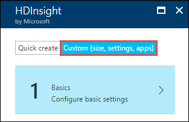
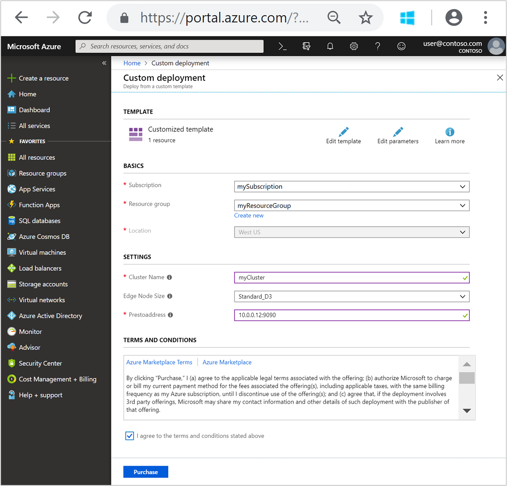
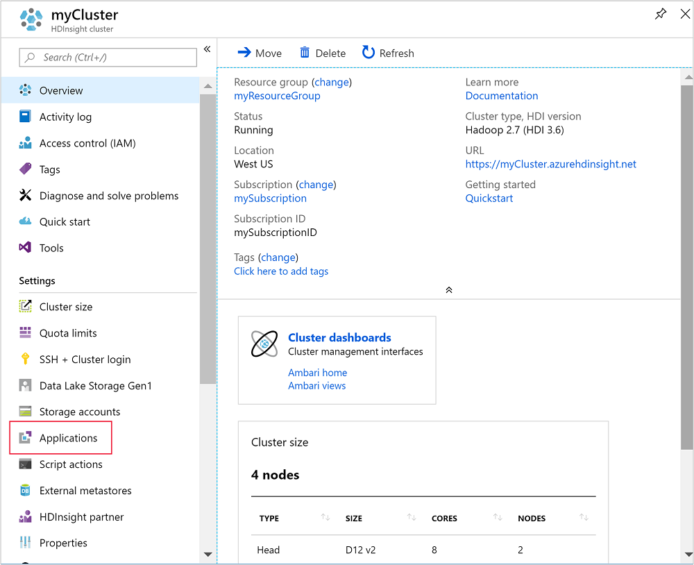
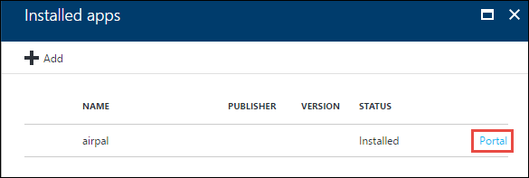

# Install and use Presto on HDInsight Hadoop clusters

In this document, you learn how to install Presto on HDInsight Hadoop clusters by using Script Action. You also learn how to install Airpal on an existing Presto HDInsight cluster.

> [!IMPORTANT]
> The steps in this document require an **HDInsight 3.5 Hadoop cluster** that uses Linux. Linux is the only operating system used on HDInsight version 3.4 or greater. For more information, see [HDInsight versions](hdinsight-component-versioning.md).

## What is Presto?
[Presto](https://prestodb.io/overview.html) is a fast distributed SQL query engine for big data. Presto is suitable for interactive querying of petabytes of data. For more information on the components of Presto and how they work together, see [Presto concepts](https://github.com/prestodb/presto/blob/master/presto-docs/src/main/sphinx/overview/concepts.rst).

> [!WARNING]
> Components provided with the HDInsight cluster are fully supported and Microsoft Support will help to isolate and resolve issues related to these components.
> 
> Custom components, such as Presto, receive commercially reasonable support to help you to further troubleshoot the issue. This might result in resolving the issue OR asking you to engage available channels for the open source technologies where deep expertise for that technology is found. For example, there are many community sites that can be used, like: [MSDN forum for HDInsight](https://social.msdn.microsoft.com/Forums/azure/home?forum=hdinsight), [http://stackoverflow.com](http://stackoverflow.com). Also Apache projects have project sites on [http://apache.org](http://apache.org), for example: [Hadoop](http://hadoop.apache.org/).
> 
> 

## Install Presto using script action

This section provides instructions on how to use the sample script when creating a new cluster by using the Azure portal. 

1. Start provisioning a cluster by using the steps in [Provision Linux-based HDInsight clusters](hdinsight-hadoop-create-linux-clusters-portal.md). Make sure you create the cluster using the **Custom** cluster creation flow. The cluster must meet the following requirements.

	* It must be a Hadoop cluster with HDInsight version 3.6.

	* It must use Azure Storage as the data store. Using Presto on a cluster that uses Azure Data Lake Store as the storage option is not yet supported. 

	

2. On the **Advanced settings** area, select **Script Actions**, and provide the information below:
   
   * **NAME**: Enter a friendly name for the script action.
   * **Bash script URI**: `https://raw.githubusercontent.com/hdinsight/presto-hdinsight/master/installpresto.sh`
   * **HEAD**: Check this option
   * **WORKER**: Check this option
   * **ZOOKEEPER**: Clear this check box
   * **PARAMETERS**: Leave this field blank

3. At the bottom of the **Script Actions** area, click the **Select** button to save the configuration. Finally, click  the **Select** button at the bottom of the **Advanced Settings** area to save the configuration information.

4. Continue provisioning the cluster as described in [Provision Linux-based HDInsight clusters](hdinsight-hadoop-create-linux-clusters-portal.md).

    > [!NOTE]
    > Azure PowerShell, the Azure Classic CLI, the HDInsight .NET SDK, or Azure Resource Manager templates can also be used to apply script actions. You can also apply script actions to already running clusters. For more information, see [Customize HDInsight clusters with Script Actions](hdinsight-hadoop-customize-cluster-linux.md).
    > 
    > 

## Use Presto with HDInsight

To work with Presto in an HDInsight cluster, use the following steps:

1. Connect to the HDInsight cluster using SSH:
   
        ssh USERNAME@CLUSTERNAME-ssh.azurehdinsight.net
   
    For more information, see [Use SSH with HDInsight](hdinsight-hadoop-linux-use-ssh-unix.md).
     

2. Start the Presto shell using the following command.
   
        presto --schema default

3. Run a query on a sample table, **hivesampletable**, which is available on all HDInsight clusters by default.
   
		select count (*) from hivesampletable;
   
	By default, [Hive](https://prestodb.io/docs/current/connector/hive.html) and [TPCH](https://prestodb.io/docs/current/connector/tpch.html) connectors for Presto are already configured. Hive connector is configured to use the default installed Hive installation, so all the tables from Hive will be automatically visible in Presto.

	For more information, see [Presto documentation](https://prestodb.io/docs/current/index.html).

## Use Airpal with Presto

[Airpal](https://github.com/airbnb/airpal#airpal) is an open-source web-based query interface for Presto. For more information on Airpal, see [Airpal documentation](https://github.com/airbnb/airpal#airpal).

Use the following steps to install Airpal on the edge node:

1. Using SSH, connect to the headnode of the HDInsight cluster that has Presto installed:
   
        ssh USERNAME@CLUSTERNAME-ssh.azurehdinsight.net
   
    For more information, see [Use SSH with HDInsight](hdinsight-hadoop-linux-use-ssh-unix.md).

2. Once you are connected, run the following command.

		sudo slider registry  --name presto1 --getexp presto 
   
    You see output similar to the following JSON:

		{
  			"coordinator_address" : [ {
    			"value" : "10.0.0.12:9090",
    			"level" : "application",
    			"updatedTime" : "Mon Apr 03 20:13:41 UTC 2017"
  		} ]

3. From the output, note the value for the **value** property. You will need this value while installing Airpal on the cluster edgenode. From the output above, the value that you will need is **10.0.0.12:9090**.

4. Use the template **[here](https://portal.azure.com/#create/Microsoft.Template/uri/https%3A%2F%2Fraw.githubusercontent.com%2Fhdinsight%2Fpresto-hdinsight%2Fmaster%2Fairpal-deploy.json)** to create an HDInsight cluster edgenode and provide the values as shown in the following screenshot.

	

5. Click **Purchase**.

6. Once the changes are applied to the cluster configuration, you can access the Airpal web interface by using the following steps.

	1. From the cluster dialog, click **Applications**.

	    

	2. From the **Installed Apps** area, click **Portal** against airpal.

	    

	3. When prompted, enter the admin credentials that you specified while creating the HDInsight Hadoop cluster.

## Customize a Presto installation on HDInsight cluster

To customize the installation, use the following steps:

1. Using SSH, connect to the headnode of the HDInsight cluster that has Presto installed:
   
        ssh USERNAME@CLUSTERNAME-ssh.azurehdinsight.net
   
    For more information, see [Use SSH with HDInsight](hdinsight-hadoop-linux-use-ssh-unix.md).

2. Make your configuration changes in the file `/var/lib/presto/presto-hdinsight-master/appConfig-default.json`. For more information on Presto configuration, see [Presto configuration for YARN-based clusters](https://prestodb.io/presto-yarn/installation-yarn-configuration-options.html).

3. Stop and kill the current running instance of Presto.

		sudo slider stop presto1 --force
		sudo slider destroy presto1 --force

4. Start a new instance of Presto with the customization.

	   sudo slider create presto1 --template /var/lib/presto/presto-hdinsight-master/appConfig-default.json --resources /var/lib/presto/presto-hdinsight-master/resources-default.json

5. Wait for the new instance to be ready and note presto coordinator address.

       sudo slider registry --name presto1 --getexp presto

## Generate benchmark data for HDInsight clusters that run Presto

TPC-DS is the industry standard for measuring the performance of many decision support systems, including big data systems. You can use Presto to generate data and evaluate how it compares with your own HDInsight benchmark data. For more information, see [here](https://github.com/hdinsight/tpcds-datagen-as-hive-query/blob/master/README.md).

## See also
* [Install and use Hue on HDInsight clusters](hdinsight-hadoop-hue-linux.md). Hue is a web UI that makes it easy to create, run, and save Pig and Hive jobs.

* [Install Giraph on HDInsight clusters](hdinsight-hadoop-giraph-install-linux.md). Use cluster customization to install Giraph on HDInsight Hadoop clusters. Giraph allows you to perform graph processing by using Hadoop, and can be used with Azure HDInsight.

* [Install Solr on HDInsight clusters](hdinsight-hadoop-solr-install-linux.md). Use cluster customization to install Solr on HDInsight Hadoop clusters. Solr allows you to perform powerful search operations on stored data.

[hdinsight-install-r]: hdinsight-hadoop-r-scripts-linux.md
[hdinsight-cluster-customize]: hdinsight-hadoop-customize-cluster-linux.md
