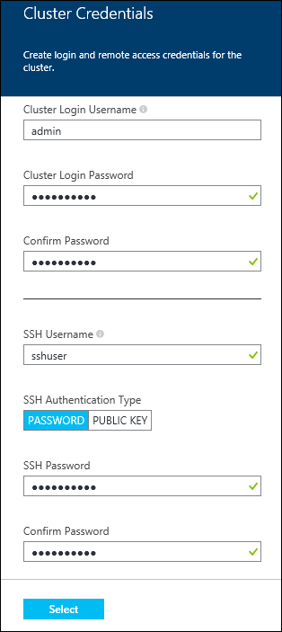
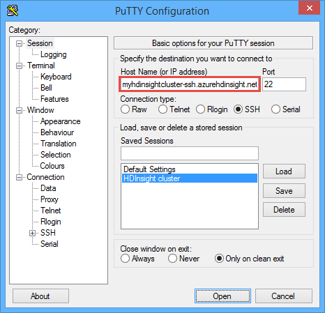

<properties
   	pageTitle="Linux tutorial: Get started with Hadoop and Hive | Microsoft Azure"
   	description="Follow this Linux tutorial to get started using Hadoop in HDInsight. Learn how to provision Linux clusters, and query data with Hive."
   	services="hdinsight"
   	documentationCenter=""
   	authors="nitinme"
   	manager="paulettm"
   	editor="cgronlun"
	tags="azure-portal"/>

<tags
   	ms.service="hdinsight"
   	ms.devlang="na"
   	ms.topic="hero-article"
   	ms.tgt_pltfrm="na"
   	ms.workload="big-data"
   	ms.date="08/21/2015"
   	ms.author="nitinme"/>

# Hadoop tutorial: Get started using Hadoop with Hive in HDInsight on Linux

> [AZURE.SELECTOR]
- [Windows](hdinsight-hadoop-tutorial-get-started-windows.md)
- [Linux](hdinsight-hadoop-linux-tutorial-get-started.md)

This docuent gets you started quickly with Azure HDInsight on Linux by showing you how to create a Linux-based Hadoop cluster, connect to the cluster using a Secure Shell (SSH,) and then run a Hive query against example data that is included with the cluster.

> [AZURE.NOTE] If you are new to Hadoop and big data, you can read more about the terms [Apache Hadoop](http://go.microsoft.com/fwlink/?LinkId=510084), [MapReduce](http://go.microsoft.com/fwlink/?LinkId=510086), [Hadoop Distributed File System (HDFS)](http://go.microsoft.com/fwlink/?LinkId=510087), and [Hive](http://go.microsoft.com/fwlink/?LinkId=510085). To understand how HDInsight enables Hadoop in Azure, see [Introduction to Hadoop in HDInsight](hdinsight-hadoop-introduction.md).

## Prerequisites

Before you begin this Linux tutorial for Hadoop, you must have the following:

- **An Azure subscription**: See [Get Azure free trial](http://azure.microsoft.com/documentation/videos/get-azure-free-trial-for-testing-hadoop-in-hdinsight/).
- **Secure Shell (SSH) keys** (optional): You can secure the SSH account used to connect to the cluster using either a password or a public key. Using a key is the recommended method as it is more secure, however it requires additional setup. For instructions on how to create and use SSH keys with HDInsight, refer to the following articles:
	-  From a Linux computer - [Use SSH with Linux-based HDInsight (Hadoop) from Linux, Unix, or OS X](hdinsight-hadoop-linux-use-ssh-unix.md).
	-  From a Windows computer - [Use SSH with Linux-based HDInsight (Hadoop) from Windows](hdinsight-hadoop-linux-use-ssh-windows.md).

## Provision an HDInsight cluster on Linux

When you provision a cluster, you create the Azure compute resources that contain Hadoop services and resources. In this section, you provision an HDInsight version 3.2 cluster, which contains Hadoop version 2.2. For information about HDInsight versions and their SLAs, see [HDInsight component versioning](hdinsight-component-versioning.md). For more detailed information on creating an HDInsight cluster, see [Provision HDInsight clusters using custom options][hdinsight-provision].

>[AZURE.NOTE]  You can also create Hadoop clusters running the Windows Server operating system. For instructions, see [Get Started with HDInsight on Windows](hdinsight-hadoop-tutorial-get-started-windows.md).

Use the following steps to create a new cluster:

1. Sign in to the [Azure Preview Portal](https://ms.portal.azure.com/).
2. Click **NEW**, Click **Data Analytics**, and then click **HDInsight**.

    

3. Enter a **Cluster Name**, select **Hadoop** for the **Cluster Type**, and from the **Cluster Operating System** drop-down, select **Ubuntu**. A green check will appear beside the cluster name if it is available.

	

4. If you have more than one subscription, click the **Subscription** entry to select the Azure subscription that will be used for the cluster.

5. Click **Resource Group** to see a list of existing resource groups and then select the one to create the cluster in. Or, you can click **Create New** and then enter the name of the new resource group. A green check will appear to indicate if the new group name is available.

	> [AZURE.NOTE] This entry will default to one of your existing resource groups, if any are available.

6. Click **Credentials** and then enter a password for the admin user. You must also enter an **SSH Username** and either a **PASSWORD** or **PUBLIC KEY**, which will be used to authenticate the SSH user. Using a public key is the recommended approach. Click **Select** at the bottom to save the credentials configuration.

	

    > [AZURE.NOTE] SSH is used to remotely access the HDInsight cluster using a command-line. The user name and password or public key you use here will be used when connecting to the cluster through SSH. Also, the SSH user name must be unique, as it creates a user account on all the HDInsight cluster nodes. The following are some of the account names reserved for use by services on the cluster, and cannot be used as the SSH user name:
    >
    > root, hdiuser, storm, hbase, ubuntu, zookeeper, hdfs, yarn, mapred, hbase, hive, oozie, falcon, sqoop, admin, tez, hcat, hdinsight-zookeeper.

	For more information on using SSH with HDInsight, see one of the following documents:

	* [Use SSH with Linux-based Hadoop on HDInsight from Linux, Unix, or OS X](hdinsight-hadoop-linux-use-ssh-unix.md)
	* [Use SSH with Linux-based Hadoop on HDInsight from Windows](hdinsight-hadoop-linux-use-ssh-windows.md)

7. Click **Data Source** to choose an existing data source for the cluster, or create a new one. When you provision a Hadoop cluster in HDInsight, you specify an Azure Storage account. A specific Blob storage container from that account is designated as the default file system, like in the Hadoop distributed file system (HDFS). By default, the HDInsight cluster is provisioned in the same data center as the storage account you specify. For more information, see [Use Azure Blob storage with HDInsight](hdinsight-use-blob-storage.md)

	

	Currently you can select an Azure Storage Account as the data source for an HDInsight cluster. Use the following to understand the entries on the **Data Source** blade.

	- **Selection Method**: Set this to **From all subscriptions** to enable browsing of storage accounts from all your subscriptions. Set this to **Access Key** if you want to enter the **Storage Name** and **Access Key** of an existing storage account.

	- **Select storage account / Create New**: Click **Select storage account** to browse and select an existing storage account you want to associate with the cluster. Or, click **Create New** to create a new storage account. Use the field that appears to enter the name of the storage account. A green check will appear if the name is available.

	- **Choose Default Container**: Use this to enter the name of the default container to use for the cluster. While you can enter any name here, we recommend using the same name as the cluster so that you can easily recognize that the container is used for this specific cluster.

	- **Location**: The geographic region that the storage account is in, or will be created in.

		> [AZURE.IMPORTANT] Selecting the location for the default data source will also set the location of the HDInsight cluster. The cluster and default data source must be located in the same region.

	Click **Select** to save the data source configuration.

8. Click **Node Pricing Tiers** to display information about the nodes that will be created for this cluster. Set the number of worker nodes that you need for the cluster. The estimated cost of the cluster will be shown within the blade.

	

	Click **Select** to save the node pricing configuration.

9. On the **New HDInsight Cluster** blade, ensure that **Pin to Startboard** is selected, and then click **Create**. This will create the cluster and add a tile for it to the Startboard of your Azure Portal. The icon will indicate that the cluster is provisioning, and will change to display the HDInsight icon once provisioning has completed.

While provisioning|Provisioning complete
------------------|---------------------
	|

> [AZURE.NOTE] It will take some time for the cluster to be created, usually around 15 minutes. Use the tile on the Startboard, or the **Notifications** entry on the left of the page to check on the provisioning process.

Once the provisioning is completed, click the tile for the cluster from the Startboard to launch the cluster blade.

##  To connect to the cluster

You can connect to an HDInsight cluster on Linux from a Linux computer or a Windows-based computer by using SSH.

###To connect from a Linux computer

1. Open a terminal and enter the following command:

		ssh <username>@<clustername>-ssh.azurehdinsight.net

	Because you provisioned a cluster with the Quick Create option, the default SSH user name is **hdiuser**. So, the command must be:

		ssh hdiuser@myhdinsightcluster-ssh.azurehdinsight.net

2. When prompted, enter the password that you provided while provisioning the cluster. After you are successfully connected, the prompt will change to the following:

		hdiuser@headnode-0:~$

###To connect from a Windows-based computer

1. Download <a href="http://www.chiark.greenend.org.uk/~sgtatham/putty/download.html" target="_blank">PuTTY</a> for Windows-based clients.

2. Open PuTTY. In **Category**, click **Session**. From the **Basic options for your PuTTY session** screen, enter the SSH address of your HDInsight server in the **Host Name (or IP address)** field. The SSH address is your cluster name, followed by**-ssh.azurehdinsight.net**. For example, **myhdinsightcluster-ssh.azurehdinsight.net**.

	

3. To save the connection information for future use, enter a name for this connection under **Saved Sessions**, and then click **Save**. The connection will be added to the list of saved sessions.

4. Click **Open** to connect to the cluster. When prompted for the user name, enter **hdiuser**. For the password, enter the password you specified while provisioning the cluster. After you are successfully connected, the prompt will change to the following:

		hdiuser@headnode-0:~$

##Run a Hive query

Once you are connected to the cluster via SSH, use the following commands to run a Hive query:

1. Start the Hive command-line interface (CLI) by using the following command at the prompt:

		hive

2. Using the CLI, enter the following statements to create a new table named **log4jLogs** by using the sample data already available on the cluster:

		DROP TABLE log4jLogs;
		CREATE EXTERNAL TABLE log4jLogs(t1 string, t2 string, t3 string, t4 string, t5 string, t6 string, t7 string)
		ROW FORMAT DELIMITED FIELDS TERMINATED BY ' '
		STORED AS TEXTFILE LOCATION 'wasb:///example/data/';
		SELECT t4 AS sev, COUNT(*) AS cnt FROM log4jLogs WHERE t4 = '[ERROR]' GROUP BY t4;

	These statements perform the following actions:

	- **DROP TABLE** - Deletes the table and the data file, in case the table already exists.
	- **CREATE EXTERNAL TABLE** - Creates a new "external" table in Hive. External tables store only the table definition in Hive; the data is left in the original location.
	- **ROW FORMAT** - Tells Hive how the data is formatted. In this case, the fields in each log are separated by a space.
	- **STORED AS TEXTFILE LOCATION** - Tells Hive where the data is stored (the example/data directory), and that it is stored as text.
	- **SELECT** - Selects a count of all rows where column t4 contains the value [ERROR].

	>[AZURE.NOTE] External tables should be used when you expect the underlying data to be updated by an external source, such as an automated data upload process, or by another MapReduce operation, but you always want Hive queries to use the latest data. Dropping an external table does *not* delete the data, only the table definition.

	This returns the following output:

		Query ID = hdiuser_20150116000202_cceb9c6b-4356-4931-b9a7-2c373ebba493
		Total jobs = 1
		Launching Job 1 out of 1
		Number of reduce tasks not specified. Estimated from input data size: 1
		In order to change the average load for a reducer (in bytes):
		  set hive.exec.reducers.bytes.per.reducer=<number>
		In order to limit the maximum number of reducers:
		  set hive.exec.reducers.max=<number>
		In order to set a constant number of reducers:
		  set mapreduce.job.reduces=<number>
		Starting Job = job_1421200049012_0006, Tracking URL = <URL>:8088/proxy/application_1421200049012_0006/
		Kill Command = /usr/hdp/2.2.1.0-2165/hadoop/bin/hadoop job  -kill job_1421200049012_0006
		Hadoop job information for Stage-1: number of mappers: 1; number of reducers: 1
		2015-01-16 00:02:40,823 Stage-1 map = 0%,  reduce = 0%
		2015-01-16 00:02:55,488 Stage-1 map = 100%,  reduce = 0%, Cumulative CPU 3.32 sec
		2015-01-16 00:03:05,298 Stage-1 map = 100%,  reduce = 100%, Cumulative CPU 5.62 sec
		MapReduce Total cumulative CPU time: 5 seconds 620 msec
		Ended Job = job_1421200049012_0006
		MapReduce Jobs Launched:
		Stage-Stage-1: Map: 1  Reduce: 1   Cumulative CPU: 5.62 sec   HDFS Read: 0 HDFS Write: 0 SUCCESS
		Total MapReduce CPU Time Spent: 5 seconds 620 msec
		OK
		[ERROR]    3
		Time taken: 60.991 seconds, Fetched: 1 row(s)

	Note that the output contains **[ERROR]  3**, as there are three rows that contain this value.

3. Use the following statements to create a new "internal" table named **errorLogs**:

		CREATE TABLE IF NOT EXISTS errorLogs (t1 string, t2 string, t3 string, t4 string, t5 string, t6 string, t7 string) STORED AS ORC;
		INSERT OVERWRITE TABLE errorLogs SELECT t1, t2, t3, t4, t5, t6, t7 FROM log4jLogs WHERE t4 = '[ERROR]';

	These statements perform the following actions:

	- **CREATE TABLE IF NOT EXISTS** - Creates a table, if it does not already exist. Since the **EXTERNAL** keyword is not used, this is an internal table, which is stored in the Hive data warehouse and is managed completely by Hive. Unlike external tables, dropping an internal table will delete the underlying data as well.
	- **STORED AS ORC** - Stores the data in Optimized Row Columnar (ORC) format. This is a highly optimized and efficient format for storing Hive data.
	- **INSERT OVERWRITE ... SELECT** - Selects rows from the **log4jLogs** table that contain [ERROR], and then inserts the data into the **errorLogs** table.

4. To verify that only rows containing [ERROR] in column t4 were stored to the **errorLogs** table, use the following statement to return all the rows from **errorLogs**:

		SELECT * from errorLogs;

	The following output should be displayed on the console:

		2012-02-03	18:35:34	SampleClass0	[ERROR]	 incorrect		id
		2012-02-03	18:55:54	SampleClass1	[ERROR]	 incorrect		id
		2012-02-03	19:25:27	SampleClass4	[ERROR]	 incorrect		id
		Time taken: 0.987 seconds, Fetched: 3 row(s)

	The returned data should all correspond to [ERROR] logs.

## Next steps

In this document, you have learned how to create a Linux-based HDInsight cluster using the Azure preview portal, connect to the cluster using SSH, and how to perform basic Hive queries.

To learn more about analyzing data with HDinsight, see the following:

- To learn more about using Hive with HDInsight, including how to perform Hive queries from Visual Studio, see [Use Hive with HDInsight][hdinsight-use-hive].

- To learn about Pig, a language used to transform data, see [Use Pig with HDInsight][hdinsight-use-pig].

- To learn about MapReduce, a way to write programs that process data on Hadoop, see [Use MapReduce with HDInsight][hdinsight-use-mapreduce].

- To learn about using the HDInsight Tools for Visual Studio to analyze data on HDInsight, see [Get started using Visual Studio Hadoop tools for HDInsight](hdinsight-hadoop-visual-studio-tools-get-started.md).

If you're ready to start working with your own data and need to know more about how HDInsight stores data or how to get data into HDInsight, see the following:

- For information on how HDInsight uses Azure blob storage, see [Use Azure Blob storage with HDInsight](hdinsight-use-blob-storage.md).

- For information on how to upload data to HDInsight, see [Upload data to HDInsight][hdinsight-upload-data].

If you'd like to learn more about creating or managing an HDInsight cluster, see the following:

- To learn about managing your Linux-based HDInsight cluster, see [Manage HDInsight clusters using Ambari](hdinsight-hadoop-manage-ambari.md).

- To learn more about the options you can select when creating an HDInsight cluster, see [Provision HDInsight on Linux using custom options](hdinsight-hadoop-provision-linux-clusters.md).

- If you are familiar with Linux, and Hadoop, but want to know specifics about Hadoop on the HDInsight, see [Working with HDInsight on Linux](hdinsight-hadoop-linux-information.md). This provides information such as:

	* URLs for services hosted on the cluster, such as Ambari and WebHCat
	* The location of Hadoop files and examples on the local file system
	* The use of Azure Storage (WASB) instead of HDFS as the default data store

[1]: ../HDInsight/hdinsight-hadoop-visual-studio-tools-get-started.md

[hdinsight-provision]: hdinsight-provision-clusters.md
[hdinsight-admin-powershell]: hdinsight-administer-use-powershell.md
[hdinsight-upload-data]: hdinsight-upload-data.md
[hdinsight-use-mapreduce]: hdinsight-use-mapreduce.md
[hdinsight-use-hive]: hdinsight-use-hive.md
[hdinsight-use-pig]: hdinsight-use-pig.md

[powershell-download]: http://go.microsoft.com/fwlink/p/?linkid=320376&clcid=0x409
[powershell-install-configure]: ../install-configure-powershell.md
[powershell-open]: ../install-configure-powershell.md#Install

[img-hdi-dashboard]: ./media/hdinsight-hadoop-tutorial-get-started-windows/HDI.dashboard.png
[img-hdi-dashboard-query-select]: ./media/hdinsight-hadoop-tutorial-get-started-windows/HDI.dashboard.query.select.png
[img-hdi-dashboard-query-select-result]: ./media/hdinsight-hadoop-tutorial-get-started-windows/HDI.dashboard.query.select.result.png
[img-hdi-dashboard-query-select-result-output]: ./media/hdinsight-hadoop-tutorial-get-started-windows/HDI.dashboard.query.select.result.output.png
[img-hdi-dashboard-query-browse-output]: ./media/hdinsight-hadoop-tutorial-get-started-windows/HDI.dashboard.query.browse.output.png
[image-hdi-clusterstatus]: ./media/hdinsight-hadoop-tutorial-get-started-windows/HDI.ClusterStatus.png
[image-hdi-gettingstarted-powerquery-importdata]: ./media/hdinsight-hadoop-tutorial-get-started-windows/HDI.GettingStarted.PowerQuery.ImportData.png
[image-hdi-gettingstarted-powerquery-importdata2]: ./media/hdinsight-hadoop-tutorial-get-started-windows/HDI.GettingStarted.PowerQuery.ImportData2.png
