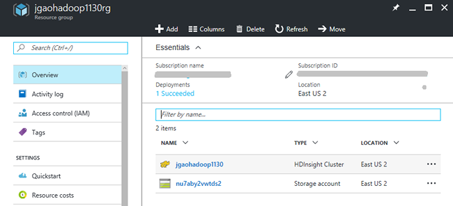
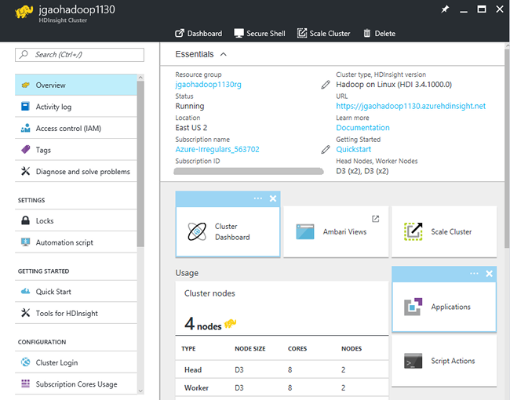
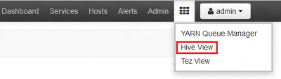
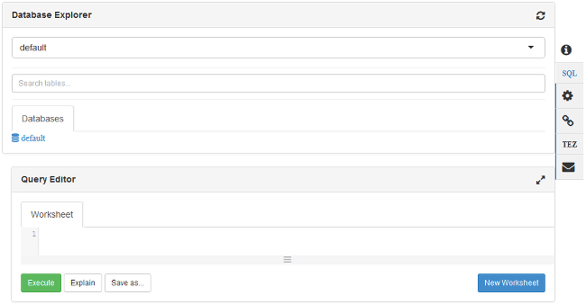

# Hadoop tutorial: Get started using Hadoop in HDInsight

Learn how to create [Hadoop](http://hadoop.apache.org/) clusters in HDInsight, and how to run Hive jobs in HDInsight. [Apache Hive](https://hive.apache.org/) is the most popular component in the Hadoop ecosystem. Currently HDInsight comes with six different cluster types: [Hadoop](hdinsight-hadoop-introduction.md), [Spark](hdinsight-apache-spark-overview.md), [HBase](hdinsight-hbase-overview.md), [Storm](hdinsight-storm-overview.md), [Interactive Hive (Preview)](hdinsight-hadoop-use-interactive-hive.md) and [R server](hdinsight-hadoop-r-server-overview.md).  Each cluster type supports a different set of components. All six cluster types support Hive. For a list of supported components in HDInsight, see [What's new in the Hadoop cluster versions provided by HDInsight?](hdinsight-component-versioning.md)  

[!INCLUDE [delete-cluster-warning](../../includes/hdinsight-delete-cluster-warning.md)]

## Prerequisites
Before you begin this tutorial, you must have:

* **Azure subscription**: To create a free one-month trial account, browse to [azure.microsoft.com/free](https://azure.microsoft.com/free).

## Create cluster

Most of Hadoop jobs are batch jobs. You create a cluster, run some jobs, and then delete the cluster. In this section, you create a Hadoop cluster in HDInsight using an [Azure Resource Manager template](../azure-resource-manager/resource-group-template-deploy.md). Resource Manager template is fully customizable; it makes easy to create Azure resources like HDInsight. Resource Manager template experience is not required for following this tutorial. For other cluster creation methods and understanding the properties used in this tutorial, see [Create HDInsight clusters](hdinsight-hadoop-provision-linux-clusters.md). Use the selector on the top of the page to choose your cluster creation options.

The Resource Manager template used in this tutorial is located in [GitHub](https://azure.microsoft.com/resources/templates/101-hdinsight-linux-ssh-password/). 

1. Click the following image to sign in to Azure and open the Resource Manager template in the Azure portal. 
   
    
2. Enter or select the following values:
   
    .
   
    * **Subscription**: Select your Azure subscription.
    * **Resource group**: Create a new resource group or select an existing resource group.  A resource group is a container of Azure components.  In this case, the resource group contains the HDInsight cluster and the dependent Azure Storage account. 
    * **Location**: Select an Azure location where you want to create your cluster.  Choose a location closer to you for better performance. 
    * **Cluster Type**: Select **hadoop** for this tutorial.
    * **Cluster Name**: Enter a name for the Hadoop cluster.
    * **Cluster login name and password**: The default login name is **admin**.
    * **SSH username and password**: The default username is **sshuser**.  You can rename it. 
     
    Some properties have been hardcoded in the template.  You can configure these values from the template.

    * **Location**: Both the location of the cluster and the dependent storage account use the same location as the resource group.
    * **Cluster version**: 3.5
    * **OS Type**: Linux
    * **Number of worker nodes**: 2

     Each cluster has an Azure Storage account dependency. It is usually referred as the default storage account. HDInsight cluster and its default storage account must be co-located in the same Azure region. Deleting clusters does not delete the storage account. 
     
     For more explanation of these properties, see [Create Hadoop clusters in HDInsight](hdinsight-hadoop-provision-linux-clusters.md).

3. Select **I agree to the terms and conditions stated above** and **Pin to dashboard**, and then click **Purchase**. You shall see a new tile titled **Deploying Template deployment** on the portal dashboard. It takes about around 20 minutes to create a cluster. Once the cluster is created, the caption of the tile is changed to the resource group name you specified. And the portal automatically opens the resource group in a new blade. You can see both the cluster and the default storage listed.
   
    .

4. Click the cluster name to open the cluster in a new blade.

   

## Run Hive queries
[Apache Hive](hdinsight-use-hive.md) is the most popular component used in HDInsight. There are many ways to run Hive jobs in HDInsight. In this tutorial, you use the Ambari Hive view from the portal to run some Hive jobs. For other methods for submitting Hive jobs, see [Use Hive in HDInsight](hdinsight-use-hive.md).

1. From the previous screenshot, click **Cluster Dashboard**, and then click **HDInsight Cluster Dashboard**.  You can also browse to  **https://&lt;ClusterName>.azurehdinsight.net**, where &lt;ClusterName> is the cluster you created in the previous section to open Ambari.
2. Enter the Hadoop username and password that you specified in the previous section. The default username is **admin**.
3. Open **Hive View** as shown in the following screenshot:
   
    .
4. In the **Query Editor** section of the page, paste the following HiveQL statements into the worksheet:
   
        SHOW TABLES;
   
   > [!NOTE]
   > Semi-colon is required by Hive.       
   > 
   > 
5. Click **Execute**. A **Query Process Results** section should appear beneath the Query Editor and display information about the job. 
   
    Once the query has finished, The **Query Process Results** section displays the results of the operation. You shall see one table called **hivesampletable**. This sample Hive table comes with all the HDInsight clusters.
   
    .
6. Repeat step 4 and step 5 to run the following query:
   
        SELECT * FROM hivesampletable;
   
   > [!TIP]
   > Note the **Save results** dropdown in the upper left of the **Query Process Results** section; you can use this to either download the results, or save them to HDInsight storage as a CSV file.
   > 
   > 
7. Click **History** to get a list of the jobs.

After you have completed a Hive job, you can [export the results to Azure SQL database or SQL Server database](hdinsight-use-sqoop-mac-linux.md), you can also [visualize the results using Excel](hdinsight-connect-excel-power-query.md). For more information about using Hive in HDInsight, see [Use Hive and HiveQL with Hadoop in HDInsight to analyze a sample Apache log4j file](hdinsight-use-hive.md).

## Clean up the tutorial
After you complete the tutorial, you may want to delete the cluster. With HDInsight, your data is stored in Azure Storage, so you can safely delete a cluster when it is not in use. You are also charged for an HDInsight cluster, even when it is not in use. Since the charges for the cluster are many times more than the charges for storage, it makes economic sense to delete clusters when they are not in use. 

> [!NOTE]
> Using [Azure Data Factory](hdinsight-hadoop-create-linux-clusters-adf.md), you can create HDInsight clusters on demand, and configure a TimeToLive setting to  delete the clusters automatically. 
> 
> 

**To delete the cluster and/or the default storage account**

1. Sign in to the [Azure portal](https://portal.azure.com).
2. From the portal dashboard, click the tile with the resource group name you used when you created the cluster.
3. Click **Delete** on the resource blade to delete the resource group which contains the cluster and the default storage account; or click the cluster name on the **Resources** tile and then click **Delete** on the cluster blade. Please note, deleting the resource group deletes the storage account. If you want to keep the storage account, choose to delete the cluster only.

## Troubleshoot

If you run into issues with creating HDInsight clusters, see [access control requirements](hdinsight-administer-use-portal-linux.md#create-clusters).

## Next steps
In this tutorial, you have learned how to create a Linux-based HDInsight cluster using a Resource Manager template, and how to perform basic Hive queries.

To learn more about analyzing data with HDInsight, see the following:

* To learn more about using Hive with HDInsight, including how to perform Hive queries from Visual Studio, see [Use Hive with HDInsight][hdinsight-use-hive].
* To learn about Pig, a language used to transform data, see [Use Pig with HDInsight][hdinsight-use-pig].
* To learn about MapReduce, a way to write programs that process data on Hadoop, see [Use MapReduce with HDInsight][hdinsight-use-mapreduce].
* To learn about using the HDInsight Tools for Visual Studio to analyze data on HDInsight, see [Get started using Visual Studio Hadoop tools for HDInsight](hdinsight-hadoop-visual-studio-tools-get-started.md).

If you're ready to start working with your own data and need to know more about how HDInsight stores data or how to get data into HDInsight, see the following:

* For information on how HDInsight uses Azure Storage, see [Use Azure Storage with HDInsight](hdinsight-hadoop-use-blob-storage.md).
* For information on how to upload data to HDInsight, see [Upload data to HDInsight][hdinsight-upload-data].

If you'd like to learn more about creating or managing an HDInsight cluster, see the following:

* To learn about managing your Linux-based HDInsight cluster, see [Manage HDInsight clusters using Ambari](hdinsight-hadoop-manage-ambari.md).
* To learn more about the options you can select when creating an HDInsight cluster, see [Creating HDInsight on Linux using custom options](hdinsight-hadoop-provision-linux-clusters.md).
* If you are familiar with Linux, and Hadoop, but want to know specifics about Hadoop on the HDInsight, see [Working with HDInsight on Linux](hdinsight-hadoop-linux-information.md). This provides information such as:
  
  * URLs for services hosted on the cluster, such as Ambari and WebHCat
  * The location of Hadoop files and examples on the local file system
  * The use of Azure Storage (WASB) instead of HDFS as the default data store

[1]: ../HDInsight/hdinsight-hadoop-visual-studio-tools-get-started.md

[hdinsight-provision]: hdinsight-provision-linux-clusters.md
[hdinsight-upload-data]: hdinsight-upload-data.md
[hdinsight-use-mapreduce]: hdinsight-use-mapreduce.md
[hdinsight-use-hive]: hdinsight-use-hive.md
[hdinsight-use-pig]: hdinsight-use-pig.md

