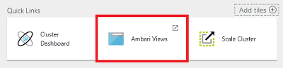
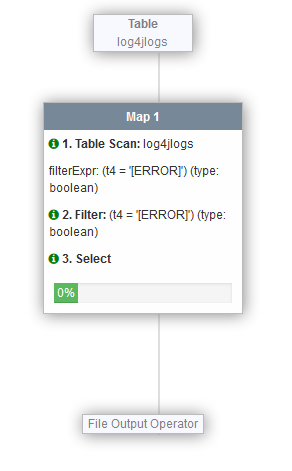

<properties
   	pageTitle="Linux tutorial: Get started with Hadoop and Hive | Microsoft Azure"
   	description="Follow this Linux tutorial to get started using Hadoop in HDInsight. Learn how to provision Linux clusters, and query data with Hive."
   	services="hdinsight"
   	documentationCenter=""
   	authors="nitinme"
   	manager="paulettm"
   	editor="cgronlun"
	tags="azure-portal"/>

<tags
   	ms.service="hdinsight"
   	ms.devlang="na"
   	ms.topic="hero-article"
   	ms.tgt_pltfrm="na"
   	ms.workload="big-data"
   	ms.date="01/13/2016"
   	ms.author="nitinme"/>

# Hadoop tutorial: Get started using Hadoop with Hive in HDInsight on Linux

> [AZURE.SELECTOR]
- [Windows](hdinsight-hadoop-tutorial-get-started-windows.md)
- [Linux](hdinsight-hadoop-linux-tutorial-get-started.md)

This document gets you started quickly with Azure HDInsight on Linux by showing you how to create a Linux-based Hadoop cluster, open the Ambari Web UI, and then run a Hive query using Ambari Hive View.

> [AZURE.NOTE] If you are new to Hadoop and big data, you can read more about the terms [Apache Hadoop](http://go.microsoft.com/fwlink/?LinkId=510084), [MapReduce](http://go.microsoft.com/fwlink/?LinkId=510086), [Hadoop Distributed File System (HDFS)](http://go.microsoft.com/fwlink/?LinkId=510087), and [Hive](http://go.microsoft.com/fwlink/?LinkId=510085). To understand how HDInsight enables Hadoop in Azure, see [Introduction to Hadoop in HDInsight](hdinsight-hadoop-introduction.md).

## Prerequisites

Before you begin this Linux tutorial for Hadoop, you must have the following:

- **An Azure subscription**: See [Get Azure free trial](http://azure.microsoft.com/documentation/videos/get-azure-free-trial-for-testing-hadoop-in-hdinsight/).

## Provision an HDInsight cluster on Linux

When you provision a cluster, you create the Azure compute resources that contain Hadoop services and resources. In this section, you provision an HDInsight version 3.2 cluster, which contains Hadoop version 2.2. For information about HDInsight versions and their SLAs, see [HDInsight component versioning](hdinsight-component-versioning.md). For more detailed information on creating an HDInsight cluster, see [Provision HDInsight clusters using custom options][hdinsight-provision].

>[AZURE.NOTE]  You can also create Hadoop clusters running the Windows Server operating system. For instructions, see [Get Started with HDInsight on Windows](hdinsight-hadoop-tutorial-get-started-windows.md).

Use the following steps to create a new cluster:

1. Sign in to the [Azure Portal](https://ms.portal.azure.com/).
2. Click **NEW**, Click **Data Analytics**, and then click **HDInsight**.

    

3. Enter a **Cluster Name**, select **Hadoop** for the **Cluster Type**, and from the **Cluster Operating System** drop-down, select **Ubuntu**. A green check will appear beside the cluster name if it is available.

	

4. If you have more than one subscription, click the **Subscription** entry to select the Azure subscription that will be used for the cluster.

5. Click **Resource Group** to see a list of existing resource groups and then select the one to create the cluster in. Or, you can click **Create New** and then enter the name of the new resource group. A green check will appear to indicate if the new group name is available.

	> [AZURE.NOTE] This entry will default to one of your existing resource groups, if any are available.

6. Click **Credentials** and then enter a password for the admin user. You must also enter an **SSH Username**. For **SSH Authentication Type**, click **PASSWORD** and specify a password for the SSH user. Click **Select** at the bottom to save the credentials configuration.

	

    > [AZURE.NOTE] SSH is used to remotely access the HDInsight cluster using a command-line. The user name and password you use here is used when connecting to the cluster through SSH.

	For more information on using SSH with HDInsight, see one of the following documents:

	* [Use SSH with Linux-based Hadoop on HDInsight from Linux, Unix, or OS X](hdinsight-hadoop-linux-use-ssh-unix.md)
	* [Use SSH with Linux-based Hadoop on HDInsight from Windows](hdinsight-hadoop-linux-use-ssh-windows.md)

7. Click **Data Source** to choose an existing data source for the cluster, or create a new one. When you provision a Hadoop cluster in HDInsight, you specify an Azure Storage account. A specific Blob storage container from that account is designated as the default file system, like in the Hadoop distributed file system (HDFS). By default, the HDInsight cluster is provisioned in the same data center as the storage account you specify. For more information, see [Use Azure Blob storage with HDInsight](hdinsight-use-blob-storage.md)

	

	Currently you can select an Azure Storage Account as the data source for an HDInsight cluster. Use the following to understand the entries on the **Data Source** blade.

	- **Selection Method**: Set this to **From all subscriptions** to enable browsing of storage accounts from all your subscriptions. Set this to **Access Key** if you want to enter the **Storage Name** and **Access Key** of an existing storage account.

	- **Select storage account / Create New**: Click **Select storage account** to browse and select an existing storage account you want to associate with the cluster. Or, click **Create New** to create a new storage account. Use the field that appears to enter the name of the storage account. A green check will appear if the name is available.

	- **Choose Default Container**: Use this to enter the name of the default container to use for the cluster. While you can enter any name here, we recommend using the same name as the cluster so that you can easily recognize that the container is used for this specific cluster.

	- **Location**: The geographic region that the storage account is in, or will be created in.

		> [AZURE.IMPORTANT] Selecting the location for the default data source will also set the location of the HDInsight cluster. The cluster and default data source must be located in the same region.

	Click **Select** to save the data source configuration.

8. Click **Node Pricing Tiers** to display information about the nodes that will be created for this cluster. Set the number of worker nodes that you need for the cluster. The estimated cost of the cluster will be shown within the blade.

	
    
    > [AZURE.IMPORTANT] If you plan on more than 32 worker nodes, either at cluster creation or by scaling the cluster after creation, then you must select a head node size with at least 8 cores and 14GB ram.
    >
    > For more information on node sizes and associated costs, see [HDInsight pricing](https://azure.microsoft.com/pricing/details/hdinsight/).

	Click **Select** to save the node pricing configuration.

9. On the **New HDInsight Cluster** blade, ensure that **Pin to Startboard** is selected, and then click **Create**. This will create the cluster and add a tile for it to the Startboard of your Azure Portal. The icon will indicate that the cluster is provisioning, and will change to display the HDInsight icon once provisioning has completed.

While provisioning|Provisioning complete
------------------|---------------------
	|

> [AZURE.NOTE] It will take some time for the cluster to be created, usually around 15 minutes. Use the tile on the Startboard, or the **Notifications** entry on the left of the page to check on the provisioning process.

Once the provisioning is completed, click the tile for the cluster from the Startboard to launch the cluster blade.

##Connect to the Hive View

Ambari Views provide several utilities through a web page. In the following sections, you'll use the Hive view to run Hive queries on your HDInsight cluster.

> [AZURE.NOTE] Ambari is a management and monitoring utility provided with Linux-based HDInsight clusters. Ambari has a lot of capabilities that won't be discussed in this document. For more information, see [Manage HDInsight clusters by using the Ambari Web UI](hdinsight-hadoop-manage-ambari.md).

To display Ambari Views from the Azure Portal, select your HDInsight cluster and then select __Ambari Views__ from the __Quick Links__ section

You can also navigate directly to Ambari by going to https://CLUSTERNAME.azurehdinsight.net in a web browser (where __CLUSTERNAME__ is the name of your HDInsight cluster,) and then select the set of squares from the page menu (next to the __Admin__ link and button on the left of the page,) to list available views. Select the __Hive view__.

.

> [AZURE.NOTE] When accessing Ambari, you will be prompted to authenticate to the site. Enter the admin (default `admin`,) account name and password you used when creating the cluster.

You should see a page similar to the following:

##Run a Hive query

Use the following steps from the Hive view to run a Hive query against data included with the cluster.

1. In the __Query Editor__ section of the page, paste the following HiveQL statements into the worksheet:

		DROP TABLE log4jLogs;
		CREATE EXTERNAL TABLE log4jLogs(t1 string, t2 string, t3 string, t4 string, t5 string, t6 string, t7 string)
		ROW FORMAT DELIMITED FIELDS TERMINATED BY ' '
		STORED AS TEXTFILE LOCATION 'wasb:///example/data/';
		SELECT t4 AS sev, COUNT(*) AS cnt FROM log4jLogs WHERE t4 = '[ERROR]' GROUP BY t4;

	These statements perform the following actions:

	- **DROP TABLE** - Deletes the table and the data file, in case the table already exists.
	- **CREATE EXTERNAL TABLE** - Creates a new "external" table in Hive. External tables store only the table definition in Hive; the data is left in the original location.
	- **ROW FORMAT** - Tells Hive how the data is formatted. In this case, the fields in each log are separated by a space.
	- **STORED AS TEXTFILE LOCATION** - Tells Hive where the data is stored (the example/data directory), and that it is stored as text.
	- **SELECT** - Selects a count of all rows where column t4 contains the value [ERROR].

	>[AZURE.NOTE] External tables should be used when you expect the underlying data to be updated by an external source, such as an automated data upload process, or by another MapReduce operation, but you always want Hive queries to use the latest data. Dropping an external table does *not* delete the data, only the table definition.

2. Use the __Execute__ button at the bottom of the Query Editor to start the query. It should turn orange and the text will change to __Stop execution__. A __Query Process Results__ section should appear beneath the Query Editor and display information about the job.

    > [AZURE.IMPORTANT] Some browsers may not correctly refresh the log or results information. If you run a job and it appears to run forever without updating the log or returning results, try using Mozilla FireFox or Google Chrome instead.
    
3. Once the query has finished, The __Query Process Results__ section will display the results of the operation. The __Stop execution__ button will also change back to a green __Execute__ button. The __Results__ tab should contain the following information:

        sev       cnt
        [ERROR]   3

    The __Logs__ tab can be used to view the logging information created by the job. You can use this for troubleshooting if there are problems with a query.
    
    > [AZURE.TIP] Note the __Save results__ dropdown in the upper left of the __Query Process Results__ section; you can use this to either download the results, or save them to HDInsight storage as a CSV file.

3. Select the first four lines of this query, then select __Execute__. Notice that there are no results when the job completes. This is because using the __Execute__ button when part of the query is selected will only run the selected statements. In this case, the selection didn't include the final statement that retrieves rows from the table. If you select just that line and use __Execute__, you should see the expected results.

3. Use the __New Worksheet__ button at the bottom of the __Query Editor__ to create a new worksheet. In the new worksheet, enter the following HiveQL statements:

		CREATE TABLE IF NOT EXISTS errorLogs (t1 string, t2 string, t3 string, t4 string, t5 string, t6 string, t7 string) STORED AS ORC;
		INSERT OVERWRITE TABLE errorLogs SELECT t1, t2, t3, t4, t5, t6, t7 FROM log4jLogs WHERE t4 = '[ERROR]';

	These statements perform the following actions:

	- **CREATE TABLE IF NOT EXISTS** - Creates a table, if it does not already exist. Since the **EXTERNAL** keyword is not used, this is an internal table, which is stored in the Hive data warehouse and is managed completely by Hive. Unlike external tables, dropping an internal table will delete the underlying data as well.
	- **STORED AS ORC** - Stores the data in Optimized Row Columnar (ORC) format. This is a highly optimized and efficient format for storing Hive data.
	- **INSERT OVERWRITE ... SELECT** - Selects rows from the **log4jLogs** table that contain [ERROR], and then inserts the data into the **errorLogs** table.
    
    Use the __Execute__ button to run this query. The __Results__ tab will not contain any information as no rows are returned by this query, but the status should show as __SUCCEEDED__.
    
4. To the right of the Query Editor is a row of icons. Select the one that looks like a chain.

    
    
    This is the __Visual Explain__ view of the query, which can be helpful in understanding the flow of complex queries. You can view a textual equivalent of this view by using the __Explain__ button in the Query Editor.
    
    
    
    The other icons are as follows:
    
        * Settings: The gear icon allows you to change Hive settings, such as setting `hive.execution.engine` or Tez parameters.
        * Tez: Displays the Directed Acyclic Graph (DAG) that Tez used to perform the query. If you want to view the DAG for queries you've ran in the past, use the __Tez View__ instead.
        * Notifications: Displays notifications, such as "Query has been submitted" or if an error occurs when running a query.

5. Select the __SQL__ icon to switch back to the Query Editor, then create a new worksheet and enter the following query:

        SELECT * from errorLogs;
    
    Use the __Save as__ button at the bottom of the editor. Name this query __Errorlogs__ and select __OK__. Note that the name of the worksheet changes to __Errorlogs__.
    
    Saved queries also appear in the __Saved Queries__ tab at the top of the page. Select this and you should see __Errorlogs__ listed. Selecting the name will open the query in the Query Editor.

4. Execute the __Errorlogs__ query. The results will be as follows:

        errorlogs.t1 	errorlogs.t2 	errorlogs.t3 	errorlogs.t4 	errorlogs.t5 	errorlogs.t6 	errorlogs.t7
        2012-02-03 	18:35:34 	SampleClass0 	[ERROR] 	incorrect 	id 	
        2012-02-03 	18:55:54 	SampleClass1 	[ERROR] 	incorrect 	id 	
        2012-02-03 	19:25:27 	SampleClass4 	[ERROR] 	incorrect 	id

## Next steps

In this document, you have learned how to create a Linux-based HDInsight cluster using the Azure Portal, connect to the cluster using SSH, and how to perform basic Hive queries.

To learn more about analyzing data with HDinsight, see the following:

- To learn more about using Hive with HDInsight, including how to perform Hive queries from Visual Studio, see [Use Hive with HDInsight][hdinsight-use-hive].

- To learn about Pig, a language used to transform data, see [Use Pig with HDInsight][hdinsight-use-pig].

- To learn about MapReduce, a way to write programs that process data on Hadoop, see [Use MapReduce with HDInsight][hdinsight-use-mapreduce].

- To learn about using the HDInsight Tools for Visual Studio to analyze data on HDInsight, see [Get started using Visual Studio Hadoop tools for HDInsight](hdinsight-hadoop-visual-studio-tools-get-started.md).

If you're ready to start working with your own data and need to know more about how HDInsight stores data or how to get data into HDInsight, see the following:

- For information on how HDInsight uses Azure blob storage, see [Use Azure Blob storage with HDInsight](hdinsight-use-blob-storage.md).

- For information on how to upload data to HDInsight, see [Upload data to HDInsight][hdinsight-upload-data].

If you'd like to learn more about creating or managing an HDInsight cluster, see the following:

- To learn about managing your Linux-based HDInsight cluster, see [Manage HDInsight clusters using Ambari](hdinsight-hadoop-manage-ambari.md).

- To learn more about the options you can select when creating an HDInsight cluster, see [Provision HDInsight on Linux using custom options](hdinsight-hadoop-provision-linux-clusters.md).

- If you are familiar with Linux, and Hadoop, but want to know specifics about Hadoop on the HDInsight, see [Working with HDInsight on Linux](hdinsight-hadoop-linux-information.md). This provides information such as:

	* URLs for services hosted on the cluster, such as Ambari and WebHCat
	* The location of Hadoop files and examples on the local file system
	* The use of Azure Storage (WASB) instead of HDFS as the default data store

[1]: ../HDInsight/hdinsight-hadoop-visual-studio-tools-get-started.md

[hdinsight-provision]: hdinsight-provision-clusters.md
[hdinsight-admin-powershell]: hdinsight-administer-use-powershell.md
[hdinsight-upload-data]: hdinsight-upload-data.md
[hdinsight-use-mapreduce]: hdinsight-use-mapreduce.md
[hdinsight-use-hive]: hdinsight-use-hive.md
[hdinsight-use-pig]: hdinsight-use-pig.md

[powershell-download]: http://go.microsoft.com/fwlink/p/?linkid=320376&clcid=0x409
[powershell-install-configure]: ../install-configure-powershell.md
[powershell-open]: ../install-configure-powershell.md#Install

[img-hdi-dashboard]: ./media/hdinsight-hadoop-tutorial-get-started-windows/HDI.dashboard.png
[img-hdi-dashboard-query-select]: ./media/hdinsight-hadoop-tutorial-get-started-windows/HDI.dashboard.query.select.png
[img-hdi-dashboard-query-select-result]: ./media/hdinsight-hadoop-tutorial-get-started-windows/HDI.dashboard.query.select.result.png
[img-hdi-dashboard-query-select-result-output]: ./media/hdinsight-hadoop-tutorial-get-started-windows/HDI.dashboard.query.select.result.output.png
[img-hdi-dashboard-query-browse-output]: ./media/hdinsight-hadoop-tutorial-get-started-windows/HDI.dashboard.query.browse.output.png
[image-hdi-clusterstatus]: ./media/hdinsight-hadoop-tutorial-get-started-windows/HDI.ClusterStatus.png
[image-hdi-gettingstarted-powerquery-importdata]: ./media/hdinsight-hadoop-tutorial-get-started-windows/HDI.GettingStarted.PowerQuery.ImportData.png
[image-hdi-gettingstarted-powerquery-importdata2]: ./media/hdinsight-hadoop-tutorial-get-started-windows/HDI.GettingStarted.PowerQuery.ImportData2.png
