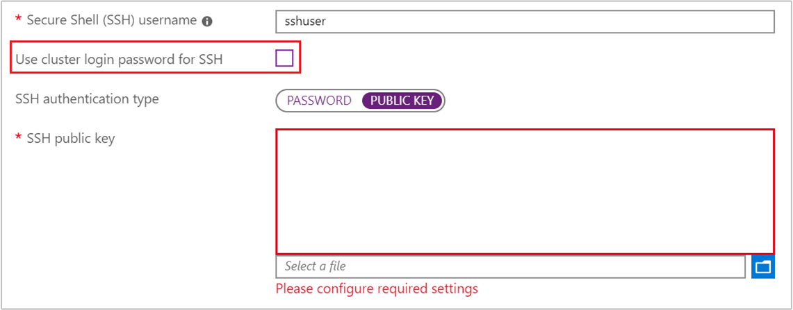
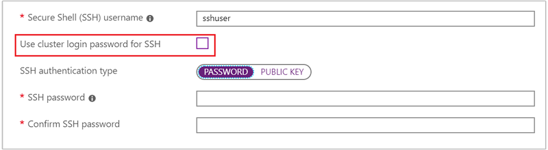

# Connect to HDInsight (Hadoop) using SSH

Learn how to use [Secure Shell (SSH)](https://en.wikipedia.org/wiki/Secure_Shell) to securely connect to HDInsight. HDInsight can use Linux (Ubuntu) as the operating system for nodes within the cluster. SSH can be used to connect to the head and edge nodes of a Linux-based cluster and run commands directly on those nodes.

The following table contains the address and port information needed when connecting to HDInsight using SSH:

| Address | Port | Connects to... |
| ----- | ----- | ----- |
| `<clustername>-ed-ssh.azurehdinsight.net` | 22 | Edge node (R Server on HDInsight) |
| `<edgenodename>.<clustername>-ssh.azurehdinsight.net` | 22 | Edge node (any other cluster type, if an edge node exists) |
| `<clustername>-ssh.azurehdinsight.net` | 22 | Primary headnode |
| `<clustername>-ssh.azurehdinsight.net` | 23 | Secondary headnode |

> [!NOTE]
> Replace `<edgenodename>` with the name of the edge node.
>
> Replace `<clustername>` with the name of your HDInsight cluster.
>
> We recommend __always connecting to the edge node__ if you have one. The head nodes host services that are critical to the health of the cluster. The edge node runs only what you put on it.
>
> For more information on using edge nodes, see [Use edge nodes in HDInsight](hdinsight-apps-use-edge-node.md#access-an-edge-node).

## SSH clients

Most operating systems provide the `ssh` client. Microsoft Windows does not provide an SSH client by default. An SSH client for Windows is available in each of the following packages:

* [Bash on Ubuntu on Windows 10](https://msdn.microsoft.com/commandline/wsl/about): The `ssh` command is provided through the Bash on Windows command line.

* [Git (https://git-scm.com/)](https://git-scm.com/): The `ssh` command is provided through the GitBash command line.

* [GitHub Desktop (https://desktop.github.com/)](https://desktop.github.com/) The `ssh` command is provided through the Git Shell command line. GitHub Desktop can be configured to use Bash, the Windows Command Prompt, or PowerShell as the command line for the Git Shell.

* [OpenSSH (https://github.com/PowerShell/Win32-OpenSSH/wiki/Install-Win32-OpenSSH)](https://github.com/PowerShell/Win32-OpenSSH/wiki/Install-Win32-OpenSSH): The PowerShell team is porting OpenSSH to Windows, and provides test releases.

    > [!WARNING]
    > The OpenSSH package includes the SSH server component, `sshd`. This component starts an SSH server on your system, allowing others to connect to it. Do not configure this component or open port 22 unless you want to host an SSH server on your system. It is not required to communicate with HDInsight.

There are also several graphical SSH clients, such as [PuTTY (http://www.chiark.greenend.org.uk/~sgtatham/putty/)](http://www.chiark.greenend.org.uk/~sgtatham/putty/) and [MobaXterm (http://mobaxterm.mobatek.net/)](http://mobaxterm.mobatek.net/). While these clients can be used to connect to HDInsight, the process of connecting to a server is different than using the `ssh` utility. For more information, see the documentation of the graphical client you are using.

## Authentication: SSH Keys

SSH keys use [Public-key cryptography](https://en.wikipedia.org/wiki/Public-key_cryptography) to secure the cluster. SSH keys are more secure than passwords, and provide an easy way to secure your HDInsight cluster.

If your SSH account is secured using a key, the client must provide the matching private key when you connect:

* Most clients can be configured to use a __default key__. For example, the `ssh` client looks for a private key at `~/.ssh/id_rsa` on Linux and Unix environments.

* You can specify the __path to a private key__. With the `ssh` client, the `-i` parameter is used to specify the path to private key. For example, `ssh -i ~/.ssh/hdinsight sshuser@myedge.mycluster-ssh.azurehdinsight.net`.

* If you have __multiple private keys__ for use with different servers, utilities such as [ssh-agent (https://en.wikipedia.org/wiki/Ssh-agent)](https://en.wikipedia.org/wiki/Ssh-agent) can be used to automatically select the key to use.

> [!IMPORTANT]
>
> If you secure your private key with a passphrase, you must enter the passphrase when using the key. Utilities such as `ssh-agent` can cache the password for your convenience.

### Create an SSH key pair

Use the `ssh-keygen` command to create public and private key files. The following command generates a 2048-bit RSA key pair that can be used with HDInsight:

    ssh-keygen -t rsa -b 2048

You are prompted for information during the key creation process. For example, where the keys are stored or whether to use a passphrase. After the process completes, two files are created; a public key and a private key.

* The __public key__ is used to create an HDInsight cluster. The public key has an extension of `.pub`.

* The __private key__ is used to authenticate your client to the HDInsight cluster.

> [!IMPORTANT]
> You can secure your keys using a passphrase. This is effectively a password on your private key. Even if someone obtains your private key, they must have the passphrase to use the key.

### Create HDInsight using the public key

| Creation method | How to use the public key |
| ------- | ------- |
| **Azure portal** | Uncheck __Use same password as cluster login__, and then select __Public Key__ as the SSH authentication type. Finally, select the public key file or paste the text contents of the file in the __SSH public key__ field.  |
| **Azure PowerShell** | Use the `-SshPublicKey` parameter of the `New-AzureRmHdinsightCluster` cmdlet and pass the contents of the public key as a string.|
| **Azure CLI 1.0** | Use the `--sshPublicKey` parameter of the `azure hdinsight cluster create` command and pass the contents of the public key as a string. |
| **Resource Manager Template** | For an example of using SSH keys with a template, see [Deploy HDInsight on Linux with SSH key](https://azure.microsoft.com/resources/templates/101-hdinsight-linux-ssh-publickey/). The `publicKeys` element in the [azuredeploy.json](https://github.com/Azure/azure-quickstart-templates/blob/master/101-hdinsight-linux-ssh-publickey/azuredeploy.json) file is used to pass the keys to Azure when creating the cluster. |

## Authentication: Password

SSH accounts can be secured using a password. When you connect to HDInsight using SSH, you are prompted to enter the password.

> [!WARNING]
> We do not recommend using password authentication for SSH. Passwords can be guessed and are vulnerable to brute force attacks. Instead, we recommend that you use [SSH keys for authentication](#sshkey).

### Create HDInsight using a password

| Creation method | How to specify the password |
| --------------- | ---------------- |
| **Azure portal** | By default, the SSH user account has the same password as the cluster login account. To use a different password, uncheck __Use same password as cluster login__, and then enter the password in the __SSH password__ field. |
| **Azure PowerShell** | Use the `--SshCredential` parameter of the `New-AzureRmHdinsightCluster` cmdlet and pass a `PSCredential` object that contains the SSH user account name and password. |
| **Azure CLI 1.0** | Use the `--sshPassword` parameter of the `azure hdinsight cluster create` command and provide the password value. |
| **Resource Manager Template** | For an example of using a password with a template, see [Deploy HDInsight on Linux with SSH password](https://azure.microsoft.com/resources/templates/101-hdinsight-linux-ssh-password/). The `linuxOperatingSystemProfile` element in the [azuredeploy.json](https://github.com/Azure/azure-quickstart-templates/blob/master/101-hdinsight-linux-ssh-password/azuredeploy.json) file is used to pass the SSH account name and password to Azure when creating the cluster.|

### Change the SSH password

For information on changing the SSH user account password, see the __Change passwords__ section of the [Manage HDInsight](hdinsight-administer-use-portal-linux.md#change-passwords) document.

## Authentication: Domain-joined HDInsight

If you are using a __domain-joined HDInsight cluster__, you must use the `kinit` command after connecting with SSH. This command prompts you for a domain user and password, and authenticates your session with the Azure Active Directory domain associated with the cluster.

For more information, see [Configure domain-joined HDInsight](hdinsight-domain-joined-configure.md).

## Connect to worker and Zookeeper nodes

The worker nodes and Zookeeper nodes are not directly accessible from the internet, but they can be accessed from the cluster head nodes or edge nodes. The following are the general steps to connect to other nodes:

1. Use SSH to connect to a head or edge node:

        ssh sshuser@myedge.mycluster-ssh.azurehdinsight.net

2. From the SSH connection to the head or edge node, use the `ssh` command to connect to a worker node in the cluster:

        ssh sshuser@wn0-myhdi

    To retrieve a list of the domain names of the nodes in the cluster, see the examples in the [Manage HDInsight by using the Ambari REST API](hdinsight-hadoop-manage-ambari-rest-api.md#example-get-the-fqdn-of-cluster-nodes) document.

If the SSH account is secured using a __password__, you are asked to enter the password and the connection is established.

If the SSH account is secured using __SSH keys__, you must make sure that your local environment is configured for SSH agent forwarding.

> [!NOTE]
> Another way to directly access all nodes in the cluster is to install HDInsight into an Azure Virtual Network. Then, you can join your remote machine to the same virtual network and directly access all nodes in the cluster.
>
> For more information, see [Use a virtual network with HDInsight](hdinsight-extend-hadoop-virtual-network.md).

### Configure SSH agent forwarding

> [!IMPORTANT]
> The following steps assume a Linux/UNIX based system, and work with Bash on Windows 10. If these steps do not work for your system, you may need to consult the documentation for your SSH client.

1. Using a text editor, open `~/.ssh/config`. If this file doesn't exist, you can create it by entering `touch ~/.ssh/config` at a command line.

2. Add the following text to the `config` file.

        Host <edgenodename>.<clustername>-ssh.azurehdinsight.net
          ForwardAgent yes

    Replace the __Host__ information with the address of the node you connect to using SSH. The previous example uses the edge node. This entry configures SSH agent forwarding for the specified node.

3. Test SSH agent forwarding by using the following command from the terminal:

        echo "$SSH_AUTH_SOCK"

    This command returns information similar to the following text:

        /tmp/ssh-rfSUL1ldCldQ/agent.1792

    If nothing is returned, then `ssh-agent` is not running. See the agent startup scripts information at [Using ssh-agent with ssh (http://mah.everybody.org/docs/ssh)](http://mah.everybody.org/docs/ssh) or consult your SSH client documentation for specific steps on installing and configuring `ssh-agent`.

4. Once you have verified that **ssh-agent** is running, use the following to add your SSH private key to the agent:

        ssh-add ~/.ssh/id_rsa

    If your private key is stored in a different file, replace `~/.ssh/id_rsa` with the path to the file.

5. Connect to the cluster edge node or head nodes using SSH. Then use the SSH command to connect to a worker or zookeeper node. The connection is established using the forwarded key.

## Next steps

* [Use SSH tunneling with HDInsight](hdinsight-linux-ambari-ssh-tunnel.md)
* [Use a virtual network with HDInsight](hdinsight-extend-hadoop-virtual-network.md)
* [Use edge nodes in HDInsight](hdinsight-apps-use-edge-node.md#access-an-edge-node)