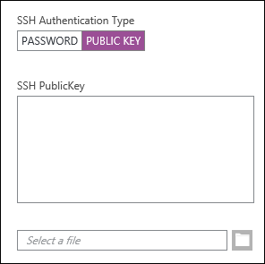
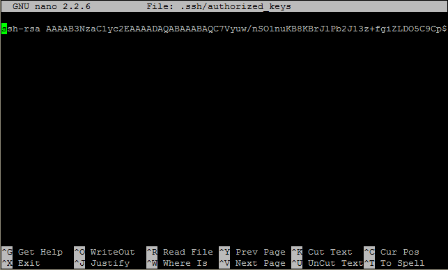

<properties
   pageTitle="Use SSH keys with  Linux-based Hadoop from Linux, Unix, or OS X | Microsoft Azure"
   description=" You can access Linux-based HDInsight using Secure Shell (SSH). This document provides information on using SSH with HDInsight from Linux, Unix, or OS X clients."
   services="hdinsight"
   documentationCenter=""
   authors="Blackmist"
   manager="paulettm"
   editor="cgronlun"
	tags="azure-portal"/>

<tags
   ms.service="hdinsight"
   ms.devlang="na"
   ms.topic="get-started-article"
   ms.tgt_pltfrm="na"
   ms.workload="big-data"
   ms.date="06/14/2016"
   ms.author="larryfr"/>

#Use SSH with Linux-based Hadoop on HDInsight from Linux, Unix, or OS X

> [AZURE.SELECTOR]
- [Windows](hdinsight-hadoop-linux-use-ssh-windows.md)
- [Linux, Unix, OS X](hdinsight-hadoop-linux-use-ssh-unix.md)

[Secure Shell (SSH)](https://en.wikipedia.org/wiki/Secure_Shell) allows you to remotely perform operations on your Linux-based HDInsight clusters using a command-line interface. This document provides information on using SSH with HDInsight from Linux, Unix, or OS X clients.

> [AZURE.NOTE] The steps in this article assume you are using a Linux, Unix, or OS X client. While these steps may be performed on a Windows-based client if you have installed a package that provides `ssh` and `ssh-keygen` (such as Git for Windows,) we recommend that Windows-based clients follow the steps in [Use SSH with Linux-based HDInsight (Hadoop) from Windows](hdinsight-hadoop-linux-use-ssh-windows.md).

##Prerequisites

* **ssh-keygen** and **ssh** for Linux, Unix, and OS X clients. This utilities are usually provided with your operating system, or available through the package management system.

* A modern web browser that supports HTML5.

OR

* [Azure CLI](../xplat-cli-install.md).

    [AZURE.INCLUDE [use-latest-version](../../includes/hdinsight-use-latest-cli.md)] 

##What is SSH?

SSH is a utility for logging in to, and remotely executing, commands on a remote server. With Linux-based HDInsight, SSH establishes an encrypted connection to the cluster head node and provides a command line that you use to type in commands. Commands are then executed directly on the server.

###SSH user name

An SSH user name is the name you use to authenticate to the HDInsight cluster. When you specify an SSH user name during cluster creation, this user is created on all nodes in the cluster. Once the cluster is created, you can use this user name to connect to the HDInsight cluster head nodes. From the head nodes, you can then connect to the individual worker nodes.

###SSH password or Public key

An SSH user can use either a password or public key for authentication. A password is just a string of text you make up, while a public key is part of a cryptographic key pair generated to uniquely identify you.

A key is more secure than a password, however it requires additional steps to generate the key and you must maintain the files containing the key in a secure location. If anyone gains access to the key files, they gain access to your account. Or if you lose the key files, you will not be able to login to your account.

A key pair consists of a public key (which is sent to the HDInsight server,) and a private key (which is kept on your client machine.) When you connect to the HDInsight server using SSH, the SSH client will use the private key on your machine to authenticate with the server.

##Create an SSH key

Use the following information if you plan on using SSH keys with your cluster. If you plan on using a password, you can skip this section.

1. Open a terminal session and use the following command to see if you have any existing SSH keys:

		ls -al ~/.ssh

	Look for the following files in the directory listing. These are common names for public SSH keys.

	* id\_dsa.pub
	* id\_ecdsa.pub
	* id\_ed25519.pub
	* id\_rsa.pub

2. If you do not want to use an existing file, or you have no existing SSH keys, use the following to generate a new file:

		ssh-keygen -t rsa

	You will be prompted for the following information:

	* The file location - The location defaults to ~/.ssh/id\_rsa.
	* A passphrase - You will be prompted to re-enter this.

		> [AZURE.NOTE] We strongly recommend that you use a secure passphrase for the key. However, if you forget the passphrase, there is no way to recover it.

	After the command finishes, you will have two new files, the private key (for example, **id\_rsa**) and the public key (for example, **id\_rsa.pub**).

##Create a Linux-based HDInsight cluster

When creating a Linux-based HDInsight cluster, you must provide the public key created previously. From Linux, Unix, or OS X clients, there are two ways to create an HDInsight cluster:

* **Azure Portal** - Uses a web-based portal to create the cluster.

* **Azure CLI for Mac, Linux and Windows** - Uses command-line commands to create the cluster.

Each of these methods will require either a password or a public key. For complete information on creating a Linux-based HDInsight cluster, see [Provision Linux-based HDInsight clusters](hdinsight-hadoop-provision-linux-clusters.md).

###Azure Portal

When using the [Azure Portal][preview-portal] to create a Linux-based HDInsight cluster, you must enter an **SSH USER NAME**, and select to enter a **PASSWORD** or **SSH PUBLIC KEY**.

If you select **SSH PUBLIC KEY**, you can either paste the public key (contained in the file with the **.pub** extension) into the __SSH PublicKey__ field, or select __Select a file__ to browse and select the public key file.



> [AZURE.NOTE] The key file is simply a text file. The contents should appear similar to the following:
> ```
ssh-rsa AAAAB3NzaC1yc2EAAAADAQABAAABAQCelfkjrpYHYiks4TM+r1LVsTYQ4jAXXGeOAF9Vv/KGz90pgMk3VRJk4PEUSELfXKxP3NtsVwLVPN1l09utI/tKHQ6WL3qy89WVVVLiwzL7tfJ2B08Gmcw8mC/YoieT/YG+4I4oAgPEmim+6/F9S0lU2I2CuFBX9JzauX8n1Y9kWzTARST+ERx2hysyA5ObLv97Xe4C2CQvGE01LGAXkw2ffP9vI+emUM+VeYrf0q3w/b1o/COKbFVZ2IpEcJ8G2SLlNsHWXofWhOKQRi64TMxT7LLoohD61q2aWNKdaE4oQdiuo8TGnt4zWLEPjzjIYIEIZGk00HiQD+KCB5pxoVtp user@system
> ```

This creates a login for the specified user, by using the password or public key you provide.

###Azure Command-Line Interface for Mac, Linux and Windows

You can use the [Azure CLI for Mac, Linux and Windows](../xplat-cli-install.md) to create a new cluster by using the `azure hdinsight cluster create` command.

For more information on using this command, see [Provision Hadoop Linux clusters in HDInsight using custom options](hdinsight-hadoop-provision-linux-clusters.md).

##Connect to a Linux-based HDInsight cluster

From a terminal session, use the SSH command to connect to the cluster head node by providing the address and user name:

* **SSH address** - There are two addresses that may be used to connect to a cluster using SSH:

    * **Connect to the head node**: The cluster name, followed by **-ssh.azurehdinsight.net**. For example, **mycluster-ssh.azurehdinsight.net**.
    
    * **Connect to the edge node**: If your cluster is R Server on HDInsight, the cluster will also contain an edge node that can be accessed using **RServer.CLUSTERNAME.ssh.azurehdinsight.net**, where __CLUSTERNAME__ is the name of the cluster.

* **User name** - The SSH user name you provided when you created the cluster.

The following example will connect to head node 0 of **mycluster** as the user **me**:

	ssh me@mycluster-ssh.azurehdinsight.net

If you used a password for the user account, you will be prompted to enter the password.

If you used an SSH key that is secured with a passphrase, you will be prompted to enter the passphrase. Otherwise, SSH will attempt to automatically authenticate by using one of the local private keys on your client.

> [AZURE.NOTE] If SSH does not automatically authenticate with the correct private key, use the **-i** parameter and specify the path to the private key. The following example will load the private key from `~/.ssh/id_rsa`:
>
> `ssh -i ~/.ssh/id_rsa me@mycluster-ssh.azurehdinsight.net`

If you are connecting to using the address for the head node, and no port is specified, SSH will default to port 22, which will connect to head node 0 on the HDInsight cluster. If you use port 23, you will connect to head node 1. For more information on the head nodes, see [Availability and reliability of Hadoop clusters in HDInsight](hdinsight-high-availability-linux.md).

###Connect to worker nodes

The worker nodes are not directly accessible from outside the Azure datacenter, but they can be accessed from the cluster head node via SSH.

If you use an SSH key to authenticate your user account, you must complete the following steps on your client:

1. Using a text editor, open `~/.ssh/config`. If this file doesn't exist, you can create it by entering `touch ~/.ssh/config` in the terminal.

2. Add the following to the file. Replace *CLUSTERNAME* with the name of your HDInsight cluster.

        Host CLUSTERNAME-ssh.azurehdinsight.net
          ForwardAgent yes

    This configures SSH agent forwarding for your HDInsight cluster.

3. Test SSH agent forwarding by using the following command from the terminal:

        echo "$SSH_AUTH_SOCK"

    This should return information similar to the following:

        /tmp/ssh-rfSUL1ldCldQ/agent.1792

    If nothing is returned, this indicates that **ssh-agent** is not running. Consult your operating system documentation for specific steps on installing and configuring **ssh-agent**, or see [Using ssh-agent with ssh](http://mah.everybody.org/docs/ssh).

4. Once you have verified that **ssh-agent** is running, use the following to add your SSH private key to the agent:

        ssh-add ~/.ssh/id_rsa

    If your private key is stored in a different file, replace `~/.ssh/id_rsa` with the path to the file.

Use the following steps to connect to the worker nodes for your cluster.

> [AZURE.IMPORTANT] If you use an SSH key to authenticate your account, you must complete the previous steps to verify that agent forwarding is working.

1. Connect to the HDInsight cluster by using SSH as described previously.

2. Once you are connected, use the following to retrieve a list of the nodes in your cluster. Replace *ADMINPASSWORD* with the password for your cluster admin account. Replace *CLUSTERNAME* with the name of your cluster.

        curl --user admin:ADMINPASSWORD https://CLUSTERNAME.azurehdinsight.net/api/v1/hosts

    This will return information in JSON format for the nodes in the cluster, including `host_name`, which contains the fully qualified domain name (FQDN) for each node. The following is an example of a `host_name` entry returned by the **curl** command:

        "host_name" : "workernode0.workernode-0-e2f35e63355b4f15a31c460b6d4e1230.j1.internal.cloudapp.net"

3. Once you have a list of the worker nodes you want to connect to, use the following command from the SSH session to the server to open a connection to a worker node:

        ssh USERNAME@FQDN

    Replace *USERNAME* with your SSH user name and *FQDN* with the FQDN for the worker node. For example, `workernode0.workernode-0-e2f35e63355b4f15a31c460b6d4e1230.j1.internal.cloudapp.net`.

    > [AZURE.NOTE] If you use a password to authentication your SSH session, you will be prompted to enter the password again. If you use an SSH key, the connection should finish without any prompts.

4. Once the session has been established, the terminal prompt will change from `username@hn0-clustername` to `username@wk0-clustername` to indicate that you are connected to the worker node. Any commands you run at this point will run on the worker node.

4. Once you have finished performing actions on the worker node, use the `exit` command to close the session to the worker node. This will return you to the `username@hn0-clustername` prompt.

##Add more accounts

1. Generate a new public key and private key for the new user account, as described in the [Create an SSH key](#create-an-ssh-key-optional) section.

	> [AZURE.NOTE] The private key should either be generated on a client that the user will use to connect to the cluster, or securely transferred to such a client after creation.

1. From an SSH session to the cluster, add the new user with the following command:

		sudo adduser --disabled-password <username>

	This will create a new user account, but will disable password authentication.

2. Create the directory and files to hold the key by using the following commands:

		sudo mkdir -p /home/<username>/.ssh
		sudo touch /home/<username>/.ssh/authorized_keys
		sudo nano /home/<username>/.ssh/authorized_keys

3. When the nano editor opens, copy and paste in the contents of the public key for the new user account. Finally, use **Ctrl-X** to save the file and exit the editor.

	

4. Use the following command to change ownership of the .ssh folder and contents to the new user account:

		sudo chown -hR <username>:<username> /home/<username>/.ssh

5. You should now be able to authenticate to the server with the new user account and private key.

##<a id="tunnel"></a>SSH tunneling

SSH can be used to tunnel local requests, such as web requests, to the HDInsight cluster. The request will then be routed to the requested resource as if it had originated on the HDInsight cluster head node.

> [AZURE.IMPORTANT] An SSH tunnel is a requirement for accessing the web UI for some Hadoop services. For example, both the Job History UI or Resource Manager UI can only be accessed using an SSH tunnel.

For more information on creating and using an SSH tunnel, see [Use SSH Tunneling to access Ambari web UI, ResourceManager, JobHistory, NameNode, Oozie, and other web UI's](hdinsight-linux-ambari-ssh-tunnel.md).

##Next steps

Now that you understand how to authenticate by using an SSH key, learn how to use MapReduce with Hadoop on HDInsight.

* [Use Hive with HDInsight](hdinsight-use-hive.md)

* [Use Pig with HDInsight](hdinsight-use-pig.md)

* [Use MapReduce jobs with HDInsight](hdinsight-use-mapreduce.md)

[preview-portal]: https://portal.azure.com/
