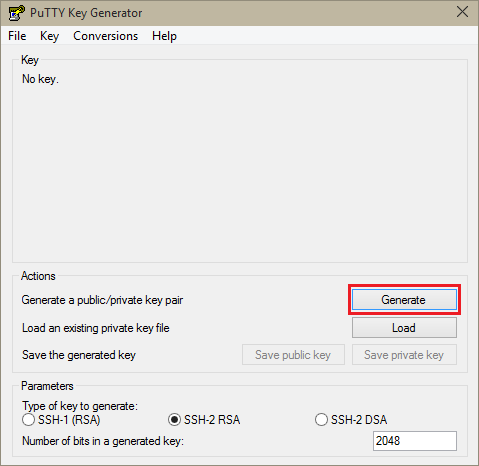
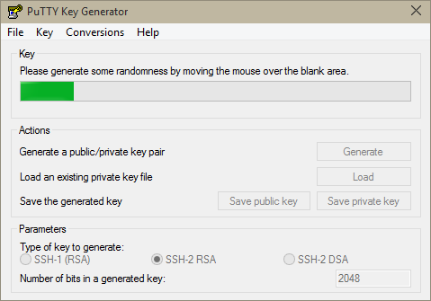
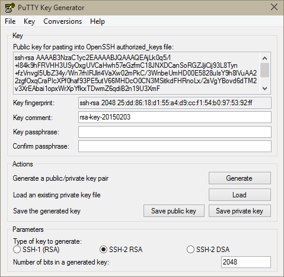
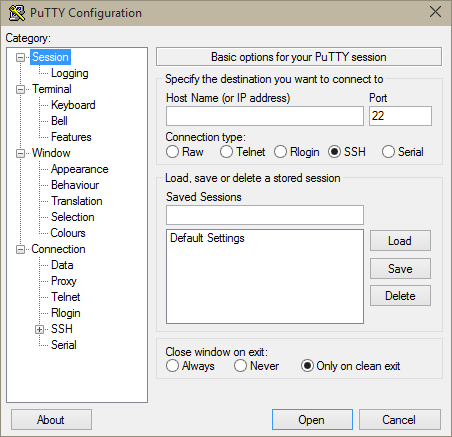
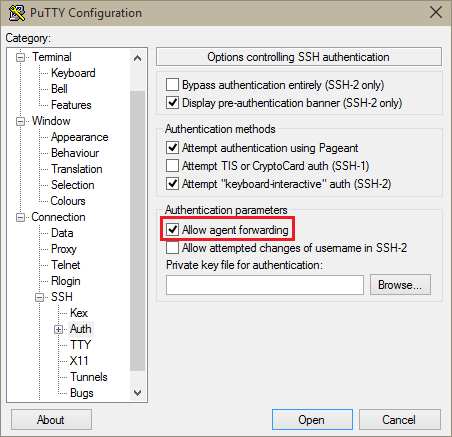

<properties
   pageTitle="Use SSH keys with Hadoop on Linux-based clusters from Windows | Microsoft Azure"
   description="Learn how to create and use SSH keys to authenticate to Linux-based HDInsight clusters. Connect clusters from Windows-based clients by using the PuTTY SSH client."
   services="hdinsight"
   documentationCenter=""
   authors="Blackmist"
   manager="paulettm"
   editor="cgronlun"
	tags="azure-portal"/>

<tags
   ms.service="hdinsight"
   ms.devlang="na"
   ms.topic="get-started-article"
   ms.tgt_pltfrm="na"
   ms.workload="big-data"
   ms.date="06/14/2016"
   ms.author="larryfr"/>

#Use SSH with Linux-based Hadoop on HDInsight from Windows

> [AZURE.SELECTOR]
- [Windows](hdinsight-hadoop-linux-use-ssh-windows.md)
- [Linux, Unix, OS X](hdinsight-hadoop-linux-use-ssh-unix.md)

[Secure Shell (SSH)](https://en.wikipedia.org/wiki/Secure_Shell) allows you to remotely perform operations on your Liux-based HDInsight clusters using a command-line interface. This document provides information on connecting to HDInsight from Windows-based clients by using the PuTTY SSH client.

> [AZURE.NOTE] The steps in this article assume you are using a Windows-based client. If you are using a Linux, Unix, or OS X client, see [Use SSH with Linux-based Hadoop on HDInsight from Linux, Unix, or OS X](hdinsight-hadoop-linux-use-ssh-unix.md).

##Prerequisites

* **PuTTY** and **PuTTYGen** for Windows-based clients. These utilities are available from [http://www.chiark.greenend.org.uk/~sgtatham/putty/download.html](http://www.chiark.greenend.org.uk/~sgtatham/putty/download.html).

* A modern web browser that supports HTML5.

OR

* [Azure CLI](../xplat-cli-install.md).

    [AZURE.INCLUDE [use-latest-version](../../includes/hdinsight-use-latest-cli.md)] 

##What is SSH?

SSH is a utility for logging in to, and remotely executing, commands on a remote server. With Linux-based HDInsight, SSH establishes an encrypted connection to the cluster head node and provides a command line that you use to type in commands. Commands are then executed directly on the server.

###SSH user name

An SSH user name is the name you use to authenticate to the HDInsight cluster. When you specify an SSH user name during cluster creation, this user is created on all nodes in the cluster. Once the cluster is created, you can use this user name to connect to the HDInsight cluster head nodes. From the head nodes, you can then connect to the individual worker nodes.

###SSH password or Public key

An SSH user can use either a password or public key for authentication. A password is just a string of text you make up, while a public key is part of a cryptographic key pair generated to uniquely identify you.

A key is more secure than a password, however it requires additional steps to generate the key and you must maintain the files containing the key in a secure location. If anyone gains access to the key files, they gain access to your account. Or if you lose the key files, you will not be able to login to your account.

A key pair consists of a public key (which is sent to the HDInsight server,) and a private key (which is kept on your client machine.) When you connect to the HDInsight server using SSH, the SSH client will use the private key on your machine to authenticate with the server.

##Create an SSH key

Use the following information if you plan on using SSH keys with your cluster. If you plan on using a password, you can skip this section.

1. Open PuTTYGen.

2. For **Type of key to generate**, select **SSH-2 RSA**, and then click **Generate**.

	

3. Move the mouse around in the area below the progress bar, until the bar fills. Moving the mouse generates random data that is used to generate the key.

	

	Once the key has been generated, the public key will be displayed.

4. For added security, you can enter a passphrase in the **Key passphrase** field, and then type the same value in the **Confirm passphrase** field.

	

	> [AZURE.NOTE] We strongly recommend that you use a secure passphrase for the key. However, if you forget the passphrase, there is no way to recover it.

5. Click **Save private key** to save the key to a **.ppk** file. This key will be used to authenticate to your Linux-based HDInsight cluster.

	> [AZURE.NOTE] You should store this key in a secure location, as it can be used to access your Linux-based HDInsight cluster.

6. Click **Save public key** to save the key as a **.txt** file. This allows you to reuse the public key in the future when you create additional Linux-based HDInsight clusters.

	> [AZURE.NOTE] The public key is also displayed at the top of PuTTYGen. You can right-click this field, copy the value, and then paste it into a form when creating a cluster using the Azure Portal.

##Create a Linux-based HDInsight cluster

When creating a Linux-based HDInsight cluster, you must provide the public key created previously. From Windows-based clients, there are two ways to create a Linux-based HDInsight cluster:

* **Azure Portal** - Uses a web-based portal to create the cluster.

* **Azure CLI for Mac, Linux and Windows** - Uses command-line commands to create the cluster.

Each of these methods will require the public key. For complete information on creating a Linux-based HDInsight cluster, see [Provision Linux-based HDInsight clusters](hdinsight-hadoop-provision-linux-clusters.md).

###Azure Portal

When using the [Azure Portal][preview-portal] to create a Linux-based HDInsight cluster, you must enter an **SSH Username**, and select to enter a **PASSWORD** or **SSH PUBLIC KEY**.

If you select **SSH PUBLIC KEY**, you can either paste the public key (displayed in the __Public key for pasting into OpenSSH authorized\_keys file__ field in PuttyGen,) into the __SSH PublicKey__ field, or select __Select a file__ to browse and select the file that contains the public key.

This creates a login for the specified user, and enables either password authentication or SSH key authentication.

###Azure Command-Line Interface for Mac, Linux, and Windows

You can use the [Azure CLI for Mac, Linux and Windows](../xplat-cli-install.md) to create a new cluster by using the `azure hdinsight cluster create` command.

For more information on using this command, see [Provision Hadoop Linux clusters in HDInsight using custom options](hdinsight-hadoop-provision-linux-clusters.md).

##Connect to a Linux-based HDInsight cluster

1. Open PuTTY.

	

2. If you provided an SSH key when you created your user account, you must perform the following step to select the private key to use when authenticating to the cluster:

	In **Category**, expand **Connection**, expand **SSH**, and select **Auth**. Finally, click **Browse** and select the .ppk file that contains your private key.

	

3. In **Category**, select **Session**. From the **Basic options for your PuTTY session** screen, enter the SSH address of your HDInsight server in the **Host name (or IP address)** field. There are two possible SSH addresses you may use when connecting to a cluster:

    * __Head node address__: To connect to the head node ofthe cluster, use your cluster name, then **-ssh.azurehdinsight.net**. For example, **mycluster-ssh.azurehdinsight.net**.
    
    * __Edge node address__: If you are connecting to an R Server on HDInsight cluster, you can connect to the R Server edge node using the address __RServer.CLUSTERNAME.ssh.azurehdinsight.net__, where CLUSTERNAME is the name of your cluster. For example, __RServer.mycluster.ssh.azurehdinsight.net__.

	

4. To save the connection information for future use, enter a name for this connection under **Saved Sessions**, and then click **Save**. The connection will be added to the list of saved sessions.

5. Click **Open** to connect to the cluster.

	> [AZURE.NOTE] If this is the first time you have connected to the cluster, you will receive a security alert. This is normal. Select **Yes** to cache the server's RSA2 key to continue.

6. When prompted, enter the user that you entered when you created the cluster. If you provided a password for the user, you will be prompted to enter it also.

> [AZURE.NOTE] The above steps assume you are using port 22, which will connect to head node 0 on the HDInsight cluster. If you use port 23, you will connect to head node 1. For more information on the head nodes, see [Availability and reliability of Hadoop clusters in HDInsight](hdinsight-high-availability-linux.md).

###Connect to worker nodes

The worker nodes are not directly accessible from outside the Azure datacenter, but they can be accessed from the cluster head node via SSH.

If you provided an SSH key when you created your user account, you must perform the following steps to use the private key when authenticating to the cluster if you want to connect to the worker nodes.

1. Install Pageant from [http://www.chiark.greenend.org.uk/~sgtatham/putty/download.html](http://www.chiark.greenend.org.uk/~sgtatham/putty/download.html). This utility is used to cache SSH keys for PuTTY.

2. Run Pageant. It will minimize to an icon in the status tray. Right-click the icon and select **Add Key**.

    

3. When the browse dialog appears, select the .ppk file that contains the key, and then click **Open**. This adds the key to Pageant, which will provide it to PuTTY when connecting to the cluster.

    > [AZURE.IMPORTANT] If you used an SSH key to secure your account, you must complete the previous steps before you will be able to connect to worker nodes.

4. Open PuTTY.

5. If you use an SSH key to authenticate, in the **Category** section, expand **Connection**, expand **SSH**, and then select **Auth**.

    In the **Authentication parameters** section, enable **Allow agent forwarding**. This allows PuTTY to automatically pass the certificate authentication through the connection to the cluster head node when connecting to worker nodes.

    

6. Connect to the cluster as documented earlier. If you use an SSH key for authentication, you do not need to select the key - the SSH key added to Pageant will be used to authenticate to the cluster.

7. After the connection has been established, use the following to retrieve a list of the nodes in your cluster. Replace *ADMINPASSWORD* with the password for your cluster admin account. Replace *CLUSTERNAME* with the name of your cluster.

        curl --user admin:ADMINPASSWORD https://CLUSTERNAME.azurehdinsight.net/api/v1/hosts

    This will return information in JSON format for the nodes in the cluster, including `host_name`, which contains the fully qualified domain name (FQDN) for each node. The following is an example of a `host_name` entry returned by the **curl** command:

        "host_name" : "workernode0.workernode-0-e2f35e63355b4f15a31c460b6d4e1230.j1.internal.cloudapp.net"

8. Once you have a list of the worker nodes you want to connect to, use the following command from the PuTTY session to open a connection to a worker node:

        ssh USERNAME@FQDN

    Replace *USERNAME* with your SSH user name and *FQDN* with the FQDN for the worker node. For example, `workernode0.workernode-0-e2f35e63355b4f15a31c460b6d4e1230.j1.internal.cloudapp.net`.

    > [AZURE.NOTE] If you use a password to authentication your SSH session, you will be prompted to enter the password again. If you use an SSH key, the connection should finish without any prompts.

9. Once the session has been established, the prompt for your PuTTY session will change from `username@hn0-clustername` to `username@wn0-clustername` to indicate that you are connected to the worker node. Any commands you run at this point will run on the worker node.

10. Once you have finished performing actions on the worker node, use the `exit` command to close the session to the worker node. This will return you to the `username@hn0-clustername` prompt.

##Add more accounts

If you need to add more accounts to your cluster, perform the following steps:

1. Generate a new public key and private key for the new user account as described previously.

2. From an SSH session to the cluster, add the new user with the following command:

		sudo adduser --disabled-password <username>

	This will create a new user account, but will disable password authentication.

3. Create the directory and files to hold the key by using the following commands:

        sudo mkdir -p /home/<username>/.ssh
        sudo touch /home/<username>/.ssh/authorized_keys
        sudo nano /home/<username>/.ssh/authorized_keys

4. When the nano editor opens, copy and paste in the contents of the public key for the new user account. Finally, use **Ctrl-X** to save the file and exit the editor.

	

5. Use the following command to change ownership of the .ssh folder and contents to the new user account:

		sudo chown -hR <username>:<username> /home/<username>/.ssh

6. You should now be able to authenticate to the server with the new user account and private key.

##SSH tunneling

SSH can be used to tunnel local requests, such as web requests, to the HDInsight cluster. The request will then be routed to the requested resource as if it had originated on the HDInsight cluster head node.

> [AZURE.IMPORTANT] An SSH tunnel is a requirement for accessing the web UI for some Hadoop services. For example, both the Job History UI or Resource Manager UI can only be accessed using an SSH tunnel.

For more information on creating and using an SSH tunnel, see [Use SSH Tunneling to access Ambari web UI, ResourceManager, JobHistory, NameNode, Oozie, and other web UI's](hdinsight-linux-ambari-ssh-tunnel.md).

##Next steps

Now that you understand how to authenticate by using an SSH key, learn how to use MapReduce with Hadoop on HDInsight.

* [Use Hive with HDInsight](hdinsight-use-hive.md)

* [Use Pig with HDInsight](hdinsight-use-pig.md)

* [Use MapReduce jobs with HDInsight](hdinsight-use-mapreduce.md)

[preview-portal]: https://portal.azure.com/
