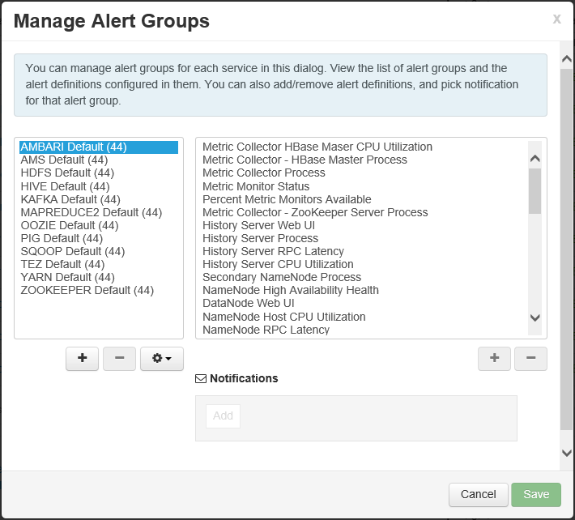
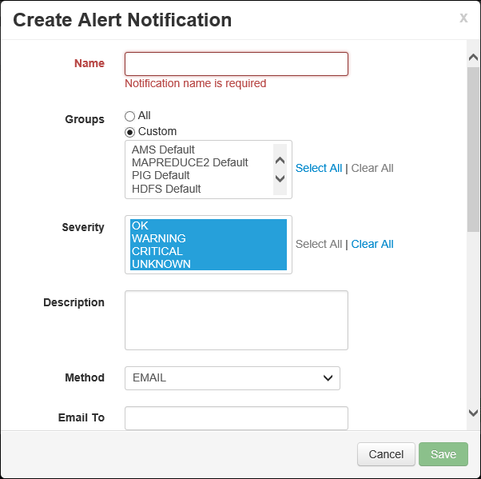
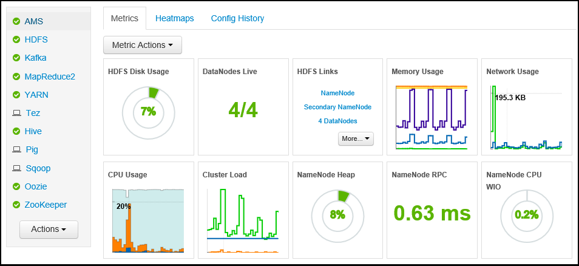
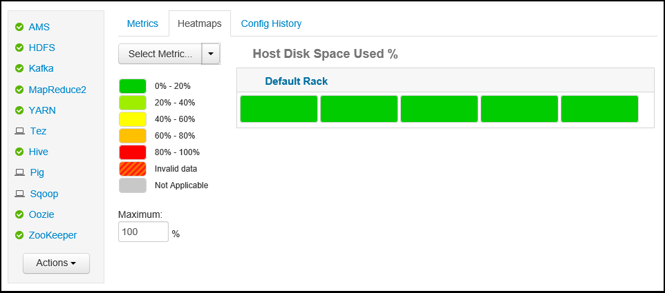
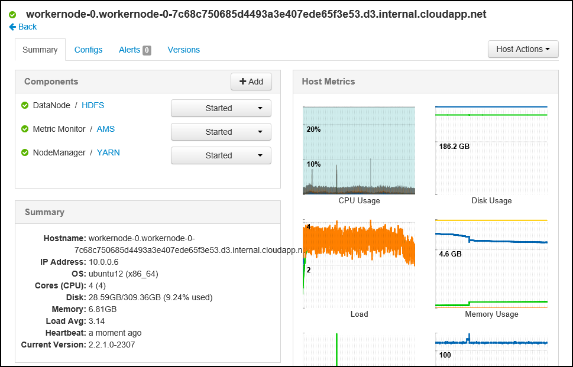
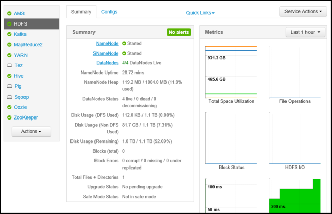
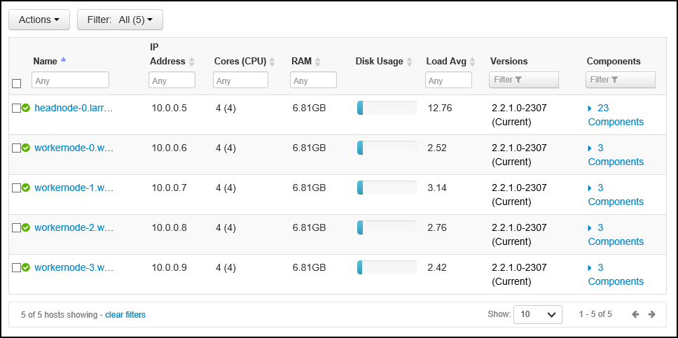
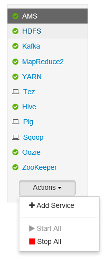
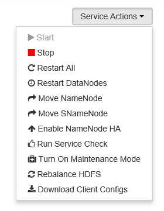
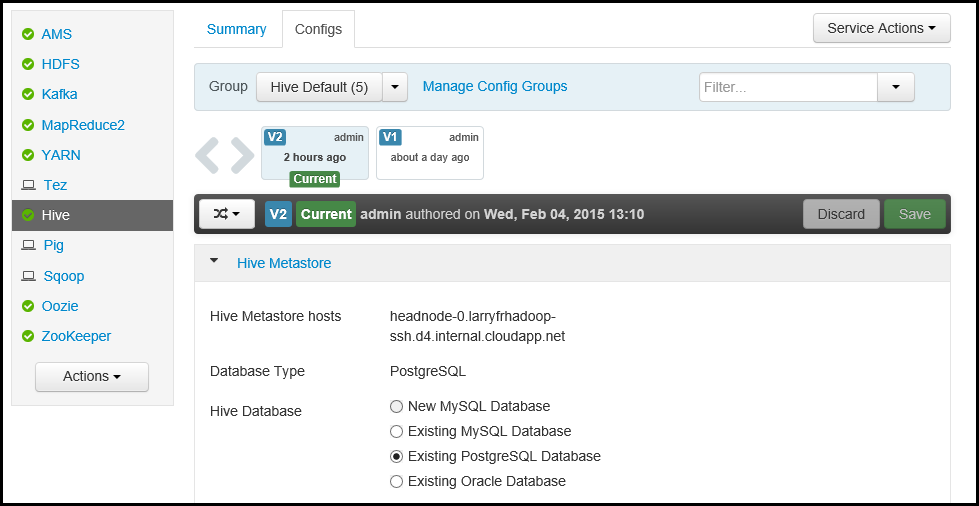

<properties
   pageTitle="Monitor and manage HDInsight clusters using the Apache Ambari Web UI | Microsoft Azure"
   description="Learn how to use Ambari to monitor and manage Linux-based HDInsight clusters. In this document, you will learn how to use the Ambari Web UI included with HDInsight clusters."
   services="hdinsight"
   documentationCenter=""
   authors="Blackmist"
   manager="paulettm"
   editor="cgronlun"
	tags="azure-portal"/>

<tags
   ms.service="hdinsight"
   ms.devlang="na"
   ms.topic="article"
   ms.tgt_pltfrm="na"
   ms.workload="big-data"
   ms.date="07/12/2016"
   ms.author="larryfr"/>

#Manage HDInsight clusters by using the Ambari Web UI

[AZURE.INCLUDE [ambari-selector](../../includes/hdinsight-ambari-selector.md)]

Apache Ambari simplifies the management and monitoring of a Hadoop cluster by providing an easy to use web UI and REST API. Ambari is included on Linux-based HDInsight clusters, and is used to monitor the cluster and make configuration changes.

In this document, you will learn how to use the Ambari Web UI with an HDInsight cluster.

##What is Ambari?

<a href="http://ambari.apache.org" target="_blank">Apache Ambari</a> makes Hadoop management simpler by providing an easy-to-use web UI that can be used to provision, manage, and monitor Hadoop clusters. Developers can integrate these capabilities into their applications by using the <a href="https://github.com/apache/ambari/blob/trunk/ambari-server/docs/api/v1/index.md" target="_blank">Ambari REST APIs</a>.

The Ambari Web UI is provided by default with Linux-based HDInsight clusters. 

##Connectivity

The Ambari Web UI is available on your HDInsight cluster at HTTPS://CLUSTERNAME.azurehdidnsight.net, where __CLUSTERNAME__ is the name of your cluster. 

> [AZURE.IMPORTANT] Connecting to Ambari on HDInsight requires HTTPS. You must also authenticate to Ambari using the admin account name (the default is __admin__,) and password you provided when the cluster was created.

##SSH proxy

> [AZURE.NOTE] While Ambari for your cluster is accessible directly over the Internet, some links from the Ambari Web UI (such as to the JobTracker,) are not exposed on the internet. So you will receive "server not found" errors when trying to access these features unless you use a Secure Shell (SSH) tunnel to proxy web traffic to the cluster head node.

For information on creating an SSH tunnel to work with Ambari, see [Use SSH Tunneling to access Ambari web UI, ResourceManager, JobHistory, NameNode, Oozie, and other web UI's](hdinsight-linux-ambari-ssh-tunnel.md).

##Ambari Web UI

When connecting to the Ambari Web UI, you will be prompted to authenticate to the page. Use the cluster admin user (default Admin,) and password you used during cluster creation.

When the page opens, note the bar at the top. This contains the following information and controls:

* **Ambari logo** - Opens the dashboard, which can be used to monitor the cluster.

* **Cluster name # ops** - Displays the number of ongoing Ambari operations. Selecting the cluster name or **# ops** will display a list of background operations.

* **# alerts** - Warnings or critical alerts, if any, for the cluster. Selecting this will display a list of alerts.

* **Dashboard** - Displays the dashboard.

* **Services** - Information and configuration settings for the services in the cluster.

* **Hosts** - Information and configuration settings for the nodes in the cluster.

* **Alerts** - A log of information, warnings, and critical alerts.

* **Admin** - Software stack/services that are installed on the cluster, service account information, and Kerberos security.

* **Admin button** - Ambari management, user settings, and logout.

##Monitoring

###Alerts

Ambari provides many alerts, which will have one of the following as the status:

* **OK**

* **Warning**

* **CRITICAL**

* **UNKNOWN**

Alerts other than **OK** will cause the **# alerts** entry at the top of the page to display the number of alerts. Selecting this entry will display the alerts and their status.

Alerts are organized into several default groups, which can be viewed from the **Alerts** page.

You can manage the groups by using the **Actions** menu and selecting **Manage Alert Groups**. This allows you to modify existing groups, or create new groups.

You can also create alert notifications from the **Actions** menu. This allows you to create triggers that send notifications via **EMAIL** or **SNMP** when specific alert/severity combinations occur. For example, you can send an alert when any of the alerts in the **YARN Default** group is set to **Critical**.

###Cluster

The **Metrics** tab of the dashboard contains a series of widgets that make it easy to monitor the status of your cluster at a glance. Several widgets, such as **CPU Usage**, provide additional information when clicked.

The **Heatmaps** tab displays metrics as colored heatmaps, going from green to red.

For more detailed information on the nodes within the cluster, select **Hosts**, and then select the specific node you are interested in.

###Services

The **Services** sidebar on the dashboard provides quick insight into the status of the services running on the cluster. Various icons are used to indicate status or actions that should be taken, such as a yellow recycle symbol if a service needs to be recycled.

Selecting a service will display more detailed information on the service.

####Quick links

Some services display a **Quick Links** link at the top of the page. This can be used to access service-specific web UIs, such as:

* **Job History** - MapReduce job history.

* **Resource Manager** - YARN ResourceManager UI.

* **NameNode** - Hadoop Distributed File System (HDFS) NameNode UI.

* **Oozie Web UI** - Oozie UI.

Selecting any of these links will open a new tab in your browser, which will display the selected page.

> [AZURE.NOTE] Selecting a **Quick Links** link for any service will result in a "server not found" error unless you are using a Secure Sockets Layer (SSL) tunnel to proxy web traffic to the cluster. This is because the web applications used to display this information are not exposed on the internet.
>
> For information on using an SSL tunnel with HDInsight, see [Use SSH Tunneling to access Ambari web UI, ResourceManager, JobHistory, NameNode, Oozie, and other web UI's](hdinsight-linux-ambari-ssh-tunnel.md)

##Management

###Ambari users, groups, and permissions

Managing users, groups, and permissions should not be used with HDInsight clusters.

###Hosts

The **Hosts** page lists all hosts in the cluster. To manage hosts, follow these steps.

> [AZURE.NOTE] Adding, decommissioning or recommissioning a host should not be used with HDInsight clusters.

1. Select the host(s) that you wish to manage.

2. Use the **Actions** menu to select the action that you wish to perform:

	* **Start all components** - Start all components on the host.

	* **Stop all components** - Stop all components on the host.

	* **Restart all components** - Stop and start all components on the host.

	* **Turn on maintenance mode** - Suppresses alerts for the host. This should be enabled if you are performing actions that will generate alerts, such as restarting a service that running services rely on.

	* **Turn off maintenance mode** - Returns the host to normal alerting.

	* **Stop** - Stops DataNode or NodeManagers on the host.

	* **Start** - Starts DataNode or NodeManagers on the host.

	* **Restart** - Stops and starts DataNode or NodeManagers on the host.

	* **Decommission** - Removes a host from the cluster.

		> [AZURE.NOTE] Do not use this action on HDInsight clusters.

	* **Recommission** - Adds a previously decommissioned host to the cluster.

		> [AZURE.NOTE] Do not use this action on HDInsight clusters.

###Services

From the **Dashboard** or **Services** page, use the **Actions** button at the bottom of the list of services to stop and start all services.

> [AZURE.WARNING] While __Add Service__ is listed in this menu, it should not be used to add services to the HDInsight cluster. New services should be added using a Script Action during cluster provisioning. For more information on using Script Actions, see [Customize HDInsight clusters using Script Actions](hdinsight-hadoop-customize-cluster-linux.md).

While the **Actions** button can restart all services, often you want to start, stop, or restart a specific service. Use the following steps to perform actions on an individual service:

1. From the **Dashboard** or **Services** page, select a service.

2. From the top of the **Summary** tab, use the **Service Actions** button and select the action to take. This will restart the service on all nodes.

	

	> [AZURE.NOTE] Restarting some services while the cluster is running may generate alerts. To avoid this, you can use the **Service Actions** button to enable **Maintenance mode** for the service before performing the restart.

3. Once an action has been selected, the **# op** entry at the top of the page will increment to show that a background operation is occurring. If configured to display, the list of background operations is displayed.

	> [AZURE.NOTE] If you enabled **Maintenance mode** for the service, remember to disable it by using the **Service Actions** button once the operation has finished.

To configure a service, use the following steps:

1. From the **Dashboard** or **Services** page, select a service.

2. Select the **Configs** tab. The current configuration will be displayed. A list of previous configurations is also displayed.

	

3. Use the fields displayed to modify the configuration, and then select **Save**. Or select a previous configuration and then select **Make current** to roll back to the previous settings.

##Ambari views

Ambari Views allow developers to plug UI elements into the Ambari Web UI using the [Ambari Views Framework](https://cwiki.apache.org/confluence/display/AMBARI/Views). HDInsight provides the following views with Hadoop cluster types:

* Yarn Queue Manager: The queue manager provides a simple UI for viewing and modifying YARN queues.
* Hive View: The Hive View allows you to run Hive queries directly from your web browser. You can save queries, view results, save results to the cluster storage, or download results to your local system. For more information on using Hive Views, see [Use Hive Views with HDInsight](hdinsight-hadoop-use-hive-ambari-view.md).
* Tez View: The Tez View allows you to better understand and optimize jobs by viewing information on how Tez jobs are executed and what resources are used by the job.