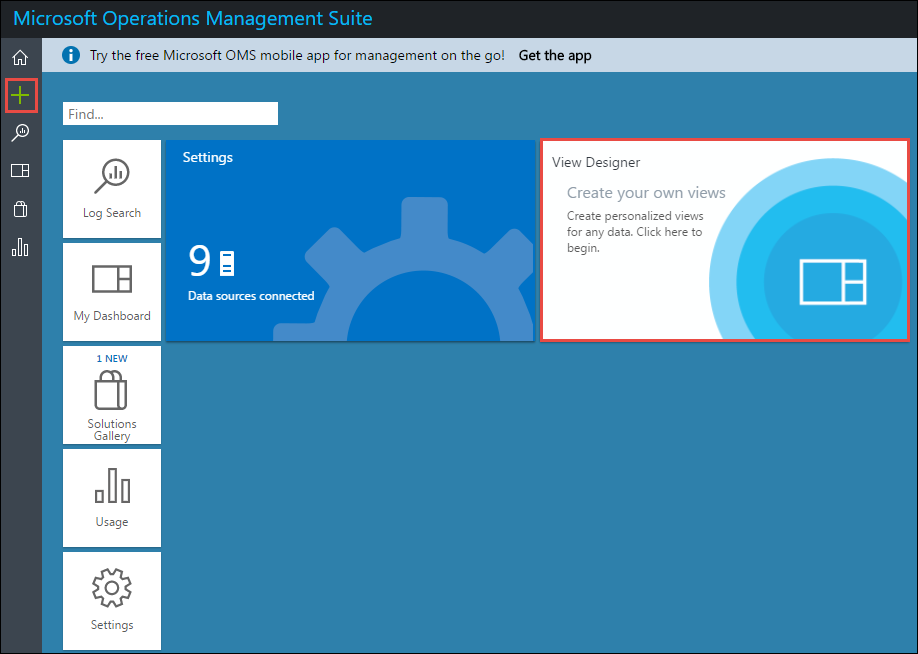
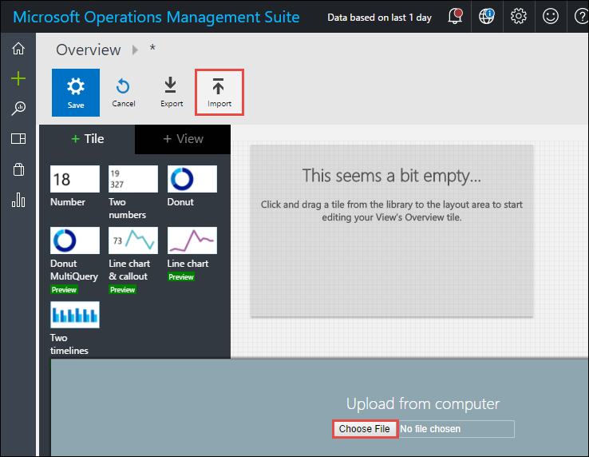
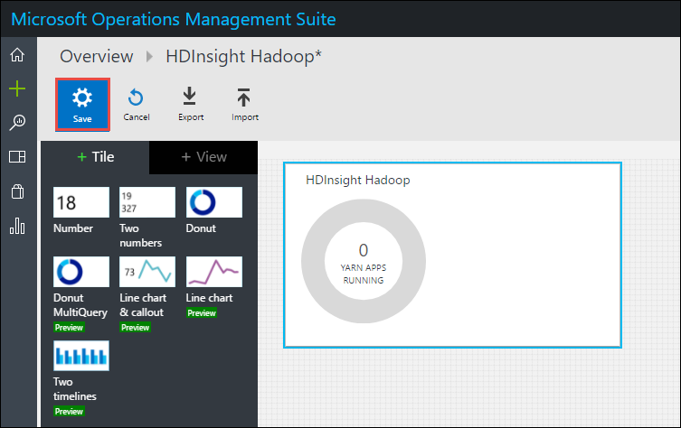

# Create custom views in Log Analytics for HDInsight clusters 

Azure HDInsight provides templates for custom views for the different HDInsight cluster types. This article provides instructions on how to import these templates into the OMS Log Analytics Portal. For more information on views in Log Analytics, see [Use View Designer to create custom views in Log Analytics](../log-analytics/log-analytics-view-designer.md).

## Prerequisites

* You must have configured an HDInsight cluster to use Azure Log Analytics. For instructions see [Use Azure Log Analytics with HDInsight clusters](hdinsight-hadoop-oms-log-analytics-tutorial.md). 

## Custom view templates for HDInsight clusters

Here are some of the templates that you can use
 
* **Hive** -  https://raw.githubusercontent.com/hdinsight/HDInsightOMS/master/monitoring/hiveview.omsview 
* **Spark** - https://raw.githubusercontent.com/hdinsight/HDInsightOMS/master/monitoring/sparkOMS.omsview
* **HBase** - https://raw.githubusercontent.com/hdinsight/HDInsightOMS/master/monitoring/hbaseoms.omsview
* **Kafka** - https://raw.githubusercontent.com/hdinsight/HDInsightOMS/master/monitoring/kafkaoms.omsview

>>>> TBD >>>>. Are there any other views that must be listed here.

The next section talks about how to import these views into the Log Analytics portal.
   
## Import template to create custom views for HDInsight clusters

In this section, you import templates create custom views for HDInsight clusters. This section provides instructions on how to import the Hive template. You can perform the same steps to import any other template view.

1. In the OMS dashboard, click **View Designer** or the View Designer icon from the left pane.

    

2. In the next screen, click **Import**, and then click **Choose File**.

    

3. Even though it opens a file open dialog box, you can provide the URL to the template file. For a Hive template, the URL is https://raw.githubusercontent.com/hdinsight/HDInsightOMS/master/monitoring/hiveview.omsview.

4. The custom view is now added to your OMS workspace dashboard. Click **Save**.

    

3. You should now see a tile on OMS dashboard for the custom view that you just saved. Click the tile to see the different metrics being collected for an HDInsight Hadoop cluster.

## See also

* [Working with OMS Log Analytics](https://blogs.msdn.microsoft.com/wei_out_there_with_system_center/2016/07/03/oms-log-analytics-create-tiles-drill-ins-and-dashboards-with-the-view-designer/)
* [Use View Designer to create custom views in Log Analytics](../log-analytics/log-analytics-view-designer.md)
