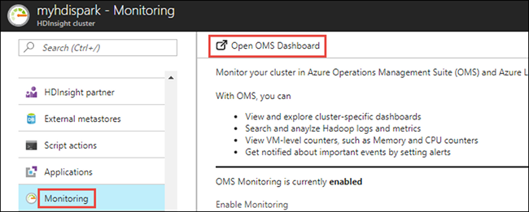
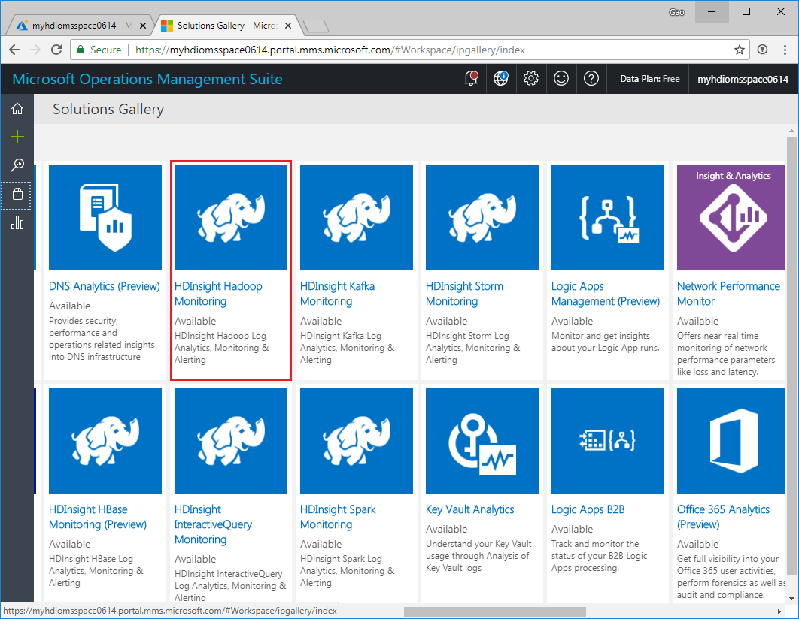
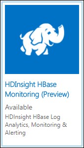
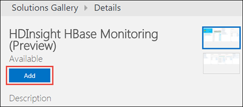
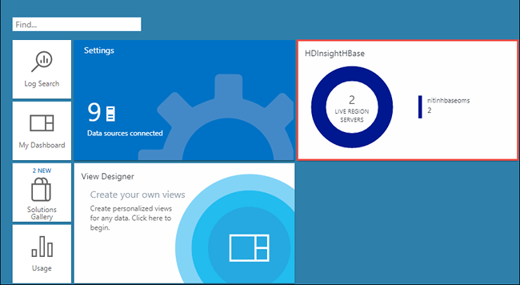

# Add HDInsight cluster management solutions to Log Analytics (Preview)

HDInsight provides cluster-specific management solutions that you can add  for Azure Log Analytics. [Management solutions](../log-analytics/log-analytics-add-solutions.md) add functionality to OMS, providing additional data and analysis tools to Log Analytics. These solutions collect important performance metrics from your HDInsight clusters and provides the tools to search the metrics. These solutions also provide visualizations and dashboards for most cluster types supported in HDInsight. By using the metrics that you collect with the solution, you can create custom monitoring rules and alerts. 

In this article, you learn how to add cluster-specific management solutions to an OMS workspace.

## Prerequisites

* You must have configured an HDInsight cluster to use Azure Log Analytics. For instructions see [Use Azure Log Analytics with HDInsight clusters](hdinsight-hadoop-oms-log-analytics-tutorial.md).

## Add cluster-specific management solutions

In this section you add an HBase cluster management solution to an existing OMS workspace. You must perform similar steps to add management solution for other HDInsight cluster types.

1. Open the OMS dashboard. In the Azure portal, open the HDInsight cluster blade that you associated with Azure Log Analytics, click the Monitoring tab, and the click **Open OMS Dashboard**.

    

1. In the OMS dashboard, click **Solutions Gallery** or the View Designer icon from the left pane.

    

2. In the Solutions Gallery, find **HDInsight HBase Monitoring**, and then click the tile.

    

3. In the next screen, click **Add**.

     

4. You should now see a tile on OMS dashboard for the HBase management solution. If the cluster you associated with OMS (as part of the prerequiste for this article) is an HBase cluster, the tile shows the name of the cluster and the number of nodes in the cluster.

    

## Next steps

* [Query Azure Log Analytics to monitor HDInsight clusters](hdinsight-hadoop-oms-log-analytics-use-queries.md)

## See also

* [Working with OMS Log Analytics](https://blogs.msdn.microsoft.com/wei_out_there_with_system_center/2016/07/03/oms-log-analytics-create-tiles-drill-ins-and-dashboards-with-the-view-designer/)
* [Create alert rules in Log Analytics](../log-analytics/log-analytics-alerts-creating.md)
