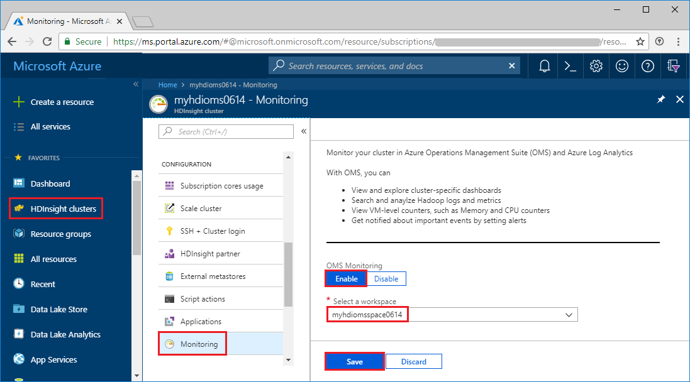
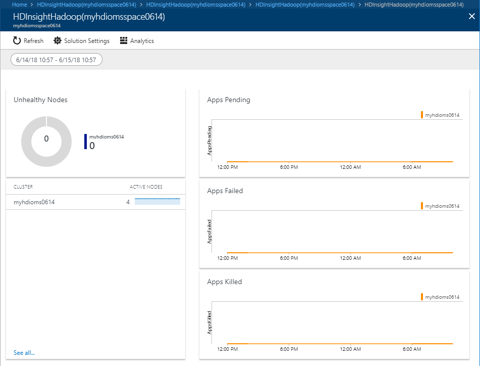

# Use Azure Log Analytics to monitor HDInsight clusters

Learn how to enable Azure Log Analytics to monitor Hadoop cluster operations in HDInsight, and how to add an HDInisght monitoring solution.

[Log Analytics](../log-analytics/log-analytics-overview.md) is a service that monitors your cloud and on-premises environments to maintain their availability and performance. It collects data generated by resources in your cloud and on-premises environments and from other monitoring tools to provide analysis across multiple sources.

If you don't have an Azure subscription, [create a free account](https://azure.microsoft.com/free/) before you begin.

## Prerequisites

* **A Log Analytics workspace**. You can think of this workspace as a unique Log Analytics environment with its own data repository, data sources, and solutions. For the instructions, see [Create a Log Analytics workspace](../log-analytics/log-analytics-quick-collect-azurevm.md#create-a-workspace).

* **An Azure HDInsight cluster**. Currently, you can use Log Analytics with the following HDInsight cluster types:

  * Hadoop
  * HBase
  * Interactive Query
  * Kafka
  * Spark
  * Storm

  For the instructions on how to create an HDInsight cluster, see [Get started with Azure HDInsight](hadoop/apache-hadoop-linux-tutorial-get-started.md).

> [!NOTE]
> It is recommended to place both the HDInsight cluster and the Log Analytics workspace in the same region for better performance. Note Azure Log Analytics is not available in all Azure regions.

## Enable Log Analytics by using the portal

In this section, you configure an existing HDInsight Hadoop cluster to use an Azure Log Analytics workspace to monitor jobs, debug logs, etc.

1. Open an HDInsight cluster in the Azure portal.
2. In the left pane, select **Monitoring**.
3. In the right pane, select **Enable**, select an existing Log Analytics workspace, and then select **Save**.

    

    It takes a few moments to save the setting.

## Enable Log Analytics by using Azure PowerShell

You can enable Log Analytics using Azure PowerShell. The cmdlet is:

```powershell
Enable-AzureRmHDInsightOperationsManagementSuite
      [-Name] <CLUSTER NAME>
      [-WorkspaceId] <LOG ANALYTICS WORKSPACE NAME>
      [-PrimaryKey] <LOG ANALYTICS WORKSPACE PRIMARY KEY>
      [-ResourceGroupName] <RESOURCE GROUIP NAME>
```

See [Enable-AzureRmHDInsightOperationsManagementSuite](https://docs.microsoft.com/powershell/module/azurerm.hdinsight/Enable-AzureRmHDInsightOperationsManagementSuite?view=azurermps-5.0.0).

To disable, the cmdlet is:

```powershell
Disable-AzureRmHDInsightOperationsManagementSuite
       [-Name] <CLUSTER NAME>
       [-ResourceGroupName] <RESOURCE GROUP NAME>
```

See [Disable-AzureRmHDInsightOperationsManagementSuite](https://docs.microsoft.com/powershell/module/azurerm.hdinsight/disable-azurermhdinsightoperationsmanagementsuite?view=azurermps-5.0.0).

## Install HDInsight cluster management solutions

HDInsight provides cluster-specific management solutions that you can add for Azure Log Analytics. [Management solutions](../log-analytics/log-analytics-add-solutions.md) add functionality to Log Analytics, providing additional data and analysis tools. These solutions collect important performance metrics from your HDInsight clusters and provide the tools to search the metrics. These solutions also provide visualizations and dashboards for most cluster types supported in HDInsight. By using the metrics that you collect with the solution, you can create custom monitoring rules and alerts.

These are the available HDInsight solutions:

* HDInsight Hadoop Monitoring
* HDInsight HBase Monitoring
* HDInsight Interactive Query Monitoring
* HDInsight Kafka Monitoring
* HDInsight Spark Monitoring
* HDInsight Storm Monitoring

For the instructions to install a management solution, see [Management solutions in Azure](../monitoring/monitoring-solutions.md#install-a-management-solution). To experiment, install a HDInsight Hadoop Monotiring solution. When it is done, you see an **HDInsightHadoop** tile listed under **Summary**. Select the **HDInsightHadoop** tile. The HDInsightHadoop solution looks like:



Because the cluster is a brand new cluster, the report doesn't show any activities.

## Next steps

* [Query Azure Log Analytics to monitor HDInsight clusters](hdinsight-hadoop-oms-log-analytics-use-queries.md)
