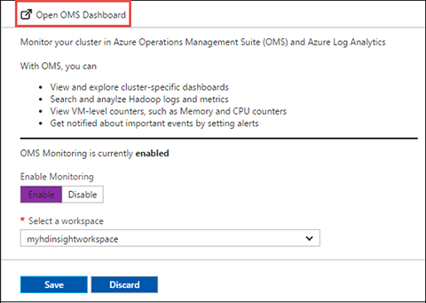
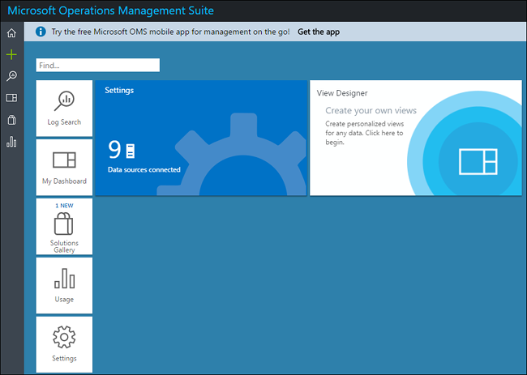

# Use Azure Log Analytics to monitor HDInsight clusters (Preview)

In this article, you learn how to use Azure Log Analytics to monitor HDInsight Hadoop clusters operations.

Log Analytics is a service in [Operations Management Suite (OMS)](../operations-management-suite/operations-management-suite-overview.md) that monitors your cloud and on-premises environments to maintain their availability and performance. It collects data generated by resources in your cloud and on-premises environments and from other monitoring tools to provide analysis across multiple sources. 

## Prerequisites

* **An Azure subscription**. Before you begin this tutorial, you must have an Azure subscription. See [Create your free Azure account today](https://azure.microsoft.com/free).

* **An Azure HDInsight cluster**. Currently, you can use Azure OMS with the following HDInsight cluster types:
    * Hadoop
    * Spark
    * HBase
    * Storm
    * Kafka
    * Interactive Hive

    For instructions on how to create an HDInsight cluster, see [Get started with Azure HDInsight](hdinsight-hadoop-linux-tutorial-get-started.md).

* **A Log Analytics workspace**. You can think of this workspace as a unique Log Analytics environment with its own data repository, data sources, and solutions. You must have one such workspace already created that you can associate with Azure HDInsight clusters. For instructions, see [Create a Log Analytics workspace](../log-analytics/log-analytics-get-started.md#2-create-a-workspace).

## Configure HDInsight cluster to use Azure Log Analytics

In this section, you configure an existing HDInsight Hadoop cluster to use an Azure Log Analytics workspace to monitor jobs, debug logs, etc.

1. In the Azure portal, from the left pane, click **HDInsight clusters**, and then click the name of the cluster you want to configure with Azure Log Analytics.

2. In the cluster blade, from the left pane, click **Monitoring**.

3. In the right pane, click **Enable**, and then select an existing Log Analytics workspace. Click **Save**.

    

4. Once the cluster is configured to use Log Analytics for monitoring, you see an **Open OMS Dashboard** option at the top of the tab. Click the button.

    

5. Enter your Azure credentials if prompted. You are directed to the Microsoft OMS dashboard.

    

## Next steps
* [Add HDInsight cluster management solutions to Log Analytics](hdinsight-hadoop-oms-log-analytics-management-solutions.md)
