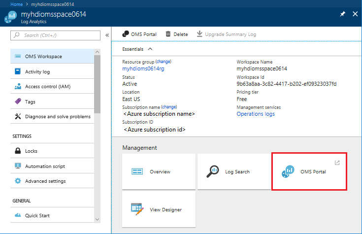

# Use Azure Log Analytics to monitor HDInsight clusters

Learn how to use Azure Log Analytics to monitor Hadoop cluster operations in HDInsight.

[Log Analytics](../log-analytics/log-analytics-overview.md) is a service that monitors your cloud and on-premises environments to maintain their availability and performance. It collects data generated by resources in your cloud and on-premises environments and from other monitoring tools to provide analysis across multiple sources.

If you don't have an Azure subscription, [create a free account](https://azure.microsoft.com/free/) before you begin.

## Prerequisites

* **A Log Analytics workspace**. You can think of this workspace as a unique Log Analytics environment with its own data repository, data sources, and solutions. For the instructions, see [Create a Log Analytics workspace](../log-analytics/log-analytics-quick-collect-azurevm.md#create-a-workspace).

* **An Azure HDInsight cluster**. Currently, you can use Log Analytics with the following HDInsight cluster types:

  * Hadoop
  * HBase
  * Interactive Query
  * Kafka
  * Spark
  * Storm

  For the instructions on how to create an HDInsight cluster, see [Get started with Azure HDInsight](hadoop/apache-hadoop-linux-tutorial-get-started.md).

> [!NOTE]
> It is recommended to place both the HDInsight cluster and the Log Analytics workspace in the same region for better performance. Note Azure Log Analytics is not available in all Azure regions.

## Enable Log Analytics by using the portal

In this section, you configure an existing HDInsight Hadoop cluster to use an Azure Log Analytics workspace to monitor jobs, debug logs, etc.

1. Open an HDInsight cluster in the Azure portal.
2. In the left pane, select **Monitoring**.
3. In the right pane, select **Enable**, select an existing Log Analytics workspace, and then select **Save**.

    

    It takes a few moments to save the setting.

## Enable Log Analytics by using Azure PowerShell

You can enable Log Analytics using Azure PowerShell. The cmdlet is:

```powershell
Enable-AzureRmHDInsightOperationsManagementSuite
      [-Name] <CLUSTER NAME>
      [-WorkspaceId] <LOG ANALYTICS WORKSPACE NAME>
      [-PrimaryKey] <LOG ANALYTICS WORKSPACE PRIMARY KEY>
      [-ResourceGroupName] <RESOURCE GROUIP NAME>
```

See [Enable-AzureRmHDInsightOperationsManagementSuite](https://docs.microsoft.com/powershell/module/azurerm.hdinsight/Enable-AzureRmHDInsightOperationsManagementSuite?view=azurermps-5.0.0).

To disable, the cmdlet is:

```powershell
Disable-AzureRmHDInsightOperationsManagementSuite
       [-Name] <CLUSTER NAME>
       [-ResourceGroupName] <RESOURCE GROUP NAME>
```

See [Disable-AzureRmHDInsightOperationsManagementSuite](https://docs.microsoft.com/powershell/module/azurerm.hdinsight/disable-azurermhdinsightoperationsmanagementsuite?view=azurermps-5.0.0).

## Open the OMS dashboard

After you enabled OMS monitoring for your HDInsight cluster, you can open the OMS dashboard from the Azure portal.

> [!NOTE]
> The external OMS dashboard has been deprecated.

1. Open the OMS workspace that is linked to your HDInsight cluster from the Azure portal.
2. Select **OMS Portal**:

    

3. Select the left menu to open **View Designer**, **Log Search**, **Solution Gallery, and **Usage**. The following screenshot shows the usage page:

    

## Next steps

* [Add HDInsight cluster management solutions to Log Analytics](hdinsight-hadoop-oms-log-analytics-management-solutions.md)
