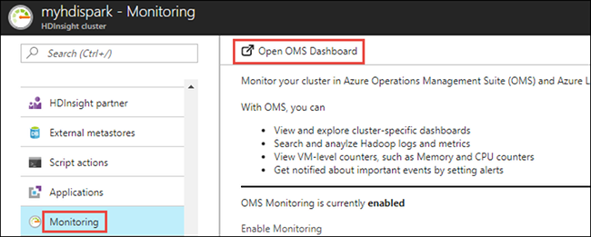
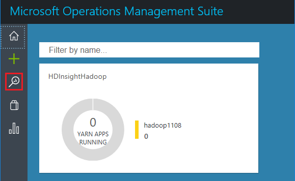
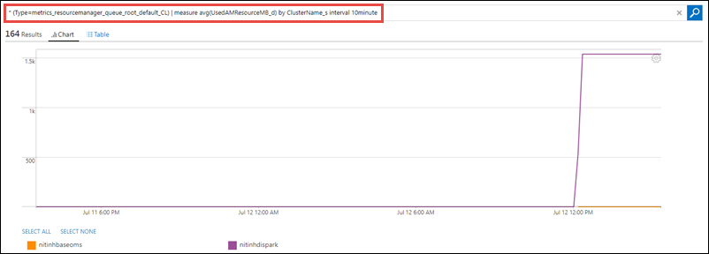
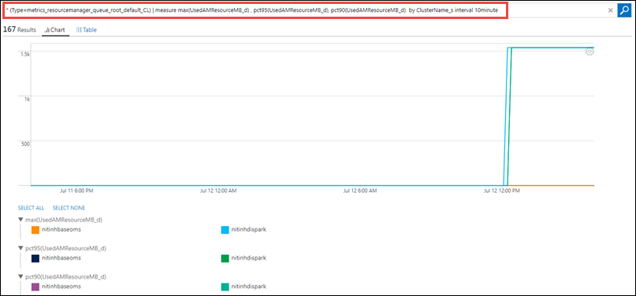
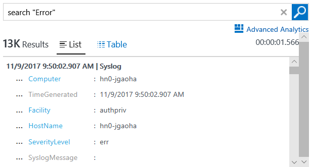
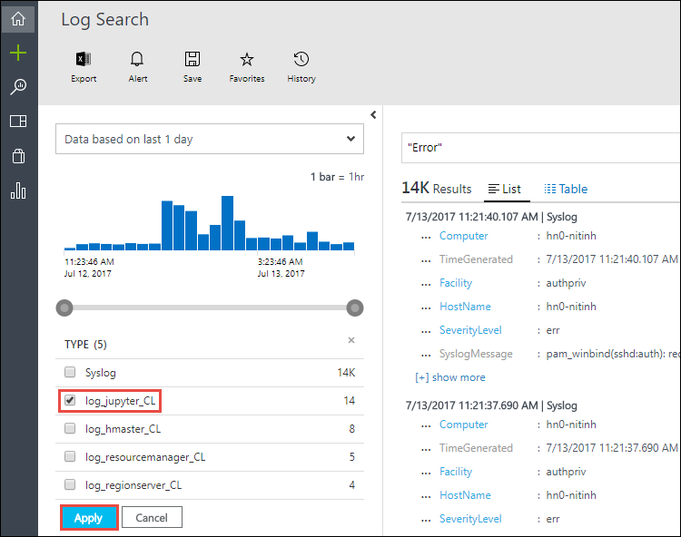

# Query Azure Log Analytics to monitor HDInsight clusters (Preview)

In this article you will look at some scenarios on how to use Azure Log Analytics with Azure HDInsight clusters. Three most common scenarios are:

* Analyze HDInsight cluster metrics in OMS
* Search specific log messages for HDInsight clusters
* Create alerts based on events ocurring in the clusters

## Prerequisites

* You must have configured an HDInsight cluster to use Azure Log Analytics. For instructions see [Use Azure Log Analytics with HDInsight clusters](hdinsight-hadoop-oms-log-analytics-tutorial.md).

* You must have add the HDInsight cluster-specific management solutions to the OMS workspace as described in [Add HDInsight cluster management solutions to Log Analytics](hdinsight-hadoop-oms-log-analytics-management-solutions.md).

## Analyze HDInsight cluster metrics in OMS

In this section we walk through the steps to look for specific metrics for your HDInsight cluster.

1. Open the OMS dashboard. In the Azure portal, open the HDInsight cluster blade that you associated with Azure Log Analytics, click the Monitoring tab, and the click **Open OMS Dashboard**.

    

2. In the OMS dashboard, from the home screen, click **Log Search**.

    

3. In the Log Search window, in the **Begin search here** text box, type `*` to search for all metrics for all available metrics for all HDInsight clusters configured to use Azure Log Analytics. Press ENTER.

    

4. You should see an output like the following.

    

5. From the left pane, under **Type** category, search a metric that you want to dig deep into. For this tutorial, let's pick `metrics_resourcemanager_queue_root_default_CL`. Select the checkbox corresponding to the metric, and then click **Apply**.

    > [!NOTE]
    > You might need to click the **[+]More** button to find the metric you are looking for. Also, the **Apply** button is at the bottom of the list so you must scroll down to see it.
    > 
    >    
    Notice that the query in the text box now changes to one shown in the highlighted box below.

    

6. You can now dig deeper into this specific metrics. For example, you can now refine the existing output based on the average of resources used in a 10 minute interval, categorized by cluster name. Type the following query in the query text box.

        * (Type=metrics_resourcemanager_queue_root_default_CL) | measure avg(UsedAMResourceMB_d) by ClusterName_s interval 10minute

    

7. Instead of refining based on the average of resources used, you can use the following query to refine the results based on when the maximum resources were used (as well as 90th and 95th percentile) in a 10 minute window.

        * (Type=metrics_resourcemanager_queue_root_default_CL) | measure max(UsedAMResourceMB_d) , pct95(UsedAMResourceMB_d), pct90(UsedAMResourceMB_d)  by ClusterName_s interval 10minute

    

## Search specific log messages in HDInsight clusters

In this section we walk through the steps to look error messages during a specific time window. The steps here are just one example on how you can arrive at the error message you are interested in. You can use any property that is available to look for the errors you are trying to find.

1. Open the OMS dashboard. In the Azure portal, open the HDInsight cluster blade that you associated with Azure Log Analytics, click the Monitoring tab, and the click **Open OMS Dashboard**.

    

2. In the OMS dashboard, from the home screen, click **Log Search**.

    

3. In the Log Search window, in the **Begin search here** text box, type `"Error"` (with the quotation marks) to search for all error messages for all HDInsight clusters configured to use Azure Log Analytics. Press ENTER.

    

4. You should see an output like the following.

    

5. From the left pane, under **Type** category, search an error type that you want to dig deep into. For this tutorial, let's pick `log_sparkappsexecutors_CL`. Select the checkbox corresponding to the metric, and then click **Apply**.

    

        
6. Notice that the query in the text box now changes to one shown in the highlighted box below and the results are refined to only show the error of the type you selected.

    

7. You can now dig deeper into this specific error list by using the options available in the left pane. For example, you can refine the query to only look at error messages from a specific worker node.

    

8. You can further zone in on the time you think the error occurred by selecting the relevant time value from the left pane.

    

9. You are now down to the specific error that you are looking for. You can click **[+]show more** to look at the actual error message.

    

## Create alerts to track events

The first step to create an alert is to arrive at a query based on which the alert is triggered. For simplicity, let's use the following query that provides list of failed applications running on HDInsight clusters.

    * (Type=metrics_resourcemanager_queue_root_default_CL) AppsFailed_d>0 

You can use any query that you want to create an alert.

1. Open the OMS dashboard. In the Azure portal, open the HDInsight cluster blade that you associated with Azure Log Analytics, click the Monitoring tab, and the click **Open OMS Dashboard**.

    

2. In the OMS dashboard, from the home screen, click **Log Search**.

    

3. In the Log Search window, in the **Begin search here** text box, paste the query on which you want to create an alert, press ENTER, and then click the **Alert** button.

    

4. In the **Add Alert Rule** window, enter the query and other details to create an alert, and then click **Save**.

    

    In this screenshot, we only send an e-mail notification if the alert query retrieves an output.

5. You can also edit or delete an existing alert. To do so, from any page in the OMS portal, click the **Settings** icon.

    

6. From the **Settings** page, click **Alerts** to see the alerts you have created. You can also enable or disable an alert, edit it, or delete it. For more information, see [Working with alert rules in Log Analytics](../log-analytics/log-analytics-alerts-creating.md).

## See also

* [Working with OMS Log Analytics](https://blogs.msdn.microsoft.com/wei_out_there_with_system_center/2016/07/03/oms-log-analytics-create-tiles-drill-ins-and-dashboards-with-the-view-designer/)
* [Create alert rules in Log Analytics](../log-analytics/log-analytics-alerts-creating.md)
