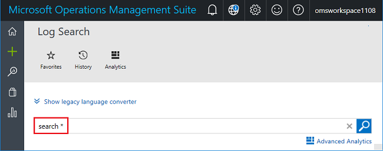
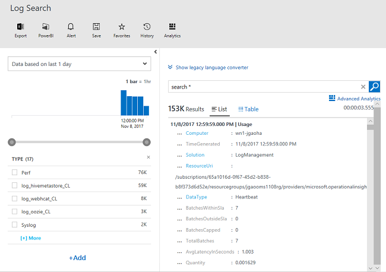
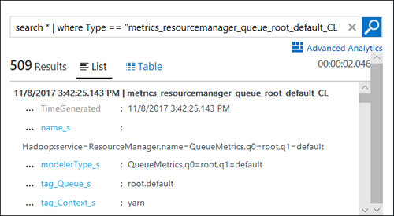
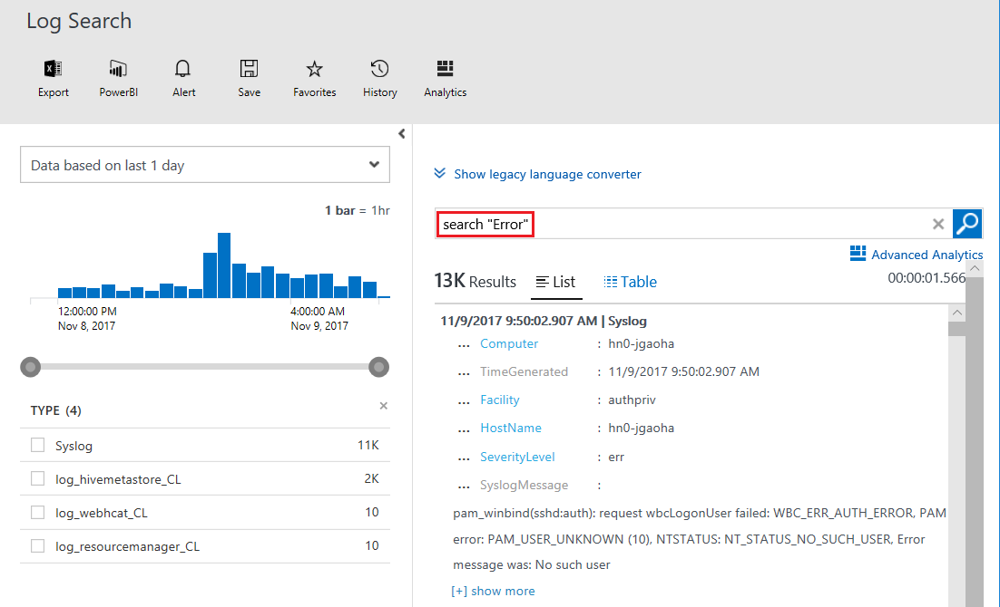
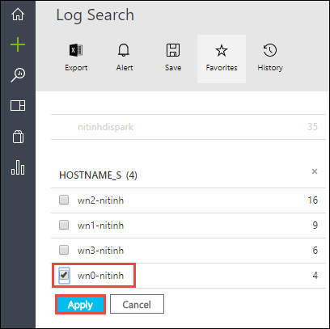
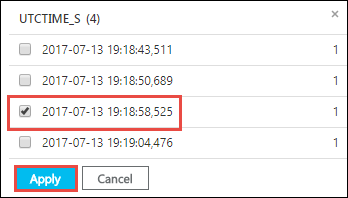
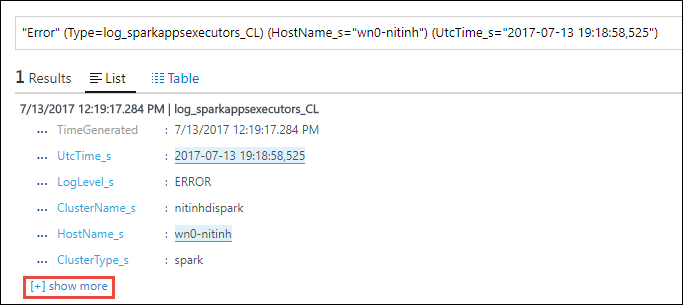
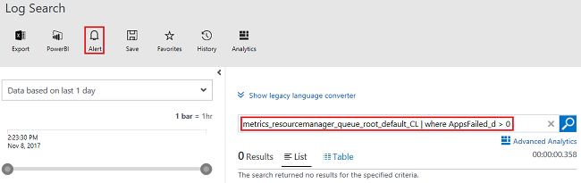
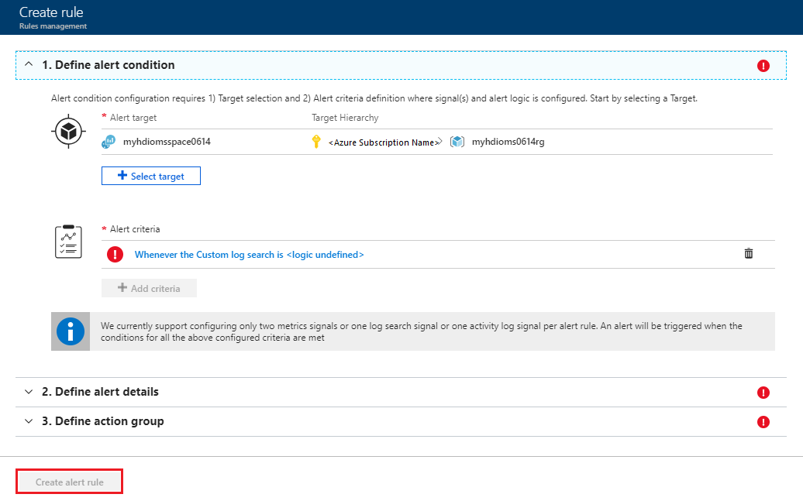

# Query Azure Monitor logs to monitor HDInsight clusters

Learn some basic scenarios on how to use Azure Monitor logs to monitor Azure HDInsight clusters:

* [Analyze HDInsight cluster metrics](#analyze-hdinsight-cluster-metrics)
* [Search for specific log messages](#search-for-specific-log-messages)
* [Create event alerts](#create-alerts-for-tracking-events)

[!INCLUDE [azure-monitor-log-analytics-rebrand](../../includes/azure-monitor-log-analytics-rebrand.md)]

## Prerequisites

* You must have configured an HDInsight cluster to use Azure Monitor logs, and added the HDInsight cluster-specific Azure Monitor logs monitoring solutions to the workspace. For instructions, see [Use Azure Monitor logs with HDInsight clusters](hdinsight-hadoop-oms-log-analytics-tutorial.md).

## Analyze HDInsight cluster metrics

Learn how to look for specific metrics for your HDInsight cluster.

1. Open the Log Analytics workspace that is associated to your HDInsight cluster from the Azure portal.
2. Select the **Log Search** tile.
3. Type the following query in the search box to search for all metrics for all available metrics for all HDInsight clusters configured to use Azure Monitor logs, and then select **RUN**.

        search *

    

    The output shall look like:

    

5. From the left pane, under **Type**, select a metric that you want to dig deep into, and then select **Apply**. The following screenshot shows the `metrics_resourcemanager_queue_root_default_CL` type is selected.

    > [!NOTE]  
    > You may need to select the **[+]More** button to find the metric you are looking for. Also, the **Apply** button is at the bottom of the list so you must scroll down to see it.

    Notice that the query in the text box changes to one shown in the highlighted box in the following screenshot:

    

6. To dig deeper into this specific metric. For example, you can refine the existing output based on the average of resources used in a 10-minute interval, categorized by cluster name using the following query:

        search in (metrics_resourcemanager_queue_root_default_CL) * | summarize AggregatedValue = avg(UsedAMResourceMB_d) by ClusterName_s, bin(TimeGenerated, 10m)

7. Instead of refining based on the average of resources used, you can use the following query to refine the results based on when the maximum resources were used (as well as 90th and 95th percentile) in a 10-minute window:

        search in (metrics_resourcemanager_queue_root_default_CL) * | summarize ["max(UsedAMResourceMB_d)"] = max(UsedAMResourceMB_d), ["pct95(UsedAMResourceMB_d)"] = percentile(UsedAMResourceMB_d, 95), ["pct90(UsedAMResourceMB_d)"] = percentile(UsedAMResourceMB_d, 90) by ClusterName_s, bin(TimeGenerated, 10m)

## Search for specific log messages

Learn how to  look error messages during a specific time window. The steps here are just one example on how you can arrive at the error message you are interested in. You can use any property that is available to look for the errors you are trying to find.

1. Open the Log Analytics workspace that is associated to your HDInsight cluster from the Azure portal.
2. Select the **Log Search** tile.
3. Type the following query to search for all error messages for all HDInsight clusters configured to use Azure Monitor logs, and then select **RUN**. 

         search "Error"

    You shall see an output like the following output:

    

4. From the left pane, under **Type** category, select an error type that you want to dig deep into, and then select **Apply**.  Notice the results are refined to only show the error of the type you selected.
5. You can dig deeper into this specific error list by using the options available in the left pane. For example:

    - To see error messages from a specific worker node:

        

    - To see an error occurred at a certain time:

        

6. To see the specific error. You can select **[+]show more** to look at the actual error message.

    

## Create alerts for tracking events

The first step to create an alert is to arrive at a query based on which the alert is triggered. You can use any query that you want to create an alert.

1. Open the Log Analytics workspace that is associated to your HDInsight cluster from the Azure portal.
2. Select the **Log Search** tile.
3. Run the following query on which you want to create an alert, and then select **RUN**.

        metrics_resourcemanager_queue_root_default_CL | where AppsFailed_d > 0

    The query provides list of failed applications running on HDInsight clusters.

4. Select **New Alert Rule** on the top of the page.

    

5. In the **Create rule** window, enter the query and other details to create an alert, and then select **Create alert rule**.

    

To edit or delete an existing alert:

1. Open the Log Analytics workspace from the Azure portal.
2. From the left menu, select **Alert**.
3. Select the alert you want to edit or delete.
4. You have the following options: **Save**, **Discard**, **Disable**, and **Delete**.

    

For more information, see [Create, view, and manage metric alerts using Azure Monitor](../azure-monitor/platform/alerts-metric.md).

## See also

* [Create custom views by using View Designer in Azure Monitor](../azure-monitor/platform/view-designer.md)
* [Create, view, and manage metric alerts using Azure Monitor](../azure-monitor/platform/alerts-metric.md)
