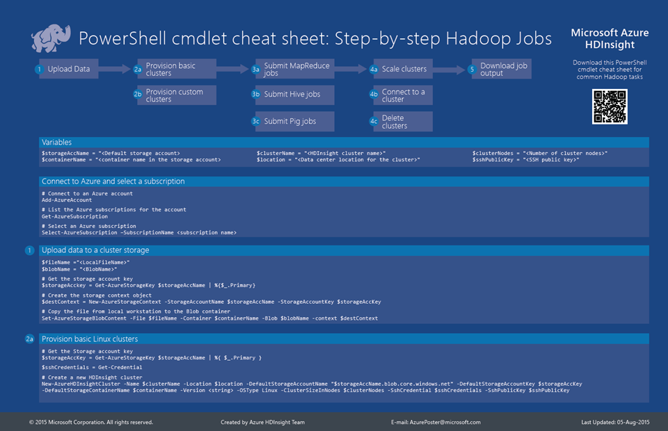

<properties 
	pageTitle="HDInsight Hadoop PowerShell Cmdlet Cheat Sheet | Microsoft Azure" 
	description="A downloadable HDInsight Hadoop powershell cmdlet cheat sheet that can help you perform standard Hadoop tasks in Azure HDInsight."
	services="hdinsight" 
	documentationCenter="" 
	authors="nitinme" 
	manager="paulettm" 
	editor="cgronlun"/>

<tags 
	ms.service="hdinsight" 
	ms.workload="big-data" 
	ms.tgt_pltfrm="na" 
	ms.devlang="na" 
	ms.topic="article" 
	ms.date="08/07/2015" 
	ms.author="nitinme"/>

# Microsoft Azure HDInsight PowerShell cmdlet cheat sheet for common Hadoop tasks

Microsoft Azure HDInsight provides PowerShell cmdlets to perform Hadoop tasks on a cluster. The **Microsoft Azure HDInsight PowerShell Cmdlet Cheat Sheet** is designed to provide you with PowerShell cmdlets for the most common Hadoop tasks such as create a cluster, run jobs, delete a cluster, etc. The cheat sheet also provides a list of all the PowerShell cmdlets available for Microsoft Azure HDInsight.

## HDInsight cheat sheet: Service Management model

**Download the cheat sheet here: [Microsoft Azure HDInsight PowerShell Cmdlet Cheat Sheet](http://download.microsoft.com/download/B/7/D/B7DBB509-164D-4343-9894-12D1FB053776/HDI_PowerShell_Cmdlet_CheatSheet.pdf)**

**Look at the Microsoft Azure HDInsight PowerShell reference document: [Azure HDInsight PowerShell reference](https://msdn.microsoft.com/library/azure/dn858087.aspx)**

## See also

* [Learning path for HDInsight](http://azure.microsoft.com/documentation/learning-paths/hdinsight-self-guided-hadoop-training/)
