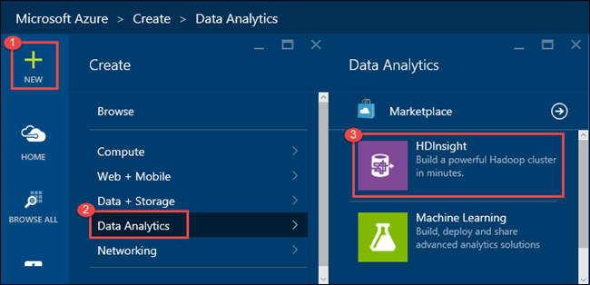
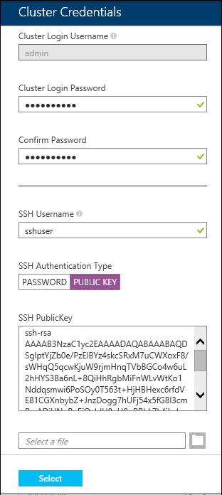
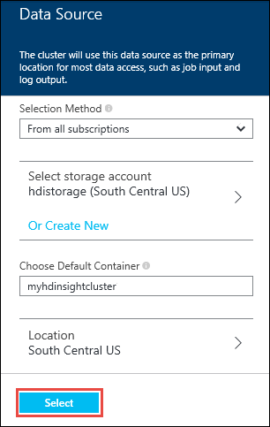
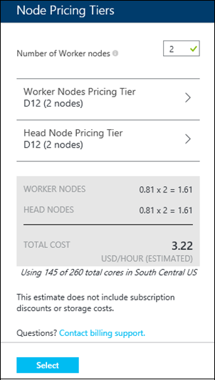
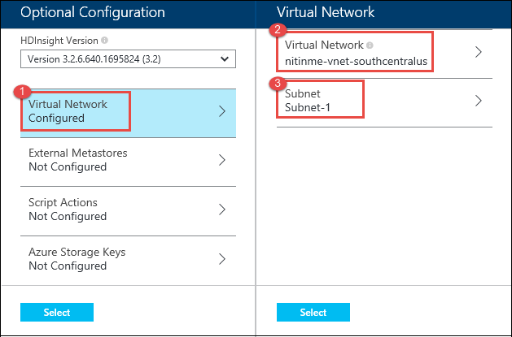
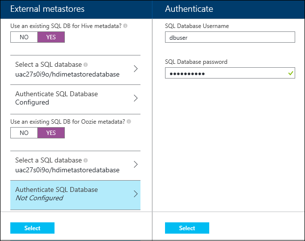
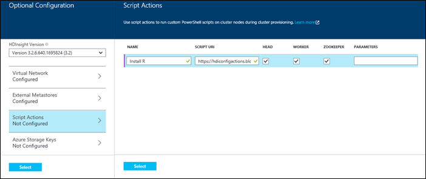

<properties
   	pageTitle="Create Hadoop, HBase, or Storm clusters on Linux in HDInsight | Microsoft Azure"
   	description="Learn how to create Hadoop, HBase, or Storm clusters on Linux for HDInsight using a browser, the Azure CLI, Azure PowerShell, REST, or through an SDK."
   	services="hdinsight"
   	documentationCenter=""
   	authors="nitinme"
   	manager="paulettm"
   	editor="cgronlun"
	tags="azure-portal"/>

<tags
   	ms.service="hdinsight"
   	ms.devlang="na"
   	ms.topic="article"
   	ms.tgt_pltfrm="na"
   	ms.workload="big-data"
   	ms.date="09/21/2015"
   	ms.author="nitinme"/>

#Create Linux-based clusters in HDInsight

In this document, you will learn about the different ways to create a Linux-based HDInsight cluster on Azure, as well as optional configurations that can be used with your cluster. HDInsight provides Apache Hadoop, Apache Storm, and Apache HBase as services on the Azure cloud platform.

> [AZURE.NOTE] This document provides instructions on the different ways to provision a cluster. If you are looking at a quick-start approach to provision a cluster, see [Get Started with Azure HDInsight on Linux](../hdinsight-hadoop-linux-get-started.md).

## What is an HDInsight cluster?

HDInsight is an Azure service that provides a variety of open source big data technologies as a service on the Azure platform. The base of any HDInsight cluster is Apache Hadoop, which enables distributed processing of large data. 

A cluster consists of multiple compute instances (called nodes,) and processing is spread across different nodes of a cluster. The cluster has a master/worker architecture with a master node (also called a head node or name node) and any number of worker nodes (also called data nodes). For more information, see <a href="http://go.microsoft.com/fwlink/?LinkId=510084" target="_blank">Apache Hadoop</a>.

![HDInsight Cluster][img-hdi-cluster]

An HDInsight cluster abstracts the Hadoop implementation details so that you don't need to worry about how to communicate with different nodes of a cluster. When you create an HDInsight cluster, Azure provisions compute resources that contain Hadoop and related applications. For more information, see [Introduction to Hadoop in HDInsight](hdinsight-hadoop-introduction.md). The data used by the cluster is stored in Azure Blob storage. For more information, see [Use Azure Blob storage with HDInsight](../hdinsight-use-blob-storage.md).

**Prerequisites**

Before you begin this article, you must have the following:

- **An Azure subscription**. See [Get Azure free trial](http://azure.microsoft.com/documentation/videos/get-azure-free-trial-for-testing-hadoop-in-hdinsight/).
- **Secure Shell (SSH) keys**. If you want to remote into a Linux cluster by using SSH with a key instead of a password. Using a key is the recommended method as it is more secure. For instructions on how to generate SSH keys, refer to the following articles:
	-  From a Linux computer - [Use SSH with Linux-based HDInsight (Hadoop) from Linux, Unix, or OS X](hdinsight-hadoop-linux-use-ssh-unix.md).
	-  From a Windows computer - [Use SSH with Linux-based HDInsight (Hadoop) from Windows](hdinsight-hadoop-linux-use-ssh-windows.md).

## Configuration options

###Cluster type

Cluster type allows you to select special purpose configurations for the cluster. The following are the types available for Linux-based HDInsight:

| Cluster type | Use this if you... | 

### Additional storage

During configuration, you must specify an Azure Blob storage account and a default container. This is used as the default storage location by the cluster. Optionally, you can specify additional blobs that will also be associated with your cluster.

For more information on using secondary blob stores, see [Using Azure Blob storage with HDInsight](../hdinsight-use-blob-storage.md).

### Metastore

The metastore contains information about Hive tables, partitions, schemas, columns, etc. This information is used by Hive to locate where data is stored in Hadoop Distributed File System (HDFS), or Azure Blob storage for HDInsight. By default, Hive uses an embedded database to store this information.

When provisioning an HDInsight cluster, you can specify a SQL database that will contain the metastore for Hive. This allows the metadata information to be preserved when you delete a cluster, as it is stored externally in the SQL database. For instructions on how to create a SQL database in Azure, see [Create your first Azure SQL Database](sql-database-get-started.md).

### Customize clusters using Script action

You can install additional components or customize cluster configuration by using scripts during provisioning. Such scripts are invoked via **Script Action**. For more information, see [Customize HDInsight cluster using Script Action](hdinsight-hadoop-customize-cluster-linux.md).

> [AZURE.IMPORTANT] Adding additional components after a cluster has been provisioned is not supported, as these components will not be available after a cluster node is reimaged. Components installed through script actions are reinstalled as part of the reimaging process.

### Use Azure virtual networks

[Azure Virtual Network](http://azure.microsoft.com/documentation/services/virtual-network/) allows you to create a secure, persistent network containing the resources you need for your solution. A virtual network allows you to:

* Connect cloud resources together in a private network (cloud-only).

	

* Connect your cloud resources to your local data-center network (site-to-site or point-to-site) by using a virtual private network (VPN).

	Site-to-site configuration allows you to connect multiple resources from your data center to the Azure virtual network by using a hardware VPN or the Routing and Remote Access Service.

	

	Point-to-site configuration allows you to connect a specific resource to the Azure virtual network by using a software VPN.

	

For more information on Virtual Network features, benefits, and capabilities, see the [Azure Virtual Network overview](http://msdn.microsoft.com/library/azure/jj156007.aspx).

> [AZURE.NOTE] You must create the Azure virtual network before provisioning a cluster. For more information, see [How to create a Virtual Network](virtual-networks-create-vnet.md).
>
> Azure HDInsight only supports location-based Virtual Networks, and does not currently work with Affinity Group-based Virtual Networks. Use Azure PowerShell cmdlet Get-AzureVNetConfig to check whether an existing Azure virtual network is location-based. If your virtual network is not location-based, you have the following options:
>
> - Export the existing Virtual Network configuration and then create a new Virtual Network. All new Virtual Networks are by default, location-based.
> - Migrate to a location-based Virtual Network.  See [Migrate existing services to regional scope](http://azure.microsoft.com/blog/2014/11/26/migrating-existing-services-to-regional-scope/).
>
> It is highly recommended to designate a single subnet for one cluster.
>
> Currently (8/25/2015,) you can only provision one Linux-based cluster in an Azure Virtual Network.
>
> You cannot use a v1 (Classic,) Azure Virtual Network with Linux-based HDInsight. The Virtual Network must be v2 (Azure Resource Manager,) in order for it to be listed as an option during the HDInsight cluster creation process in the Azure preview portal, or to be usable when creating a cluster from the Azure CLI or Azure PowerShell.
>
> If you have resources on a v1 network, and you wish to make HDInsight directly accessible to those resources through a virtual network, see [Connecting classic VNets to new VNets](../virtual-network/virtual-networks-arm-asm-s2s.md) for information on how to connect a v2 Virtual Network to a v1 Virtual Network. Once this connection is established, you can create the HDInsight cluster in the v2 Virtual Network.

##  Options for provisioning an HDInsight Linux cluster

You can provision an HDInsight Hadoop Linux cluster from a Linux computer as well as a Windows-based computer. The following table provides information on the provisioning options available from the different operating systems, and links to instructions for each.

Provision Linux clusters from a computer running this OS | Using the Azure portal | Using Azure CLI | Using Azure PowerShell | Using the .NET SDK
-----------------| --------| ------------------------| -------------------| ---------- | ---------
Linux| Click [here](#portal) | Click [here](#cli) | Not applicable | Not applicable
Mac OS X | Click [here](#portal) | Click [here](#cli) | Not applicable | Not applicable
Windows | Click [here](#portal) | Click [here](#cli) | Click [here](#powershell) | Click [here](#sdk)

###  Using the Azure portal

HDInsight clusters use an Azure Blob storage container as the default file system. An Azure Storage account located in the same datacenter is required before you can create an HDInsight cluster. For more information, see [Use Azure Blob storage with HDInsight](../hdinsight-use-blob-storage.md). For details on creating an Azure Storage account, see [How to Create a Storage Account](../storage-create-storage-account.md).

> [AZURE.NOTE] Currently, only the **Southeast Asia**, **North Europe**, **East US**, and **South Central US** regions can host HDInsight Linux clusters.

**To create an HDInsight cluster**

1. Sign in to the [Azure Preview Portal](https://portal.azure.com).
2. Click **NEW**, Click **Data Analytics**, and then click **HDInsight**.

    

3. Enter a **Cluster Name**, select **Hadoop** for the **Cluster Type**, and from the **Cluster Operating System** drop-down, select **Ubuntu**. A green check will appear beside the cluster name if it is available.

	> [AZURE.NOTE] To provision HBase or Storm clusters, select the approprite value for the **Cluster Type** drop-down.

	

4. If you have more than one subscription, click the **Subscription** entry to select the Azure subscription that will be used for the cluster.

5. Click **Resource Group** to see a list of existing resource groups and then select the one to create the cluster in. Or, you can click **Create New** and then enter the name of the new resource group. A green check will appear to indicate if the new group name is available.

	> [AZURE.NOTE] This entry will default to one of your existing resource groups, if any are available.

6. Click **Credentials** and then enter a password for the admin user. You must also enter an **SSH Username** and either a **PASSWORD** or **PUBLIC KEY**, which will be used to authenticate the SSH user. Using a public key is the recommended approach. Click **Select** at the bottom to save the credentials configuration.

	

	For more information on using SSH with HDInsight, see one of the following articles:

	* [Use SSH with Linux-based Hadoop on HDInsight from Linux, Unix, or OS X](hdinsight-hadoop-linux-use-ssh-unix.md)
	* [Use SSH with Linux-based Hadoop on HDInsight from Windows](hdinsight-hadoop-linux-use-ssh-windows.md)

7. Click **Data Source** to choose an existing data source for the cluster, or create a new one.

	

	Currently you can select an Azure Storage Account as the data source for an HDInsight cluster. Use the following to understand the entries on the **Data Source** blade.

	- **Selection Method**: Set this to **From all subscriptions** to enable browsing of storage accounts from all your subscriptions. Set this to **Access Key** if you want to enter the **Storage Name** and **Access Key** of an existing storage account.

	- **Select storage account / Create New**: Click **Select storage account** to browse and select an existing storage account you want to associate with the cluster. Or, click **Create New** to create a new storage account. Use the field that appears to enter the name of the storage account. A green check will appear if the name is available.

	- **Choose Default Container**: Use this to enter the name of the default container to use for the cluster. While you can enter any name here, we recommend using the same name as the cluster so that you can easily recognize that the container is used for this specific cluster.

	- **Location**: The geographic region that the storage account is in, or will be created in.

		> [AZURE.IMPORTANT] Selecting the location for the default data source will also set the location of the HDInsight cluster. The cluster and default data source must be located in the same region.

	Click **Select** to save the data source configuration.

8. Click **Node Pricing Tiers** to display information about the nodes that will be created for this cluster. Set the number of worker nodes that you need for the cluster. The estimated cost of the cluster will be shown within the blade.

	

	Click **Select** to save the node pricing configuration.

9. Click **Optional Configuration** to select the cluster version, as well as configure other optional settings such as joining a **Virtual Network**, setting up an **External Metastore** to hold data for Hive and Oozie, use Script Actions to customize a cluster to install custom components, or use additional storage accounts with the cluster.

	* Click the **HDInsight Version** drop-down and select the version you want to use for the cluster. For more information, see [HDInsight cluster versions](hdinsight-component-versioning.md).

	* **Virtual Network**: Select an Azure virtual network and the subnet if you want to place the cluster into a virtual network.  

		

    	>[AZURE.NOTE] Windows based HDInsight cluster can only be placed into a classical virtual network.

	* Click **External Metastores** to specify SQL database that you want to use to save Hive and Oozie metadata associated with the cluster.

		

		For **Use an existing SQL DB for Hive** metadata, click **Yes**, select a SQL database, and then provide the username/password for the database. Repeat these steps if you want to **Use an existing SQL DB for Oozie metadata**. Click **Select** till you are back on the **Optional Configuration** blade.

		>[AZURE.NOTE] The Azure SQL database used for the metastore must allow connectivity to other Azure services, including Azure HDInsight. On the Azure SQL database dashboard, on the right side, click the server name. This is the server on which the SQL database instance is running. Once you are on the server view, click **Configure**, and then for **Azure Services**, click **Yes**, and then click **Save**.

	* **Script Actions** if you want to use a custom script to customize a cluster, as the cluster is being created. For more information about script actions, see [Customize HDInsight clusters using Script Action](hdinsight-hadoop-customize-cluster-linux.md). On the Script Actions blade provide the details as shown in the screen capture.

		

	* Click **Azure Storage Keys** to specify additional storage accounts to associate with the cluster. In the **Azure Storage Keys** blade, click **Add a storage key**, and then select an existing storage account or create a new account.

		

		Click **Select** till you are back on the **New HDInsight cluster** blade.

10. On the **New HDInsight Cluster** blade, ensure that **Pin to Startboard** is selected, and then click **Create**. This will create the cluster and add a tile for it to the Startboard of your Azure Portal. The icon will indicate that the cluster is provisioning, and will change to display the HDInsight icon once provisioning has completed.

	| While provisioning | Provisioning complete |
	| ------------------ | --------------------- |
	|  |  |

	> [AZURE.NOTE] It will take some time for the cluster to be created, usually around 15 minutes. Use the tile on the Startboard, or the **Notifications** entry on the left of the page to check on the provisioning process.

11. Once the provisioning completes, click the tile for the cluster from the Startboard to launch the cluster blade. The cluster blade provides essential information about the cluser such as the name, the resource group it belongs to, the location, the operating system, URL for the cluster dashboard, etc.

	

	Use the following to understand the icons at the top of this blade, and in the **Essentials** section:

	* **Settings** and **All Settings**: Displays the **Settings** blade for the cluster, which allows you to access detailed configuration information for the cluster.

	* **Dashboard**, **Cluster Dashboard**, and **URL**: These are all ways to access the cluster dashboard, which is a Web portal to run jobs on the cluster.

	* **Secure Shell**: Information needed to access the cluster using SSH.

	* **Delete**: Deletes the HDInsight cluster.

	* **Quickstart** (): Displays information that will help you get started using HDInsight.

	* **Users** (): Allows you to set permissions for _portal management_ of this cluster for other users on your Azure subscription.

		> [AZURE.IMPORTANT] This _only_ affects access and permissions to this cluster in the Azure preview portal, and has no effect on who can connect to or submit jobs to the HDInsight cluster.

	* **Tags** (): Tags allows you to set key/value pairs to define a custom taxonomy of your cloud services. For example, you may create a key named __project__, and then use a common value for all services associated with a specific project.

###  Using Azure CLI

The Azure CLI is a cross-platform command-line utility that allows you to manage Azure Services. It can be used, along with Azure Resource management templates, to provision an HDInsight cluster, along with associated storage accounts and other services.

Azure Resource Management templates are JSON documents that describe a __resource group__ and all resources in it (such as HDInsight.) This template based approach allows you to define all the resources that you need for HDInsight in one template, and to manage changes to the group as a whole through __deployments__ that apply changes to the group.

The following steps walk through the process of creating a new HDInsight cluster using the Azure CLI and a template:

1. If it is not already installed, follow the steps in the [Install and configure the Azure CLI](../xplat-cli-install.md) document.

2. From a command-line, terminal, or shell, use the following command to authenticate to your Azure subscription:

        azure login

    You will be prompted to provide your name and password. If you have multiple Azure subscriptions, you can use `azure account set <subscriptionname>` to set the subscription that the Azure CLI commands will use.

3. Switch to Azure Resource Manager mode using the following command:

        azure config mode arm

4. Create a template for your HDInsight cluster. The following are some basic example templates:

    * [Linux-based cluster, using an SSH public key](https://github.com/matt1883/azure-quickstart-templates/tree/master/hdinsight-linux-sshpublickey)
    * [Linux-based cluster, using a password for the SSH account](https://github.com/matt1883/azure-quickstart-templates/tree/master/hdinsight-linux-sshpassword)

    Both of these templates also create the default Azure Storage Account used by HDInsight.

    The files you will need are the __azuredeploy.json__ and __azuredeploy.parameters.json__.

5. Open the __azuredeploy.parameters.json__ file in an editor, and provide values for the items in the `parameters` section:

    * __location__: The data center that the resources will be created in. You can view the `location` section in the __azuredeploy.json__ file for a list of allowed locations.
    * __clusterName__: The name of the HDInsight cluster. This name must be unique, or the deployment will fail.
    * __clusterStorageAccountName__: The name of the Azure Storage Account that will be created for the HDInsight cluster. This name must be unique, or the deployment will fail.
    * __clusterLoginPassword__: The password for the cluster admin user. This should be a secure password, as it is used to access web sites and REST services on the cluster.
    * __sshUserName__: The name of the first SSH user to create for this cluster. SSH will be used to remotely access the cluster using this account. The name must be unique, and cannot be the name of an account already in use on the cluster. Invalid names include root, storm, and hbase.
    * __sshPublicKey__: If you are using the template that requires an SSH public key, you must add your public key on this line. For more information on generating and working with public keys, see the following articles:

        * [Use SSH with Linux-based Hadoop on HDInsight from Linux, Unix, or OS X](hdinsight-hadoop-linux-use-ssh-unix.md)
        * [Use SSH with Linux-based Hadoop on HDInsight from Windows](hdinsight-hadoop-linux-use-ssh-windows.md)

    * __sshPassword__: If you are using the template that requires an SSH password, you must add a password on this line.

    Once you are done, save and close the file.

5. Use the following to create an empty resource group. Replace __RESOURCEGROUPNAME__ with the name you wish to use for this group. Replace __LOCATION__ with the data center that the group should be created in:

        azure group create RESOURCEGROUPNAME LOCATION
    
    > [AZURE.NOTE] If the location name contains spaces, put it in double quotes. For example "South Central US".

6. Use the following command to create the initial deployment for this resource group. Replace __PATHTOTEMPLATE__ with the path to the __azuredeploy.json__ template file. Replace __PATHTOPARAMETERSFILE__ with the path to the __azuredeploy.parameters.json__ file. Replace __RESOURCEGROUPNAME__ with the name of the group you created in the previous step:

        azure group deployment create -f PATHTOTEMPLATE -e PATHTOPARAMETERSFILE -g RESOURCEGROUPNAME -n InitialDeployment

    Once the deployment has been accepted, you should see a message similar to `group deployment create command ok`.

7. It may take some time for the deployment to complete, around 15 minutes. you can view information about the deployment using the following command. Replace __RESOURCEGROUPNAME__ with the name of the resource group used in the previous step:

        azure group log show -l RESOURCEGROUPNAME

    If a failure occurs during deployment, you can get more information on the failure using the following command

        azure group log show -l -v RESOURCEGROUPNAME

###  Using Azure PowerShell

Azure PowerShell is a powerful scripting environment that you can use to control and automate the deployment and management of your workloads in Azure. This section provides instructions on how to provision an HDInsight cluster by using Azure PowerShell. For information on configuring a workstation to run HDInsight Windows PowerShell cmdlets, see [Install and configure Azure PowerShell](../install-configure-powershell.md). For more information on using Azure PowerShell with HDInsight, see [Administer HDInsight using PowerShell](hdinsight-administer-use-powershell.md). For the list of the HDInsight Windows PowerShell cmdlets, see [HDInsight cmdlet reference](https://msdn.microsoft.com/library/azure/dn858087.aspx).

The following procedures are needed to provision an HDInsight cluster by using Azure PowerShell:

- Create an Azure resource group
- Create an Azure Storage account
- Create an Azure Blob container
- Create an HDInsight cluster

The two most important parameters that you must set to provision Linux clusters are the ones where you specify the OS type and the SSH user details:

- Make sure you specify the **-OSType** parameter as **Linux**.
- To use SSH for remote sessions on the clusters, you can specify either SSH user password or the SSH public key. If you specify both the SSH user password and the SSH public key, the key will be ignored. If you want to use the SSH key for remote sessions, you must specify a blank SSH password when prompted for one. For more information on using SSH with HDInsight, see one of the following articles:

	* [Use SSH with Linux-based Hadoop on HDInsight from Linux, Unix, or OS X](hdinsight-hadoop-linux-use-ssh-unix.md)
	* [Use SSH with Linux-based Hadoop on HDInsight from Windows](hdinsight-hadoop-linux-use-ssh-windows.md)

			# Use the new Azure Resource Manager mode
			Switch-AzureMode AzureResourceManager

			###########################################
			# Create required items, if none exist
			###########################################

			# Sign in
			Add-AzureAccount

			# Select the subscription to use
			$subscriptionName = "<SubscriptionName>"        # Provide your Subscription Name
			Select-AzureSubscription -SubscriptionName $subscriptionName

			# Register your subscription to use HDInsight
			Register-AzureProvider -ProviderNamespace "Microsoft.HDInsight" -Force

			# Create an Azure Resource Group
			$resourceGroupName = "<ResourceGroupName>"      # Provide a Resource Group name
			$location = "<Location>"                        # For example, "West US"
			New-AzureResourceGroup -Name $resourceGroupName -Location $location

			# Create an Azure Storage account
			$storageAccountName = "<StorageAcccountName>"   # Provide a Storage account name
			New-AzureStorageAccount -ResourceGroupName $resourceGroupName -StorageAccountName $storageAccountName -Location $location -Type Standard_GRS

			# Create an Azure Blob Storage container
			$containerName = "<ContainerName>"              # Provide a container name
			$storageAccountKey = Get-AzureStorageAccountKey -Name $storageAccountName -ResourceGroupName $resourceGroupName | %{ $_.Key1 }
			$destContext = New-AzureStorageContext -StorageAccountName $storageAccountName -StorageAccountKey $storageAccountKey
			New-AzureStorageContainer -Name $containerName -Context $destContext

			###########################################
			# Create an HDInsight Cluster
			###########################################

			# Skip these variables if you just created them
			$resourceGroupName = "<ResourceGroupName>"      # Provide the Resource Group name
			$storageAccountName = "<StorageAcccountName>"   # Provide the Storage account name
			$containerName = "<ContainerName>"              # Provide the container name
			$storageAccountKey = Get-AzureStorageAccountKey -Name $storageAccountName -ResourceGroupName $resourceGroupName | %{ $_.Key1 }

			# Set these variables
			$clusterName = $containerName           		# As a best practice, have the same name for the cluster and container
			$clusterNodes = <ClusterSizeInNodes>    		# The number of nodes in the HDInsight cluster
			$credentials = Get-Credential
			$sshCredentials = Get-Credential

			# The location of the HDInsight cluster. It must be in the same data center as the Storage account.
			$location = Get-AzureStorageAccount -ResourceGroupName $resourceGroupName -StorageAccountName $storageAccountName | %{$_.Location}

			# Create a new HDInsight cluster
			New-AzureHDInsightCluster -ClusterName $clusterName -ResourceGroupName $resourceGroupName -HttpCredential $credentials -Location $location -DefaultStorageAccountName "$storageAccountName.blob.core.windows.net" -DefaultStorageAccountKey $storageAccountKey -DefaultStorageContainer $containerName  -ClusterSizeInNodes $clusterNodes -ClusterType Hadoop -OSType Linux -Version "3.2" -SshCredential $sshCredentials

>[AZURE.NOTE] The values you specify for **$clusterCredentials** are used to create the Hadoop user account for the cluster. You will use this account to connect to the cluster. The values you specify for the **$sshCredentials** are used to create the SSH user for the cluster. You use this account to start a remote SSH session on the cluster and run jobs. If you use the Quick Create option from the Azure portal to provision a cluster, the default Hadoop user name is "admin" and default SSH user name is "hdiuser".

It can take several minutes before the cluster provisioning finishes.

![HDI.CLI.Provision][image-hdi-ps-provision]

### Using the HDInsight .NET SDK
The HDInsight .NET SDK provides .NET client libraries that make it easier to work with HDInsight from a .NET Framework application. Follow the instructions below to create a Visual Studio console application and paste the code for creating a cluster.

**To create a Visual Studio console application**

1. Open Visual Studio 2013 or 2015.
2. Create a new Visual Studio project with the following settings

	|Property|Value|
	|--------|-----|
	|Template|Templates/Visual C#/Windows/Console Application|
	|Name|CreateHDICluster|

5. From the **Tools** menu, click **Nuget Package Manager**, and then click **Package Manager Console**.
6. Run the following command in the console to install the packages:

		Install-Package Microsoft.Azure.Common.Authentication -pre
		Install-Package Microsoft.Azure.Management.HDInsight -Pre

	These commands add .NET libraries and references to them to the current Visual Studio project.

6. From Solution Explorer, double-click **Program.cs** to open it, paste the following code, and provide values for the variables:

		using Microsoft.Azure;
		using Microsoft.Azure.Common.Authentication;
		using Microsoft.Azure.Common.Authentication.Factories;
		using Microsoft.Azure.Common.Authentication.Models;
		using Microsoft.Azure.Management.HDInsight;
		using Microsoft.Azure.Management.HDInsight.Models;

		namespace CreateHDICluster
		{
		    internal class Program
		    {
		        private static HDInsightManagementClient _hdiManagementClient;
		
		        private static Guid SubscriptionId = new Guid("<AZURE SUBSCRIPTION ID>");
		        private const string ResourceGroupName = "<AZURE RESOURCEGROUP NAME>";

		        private const string NewClusterName = "<HDINSIGHT CLUSTER NAME>";
		        private const int NewClusterNumNodes = <NUMBER OF NODES>;
		        private const string NewClusterLocation = "<LOCATION>";  // Must match the Azure Storage account location
		        private const string NewClusterVersion = "3.2";
		        private const HDInsightClusterType NewClusterType = HDInsightClusterType.Hadoop;
		        private const OSType NewClusterOSType = OSType.Windows;

		        private const string ExistingStorageName = "<STORAGE ACCOUNT NAME>.blob.core.windows.net";
		        private const string ExistingStorageKey = "<STORAGE ACCOUNT KEY>";
		        private const string ExistingContainer = "<DEFAULT CONTAINER NAME>"; 

		        private const string NewClusterUsername = "admin";
		        private const string NewClusterPassword = "<HTTP USER PASSWORD>";

		        private const string NewClusterSshUserName = "sshuser";
		        private const string NewClusterSshPublicKey = @"---- BEGIN SSH2 PUBLIC KEY ----
					Comment: ""rsa-key-20150731""
					AAAAB3NzaC1yc2EAAAABJQAAAQEA4QiCRLqT7fnmUA5OhYWZNlZo6lLaY1c+IRsp
					gmPCsJVGQLu6O1wqcxRqiKk7keYq8bP5s30v6bIljsLZYTnyReNUa5LtFw7eauGr
					yVt3Pve6ejfWELhbVpi0iq8uJNFA9VvRkz8IP1JmjC5jsdnJhzQZtgkIrdn3w0e6
					WVfu15kKyY8YAiynVbdV51EB0SZaSLdMZkZQ81xi4DDtCZD7qvdtWEFwLa+EHdkd
					pzO36Mtev5XvseLQqzXzZ6aVBdlXoppGHXkoGHAMNOtEWRXpAUtEccjpATsaZhQR
					zZdZlzHduhM10ofS4YOYBADt9JohporbQVHM5w6qUhIgyiPo7w==
					---- END SSH2 PUBLIC KEY ----"; //replace the public key with your own
		
		        private static void Main(string[] args)
		        {
		            var tokenCreds = GetTokenCloudCredentials();
		            var subCloudCredentials = GetSubscriptionCloudCredentials(tokenCreds, SubscriptionId);
		
		            _hdiManagementClient = new HDInsightManagementClient(subCloudCredentials);
		
		            CreateCluster();
		        }
		
		        public static SubscriptionCloudCredentials GetTokenCloudCredentials(string username = null, SecureString password = null)
		        {
		            var authFactory = new AuthenticationFactory();
		
		            var account = new AzureAccount { Type = AzureAccount.AccountType.User };
		
		            if (username != null && password != null)
		                account.Id = username;
		
		            var env = AzureEnvironment.PublicEnvironments[EnvironmentName.AzureCloud];
		
		            var accessToken =
		                authFactory.Authenticate(account, env, AuthenticationFactory.CommonAdTenant, password, ShowDialog.Auto)
		                    .AccessToken;
		
		            return new TokenCloudCredentials(accessToken);
		        }
		
		        public static SubscriptionCloudCredentials GetSubscriptionCloudCredentials(SubscriptionCloudCredentials creds, Guid subId)
		        {
		            return new TokenCloudCredentials(subId.ToString(), ((TokenCloudCredentials)creds).Token);
		        }
		
		
		        private static void CreateCluster()
		        {
		            var parameters = new ClusterCreateParameters
		            {
		                ClusterSizeInNodes = NewClusterNumNodes,
		                Location = NewClusterLocation,
		                ClusterType = NewClusterType,
		                OSType = NewClusterOSType,
		                Version = NewClusterVersion,

		                DefaultStorageAccountName = ExistingStorageName,
		                DefaultStorageAccountKey = ExistingStorageKey,
		                DefaultStorageContainer = ExistingContainer,

		                UserName = NewClusterUsername,
		                Password = NewClusterPassword,
		                SshUserName = NewClusterSshUserName,
                		SshPublicKey = NewClusterSshPublicKey
		            };
		
		            _hdiManagementClient.Clusters.Create(ResourceGroupName, NewClusterName, parameters);
		        }
			}
		}
		
10. Replace the class member values.

7. Press **F5** to run the application. A console window should open and display the status of the application. You will also be prompted to enter your Azure account credentials. It can take several minutes to create an HDInsight cluster.

## Next steps
In this article, you have learned several ways to provision an HDInsight Hadoop cluster on Linux. To learn more, see the following articles:

- [Working with HDInsight on Linux](hdinsight-hadoop-linux-information.md): Get to know the nuances of working with an HDInsight cluster on Linux.
- [Manage HDInsight clusters using Ambari](hdinsight-hadoop-manage-ambari.md): Learn how to monitor and manage your Linux-based Hadoop on HDInsight cluster by using Ambari Web or the Ambari REST API.
- [Use MapReduce with HDInsight](hdinsight-use-mapreduce.md): Learn about the different ways to run MapReduce jobs on a cluster.
- [Use Hive with HDInsight](hdinsight-use-hive.md): Learn about the different ways of running a Hive query on a cluster.
- [Use Pig with HDInsight](hdinsight-use-pig.md): Learn about the different ways of running a Pig job on a cluster.
- [Use Azure Blob storage with HDInsight](../hdinsight-use-blob-storage.md): Learn how HDInsight uses Azure Blob storage to store data for HDInsight clusters.
- [Upload data to HDInsight](hdinsight-upload-data.md): Learn how to work with data stored in an Azure Blob storage for an HDInsight cluster.

[hdinsight-use-mapreduce]: ../hdinsight-use-mapreduce/
[hdinsight-use-hive]: ../hdinsight-use-hive/
[hdinsight-use-pig]: ../hdinsight-use-pig/
[hdinsight-upload-data]: ../hdinsight-upload-data/
[hdinsight-sdk-documentation]: http://msdn.microsoft.com/library/dn479185.aspx

[hdinsight-customize-cluster]: ../hdinsight-hadoop-customize-cluster/
[hdinsight-get-started]: ../hdinsight-get-started/
[hdinsight-admin-powershell]: ../hdinsight-administer-use-powershell/

[hdinsight-submit-jobs]: ../hdinsight-submit-hadoop-jobs-programmatically/
[hdinsight-powershell-reference]: https://msdn.microsoft.com/library/dn858087.aspx

[azure-management-portal]: https://manage.windowsazure.com/

[azure-command-line-tools]: ../xplat-cli/
[azure-create-storageaccount]: ../storage-create-storage-account/

[azure-purchase-options]: http://azure.microsoft.com/pricing/purchase-options/
[azure-member-offers]: http://azure.microsoft.com/pricing/member-offers/
[azure-free-trial]: http://azure.microsoft.com/pricing/free-trial/
[hdi-remote]: http://azure.microsoft.com/documentation/articles/hdinsight-administer-use-management-portal/#rdp

[Powershell-install-configure]: ../install-configure-powershell/

[image-hdi-customcreatecluster]: ./media/hdinsight-get-started/HDI.CustomCreateCluster.png
[image-hdi-customcreatecluster-clusteruser]: ./media/hdinsight-get-started/HDI.CustomCreateCluster.ClusterUser.png
[image-hdi-customcreatecluster-storageaccount]: ./media/hdinsight-get-started/HDI.CustomCreateCluster.StorageAccount.png
[image-hdi-customcreatecluster-addonstorage]: ./media/hdinsight-get-started/HDI.CustomCreateCluster.AddOnStorage.png

[azure-preview-portal]: https://portal.azure.com

[image-cli-account-download-import]: ./media/hdinsight-hadoop-provision-linux-clusters/HDI.CLIAccountDownloadImport.png
[image-cli-clustercreation]: ./media/hdinsight-hadoop-provision-linux-clusters/HDI.CLIClusterCreation.png
[image-cli-clustercreation-config]: ./media/hdinsight-hadoop-provision-linux-clusters/HDI.CLIClusterCreationConfig.png
[image-cli-clusterlisting]: ./media/hdinsight-hadoop-provision-linux-clusters/HDI.CLIListClusters.png "List and show clusters"

[image-hdi-ps-provision]: ./media/hdinsight-hadoop-provision-linux-clusters/HDI.ps.provision.png
[image-hdi-ps-config-provision]: ./media/hdinsight-hadoop-provision-linux-clusters/HDI.ps.config.provision.png

[img-hdi-cluster]: ./media/hdinsight-hadoop-provision-linux-clusters/HDI.Cluster.png

  [89e2276a]: /documentation/articles/hdinsight-use-sqoop/ "Use Sqoop with HDInsight"
