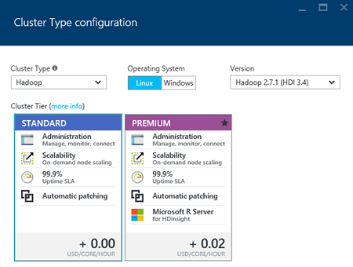
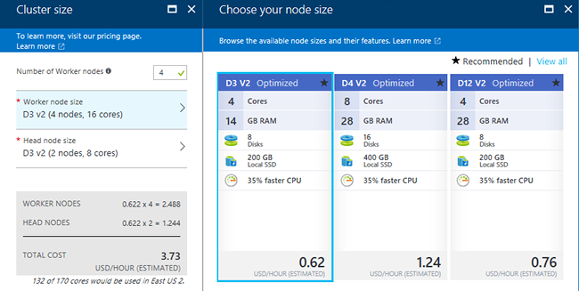

<properties
   	pageTitle="Create Hadoop, HBase, Storm, or Spark clusters on Linux in HDInsight | Microsoft Azure"
   	description="Learn how to create Hadoop, HBase, Storm, or Spark clusters on Linux for HDInsight using a browser, the Azure CLI, Azure PowerShell, REST, or through an SDK."
   	services="hdinsight"
   	documentationCenter=""
   	authors="mumian"
   	manager="paulettm"
   	editor="cgronlun"
	tags="azure-portal"/>

<tags
   	ms.service="hdinsight"
   	ms.devlang="na"
   	ms.topic="article"
   	ms.tgt_pltfrm="na"
   	ms.workload="big-data"
   	ms.date="07/08/2016"
   	ms.author="jgao"/>

# Create Linux-based Hadoop clusters in HDInsight

[AZURE.INCLUDE [selector](../../includes/hdinsight-selector-create-clusters.md)]

A Hadoop cluster consists of several virtual machines (nodes) that are used for distributed processing of tasks on the cluster. Azure abstracts the implementation details of installation and configuration of individual nodes, so you only have to provide general configuration information. In this article,  you will learn these configuration settings.

## Cluster types

Currently, Azure HDInsight provides five different types of clusters, each with a set of components to provide certain functionalities.

| Cluster type | Functionality |
| ------------ | ----------------------------- |
| Hadoop       | Query and analysis (batch jobs)     |
| HBase        | NoSQL data storage            |
| Storm        | Real-time event processing |
| Spark (preview) | In-memory processing, interactive queries, micro-batch stream processing |
| R Server on Spark | A variety of big data statistics, predictive modeling, and machine learning capabilities |

Each cluster type has its own number of nodes within the cluster, terminology for nodes within the cluster, and default VM size for each node type. In the following table, the number of nodes for each node type is in parentheses.

| Type| Nodes | Diagram|
|-----|------|--------|
|Hadoop| Head node (2), Data node (1+)||
|HBase|Head server (2), Region server (1+), Master/Zookeeper node (3)||
|Storm|Nimbus node (2), Supervisor server (1+), Zookeeper node (3)||
|Spark|Head node (2), Worker node (1+), Zookeeper node (3) (Free for A1 Zookeepers VM size)||

The following table lists the default VM sizes for HDInsight.

|Cluster type|	Hadoop|	HBase|	Storm|	Spark|
|------------|--------|------|-------|-------|
|Head – Default VM size|	D3	|A3|	A3|	D12|
|Head – Recommended VM sizes|	D3, D4, D12	|A3, A4, A5	|A3, A4, A5|	D12, D13, D14|
|Worker – Default VM size|	D3|	D3|	D3|	D12|
|Worker – Recommended VM sizes |	D3, D4, D12|	D3, D4, D12	|D3, D4, D12|	D12, D13, D14|
|Zookeeper – Default VM size|	|	A2|	A2	| |
|Zookeeper – Recommended VM sizes |		|A2, A3, A4	|A2, A3, A4	| |

Note that Head is known as *Nimbus* for the Storm cluster type. Worker is known as *Region* for the HBase cluster type and as *Supervisor* for the Storm cluster type.

> [AZURE.IMPORTANT] If you plan on having more than 32 worker nodes, either at cluster creation or by scaling the cluster after creation, then you must select a head node size with at least 8 cores and 14 GB of RAM.

You can add other components such as Hue or R to these basic types by using [Script Actions](#customize-clusters-using-script-action).

## Cluster tiers

Azure HDInsight provides the big data cloud offerings in two categories: Standard and [Premium](hdinsight-component-versioning.md#hdinsight-standard-and-hdinsight-premium). HDInsight Premium includes R and other additional components. HDInsight Premium is supported only on HDInsight version 3.4.

The following table lists the HDInsight cluster type and HDInsight Premium support matrix.

| Cluster type | Standard | Premium  |
|--------------|---------------|--------------|
| Hadoop       | Yes           | Yes          |
| Spark        | Yes           | Yes          |
| HBase        | Yes           | No           |
| Storm        | Yes           | No           |
| R Server on Spark | No | Yes |

This table will be updated as more cluster types are included in HDInsight Premium. The following screenshot shows the Azure portal information for choosing cluster types.

## Basic configuration options

The following are the basic configuration options used to create an HDInsight cluster.

### Cluster name ###

Cluster name is used to identify a cluster. Cluster name must be globally unique, and it must adhere to the following naming guidelines:

- The field must be a string that contains between 3 and 63 characters.
- The field can contain only letters, numbers, and hyphens.

### Cluster type###

See [Cluster types](#cluster-types) and [Cluster tiers](#cluster-tiers).

### Operating system ###

You can create HDInsight clusters on one of the following two operating systems:

- HDInsight on Linux (Ubuntu 12.04 LTS for Linux).  HDInsight provides the option of configuring Linux clusters on Azure. Configure a Linux cluster if you are familiar with Linux or Unix, migrating from an existing Linux-based Hadoop solution, or want easy integration with Hadoop ecosystem components built for Linux. For more information, see [Get started with Hadoop on Linux in HDInsight](hdinsight-hadoop-linux-tutorial-get-started.md).
- HDInsight on Windows (Windows Server 2012 R2 Datacenter).

### HDInsight version###

This is used to determine the version of HDInsight needed for this cluster. For more information, see [Hadoop cluster versions and components in HDInsight](https://go.microsoft.com/fwLink/?LinkID=320896&clcid=0x409).

### Subscription name###

Each HDInsight cluster is tied to one Azure subscription.

### Resource group name ###

[Azure Resource Manager](../resource-group-overview.md) helps you work with the resources in your application as a group, referred to as an Azure Resource Group. You can deploy, update, monitor, or delete all of the resources for your application in a single coordinated operation.

### Credentials###

With HDInsight clusters, you can configure two user accounts during cluster creation:

- HTTP user. The default user name is *admin* using the basic configuration on the Azure Portal. Sometimes it is called "Cluster user."
- SSH User (Linux clusters). This is used to connect to the cluster using SSH. You can create additional SSH user accounts after the cluster is created by following the steps in [Use SSH with Linux-based Hadoop on HDInsight from Linux, Unix, or OS X](hdinsight-hadoop-linux-use-ssh-unix.md) or [Use SSH with Linux-based Hadoop on HDInsight from Windows](hdinsight-hadoop-linux-use-ssh-unix.md).

    >[AZURE.NOTE] For Windows-based clusters, you can create an RDP user to connect to the cluster using RDP.

### Data source###

The original Hadoop distributed file system (HDFS) uses many local disks on the cluster. HDInsight uses Azure Blob storage for data storage. Azure Blob storage is a robust, general-purpose storage solution that integrates seamlessly with HDInsight. Through an HDFS interface, the full set of components in HDInsight can operate directly on structured or unstructured data in Blob storage. Storing data in Blob storage helps you safely delete the HDInsight clusters that are used for computation without losing user data.

During configuration, you must specify an Azure storage account and an Azure Blob storage container on the Azure storage account. Some creation processes require the Azure storage account and the Blob storage container to be created beforehand. The Blob storage container is used as the default storage location by the cluster. Optionally, you can specify additional Azure Storage accounts (linked storage) that will be accessible by the cluster. The cluster can also access any Blob storage containers that are configured with full public read access or public read access for blobs only.  For more information, see [Manage Access to Azure Storage Resources](../storage/storage-manage-access-to-resources.md).

>[AZURE.NOTE] A Blob storage container provides a grouping of a set of blobs as shown in the following image.

We do not recommended using the default Blob storage container for storing business data. Deleting the default Blob storage container after each use to reduce storage cost is a good practice. Note that the default container contains application and system logs. Make sure to retrieve the logs before deleting the container.

>[AZURE.WARNING] Sharing one Blob storage container for multiple clusters is not supported.

For more information on using secondary Blob storage, see [Using Azure Blob Storage with HDInsight](hdinsight-hadoop-use-blob-storage.md).

In addition to Azure Blob storage, you can also use [Azure Data Lake Store](../data-lake-store/data-lake-store-overview.md) as a default storage account for HBase cluster in HDInsight and as linked storage for all four HDInsight cluster types. For more information, see [Create an HDInsight cluster with Data Lake Store using Azure Portal](../data-lake-store/data-lake-store-hdinsight-hadoop-use-portal.md).

### Location (Region) ###

The HDInsight cluster and its default storage account must be located at the same Azure location.

For a list of supported regions, click the **Region** drop-down list on [HDInsight pricing](https://go.microsoft.com/fwLink/?LinkID=282635&clcid=0x409).

### Node pricing tiers###

Customers are billed for the usage of those nodes for the duration of the cluster’s life. Billing starts when a cluster is created and stops when the cluster is deleted. Clusters can’t be de-allocated or put on hold.

Different cluster types have different node types, numbers of nodes, and node sizes. For example, a Hadoop cluster type has two _head nodes_ and a default of four _data nodes_, while a Storm cluster type has two _nimbus nodes_, three _zookeeper nodes_, and a default of four _supervisor nodes_. The cost of HDInsight clusters is determined by the number of nodes and the virtual machines sizes for the nodes. For example, if you know that you will be performing operations that need a lot of memory, you may want to select a compute resource with more memory. For learning purposes, it is recommended to use one data node. For more information about HDInsight pricing, see [HDInsight pricing](https://go.microsoft.com/fwLink/?LinkID=282635&clcid=0x409).

>[AZURE.NOTE] The cluster size limit varies among Azure subscriptions. Contact billing support to increase the limit.

>The nodes used by your cluster do not count as virtual machines because the virtual machine images used for the nodes are an implementation detail of the HDInsight service. The compute cores used by the nodes do count against the total number of compute cores available to your subscription. You can see the number of available cores and the cores that will be used by the cluster in the summary section of the Node Pricing Tiers blade when creating an HDInsight cluster.

When you use the Azure portal to configure the cluster, the node size is available through the __Node Pricing Tier__ blade. You can also see the cost associated with the different node sizes. The following screenshot shows the choices for a Linux-base Hadoop cluster.

The following tables show the sizes supported by HDInsight clusters and the capacities they provide.

#### Standard tier: A-series####

In the classic deployment model, some VM sizes are slightly different in PowerShell and CLI.
* Standard_A3 is Large
* Standard_A4 is ExtraLarge

|Size |CPU cores|Memory|NICs (Max)|Max. disk size|Max. data disks (1023 GB each)|Max. IOPS (500 per disk)|
|---|---|---|---|---|---|---|
|Standard_A3\Large|4|7 GB|2|Temporary = 285 GB |8|8x500|
|Standard_A4\ExtraLarge|8|14 GB|4|Temporary = 605 GB |16|16x500|
|Standard_A6|4|28 GB|2|Temporary = 285 GB |8|8x500|
|Standard_A7|8|56 GB|4|Temporary = 605 GB |16|16x500|

#### Standard tier: D-series####

|Size |CPU cores|Memory|NICs (Max)|Max. disk size|Max. data disks (1023 GB each)|Max. IOPS (500 per disk)|
|---|---|---|---|---|---|---|
|Standard_D3 |4|14 GB|4|Temporary (SSD) =200 GB |8|8x500|
|Standard_D4 |8|28 GB|8|Temporary (SSD) =400 GB |16|16x500|
|Standard_D12 |4|28 GB|4|Temporary (SSD) =200 GB |8|8x500|
|Standard_D13 |8|56 GB|8|Temporary (SSD) =400 GB |16|16x500|
|Standard_D14 |16|112 GB|8|Temporary (SSD) =800 GB |32|32x500|

#### Standard tier: Dv2-series####

|Size |CPU cores|Memory|NICs (Max)|Max. disk size|Max. data disks (1023 GB each)|Max. IOPS (500 per disk)|
|---|---|---|---|---|---|---|
|Standard_D3_v2 |4|14 GB|4|Temporary (SSD) =200 GB |8|8x500|
|Standard_D4_v2 |8|28 GB|8|Temporary (SSD) =400 GB |16|16x500|
|Standard_D12_v2 |4|28 GB|4|Temporary (SSD) =200 GB |8|8x500|
|Standard_D13_v2 |8|56 GB|8|Temporary (SSD) =400 GB |16|16x500|
|Standard_D14_v2 |16|112 GB|8|Temporary (SSD) =800 GB |32|32x500|    

For deployment considerations to be aware of when you're planning to use these resources, see [Sizes for virtual machines](../virtual-machines/virtual-machines-windows-sizes.md). For information about pricing of the various sizes, see [HDInsight Pricing](https://azure.microsoft.com/pricing/details/hdinsight).   

> [AZURE.IMPORTANT] If you plan on having more than 32 worker nodes, either at cluster creation or by scaling the cluster after creation, then you must select a head node size with at least 8 cores and 14 GB of RAM.

Billing starts when a cluster is created, and stops when the cluster is deleted. For more information on pricing, see [HDInsight pricing details](https://azure.microsoft.com/pricing/details/hdinsight/).

## Use additional storage

In some cases, you may wish to add additional storage to the cluster. For example, you might have multiple Azure storage accounts for different geographical regions or different services, but you want to analyze them all with HDInsight.

For more information about secondary Blob storage, see [Using Azure Blob storage with HDInsight](hdinsight-hadoop-use-blob-storage.md). For more information about secondary Data Lake Storage, see [Create HDInsight clusters with Data Lake Store using Azure Portal](../data-lake-store/data-lake-store-hdinsight-hadoop-use-portal.md).

## Use Hive/Oozie metastore

We strongly recommend that you use a custom metastore if you want to retain your Hive tables after you delete your HDInsight cluster. You will be able to attach that metastore to another HDInsight cluster.

> [AZURE.IMPORTANT] HDInsight metastore is not backward compatible. For example, you cannot use a metastore of an HDInsight 3.4 cluster to create an HDInsight 3.3 cluster.

The metastore contains Hive and Oozie metadata, such as Hive tables, partitions, schemas, and columns. The metastore helps you to retain your Hive and Oozie metadata, so you don't need to re-create Hive tables or Oozie jobs when you create a new cluster. By default, Hive uses an embedded Azure SQL database to store this information. The embedded database can't preserve the metadata when the cluster is deleted. For example, if you create Hive tables in a cluster created with a Hive metastore, you will be able to see the Hive tables if you delete and recreate the cluster using the same Hive metastore.

Metastore configuration is not available for HBase cluster types.

> [AZURE.IMPORTANT] When creating a custom metastore, do not use a database name that contains dashes or hyphens. This can cause the cluster creation process to fail.

## Use Azure virtual networks

With an [Azure virtual network](https://azure.microsoft.com/documentation/services/virtual-network/), you can create a secure, persistent network containing the resources you need for your solution. With a virtual network, you can:

* Connect cloud resources together in a private network (cloud-only).

	

* Connect your cloud resources to your local datacenter network (site-to-site or point-to-site) by using a virtual private network (VPN).

| Site-to-site configuration | Point-to-site configuration |
| -------------------------- | --------------------------- |
| With site-to-site configuration, you can connect multiple resources from your datacenter to the Azure virtual network by using a hardware VPN or the Routing and Remote Access Service.  | With point-to-site configuration, you can connect a specific resource to the Azure virtual network by using a software VPN.  |

Windows-based clusters require a v1 (Classic) virtual network, while Linux-based clusters require a v2 (Azure Resource Manager) virtual network. If you do not have the correct type of network, it will not be usable when you create the cluster.

For more information about using HDInsight with a virtual network, including specific configuration requirements for the virtual network, see [Extend HDInsight capabilities by using an Azure virtual network](hdinsight-extend-hadoop-virtual-network.md).

## Customize clusters using HDInsight cluster customization (bootstrap)

Sometimes, you want to configure the following configuration files:

- clusterIdentity.xml
- core-site.xml
- gateway.xml
- hbase-env.xml
- hbase-site.xml
- hdfs-site.xml
- hive-env.xml
- hive-site.xml
- mapred-site
- oozie-site.xml
- oozie-env.xml
- storm-site.xml
- tez-site.xml
- webhcat-site.xml
- yarn-site.xml

To keep the changes through the lifetime of a cluster, you can use HDInsight cluster customization during the creation process, or you can use Ambari in Linux-based clusters. For more information, see [Customize HDInsight clusters using Bootstrap](hdinsight-hadoop-customize-cluster-bootstrap.md).

>[AZURE.NOTE] The Windows-based clusters can't retain the changes due to re-image. For more information,
see [Role Instance Restarts Due to OS Upgrades](http://blogs.msdn.com/b/kwill/archive/2012/09/19/role-instance-restarts-due-to-os-upgrades.aspx).  To keep the changes through the clusters' lifetime, you must use HDInsight cluster customization during the creation process.

## Customize clusters using Script Action

You can install additional components or customize cluster configuration by using scripts during creation. Such scripts are invoked via **Script Action**, which is a configuration option that can be used from the Azure portal, HDInsight Windows PowerShell cmdlets, or the HDInsight .NET SDK. For more information, see [Customize HDInsight cluster using Script Action](hdinsight-hadoop-customize-cluster-linux.md).

Some native Java components, like Mahout and Cascading, can be run on the cluster as Java Archive (JAR) files. These JAR files can be distributed to Azure Blob storage and submitted to HDInsight clusters through Hadoop job submission mechanisms. For more information, see [Submit Hadoop jobs programmatically](hdinsight-submit-hadoop-jobs-programmatically.md).

>[AZURE.NOTE] If you have issues deploying JAR files to HDInsight clusters or calling JAR files on HDInsight clusters, contact [Microsoft Support](https://azure.microsoft.com/support/options/).

> Cascading is not supported by HDInsight and is not eligible for Microsoft Support. For lists of supported components, see [What's new in the cluster versions provided by HDInsight?](hdinsight-component-versioning.md)

## Cluster creation methods

In this article, you have learned basic information about creating a Linux-based HDInsight cluster. Use the following table to find specific information about how to create a cluster using a method that best suits your needs.

| Clusters created with | Web browser | Command-line | REST API | SDK | Linux, Mac OS X, or Unix | Windows |
| ------------------------------- |:----------------------:|:--------------------:|:------------------:|:------------:|:-----------------------------:|:------------:|
| [The Azure portal](hdinsight-hadoop-create-linux-clusters-portal.md) | ✔     | &nbsp; | &nbsp; | &nbsp; | ✔      | ✔ |
| [Azure Data Factory](hdinsight-hadoop-create-linux-clusters-adf.md) | ✔     | ✔  | ✔  |✔  | ✔      | ✔ |
| [Azure CLI](hdinsight-hadoop-create-linux-clusters-azure-cli.md)         | &nbsp; | ✔     | &nbsp; | &nbsp; | ✔      | ✔ |
| [Azure PowerShell](hdinsight-hadoop-create-linux-clusters-azure-powershell.md) | &nbsp; | ✔     | &nbsp; | &nbsp; | ✔ | ✔ |
| [cURL](hdinsight-hadoop-create-linux-clusters-curl-rest.md) | &nbsp; | ✔     | ✔ | &nbsp; | ✔      | ✔ |
| [.NET SDK](hdinsight-hadoop-create-linux-clusters-dotnet-sdk.md) | &nbsp; | &nbsp; | &nbsp; | ✔ | ✔      | ✔ |
| [Azure Resource Manager Templates](hdinsight-hadoop-create-linux-clusters-arm-templates.md) | &nbsp; | ✔     | &nbsp; | &nbsp; | ✔      | ✔ |
