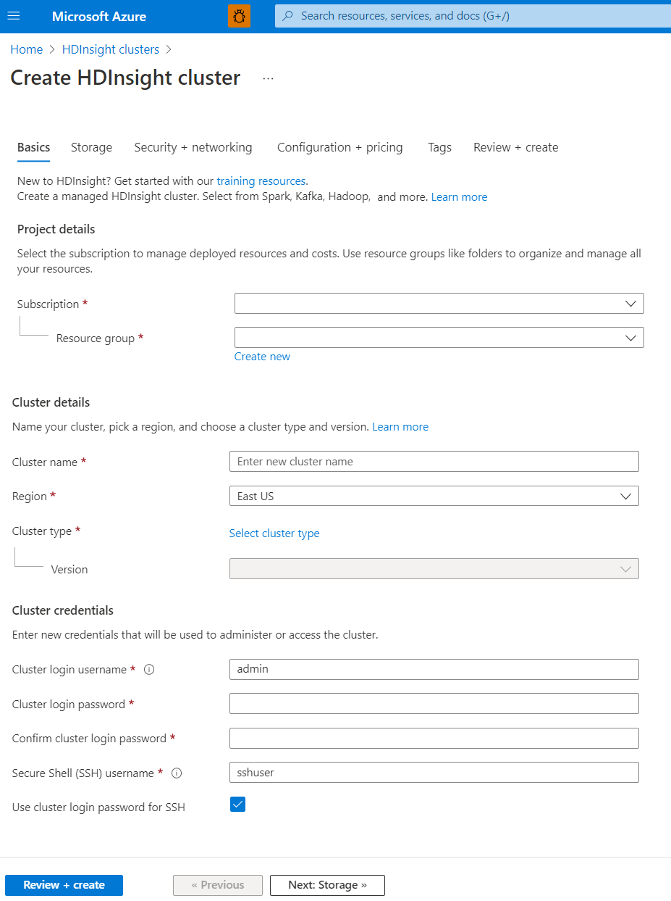

# Set up clusters in HDInsight with Apache Hadoop, Apache Spark, Apache Kafka, and more

[!INCLUDE [selector](../../includes/hdinsight-create-linux-cluster-selector.md)]

Learn how to set up and configure clusters in HDInsight with Apache Hadoop, Apache Spark, Apache Kafka, Interactive Query, Apache HBase, ML Services, or Apache Storm. Also, learn how to customize clusters and add security by joining them to a domain.

A Hadoop cluster consists of several virtual machines (nodes) that are used for distributed processing of tasks. Azure HDInsight handles implementation details of installation and configuration of individual nodes, so you only have to provide general configuration information.

> [!IMPORTANT]  
> HDInsight cluster billing starts once a cluster is created and stops when the cluster is deleted. Billing is pro-rated per minute, so you should always delete your cluster when it is no longer in use. Learn how to [delete a cluster.](hdinsight-delete-cluster.md)

## Cluster setup methods

The following table shows the different methods you can use to set up an HDInsight cluster.

| Clusters created with | Web browser | Command line | REST API | SDK |
| --- |:---:|:---:|:---:|:---:|
| [Azure portal](hdinsight-hadoop-create-linux-clusters-portal.md) |✔ |&nbsp; |&nbsp; |&nbsp; |
| [Azure Data Factory](hdinsight-hadoop-create-linux-clusters-adf.md) |✔ |✔ |✔ |✔ |
| [Azure CLI](hdinsight-hadoop-create-linux-clusters-azure-cli.md) |&nbsp; |✔ |&nbsp; |&nbsp; |
| [Azure PowerShell](hdinsight-hadoop-create-linux-clusters-azure-powershell.md) |&nbsp; |✔ |&nbsp; |&nbsp; |
| [cURL](hdinsight-hadoop-create-linux-clusters-curl-rest.md) |&nbsp; |✔ |✔ |&nbsp; |
| [Azure Resource Manager templates](hdinsight-hadoop-create-linux-clusters-arm-templates.md) |&nbsp; |✔ |&nbsp; |&nbsp; |

## Basic cluster setup

This article walks you through setup in the [Azure portal](https://portal.azure.com), where you can create an HDInsight cluster using the default view or *Classic*.

Follow instructions on the screen. Details are provided below for:

* [Resource group name](#resource-group-name)
* [Cluster types and configuration](#cluster-types)
* [Cluster name](#cluster-name)
* [Cluster login and SSH username](#cluster-login-and-ssh-username)
* [Location](#location)

## Resource group name

[Azure Resource Manager](../azure-resource-manager/management/overview.md) helps you work with the resources in your application as a group, referred to as an Azure resource group. You can deploy, update, monitor, or delete all the resources for your application in a single coordinated operation.

##  Cluster types and configuration

Azure HDInsight currently provides the following cluster types, each with a set of components to provide certain functionalities.

> [!IMPORTANT]  
> HDInsight clusters are available in various types, each for a single workload or technology. There is no supported method to create a cluster that combines multiple types, such as Storm and HBase on one cluster. If your solution requires technologies that are spread across multiple HDInsight cluster types, an [Azure virtual network](https://docs.microsoft.com/azure/virtual-network) can connect the required cluster types.

| Cluster type | Functionality |
| --- | --- |
| [Hadoop](hadoop/apache-hadoop-introduction.md) |Batch query and analysis of stored data |
| [HBase](hbase/apache-hbase-overview.md) |Processing for large amounts of schemaless, NoSQL data |
| [Interactive Query](./interactive-query/apache-interactive-query-get-started.md) |In-memory caching for interactive and faster Hive queries |
| [Kafka](kafka/apache-kafka-introduction.md) | A distributed streaming platform that can be used to build real-time streaming data pipelines and applications |
| [ML Services](r-server/r-server-overview.md) |Various big data statistics, predictive modeling, and machine learning capabilities |
| [Spark](spark/apache-spark-overview.md) |In-memory processing, interactive queries, micro-batch stream processing |
| [Storm](storm/apache-storm-overview.md) |Real-time event processing |

### HDInsight version

Choose the version of HDInsight for this cluster. For more information, see [Supported HDInsight versions](hdinsight-component-versioning.md#supported-hdinsight-versions).

## Cluster name

HDInsight cluster names have the following restrictions:

* Allowed characters: a-z, 0-9, A-Z
* Max length: 59
* Reserved names: apps
* The cluster naming scope is for all Azure, across all subscriptions. So the cluster name must be unique worldwide.
* First six characters must be unique within a VNET

## Cluster login and SSH username

With HDInsight clusters, you can configure two user accounts during cluster creation:

* HTTP user: The default username is *admin*. It uses the basic configuration on the Azure portal. Sometimes it is called "Cluster user."
* SSH user: Used to connect to the cluster through SSH. For more information, see [Use SSH with HDInsight](hdinsight-hadoop-linux-use-ssh-unix.md).

The HTTP username has the following restrictions:

* Allowed special characters: _ and @
* Characters not allowed:  #;."',\/:`!*?$(){}[]<>|&--=+%~^space
* Max length: 20

The SSH username has the following restrictions:

* Allowed special characters: _ and @
* Characters not allowed:  #;."',\/:`!*?$(){}[]<>|&--=+%~^space
* Max length: 64
* Reserved names: hadoop, users, oozie, hive, mapred, ambari-qa, zookeeper, tez, hdfs, sqoop, yarn, hcat, ams, hbase, storm, administrator, admin, user, user1, test, user2, test1, user3, admin1, 1, 123, a, actuser, adm, admin2, aspnet, backup, console, david, guest, john, owner, root, server, sql, support, support_388945a0, sys, test2, test3, user4, user5, spark

The Enterprise security package allows you to integrate HDInsight with Active Directory and Apache Ranger. Multiple users can be created using the Enterprise security package.

## Location (regions) for clusters and storage

You don't need to specify the cluster location explicitly: The cluster is in the same location as the default storage. For a list of supported regions, click the **Region** drop-down list on [HDInsight pricing](https://go.microsoft.com/fwLink/?LinkID=282635&clcid=0x409).

## Storage endpoints for clusters

Although an on-premises installation of Hadoop uses the Hadoop Distributed File System (HDFS) for storage on the cluster, in the cloud you use storage endpoints connected to cluster. Using cloud storage means you can safely delete the HDInsight clusters used for computation while still retaining your data.

HDInsight clusters can use the following storage options:

* Azure Data Lake Storage Gen2
* Azure Data Lake Storage Gen1
* Azure storage General Purpose v2
* Azure storage General Purpose v1
* Azure storage Block blob (**only supported as secondary storage**)

For more information on storage options with HDInsight, see [Compare storage options for use with Azure HDInsight clusters](hdinsight-hadoop-compare-storage-options.md).

> [!WARNING]  
> Using an additional storage account in a different location from the HDInsight cluster is not supported.

During configuration, for the default storage endpoint you specify a blob container of an Azure Storage account or Data Lake Storage. The default storage contains application and system logs. Optionally, you can specify additional linked Azure Storage accounts and Data Lake Storage accounts that the cluster can access. The HDInsight cluster and the dependent storage accounts must be in the same Azure location.

[!INCLUDE [secure-transfer-enabled-storage-account](../../includes/hdinsight-secure-transfer.md)]

### Optional metastores

You can create optional Hive or Apache Oozie metastores. However, not all cluster types support metastores, and Azure SQL Data Warehouse isn't compatible with metastores.

For more information, see [Use external metadata stores in Azure HDInsight](./hdinsight-use-external-metadata-stores.md).

> [!IMPORTANT]  
> When you create a custom metastore, don't use dashes, hyphens, or spaces in the database name. This can cause the cluster creation process to fail.

### Hive metastore

If you want to retain your Hive tables after you delete an HDInsight cluster, use a custom metastore. You can then attach the metastore to another HDInsight cluster.

An HDInsight metastore that is created for one HDInsight cluster version cannot be shared across different HDInsight cluster versions. For a list of HDInsight versions, see [Supported HDInsight versions](hdinsight-component-versioning.md#supported-hdinsight-versions).

### Oozie metastore

To increase performance when using Oozie, use a custom metastore. A metastore can also provide access to Oozie job data after you delete your cluster.

> [!IMPORTANT]  
> You cannot reuse a custom Oozie metastore. To use a custom Oozie metastore, you must provide an empty Azure SQL Database when creating the HDInsight cluster.

## Enterprise security package

For Hadoop, Spark, HBase, Kafka, and Interactive Query cluster types, you can choose to enable the **Enterprise Security Package**. This package provides option to have a more secure cluster setup by using Apache Ranger and integrating with Azure Active Directory. For more information, see [Overview of enterprise security in Azure HDInsight](./domain-joined/hdinsight-security-overview.md).

For more information on creating domain-joined HDInsight cluster, see [Create domain-joined HDInsight sandbox environment](./domain-joined/apache-domain-joined-configure.md).

## Extend clusters with a virtual network

If your solution requires technologies that are spread across multiple HDInsight cluster types, an [Azure virtual network](https://docs.microsoft.com/azure/virtual-network) can connect the required cluster types. This configuration allows the clusters, and any code you deploy to them, to directly communicate with each other.

For more information on using an Azure virtual network with HDInsight, see [Plan a virtual network for HDInsight](hdinsight-plan-virtual-network-deployment.md).

For an example of using two cluster types within an Azure virtual network, see [Use Apache Spark Structured Streaming with Apache Kafka](hdinsight-apache-kafka-spark-structured-streaming.md). For more information about using HDInsight with a virtual network, including specific configuration requirements for the virtual network, see [Plan a virtual network for HDInsight](hdinsight-plan-virtual-network-deployment.md).

## Configure cluster size

You are billed for node usage for as long as the cluster exists. Billing starts when a cluster is created and stops when the cluster is deleted. Clusters can’t be de-allocated or put on hold.

### Number of nodes for each cluster type

Each cluster type has its own number of nodes, terminology for nodes, and default VM size. In the following table, the number of nodes for each node type is in parentheses.

| Type | Nodes | Diagram |
| --- | --- | --- |
| Hadoop |Head node (2), Worker node (1+) | |
| HBase |Head server (2), region server (1+), master/ZooKeeper node (3) | |
| Storm |Nimbus node (2), supervisor server (1+), ZooKeeper node (3) | |
| Spark |Head node (2), Worker node (1+), ZooKeeper node (3) (free for A1 ZooKeeper VM size) | |

For more information, see [Default node configuration and virtual machine sizes for clusters](hdinsight-component-versioning.md#default-node-configuration-and-virtual-machine-sizes-for-clusters) in "What are the Hadoop components and versions in HDInsight?"

The cost of HDInsight clusters is determined by the number of nodes and the virtual machines sizes for the nodes.

Different cluster types have different node types, numbers of nodes, and node sizes:
* Hadoop cluster type default:
    * Two *head nodes*  
    * Four *Worker nodes*
* Storm cluster type default:
    * Two *Nimbus nodes*
    * Three *ZooKeeper nodes*
    * Four *supervisor nodes*

If you are just trying out HDInsight, we recommend you use one Worker node. For more information about HDInsight pricing, see [HDInsight pricing](https://go.microsoft.com/fwLink/?LinkID=282635&clcid=0x409).

> [!NOTE]  
> The cluster size limit varies among Azure subscriptions. Contact [Azure billing support](https://docs.microsoft.com/azure/azure-portal/supportability/how-to-create-azure-support-request) to increase the limit.

When you use the Azure portal to configure the cluster, the node size is available through the **Configuration + pricing** tab. In the portal, you can also see the cost associated with the different node sizes.

### Virtual machine sizes

When you deploy clusters, choose compute resources based on the solution you plan to deploy. The following VMs are used for HDInsight clusters:

* A and D1-4 series VMs: [General-purpose Linux VM sizes](https://docs.microsoft.com/azure/virtual-machines/linux/sizes-general)
* D11-14 series VM: [Memory-optimized Linux VM sizes](https://docs.microsoft.com/azure/virtual-machines/linux/sizes-memory)

To find out what value you should use to specify a VM size while creating a cluster using the different SDKs or while using Azure PowerShell, see [VM sizes to use for HDInsight clusters](../cloud-services/cloud-services-sizes-specs.md#size-tables). From this linked article, use the value in the **Size** column of the tables.

> [!IMPORTANT]  
> If you need more than 32 Worker nodes in a cluster, you must select a head node size with at least 8 cores and 14 GB of RAM.

For more information, see [Sizes for virtual machines](../virtual-machines/windows/sizes.md). For information about pricing of the various sizes, see [HDInsight pricing](https://azure.microsoft.com/pricing/details/hdinsight).

## Classic cluster setup

Classic cluster setup builds on the default create settings, and adds the following options:

* [HDInsight applications](#install-hdinsight-applications-on-clusters)
* [Script actions](#advanced-settings-script-actions)

## Install HDInsight applications on clusters

An HDInsight application is an application that users can install on a Linux-based HDInsight cluster. You can use applications provided by Microsoft, third parties, or that you develop yourself. For more information, see [Install third-party Apache Hadoop applications on Azure HDInsight](hdinsight-apps-install-applications.md).

Most of the HDInsight applications are installed on an empty edge node.  An empty edge node is a Linux virtual machine with the same client tools installed and configured as in the head node. You can use the edge node for accessing the cluster, testing your client applications, and hosting your client applications. For more information, see [Use empty edge nodes in HDInsight](hdinsight-apps-use-edge-node.md).

## Advanced settings: Script actions

You can install additional components or customize cluster configuration by using scripts during creation. Such scripts are invoked via **Script Action**, which is a configuration option that can be used from the Azure portal, HDInsight Windows PowerShell cmdlets, or the HDInsight .NET SDK. For more information, see [Customize HDInsight cluster using Script Action](hdinsight-hadoop-customize-cluster-linux.md).

Some native Java components, like Apache Mahout and Cascading, can be run on the cluster as Java Archive (JAR) files. These JAR files can be distributed to Azure Storage and submitted to HDInsight clusters with Hadoop job submission mechanisms. For more information, see [Submit Apache Hadoop jobs programmatically](hadoop/submit-apache-hadoop-jobs-programmatically.md).

> [!NOTE]  
> If you have issues deploying JAR files to HDInsight clusters, or calling JAR files on HDInsight clusters, contact [Microsoft Support](https://azure.microsoft.com/support/options/).
>
> Cascading is not supported by HDInsight and is not eligible for Microsoft Support. For lists of supported components, see [What's new in the cluster versions provided by HDInsight](hdinsight-component-versioning.md).

Sometimes, you want to configure the following configuration files during the creation process:

* clusterIdentity.xml
* core-site.xml
* gateway.xml
* hbase-env.xml
* hbase-site.xml
* hdfs-site.xml
* hive-env.xml
* hive-site.xml
* mapred-site
* oozie-site.xml
* oozie-env.xml
* storm-site.xml
* tez-site.xml
* webhcat-site.xml
* yarn-site.xml

For more information, see [Customize HDInsight clusters using Bootstrap](hdinsight-hadoop-customize-cluster-bootstrap.md).

## Next steps

* [Troubleshoot cluster creation failures with Azure HDInsight](./hadoop/hdinsight-troubleshoot-cluster-creation-fails.md)
* [What are HDInsight, the Apache Hadoop ecosystem, and Hadoop clusters?](hadoop/apache-hadoop-introduction.md)
* [Get started using Apache Hadoop in HDInsight](hadoop/apache-hadoop-linux-tutorial-get-started.md)
* [Work in Apache Hadoop on HDInsight from a Windows PC](hdinsight-hadoop-windows-tools.md)
