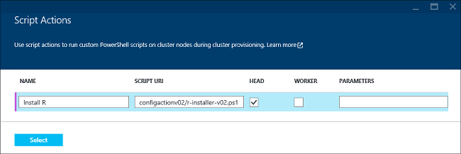

<properties
	pageTitle="Use R in HDInsight to customize clusters | Microsoft Azure"
	description="Learn how to install R using Script Action, and use R on HDInsight clusters."
	services="hdinsight"
	documentationCenter=""
	tags="azure-portal"
	authors="mumian"
	manager="paulettm"
	editor="cgronlun"/>

<tags
	ms.service="hdinsight"
	ms.workload="big-data"
	ms.tgt_pltfrm="na"
	ms.devlang="na"
	ms.topic="article"
    ms.date="06/28/2016"
	ms.author="jgao"/>

# Install and use R on HDInsight Hadoop clusters

Learn how to customize Windows based HDInsight cluster with R using Script Action, and how to use R on HDInsight clusters. The [premium tier](https://azure.microsoft.com/pricing/details/hdinsight/) offering for HDInsight includes R Server as part of your HDInsight cluster. This allows R scripts to use MapReduce and Spark to run distributed computations. For more information, see [Get started using R Server on HDInsight](hdinsight-hadoop-r-server-get-started.md). For information on using R with a Linux-based cluster, see [Install and use R on HDinsight Hadoop clusters (Linux)](hdinsight-hadoop-r-scripts-linux.md).
 
You can install R on any type of cluster (Hadoop, Storm, HBase, Spark) on Azure HDInsight by using *Script Action*. A sample script to install R on an HDInsight cluster is available from a read-only Azure storage blob at [https://hdiconfigactions.blob.core.windows.net/rconfigactionv02/r-installer-v02.ps1](https://hdiconfigactions.blob.core.windows.net/rconfigactionv02/r-installer-v02.ps1). 

**Related articles**

- [Install and use R on HDinsight Hadoop clusters (Linux)](hdinsight-hadoop-r-scripts-linux.md)
- [Create Hadoop clusters in HDInsight](hdinsight-provision-clusters.md): general information on creating HDInsight clusters
- [Customize HDInsight cluster using Script Action][hdinsight-cluster-customize]: general information on customizing HDInsight clusters using Script Action
- [Develop Script Action scripts for HDInsight](hdinsight-hadoop-script-actions.md)

## What is R?

The <a href="http://www.r-project.org/" target="_blank">R Project for Statistical Computing</a> is an open source language and environment for statistical computing. R provides hundreds of build-in statistical functions and its own programming language that combines aspects of functional and object-oriented programming. It also provides extensive graphical capabilities. R is the preferred programming environment for most professional statisticians and scientists in a wide variety of fields.

R is compatible with Azure Blob Storage (WASB) so that data that is stored there can be processed using R on HDInsight.  

## Install R

A [sample script](https://hdiconfigactions.blob.core.windows.net/rconfigactionv02/r-installer-v02.ps1) to install R on an HDInsight cluster is available from a read-only blob in Azure Storage. This section provides instructions about how to use the sample script while creating the cluster using the Azure Portal.

> [AZURE.NOTE] The sample script was introduced with HDInsight cluster version 3.1. For more information about  HDInsight cluster versions, see [HDInsight cluster versions](hdinsight-component-versioning.md).

1. When you create an HDInsight cluster from the Portal, click **Optional Configuration**, and then click **Script Actions**.
2. On the **Script Actions** page, enter the following values:

	

	<table border='1'>
		<tr><th>Property</th><th>Value</th></tr>
		<tr><td>Name</td>
			<td>Specify a name for the script action, for example, <b>Install R</b>.</td></tr>
		<tr><td>Script URI</td>
			<td>Specify the URI to the script that is invoked to customize the cluster, for example, <i>https://hdiconfigactions.blob.core.windows.net/rconfigactionv02/r-installer-v02.ps1</i></td></tr>
		<tr><td>Node Type</td>
			<td>Specify the nodes on which the customization script is run. You can choose <b>All Nodes</b>, <b>Head nodes only</b>, or <b>Worker nodes</b> only.
		<tr><td>Parameters</td>
			<td>Specify the parameters, if required by the script. However, the script to install R does not require any parameters, so you can leave this blank.</td></tr>
	</table>

	You can add more than one script action to install multiple components on the cluster. After you have added the scripts, click the check mark to start crating the cluster.

You can also use the script to install R on HDInsight by using Azure PowerShell or the HDInsight .NET SDK. Instructions for these procedures are provided later in this article.

## Run R scripts
This section describes how to run an R script on the Hadoop cluster with HDInsight.

1. **Establish a Remote Desktop connection to the cluster**: From the Portal, enable Remote Desktop for the cluster you created with R installed, and then connect to the cluster. For instructions, see [Connect to HDInsight clusters using RDP](hdinsight-administer-use-management-portal.md#rdp).

2. **Open the R console**: The R installation puts a link to the R console on the desktop of the head node. Click on it to open the R console.

3. **Run the R script**: The R script can be run directly from the R console by pasting it, selecting it, and pressing ENTER. Here is a simple example script that generates the numbers 1 to 100 and then multiplies them by 2.

		library(rmr2)
		library(rhdfs)
		ints = to.dfs(1:100)
		calc = mapreduce(input = ints, map = function(k, v) cbind(v, 2*v))
		from.dfs(calc)

The first two lines call the RHadoop libraries that are installed with R. The final line prints the results to the console. The output should look like this:

	[1,]  1 2
	[2,]  2 4
	.
	.
	.
	[98,]  98 196
	[99,]  99 198
	[100,] 100 200

## Install R using Aure PowerShell

See [Customize HDInsight clusters using Script Action](hdinsight-hadoop-customize-cluster.md#call_scripts_using_powershell).  The sample demonstrates how to install Spark using Azure PowerShell. You need to customize the script to use [https://hdiconfigactions.blob.core.windows.net/rconfigactionv02/r-installer-v02.ps1](https://hdiconfigactions.blob.core.windows.net/rconfigactionv02/r-installer-v02.ps1).

## Install R using .NET SDK

See [Customize HDInsight clusters using Script Action](hdinsight-hadoop-customize-cluster.md#call_scripts_using_azure_powershell). The sample demonstrates how to install Spark using the .NET SDK. You need to customize the script to use [https://hdiconfigactions.blob.core.windows.net/rconfigactionv02/r-installer-v02.ps1](https://hdiconfigactions.blob.core.windows.net/rconfigactionv02/r-installer-v02.ps11).

## See also

- [Install and use R on HDinsight Hadoop clusters (Linux)](hdinsight-hadoop-r-scripts-linux.md)
- [Create Hadoop clusters in HDInsight](hdinsight-provision-clusters.md): general information on creating HDInsight clusters
- [Customize HDInsight cluster using Script Action][hdinsight-cluster-customize]: general information on customizing HDInsight clusters using Script Action
- [Develop Script Action scripts for HDInsight](hdinsight-hadoop-script-actions.md)
- [Install and use Spark on HDInsight clusters][hdinsight-install-spark]: Script Action sample about installing Spark
- [Install Giraph on HDInsight clusters](hdinsight-hadoop-giraph-install.md): Script Action sample about installing Giraph
- [Install Solr on HDInsight clusters](hdinsight-hadoop-solr-install-linux.md): Script Action sample about installing Solr.

[powershell-install-configure]: powershell-install-configure.md
[hdinsight-provision]: ../hdinsight-provision-clusters/
[hdinsight-cluster-customize]: hdinsight-hadoop-customize-cluster-linux.md
[hdinsight-install-spark]: hdinsight-apache-spark-jupyter-spark-sql.md
