<properties
   pageTitle="Get started with R Server on HDInsight (preview) | Azure"
   description="Learn how to create a Apache Spark on HDInsight (Hadoop) cluster that includes R Server (preview), and then submit an R script on the cluster."
   services="HDInsight"
   documentationCenter=""
   authors="jeffstokes72"
   manager="paulettem"
   editor="cgronlun"
/>

<tags
   ms.service="HDInsight"
   ms.devlang="R"
   ms.topic="article"
   ms.tgt_pltfrm="na"
   ms.workload="data-services"
   ms.date="07/19/2016"
   ms.author="jeffstok"
/>

# Get started using R Server on HDInsight (preview)

The premium tier offering for HDInsight includes R Server as part of your HDInsight (preview) cluster. This allows R scripts to use MapReduce and Spark to run distributed computations. In this document, you will learn how to create a new R Server on HDInsight, then run an R script that demonstrates using Spark for distributed R computations.

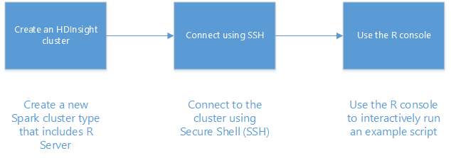

## Prerequisites

* __An Azure subscription__: Before you begin this tutorial, you must have an Azure subscription. See [Get Azure free trial](https://azure.microsoft.com/documentation/videos/get-azure-free-trial-for-testing-hadoop-in-hdinsight/) for more information.

* __A Secure Shell (SSH) client__: An SSH client is used to remotely connect to the HDInsight cluster and run commands directly on the cluster. Linux, Unix, and OS X systems provide an SSH client through the `ssh` command. For Windows systems, we recommend [PuTTY](http://www.chiark.greenend.org.uk/~sgtatham/putty/download.html).

    * __SSH keys (optional)__: You can secure the SSH account used to connect to the cluster using either a password or a public key. Using a password is easier, and allows you to get started without having to create a public/private key pair; however, using a key is more secure.
    
        The steps in this document assume that you are using a password. For information on how to create and use SSH keys with HDInsight, see the following documents:
        
        * [Use SSH with HDInsight from Linux, Unix, or OS X clients](hdinsight-hadoop-linux-use-ssh-unix.md)
        
        * [Use SSH with HDInsight from Windows clients](hdinsight-hadoop-linux-use-ssh-windows.md)

## Create the cluster

> [AZURE.NOTE] The steps in this document create an R Server on HDInsight using basic configuration information. For other cluster configuration settings (such as adding additional storage accounts, using an Azure Virtual Network, or creating a metastore for Hive,) see [Create Linux-based HDInsight clusters](hdinsight-hadoop-provision-linux-clusters.md).

1. Sign in to the [Azure portal](https://portal.azure.com).

2. Select __NEW__, __Data + Analytics__, and then __HDInsight__.

    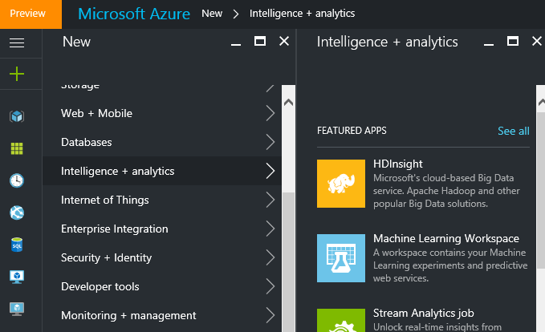

3. Enter a name for the cluster in the __Cluster Name__ field. If you have multiple Azure subscriptions, use the __Subscription__ entry to select the one you want to use.

    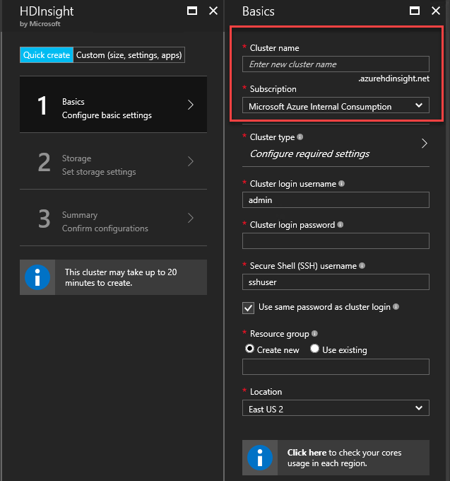

4. Select __Select Cluster Type__. On the __Cluster Type__ blade, select the following options:

    * __Cluster Type__: R Server on Spark
    
    * __Cluster Tier__: Premium

    Leave the other options at the default values, then use the __Select__ button to save the cluster type.
    
    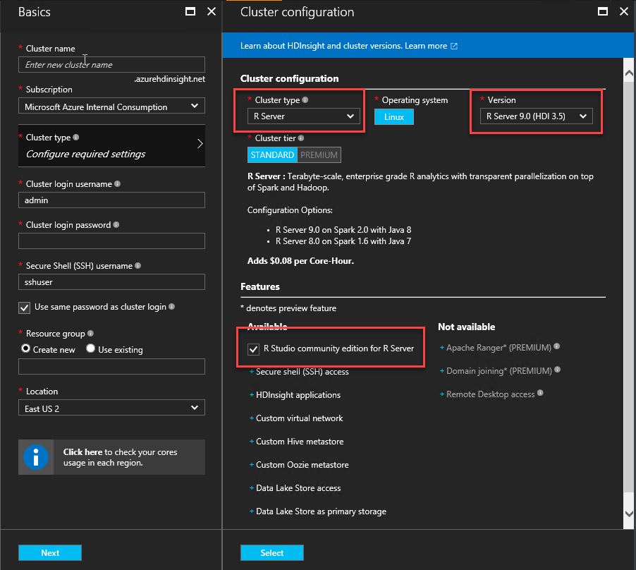
    
    > [AZURE.NOTE] You can also add R Server to other HDInsight cluster types (such as Hadoop or HBase,) by selecting the cluster type, and then selecting __Premium__.

5. Select **Resource Group** to see a list of existing resource groups and then select the one to create the cluster in. Or, you can select **Create New** and then enter the name of the new resource group. A green check will appear to indicate that the new group name is available.

    > [AZURE.NOTE] This entry will default to one of your existing resource groups, if any are available.
    
    Use the __Select__ button to save the resource group.

6. Select **Credentials**, then enter a **Cluster Login Username** and **Cluster Login Password**.

    Enter an __SSH Username__.  SSH is used to remotely connect to the cluster using a __Secure Shell (SSH)__ client. You can either specify the SSH user in this dialog or after the cluster has been created (Configuration tab for the cluster). R Server is configured to expect a __SSH username__ of “remoteuser”.  If you use a different username, you will have to perform an additional step after the cluster is created.
    
    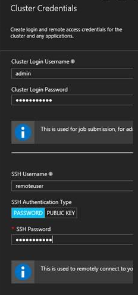

    __SSH Authentication Type__: Select __PASSWORD__ as the authentication type unless you prefer use of a public key.  You’ll need a public/private key pair if you’d like to access R Server on the cluster via a remote client, e.g. RTVS, RStudio or another desktop IDE.   

	To create and use a public/private key pair select ‘PUBLIC KEY’ and proceed as follows.  These instructions assume that you have Cygwin with ssh-keygen or equivalent installed.

	-    Generate a public/private key pair from the command prompt on your laptop:
	  
		    ssh-keygen -t rsa -b 2048 –f <private-key-filename>
      
    -    This will create a private key file and a public key file under the name <private-key-filename>.pub, e.g.  davec and davec.pub.  Then specify the public key file (*.pub) when assigning HDI cluster credentials:
      
		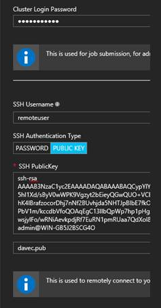  
      
	-    Change permissions on the private keyfile on your laptop
      
			chmod 600 <private-key-filename>
      
	-    Use the private key file with SSH for remote login, e.g.
	  
			ssh –i <private-key-filename> remoteuser@<hostname public ip>
      
	  or as part the definition of your Hadoop Spark compute context for R Server on the client (see Using Microsoft R Server as a Hadoop Client in the [Creating a Compute Context for Spark](https://msdn.microsoft.com/microsoft-r/scaler-spark-getting-started#creating-a-compute-context-for-spark) section of the online [RevoScaleR Hadoop Spark Getting Started guide](https://msdn.microsoft.com/microsoft-r/scaler-spark-getting-started).)

7. Select **Data Source** to select a data source for the cluster. Either select an existing storage account by selecting __Select storage account__ and then selecting the account, or create a new account using the __New__ link in the __Select storage account__ section.

    If you select __New__, you must enter a name for the new storage account. A green check will appear if the name is accepted.

    The __Default Container__ will default to the name of the cluster. Leave this as the value.
    
    Select __Location__ to select the region to create the storage account in.
    
    > [AZURE.IMPORTANT] Selecting the location for the default data source will also set the location of the HDInsight cluster. The cluster and default data source must be located in the same region.

    Use the **Select** button to save the data source configuration.
    
    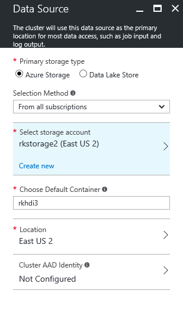

8. Select **Node Pricing Tiers** to display information about the nodes that will be created for this cluster. Unless you know that you'll need a larger cluster, leave the number of worker nodes at the default of `4`. The estimated cost of the cluster will be shown within the blade.

	> [AZURE.NOTE] If needed, you can re-size your cluster later through the Portal (Cluster -> Settings -> Scale Cluster) to increase or decrease the number of worker nodes.  This can be useful for idling down the cluster when not in use, or for adding capacity to meet the needs of larger tasks.

	Some factors to keep in mind when sizing your cluster, the data nodes, and the edge node include:  
   
    - The performance of distributed R Server analyses on Spark is proportional to the number of worker nodes when the data is large.  
    - The performance of R Server analyses is linear in the size of data being analyzed. For example:  
        - For small to modest data, performance will be best when analyzed in a local compute context on the edge node.  For more information on the scenarios under which the local and Spark compute contexts work best see  Compute context options for R Server on HDInsight. 
        - If you log into the edge node and run your R script there then all but the ScaleR rx-functions will execute <strong>locally</strong> on the edge node so the memory and number of cores of the edge node should be sized accordingly. The same applies if you use R Server on HDI as a remote compute context from your laptop.
    
    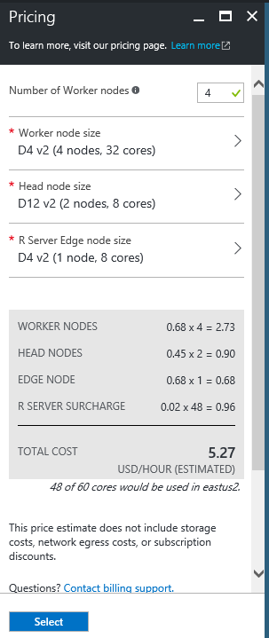

    Use the **Select** button to save the node pricing configuration.
    
9. On the **New HDInsight Cluster** blade, make sure that **Pin to Startboard** is selected, and then select **Create**. This will create the cluster and add a tile for it to the Startboard of your Azure Portal. The icon will indicate that the cluster is creating, and will change to display the HDInsight icon once creation has completed.

    | While creating | Creation complete |
    | ------------------ | --------------------- |
    |  |  |

    > [AZURE.NOTE] It will take some time for the cluster to be created, usually around 15 minutes. Use the tile on the Startboard, or the **Notifications** entry on the left of the page to check on the creation process.

## Connect to the R Server edge node

Connect to R Server edge node of the HDInsight cluster using SSH:

    ssh USERNAME@r-server.CLUSTERNAME-ssh.azurehdinsight.net
    
> [AZURE.NOTE] You can also find the `R-Server.CLUSTERNAME-ssh.azurehdinsight.net` address in the Azure portal by selecting your cluster, then __All Settings__, __Apps__, and __RServer__. This will display the SSH Endpoint information for the edge node.
>
> 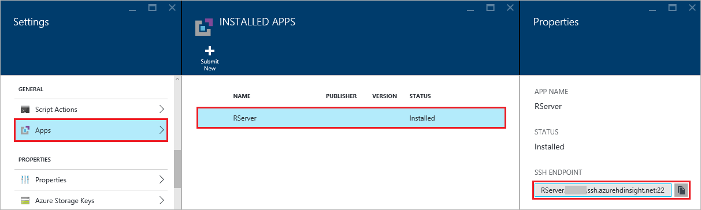
    
If you used a password to secure your SSH user account, you will be prompted to enter it. If you used a public key, you may have to use the `-i` parameter to specify the matching private key. For example, `ssh -i ~/.ssh/id_rsa USERNAME@R-Server.CLUSTERNAME-ssh.azurehdinsight.net`.
    
For more information on using SSH with Linux-based HDInsight, see the following articles:

* [Use SSH with Linux-based Hadoop on HDInsight from Linux, Unix, or OS X](hdinsight-hadoop-linux-use-ssh-unix.md)

* [Use SSH with Linux-based Hadoop on HDInsight from Windows](hdinsight-hadoop-linux-use-ssh-windows.md)

Once connected, you will arrive at a prompt similar to the following.

    username@ed00-myrser:~$

## Use the R console

1. From the SSH session, use the following command to start the R console.

        R
    
    You will see output similar to the following.
    
        R version 3.2.2 (2015-08-14) -- "Fire Safety"
        Copyright (C) 2015 The R Foundation for Statistical Computing
        Platform: x86_64-pc-linux-gnu (64-bit)

        R is free software and comes with ABSOLUTELY NO WARRANTY.
        You are welcome to redistribute it under certain conditions.
        Type 'license()' or 'licence()' for distribution details.

        Natural language support but running in an English locale

        R is a collaborative project with many contributors.
        Type 'contributors()' for more information and
        'citation()' on how to cite R or R packages in publications.

        Type 'demo()' for some demos, 'help()' for on-line help, or
        'help.start()' for an HTML browser interface to help.
        Type 'q()' to quit R.

        Microsoft R Server version 8.0: an enhanced distribution of R
        Microsoft packages Copyright (C) 2016 Microsoft Corporation

        Type 'readme()' for release notes.

        >

2. From the `>` prompt, you can enter R code. R server includes packages that allow you to easily interact with Hadoop and run distributed computations. For example, use the following command to view the root of the default file system for the HDInsight cluster.

        rxHadoopListFiles("/")
    
    You can also use the WASB style addressing.
    
        rxHadoopListFiles("wasb:///")

## Using R Server on HDI from a remote instance of Microsoft R Server or Microsoft R Client

Per the section above regarding use of public/private key pairs to access the cluster, it is possible to setup access to the HDI Hadoop Spark compute context from a remote instance of Microsoft R Server or Microsoft R Client running on a desktop or laptop (see Using Microsoft R Server as a Hadoop Client in the [Creating a Compute Context for Spark](https://msdn.microsoft.com/microsoft-r/scaler-spark-getting-started#creating-a-compute-context-for-spark) section of the online [RevoScaleR Hadoop Spark Getting Started guide](https://msdn.microsoft.com/microsoft-r/scaler-spark-getting-started)).  To do so you will need to specify the following options when defining the RxSpark compute context on your laptop: hdfsShareDir, shareDir, sshUsername, sshHostname, sshSwitches, and sshProfileScript. For example:

    
    myNameNode <- "default"
    myPort <- 0 
 
    mySshHostname  <- 'rkrrehdi1-ssh.azurehdinsight.net'  # HDI secure shell hostname
    mySshUsername  <- 'remoteuser'# HDI SSH username
    mySshSwitches  <- '-i /cygdrive/c/Data/R/davec'   # HDI SSH private key
 
    myhdfsShareDir <- paste("/user/RevoShare", mySshUsername, sep="/")
    myShareDir <- paste("/var/RevoShare" , mySshUsername, sep="/")
 
    mySparkCluster <- RxSpark(
      hdfsShareDir = myhdfsShareDir,
      shareDir     = myShareDir,
      sshUsername  = mySshUsername,
      sshHostname  = mySshHostname,
      sshSwitches  = mySshSwitches,
      sshProfileScript = '/etc/profile',
      nameNode     = myNameNode,
      port         = myPort,
      consoleOutput= TRUE
    )

    
 
## Use a compute context

A compute context allows you to control whether computation will be performed locally on the edge node, or whether it will be distributed across the nodes in the HDInsight cluster.
        
1. From the R console, use the following to load example data into the default storage for HDInsight.

        # Set the HDFS (WASB) location of example data
        bigDataDirRoot <- "/example/data"
        # create a local folder for storaging data temporarily
        source <- "/tmp/AirOnTimeCSV2012"
        dir.create(source)
        # Download data to the tmp folder
        remoteDir <- "http://packages.revolutionanalytics.com/datasets/AirOnTimeCSV2012"
        download.file(file.path(remoteDir, "airOT201201.csv"), file.path(source, "airOT201201.csv"))
        download.file(file.path(remoteDir, "airOT201202.csv"), file.path(source, "airOT201202.csv"))
        download.file(file.path(remoteDir, "airOT201203.csv"), file.path(source, "airOT201203.csv"))
        download.file(file.path(remoteDir, "airOT201204.csv"), file.path(source, "airOT201204.csv"))
        download.file(file.path(remoteDir, "airOT201205.csv"), file.path(source, "airOT201205.csv"))
        download.file(file.path(remoteDir, "airOT201206.csv"), file.path(source, "airOT201206.csv"))
        download.file(file.path(remoteDir, "airOT201207.csv"), file.path(source, "airOT201207.csv"))
        download.file(file.path(remoteDir, "airOT201208.csv"), file.path(source, "airOT201208.csv"))
        download.file(file.path(remoteDir, "airOT201209.csv"), file.path(source, "airOT201209.csv"))
        download.file(file.path(remoteDir, "airOT201210.csv"), file.path(source, "airOT201210.csv"))
        download.file(file.path(remoteDir, "airOT201211.csv"), file.path(source, "airOT201211.csv"))
        download.file(file.path(remoteDir, "airOT201212.csv"), file.path(source, "airOT201212.csv"))
        # Set directory in bigDataDirRoot to load the data into
        inputDir <- file.path(bigDataDirRoot,"AirOnTimeCSV2012") 
        # Make the directory
        rxHadoopMakeDir(inputDir)
        # Copy the data from source to input
        rxHadoopCopyFromLocal(source, bigDataDirRoot)

2. Next, let's create some data info and define two data sources so that we can work with the data.

        # Define the HDFS (WASB) file system
        hdfsFS <- RxHdfsFileSystem()
        # Create info list for the airline data
        airlineColInfo <- list(
            DAY_OF_WEEK = list(type = "factor"),
            ORIGIN = list(type = "factor"),
            DEST = list(type = "factor"),
            DEP_TIME = list(type = "integer"),
            ARR_DEL15 = list(type = "logical"))

        # get all the column names
        varNames <- names(airlineColInfo)

        # Define the text data source in hdfs
        airOnTimeData <- RxTextData(inputDir, colInfo = airlineColInfo, varsToKeep = varNames, fileSystem = hdfsFS)
        # Define the text data source in local system
        airOnTimeDataLocal <- RxTextData(source, colInfo = airlineColInfo, varsToKeep = varNames)

        # formula to use
        formula = "ARR_DEL15 ~ ORIGIN + DAY_OF_WEEK + DEP_TIME + DEST"

3. Let's run a logistic regression over the data using the local compute context.

        # Set a local compute context
        rxSetComputeContext("local")
        # Run a logistic regression
        system.time(
            modelLocal <- rxLogit(formula, data = airOnTimeDataLocal)
        )
        # Display a summary 
        summary(modelLocal)

    You should see output that ends with lines similar to the following.

        Data: airOnTimeDataLocal (RxTextData Data Source)
        File name: /tmp/AirOnTimeCSV2012
        Dependent variable(s): ARR_DEL15
        Total independent variables: 634 (Including number dropped: 3)
        Number of valid observations: 6005381
        Number of missing observations: 91381
        -2*LogLikelihood: 5143814.1504 (Residual deviance on 6004750 degrees of freedom)

        Coefficients:
                        Estimate Std. Error z value Pr(>|z|)
        (Intercept)   -3.370e+00  1.051e+00  -3.208  0.00134 **
        ORIGIN=JFK     4.549e-01  7.915e-01   0.575  0.56548
        ORIGIN=LAX     5.265e-01  7.915e-01   0.665  0.50590
        ......
        DEST=SHD       5.975e-01  9.371e-01   0.638  0.52377
        DEST=TTN       4.563e-01  9.520e-01   0.479  0.63172
        DEST=LAR      -1.270e+00  7.575e-01  -1.676  0.09364 .
        DEST=BPT         Dropped    Dropped Dropped  Dropped
        ---
        Signif. codes:  0 ‘***’ 0.001 ‘**’ 0.01 ‘*’ 0.05 ‘.’ 0.1 ‘ ’ 1

        Condition number of final variance-covariance matrix: 11904202
        Number of iterations: 7

4. Next, let's run the same logistic regression using the Spark context. The Spark context will distribute the processing over all the worker nodes in the HDInsight cluster.

        # Define the Spark compute context 
        mySparkCluster <- RxSpark()
        # Set the compute context 
        rxSetComputeContext(mySparkCluster)
        # Run a logistic regression 
        system.time(  
            modelSpark <- rxLogit(formula, data = airOnTimeData)
        )
        # Display a summary
        summary(modelSpark)

    > [AZURE.NOTE] You can also use MapReduce to distribute computation across cluster nodes. For more information on compute context, see [Compute context options for R Server on HDInsight premium](hdinsight-hadoop-r-server-compute-contexts.md).

## Distribute R code to multiple nodes

With R Server you can easily take existing R code and run it across multiple nodes in the cluster by using `rxExec`. This is useful when doing a parameter sweep or simulations. The following is an example of how to use `rxExec`.

    rxExec( function() {Sys.info()["nodename"]}, timesToRun = 4 )
    
If you are still using the Spark or MapReduce context, this will return the nodename value for the worker nodes that the code (`Sys.info()["nodename"]`) is ran on. For example, on a four node cluster, you may receive output similar to the following.

    $rxElem1
        nodename
    "wn3-myrser"

    $rxElem2
        nodename
    "wn0-myrser"

    $rxElem3
        nodename
    "wn3-myrser"

    $rxElem4
        nodename
    "wn3-myrser"

## Install R packages

If you would like to install additional R packages on the edge node, you can use `install.packages()` directly from within the R console when connected to the egde node through SSH. However, if you need to install R packages on the worker nodes of the cluster, you must use a Script Action.

Script Actions are Bash scripts that are used to make configuration changes to the HDInsight cluster, or to install additional software. In this case, to install additional R packages. To install additional packages using a Script Action, use the following steps.

> [AZURE.IMPORTANT] Using Script Actions to install additional R packages can only be used after the cluster has been created. It should not be used during cluster creation, as the script relies on R Server being completely installed and configured.

1. From the [Azure portal](https://portal.azure.com), select your R Server on HDInsight cluster.

2. From the cluster blade, select __All Settings__, and then __Script Actions__. From the __Script Actions__ blade, select __Submit New__ to submit a new Script Action.

    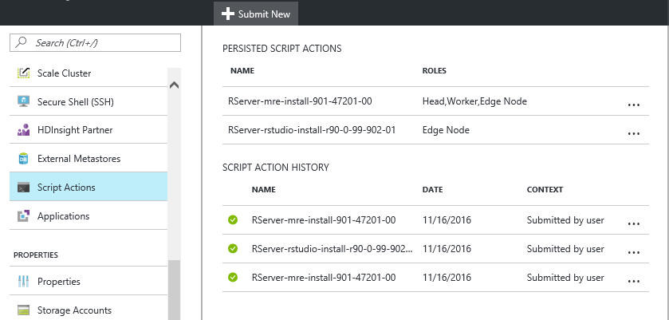

3. From the __Submit script action__ blade, provide the following information.

    * __Name__: A friendly name to used to identify this script
    * __Bash script URI__: http://mrsactionscripts.blob.core.windows.net/rpackages-v01/InstallRPackages.sh
    * __Head__: This should be __unchecked__
    * __Worker__: This should be __Checked__
    * __Zookeeper__: This should be __Unchecked__
    * __Parameters__: The R packages to be installed. For example, `bitops stringr arules`
    * __Persist this script...__: This should be __Checked__
    
    > [AZURE.IMPORTANT] If the R package(s) you install require system libraries to be added, then you must download the base script used here and add steps to install the system libraries. You must then upload the modified script to a public blob container in Azure storage and use the modified script to install the packages.
    >
    >For more information on developing Script Actions, see [Script Action development](hdinsight-hadoop-script-actions-linux.md).
    
    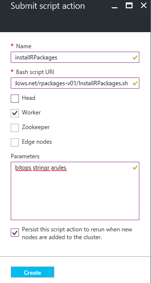

4. Select __Create__ to run the script. Once the script completes, the R packages will be available on all worker nodes.
    
## Next steps

Now that you understand how to create a new HDInsight cluster that includes R Server, and the basics of using the R console from an SSH session, use the following to discover other ways of working with R Server on HDInsight.

- [Add RStudio Server to HDInsight premium](hdinsight-hadoop-r-server-install-r-studio.md)

- [Compute context options for R Server on HDInsight premium](hdinsight-hadoop-r-server-compute-contexts.md)

- [Azure Storage options for R Server on HDInsight premium](hdinsight-hadoop-r-server-storage.md)

### Azure Resource Manager templates

If you're interested in automating the creation of R Server on HDInsight using Azure Resource Manager templates, see the following example templates.

* [Create an R Server on HDInsight cluster using an SSH public key](http://go.microsoft.com/fwlink/p/?LinkID=780809)
* [Create an R Server on HDInsight cluster using an SSH password](http://go.microsoft.com/fwlink/p/?LinkID=780810)

Both templates create a new HDInsight cluster and associated storage account, and can be used from the Azure CLI, Azure PowerShell, or the Azure Portal.

For generic information on using ARM templates, see [Create Linux-based Hadoop clusters in HDInsight using ARM templates](hdinsight-hadoop-create-linux-clusters-arm-templates.md).
