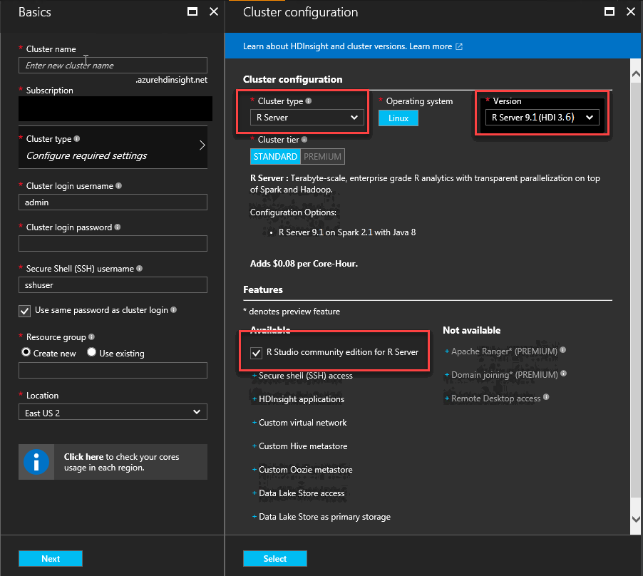
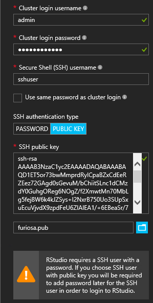
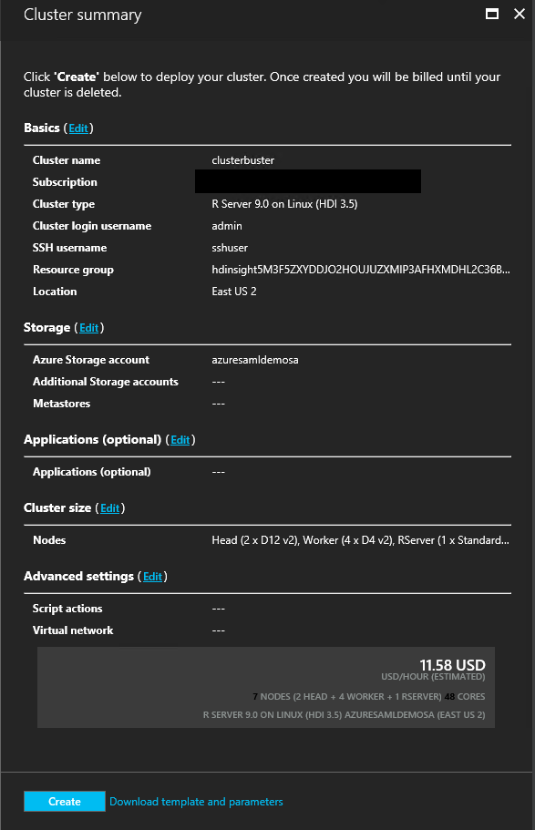
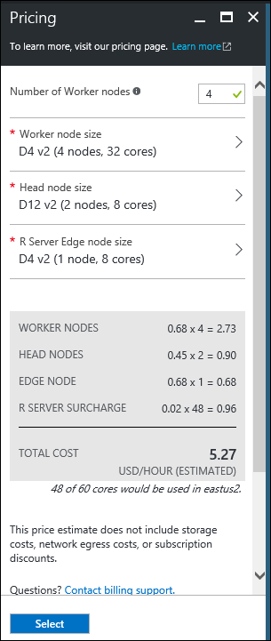
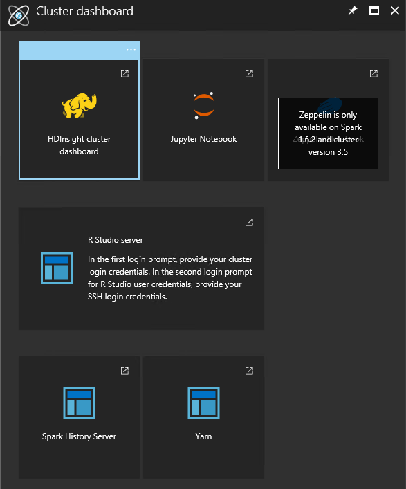
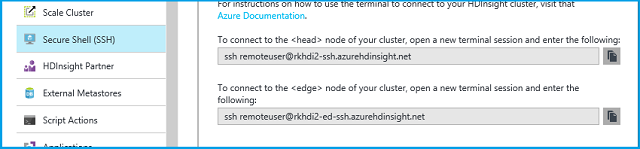
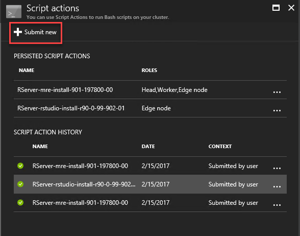
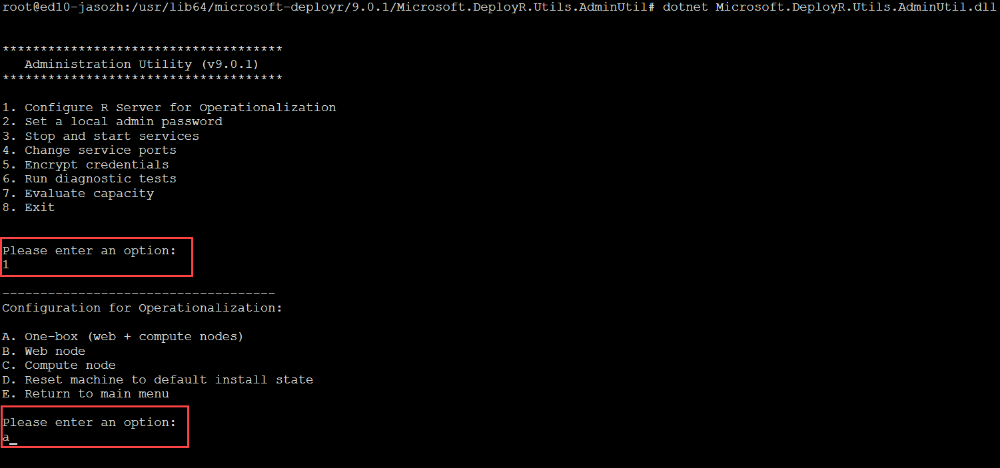
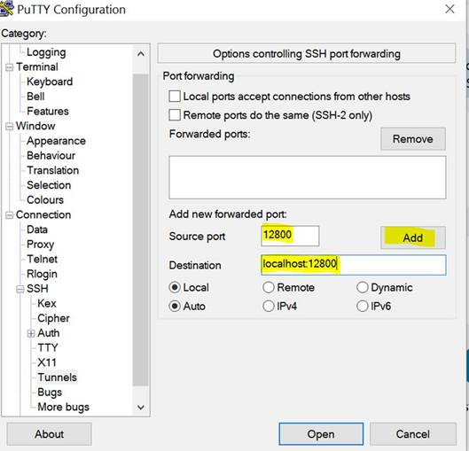

# Get started using R Server on HDInsight

HDInsight includes an R Server option to be integrated into your HDInsight cluster. This allows R scripts to use Spark and MapReduce to run distributed computations. In this document, you learn how to create an R Server on HDInsight cluster and then run an R script that demonstrates using Spark for distributed R computations.

## Prerequisites

* **An Azure subscription**: Before you begin this tutorial, you must have an Azure subscription. Go to the article [Get Microsoft Azure free trial](https://azure.microsoft.com/documentation/videos/get-azure-free-trial-for-testing-hadoop-in-hdinsight/) for more information.
* **A Secure Shell (SSH) client**: An SSH client is used to remotely connect to the HDInsight cluster and run commands directly on the cluster. For more information, see [Use SSH with HDInsight.](hdinsight-hadoop-linux-use-ssh-unix.md)
* **SSH keys (optional)**: You can secure the SSH account used to connect to the cluster using either a password or a public key. Using a password is easier, and allows you to get started without having to create a public/private key pair. However, using a key is more secure.

> [!NOTE]
> The steps in this document assume that you are using a password.

## Automated cluster creation

You can automate the creation of HDInsight R Servers using Azure Resource Manager templates, the SDK, and also PowerShell.

* To create an R Server using an Azure Resource Management template, see [Deploy an R server HDInsight cluster](https://azure.microsoft.com/resources/templates/101-hdinsight-rserver/).
* To create an R Server using the .NET SDK, see [create Linux-based clusters in HDInsight using the .NET SDK.](hdinsight-hadoop-create-linux-clusters-dotnet-sdk.md)
* To deploy R Server using powershell, see the article on [creating an R Server on HDInsight with PowerShell](hdinsight-hadoop-create-linux-clusters-azure-powershell.md).

## Create the cluster using the Azure portal

1. Sign in to the [Azure portal](https://portal.azure.com).

2. Select **NEW**, **Intelligence+ Analytics**, and then **HDInsight**.

    

3. In the **Quick create** experience, enter a name for the cluster in the **Cluster Name** field. If you have multiple Azure subscriptions, use the **Subscription** entry to select the one you want to use.

    

4. Select **Cluster type** to open the **Cluster configuration** blade. On the **Cluster Configuration** blade, select the following options:

   	* **Cluster Type**: R Server
   	* **Version**: select the version of R Server to install on the cluster. The version currently available is ***R Server 9.1 (HDI 3.6)***. Release notes for the available versions of R Server are available [here](https://msdn.microsoft.com/microsoft-r/notes/r-server-notes).
   	* **R Studio community edition for R Server**: this browser-based IDE is installed by default on the edge node. If you would prefer to not have it installed, then uncheck the check box. If you choose to have it installed, the URL for accessing the RStudio Server login is found on a portal application blade for your cluster once it’s been created.
   	* Leave the other options at the default values and use the **Select** button to save the cluster type.

   		

5. Enter a **Cluster login username** and **Cluster login password**.

   	Specify an **SSH Username**. SSH is used to remotely connect to the cluster using a **Secure Shell (SSH)** client. You can either specify the SSH user in this dialog or after the cluster has been created (in the Configuration tab for the cluster). R Server is configured to expect an **SSH username** of “remoteuser”.  **If you use a different username, you must perform an additional step after the cluster is created.**

   	Leave the box checked for **Use same password as cluster login** to use **PASSWORD** as the authentication type unless you prefer use of a public key.  You need a public/private key pair to access R Server on the cluster via a remote client as, for example, RTVS, RStudio or another desktop IDE. If you install the RStudio Server community edition, you need to choose an SSH password.     

   	To create and use a public/private key pair, uncheck **Use same password as cluster login** and then select **PUBLIC KEY** and proceed as follows. These instructions assume that you have Cygwin with ssh-keygen or an equivalent installed.

   	* Generate a public/private key pair from the command prompt on your laptop:

		ssh-keygen -t rsa -b 2048

   	* Follow the prompt to name a key file and then enter a passphrase for added security. Your screen should look something like the following:

   		

   	* This creates a private key file and a public key file under the name <private-key-filename>.pub, for example furiosa and furiosa.pub.

   		

   	* Then specify the public key file (&#42;.pub) when assigning HDI cluster credentials and finally confirm your resource group and region and select **Next**.

   		  

   * Change permissions on the private keyfile on your laptop:

		chmod 600 <private-key-filename>

   * Use the private key file with SSH for remote login:

		ssh –i <private-key-filename> remoteuser@<hostname public ip>

   	  Or, as part the definition of your Hadoop Spark compute context for R Server on the client. See the **Using Microsoft R Server as a Hadoop Client** subsection in [Create a Compute Context for Spark](https://msdn.microsoft.com/microsoft-r/scaler-spark-getting-started#creating-a-compute-context-for-spark).

6. The quick create transitions you to the **Storage** blade to select the storage account settings to be used for the primary location of the HDFS file system used by the cluster. Select either a new or existing Azure Storage account or an existing Data Lake Storage account.

	- If you select an Azure Storage account, an existing storage account is selected by choosing **Select a storage account** and then selecting the relevant account. Create a new account using the **Create New** link in the **Select a storage account** section.

      > [!NOTE]
      > If you select **New** you must enter a name for the new storage account. A green check appears if the name is accepted.

      The **Default Container** defaults to the name of the cluster. Leave this as the value.

      If a new storage account option was selected a prompt to select **Location** is given to select which region to create the storage account.  

           

      > [!IMPORTANT]
      > Selecting the location for the default data source  also sets the location of the HDInsight cluster. The cluster and default data source must be in the same region.

	- If you want to use an existing Data Lake Store, then select the ADLS storage account to use and add the cluster *ADD* identity to your cluster to allow access to the store. For more information on this process, see [Creating HDInsight cluster with Data Lake Store using Azure portal](https://docs.microsoft.com/azure/data-lake-store/data-lake-store-hdinsight-hadoop-use-portal).

   	Use the **Select** button to save the data source configuration.

7. The **Summary** blade then displays to validate all your settings. Here you can change your **Cluster size** to modify the number of servers in your cluster and also specify any **Script actions** you want to run. Unless you know that you need a larger cluster, leave the number of worker nodes at the default of `4`. The estimated cost of the cluster is shown within the blade.

   	

   > [!NOTE]
   > If needed, you can resize your cluster later through the Portal (Cluster -> Settings -> Scale Cluster) to increase or decrease the number of worker nodes.  This can be useful for idling down the cluster when not in use, or for adding capacity to meet the needs of larger tasks.
   >
   >

   Some factors to keep in mind when sizing your cluster, the data nodes, and the edge node include:  

   * The performance of distributed R Server analyses on Spark is proportional to the number of worker nodes when the data is large.  

   * The performance of R Server analyses is linear in the size of data being analyzed. For example:  

     * For small to modest data, performance is best when analyzed in a local compute context on the edge node.  For more information on the scenarios under which the local and Spark compute contexts work best, see  Compute context options for R Server on HDInsight. 
     * If you log in to the edge node and run your R script, then all but the ScaleR rx-functions are executed <strong>locally</strong> on the edge node. So the memory and number of cores of the edge node should be sized accordingly. The same applies if you use R Server on HDI as a remote compute context from your laptop.

     

     Use the **Select** button to save the node pricing configuration.

   Note that there is also a link for **Download template and parameters**. Click on this link to display scripts that can be used to automate the creation of a cluster with the selected configuration. These scripts are also available from the Azure portal entry for your cluster once it has been created.

   > [!NOTE]
   > It takes some time for the cluster to be created, usually around 20 minutes. Use the tile on the Startboard, or the **Notifications** entry on the left of the page to check on the creation process.
   >
   >

## Connect to RStudio Server

If you’ve chosen to include RStudio Server community edition in your installation then you can access the RStudio login via two different methods.

1. Either by going to the following URL (where **CLUSTERNAME** is the name of the cluster you've created):

    https://**CLUSTERNAME**.azurehdinsight.net/rstudio/

2. Or by opening the entry for your cluster in the Azure portal, selecting the R Server Dashboards quick link and then selecting the R Studio Dashboard:

     

     

   > [!IMPORTANT]
   > No matter the method, the first time you log in you need to authenticate twice.  At the first authentication, provide the cluster Admin userid and password. At the second prompt, provide the SSH userid and password. Subsequent logins only require the SSH password and userid.

## Connect to the R Server edge node

Connect to R Server edge node of the HDInsight cluster using SSH:

   `ssh USERNAME@CLUSTERNAME-ed-ssh.azurehdinsight.net`

> [!NOTE]
> You can also find the `USERNAME@CLUSTERNAME-ed-ssh.azurehdinsight.net` address in the Azure portal by selecting your cluster then **All Settings**, **Apps**, and **RServer**. This displays the SSH Endpoint information for the edge node.
>
> 
>
>

If you used a password to secure your SSH user account, you are prompted to enter it. If you used a public key, you may have to use the `-i` parameter to specify the matching private key. For example, `ssh -i ~/.ssh/id_rsa USERNAME@CLUSTERNAME-ed-ssh.azurehdinsight.net`.

For more information, see [Use SSH with HDInsight](hdinsight-hadoop-linux-use-ssh-unix.md).

Once connected, you arrive at a prompt similar to the following:

`username@ed00-myrser:~$`

## Use the R console

1. From the SSH session, use the following command to start the R console:  

		R

2. You should see output similar to the following:
	
	R version 3.2.2 (2015-08-14) -- "Fire Safety"
	Copyright (C) 2015 The R Foundation for Statistical Computing
	Platform: x86_64-pc-linux-gnu (64-bit)

	R is free software and comes with ABSOLUTELY NO WARRANTY.
	You are welcome to redistribute it under certain conditions.
	Type 'license()' or 'licence()' for distribution details.

	Natural language support but running in an English locale

	R is a collaborative project with many contributors.
	Type 'contributors()' for more information and
	'citation()' on how to cite R or R packages in publications.

	Type 'demo()' for some demos, 'help()' for on-line help, or
	'help.start()' for an HTML browser interface to help.
	Type 'q()' to quit R.

	Microsoft R Server version 8.0: an enhanced distribution of R
	Microsoft packages Copyright (C) 2016 Microsoft Corporation

	Type 'readme()' for release notes.
	>

3. From the `>` prompt, you can enter R code. R server includes packages that allow you to easily interact with Hadoop and run distributed computations. For example, use the following command to view the root of the default file system for the HDInsight cluster:

	rxHadoopListFiles("/")

4. You can also use the WASB style addressing.

	rxHadoopListFiles("wasbs:///")

## Using R Server on HDI from a remote instance of Microsoft R Server or Microsoft R Client

Regarding the preceding section on the use of public/private key pairs to access the cluster, it is also possible to set up access to the HDI Hadoop Spark compute context from a remote instance of Microsoft R Server or Microsoft R Client running on a desktop or laptop. See **Using Microsoft R Server as a Hadoop Client** subsection in the [Creating a Compute Context for Spark](https://msdn.microsoft.com/microsoft-r/scaler-spark-getting-started#creating-a-compute-context-for-spark). To do so, you need to specify the following options when defining the RxSpark compute context on your laptop: hdfsShareDir, shareDir, sshUsername, sshHostname, sshSwitches, and sshProfileScript. For example:

    myNameNode <- "default"
    myPort <- 0

    mySshHostname  <- 'rkrrehdi1-ed-ssh.azurehdinsight.net'  # HDI secure shell hostname
    mySshUsername  <- 'remoteuser'# HDI SSH username
    mySshSwitches  <- '-i /cygdrive/c/Data/R/davec'   # HDI SSH private key

    myhdfsShareDir <- paste("/user/RevoShare", mySshUsername, sep="/")
    myShareDir <- paste("/var/RevoShare" , mySshUsername, sep="/")

    mySparkCluster <- RxSpark(
      hdfsShareDir = myhdfsShareDir,
      shareDir     = myShareDir,
      sshUsername  = mySshUsername,
      sshHostname  = mySshHostname,
      sshSwitches  = mySshSwitches,
      sshProfileScript = '/etc/profile',
      nameNode     = myNameNode,
      port         = myPort,
      consoleOutput= TRUE
    )

## Use a compute context

A compute context allows you to control whether computation is performed locally on the edge node or distributed across the nodes in the HDInsight cluster.

1. From RStudio Server or the R console (in an SSH session), use the following to load example data into the default storage for HDInsight:

        # Set the HDFS (WASB) location of example data
        bigDataDirRoot <- "/example/data"

        # create a local folder for storaging data temporarily
        source <- "/tmp/AirOnTimeCSV2012"
        dir.create(source)

        # Download data to the tmp folder
        remoteDir <- "http://packages.revolutionanalytics.com/datasets/AirOnTimeCSV2012"
        download.file(file.path(remoteDir, "airOT201201.csv"), file.path(source, "airOT201201.csv"))
        download.file(file.path(remoteDir, "airOT201202.csv"), file.path(source, "airOT201202.csv"))
        download.file(file.path(remoteDir, "airOT201203.csv"), file.path(source, "airOT201203.csv"))
        download.file(file.path(remoteDir, "airOT201204.csv"), file.path(source, "airOT201204.csv"))
        download.file(file.path(remoteDir, "airOT201205.csv"), file.path(source, "airOT201205.csv"))
        download.file(file.path(remoteDir, "airOT201206.csv"), file.path(source, "airOT201206.csv"))
        download.file(file.path(remoteDir, "airOT201207.csv"), file.path(source, "airOT201207.csv"))
        download.file(file.path(remoteDir, "airOT201208.csv"), file.path(source, "airOT201208.csv"))
        download.file(file.path(remoteDir, "airOT201209.csv"), file.path(source, "airOT201209.csv"))
        download.file(file.path(remoteDir, "airOT201210.csv"), file.path(source, "airOT201210.csv"))
        download.file(file.path(remoteDir, "airOT201211.csv"), file.path(source, "airOT201211.csv"))
        download.file(file.path(remoteDir, "airOT201212.csv"), file.path(source, "airOT201212.csv"))

        # Set directory in bigDataDirRoot to load the data into
        inputDir <- file.path(bigDataDirRoot,"AirOnTimeCSV2012")

        # Make the directory
        rxHadoopMakeDir(inputDir)

        # Copy the data from source to input
        rxHadoopCopyFromLocal(source, bigDataDirRoot)

2. Next, let's create some data info and define two data sources so that we can work with the data.

        # Define the HDFS (WASB) file system
        hdfsFS <- RxHdfsFileSystem()

        # Create info list for the airline data
        airlineColInfo <- list(
             DAY_OF_WEEK = list(type = "factor"),
             ORIGIN = list(type = "factor"),
             DEST = list(type = "factor"),
             DEP_TIME = list(type = "integer"),
             ARR_DEL15 = list(type = "logical"))

        # get all the column names
        varNames <- names(airlineColInfo)

        # Define the text data source in hdfs
        airOnTimeData <- RxTextData(inputDir, colInfo = airlineColInfo, varsToKeep = varNames, fileSystem = hdfsFS)

        # Define the text data source in local system
        airOnTimeDataLocal <- RxTextData(source, colInfo = airlineColInfo, varsToKeep = varNames)

        # formula to use
        formula = "ARR_DEL15 ~ ORIGIN + DAY_OF_WEEK + DEP_TIME + DEST"

3. Let's run a logistic regression over the data using the local compute context.

        # Set a local compute context
        rxSetComputeContext("local")

        # Run a logistic regression
        system.time(
           modelLocal <- rxLogit(formula, data = airOnTimeDataLocal)
        )

        # Display a summary
        summary(modelLocal)

    You should see output that ends with lines similar to the following:

        Data: airOnTimeDataLocal (RxTextData Data Source)
        File name: /tmp/AirOnTimeCSV2012
        Dependent variable(s): ARR_DEL15
        Total independent variables: 634 (Including number dropped: 3)
        Number of valid observations: 6005381
        Number of missing observations: 91381
        -2*LogLikelihood: 5143814.1504 (Residual deviance on 6004750 degrees of freedom)

        Coefficients:
                         Estimate Std. Error z value Pr(>|z|)
         (Intercept)   -3.370e+00  1.051e+00  -3.208  0.00134 **
         ORIGIN=JFK     4.549e-01  7.915e-01   0.575  0.56548
         ORIGIN=LAX     5.265e-01  7.915e-01   0.665  0.50590
         ......
         DEST=SHD       5.975e-01  9.371e-01   0.638  0.52377
         DEST=TTN       4.563e-01  9.520e-01   0.479  0.63172
         DEST=LAR      -1.270e+00  7.575e-01  -1.676  0.09364 .
         DEST=BPT         Dropped    Dropped Dropped  Dropped

         ---

         Signif. codes:  0 ‘***’ 0.001 ‘**’ 0.01 ‘*’ 0.05 ‘.’ 0.1 ‘ ’ 1

         Condition number of final variance-covariance matrix: 11904202
         Number of iterations: 7

4. Next, let's run the same logistic regression using the Spark context. The Spark context distributes the processing over all the worker nodes in the HDInsight cluster.

        # Define the Spark compute context
        mySparkCluster <- RxSpark()

        # Set the compute context
        rxSetComputeContext(mySparkCluster)

        # Run a logistic regression
        system.time(  
           modelSpark <- rxLogit(formula, data = airOnTimeData)
        )
        
        # Display a summary
        summary(modelSpark)

   > [!NOTE]
   > You can also use MapReduce to distribute computation across cluster nodes. For more information on compute context, see [Compute context options for R Server on HDInsight](hdinsight-hadoop-r-server-compute-contexts.md).

## Distribute R code to multiple nodes

With R Server, you can easily take existing R code and run it across multiple nodes in the cluster by using `rxExec`. This is useful when doing a parameter sweep or simulations. The following is an example of how to use `rxExec`:

	rxExec( function() {Sys.info()["nodename"]}, timesToRun = 4 )

If you are still using the Spark or MapReduce context, this returns the nodename value for the worker nodes that the code `(Sys.info()["nodename"])` is run on. For example, on a four node cluster, you may receive output similar to the following:

    $rxElem1
        nodename
    "wn3-myrser"

    $rxElem2
        nodename
    "wn0-myrser"

    $rxElem3
        nodename
    "wn3-myrser"

    $rxElem4
        nodename
    "wn3-myrser"

## Accessing Data in Hive and Parquet

A feature available in R Server 9.1 allows direct access to data in Hive and Parquet for use by ScaleR functions in the Spark compute context. These capabilities are available through new ScaleR data source functions called RxHiveData and RxParquetData that work through use of Spark SQL to load data directly into a Spark DataFrame for analysis by ScaleR.  

The following provides some sample code on use of the new functions:

    #Create a Spark compute context:
    myHadoopCluster <- rxSparkConnect(reset = TRUE)

    #Retrieve some sample data from Hive and run a model:
    hiveData <- RxHiveData("select * from hivesampletable",
                     colInfo = list(devicemake = list(type = "factor")))
    rxGetInfo(hiveData, getVarInfo = TRUE)

    rxLinMod(querydwelltime ~ devicemake, data=hiveData)

    #Retrieve some sample data from Parquet and run a model:
    rxHadoopMakeDir('/share')
    rxHadoopCopyFromLocal(file.path(rxGetOption('sampleDataDir'), 'claimsParquet/'), '/share/')
    pqData <- RxParquetData('/share/claimsParquet',
                     colInfo = list(
    		    age    = list(type = "factor"),
    		   car.age = list(type = "factor"),
    		      type = list(type = "factor")
    		 ) )
    rxGetInfo(pqData, getVarInfo = TRUE)

    rxNaiveBayes(type ~ age + cost, data = pqData)

    #Check on Spark data objects, cleanup, and close the Spark session:
    lsObj <- rxSparkListData() # two data objs are cached
    lsObj
    rxSparkRemoveData(lsObj)
    rxSparkListData() # it should show empty list
    rxSparkDisconnect(myHadoopCluster)

For additional info on use of these new functions see the online help in R Server through use of the `?RxHivedata` and `?RxParquetData` commands.  

## Install R packages

If you would like to install additional R packages on the edge node, you can use `install.packages()` directly from within the R console when connected to the edge node through SSH. However, if you need to install R packages on the worker nodes of the cluster, you must use a Script Action.

Script Actions are Bash scripts that are used to make configuration changes to the HDInsight cluster, or to install additional software. In this case, to install additional R packages. To install additional packages using a Script Action, use the following steps:

> [!IMPORTANT]
> Using Script Actions to install additional R packages can only be used after the cluster has been created. Do not use this procedure during cluster creation, as the script relies on R Server being completely installed and configured.
>
>

1. From the [Azure portal](https://portal.azure.com), select your R Server on HDInsight cluster.

2. From the **Settings** blade, select **Script Actions** and then **Submit New** to submit a new Script Action.

   

3. From the **Submit script action** blade, provide the following information:

   * **Name**: A friendly name to identify this script

   * **Bash script URI**: `http://mrsactionscripts.blob.core.windows.net/rpackages-v01/InstallRPackages.sh`

   * **Head**: This should be **unchecked**

   * **Worker**: This should be **checked**

   * **Edge nodes**: This should be **unchecked**.

   * **Zookeeper**: This should be **unchecked**

   * **Parameters**: The R packages to be installed. For example, `bitops stringr arules`

   * **Persist this script...**: This should be **Checked**  

   > [!NOTE]
   > 1. By default, all R packages are installed from a snapshot of the Microsoft MRAN repository consistent with the version of R Server that has been installed.  If you would like to install newer versions of packages then there is some risk of incompatibility, however this is possible by specifying `useCRAN` as the first element of the package list, for example `useCRAN bitops, stringr, arules`.  
   > 2. Some R packages require additional Linux system libraries. For convenience, we have pre-installed the dependencies needed by the top 100 most popular R packages. However, if the R package(s) you install require libraries beyond these then you must download the base script used here and add steps to install the system libraries. You must then upload the modified script to a public blob container in Azure storage and use the modified script to install the packages.
   >    For more information on developing Script Actions, see [Script Action development](hdinsight-hadoop-script-actions-linux.md).  
   >
   >

   

4. Select **Create** to run the script. Once the script completes, the R packages are available on all worker nodes.

## Using Microsoft R Server Operationalization

When your data modeling is complete, you can operationalize the model to make predictions. To configure for Microsoft R Server operationalization perform the following steps:

First, ssh into the Edge node. For example, 

	ssh -L USERNAME@CLUSTERNAME-ed-ssh.azurehdinsight.net

After using ssh, change directory to the following directory and sudo the dotnet dll:

	cd /usr/lib64/microsoft-deployr/9.0.1/Microsoft.DeployR.Utils.AdminUtil
	sudo dotnet Microsoft.DeployR.Utils.AdminUtil.dll

To configure Microsoft R Server operationalization with a One-box configuration do the following:

1. Select “Configure R Server for Operationalization”
2. Select “A. One-box (web + compute nodes)”
3. Enter a password for the **admin** user

As an optional step you can perform Diagnostic checks by running a diagnostic test as follows:

1. Select “6. Run diagnostic tests”
2. Select “A. Test configuration”
3. Enter Username = “admin” and password from previous configuration step
4. Confirm Overall Health = pass
5. Exit the Admin Utility
6. Exit SSH

At this stage, the configuration for Operationalization is complete. Now you can use the ‘mrsdeploy’ package on your RClient to connect to the Operationalization on Edge node and start using its features like [remote execution](https://msdn.microsoft.com/microsoft-r/operationalize/remote-execution) and [web-services](https://msdn.microsoft.com/microsoft-r/mrsdeploy/mrsdeploy-websrv-vignette). Depending on whether your cluster is set up on a virtual network or not, you may need to set up port forward tunneling through SSH login. The following sections explain how to do this.

### RServer Cluster on virtual network

Make sure you allow traffic through port 12800 to the Edge node. That way, you can use the Edge node to connect to the Operationalization feature.

	library(mrsdeploy)

	remoteLogin(
    	deployr_endpoint = "http://[your-cluster-name]-ed-ssh.azurehdinsight.net:12800",
    	username = "admin",
    	password = "xxxxxxx"
	)

If the remoteLogin() cannot connect to the Edge node, but if you can SSH to the Edge node, you need to verify if the rule to allow traffic on port 12800 has been set properly or not. If you continue to face the issue, you can use a workaround by setting up port forward tunneling through SSH.

### RServer Cluster not set up on virtual network

If your cluster is not set up on vnet OR if you are having troubles with connectivity through vnet, you can use SSH port forward tunneling:

	ssh -L localhost:12800:localhost:12800 USERNAME@CLUSTERNAME-ed-ssh.azurehdinsight.net

On Putty, you can set it up as well.

Once your SSH session is active, the traffic from your machine’s port 12800 is forwarded to the Edge node’s port 12800 through SSH session. Make sure you use `127.0.0.1:12800` in your remoteLogin() method. This logs in to the Edge node’s operationalization through port forwarding.

	library(mrsdeploy)

	remoteLogin(
    	deployr_endpoint = "http://127.0.0.1:12800",
    	username = "admin",
    	password = "xxxxxxx"
	)

## How to scale Microsoft R Server Operationalization compute nodes on HDInsight worker nodes

### Decommission the worker node(s)

Microsoft R Server is currently not managed through Yarn. If the worker nodes are not decommissioned, the Yarn Resource Manager will not work as expected because it will not be aware of the resources being taken up by the server. In order to avoid this situation, we recommend decommissioning the worker nodes before you scale out the compute nodes.

Steps to decommissioning worker nodes:

* Log in to HDI cluster's Ambari console and click on "hosts" tab
* Select worker nodes (to be decommissioned), Click on "Actions" > "Selected Hosts" > "Hosts" > click on "Turn ON Maintenance Mode". For example, in the following image we have selected wn3 and wn4 to decommission.  

     

* Select **Actions** > **Selected Hosts** > **DataNodes** > click **Decommission**
* Select **Actions** > **Selected Hosts** > **NodeManagers** > click **Decommission**
* Select **Actions** > **Selected Hosts** > **DataNodes** > click **Stop**
* Select **Actions** > **Selected Hosts** > **NodeManagers** > click on **Stop**
* Select **Actions** > **Selected Hosts** > **Hosts** > click **Stop All Components**
* Unselect the worker nodes and select the head nodes
* Select **Actions** > **Selected Hosts** > "**Hosts** > **Restart All Components**

###	Configure Compute nodes on each decommissioned worker node(s)

1. SSH into each decommissioned worker node.
2. Run admin utility using `dotnet /usr/lib64/microsoft-deployr/9.0.1/Microsoft.DeployR.Utils.AdminUtil/Microsoft.DeployR.Utils.AdminUtil.dll`.
3. Enter "1" to select option "Configure R Server for Operationalization".
4. Enter "c" to select option "C. Compute node". This configures the compute node on the worker node.
5. Exit the Admin Utility.

### Add compute nodes details on Web Node

Once all decommissioned worker nodes have been configured to run compute node, come back on the Edge node and add decommissioned worker nodes' IP addresses in the Microsoft R Server web node's configuration:

* SSH into the Edge node.
* Run `vi /usr/lib64/microsoft-deployr/9.0.1/Microsoft.DeployR.Server.WebAPI/appsettings.json`.
* Look for the "URIs" section, and add worker node's IP and port details.

	

## Troubleshoot

If you run into issues with creating HDInsight clusters, see [access control requirements](hdinsight-administer-use-portal-linux.md#create-clusters).

## Next steps

Now you should understand how to create a new HDInsight cluster that includes the R Server and the basics of using the R console from an SSH session. The following topics explain other ways of managing and working with R Server on HDInsight:

* [Add RStudio Server to HDInsight (if not installed during cluster creation)](hdinsight-hadoop-r-server-install-r-studio.md)
* [Compute context options for R Server on HDInsight](hdinsight-hadoop-r-server-compute-contexts.md)
* [Azure Storage options for R Server on HDInsight](hdinsight-hadoop-r-server-storage.md)
