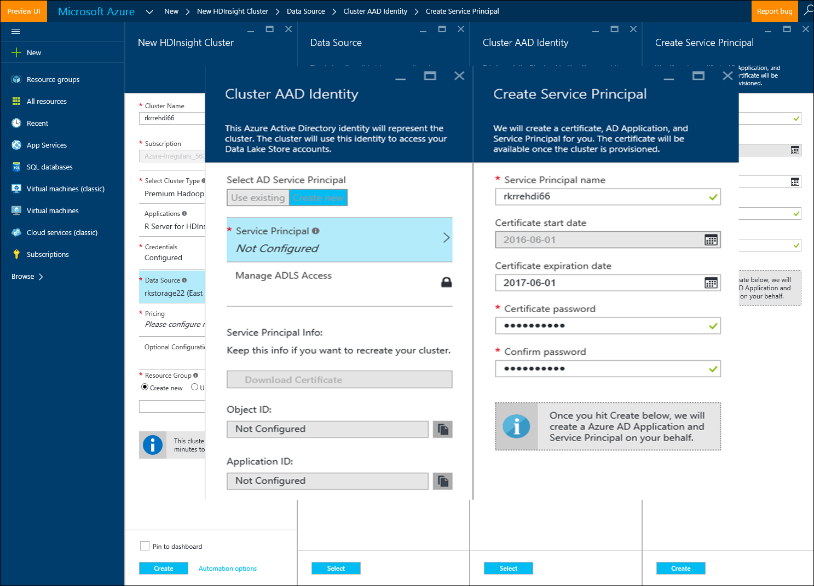
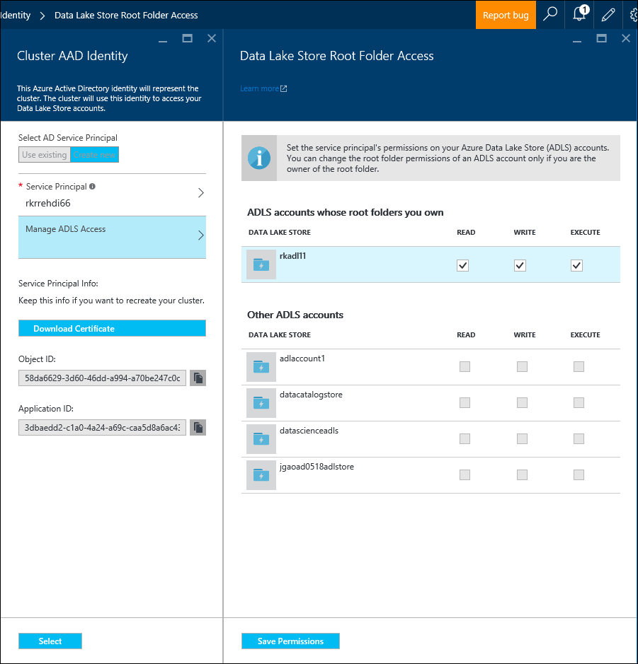

<properties
   pageTitle="Azure Storage options for R Server on HDInsight (preview) | Microsoft Azure"
   description="Learn about the different storage options available to users with R Server on HDInsight (preview)"
   services="HDInsight"
   documentationCenter=""
   authors="jeffstokes72"
   manager="paulettem"
   editor="cgronlun"
/>

<tags
   ms.service="HDInsight"
   ms.devlang="R"
   ms.topic="article"
   ms.tgt_pltfrm="na"
   ms.workload="data-services"
   ms.date="06/01/2016"
   ms.author="jeffstok"
/>

# Azure Storage options for R Server on HDInsight (preview)

Microsoft R Server on HDInsight (preview) has access to both Azure Blob and [Azure Data Lake Storage](https://azure.microsoft.com/services/data-lake-store/), as a means of persisting data, code, result objects from analysis, and so on.

When you create a Hadoop cluster in HDInsight, you specify an Azure storage account. A specific Blob storage container from that account holds the file system for the cluster you create (for example, the Hadoop Distributed File System). For performance purposes, the HDInsight cluster is created in the same data center as the primary storage account that you specify. For more information, see [Use Azure Blob storage with HDInsight](hdinsight-hadoop-use-blob-storage.md "Use Azure Blob storage with HDInsight").   


## Use multiple Azure Blob storage accounts

If necessary, you can access multiple Azure storage accounts or containers with your HDI cluster. To do so, you need to specify the additional storage accounts in the UI when you create the cluster, and then follow these steps to use them in R.  

1.	Create an HDInsight cluster with a storage account name of **storage1** and a default container called **container1**.
2. Specify an additional storage account called **storage2**.  
3. Copy the mycsv.csv file to the /share directory, and perform analysis on that file.  

````
hadoop fs –mkdir /share
hadoop fs –copyFromLocal myscsv.scv /share  
````

3.	In R code, set the name node to **default,** and set your directory and file to process.  

````
myNameNode <- "default"
myPort <- 0
````

  Location of the data:  

    bigDataDirRoot <- "/share"  

  Define Spark compute context:

    mySparkCluster <- RxSpark(consoleOutput=TRUE)

  Set compute context:

    rxSetComputeContext(mySparkCluster)

  Define the Hadoop Distributed File System (HDFS) file system:

    hdfsFS <- RxHdfsFileSystem(hostName=myNameNode, port=myPort)

  Specify the input file to analyze in HDFS:

    inputFile <-file.path(bigDataDirRoot,"mycsv.csv")

All of the directory and file references point to the storage account wasbs://container1@storage1.blob.core.windows.net. This is the **default storage account** that's associated with the HDInsight cluster.

Now, suppose you want to process a file called mySpecial.csv that's located in the  /private directory of **container2** in **storage2**.

In your R code, point the name node reference to the **storage2** storage account.

    myNameNode <- "wasbs://container2@storage2.blob.core.windows.net"
    myPort <- 0

  Location of the data:

    bigDataDirRoot <- "/private"

  Define Spark compute context:

    mySparkCluster <- RxSpark(consoleOutput=TRUE)

  Set compute context:

    rxSetComputeContext(mySparkCluster)

  Define HDFS file system:

    hdfsFS <- RxHdfsFileSystem(hostName=myNameNode, port=myPort)

  Specify the input file to analyze in HDFS:

    inputFile <-file.path(bigDataDirRoot,"mySpecial.csv")

All of the directory and file references now point to the storage account wasbs://container2@storage2.blob.core.windows.net. This is the **Name Node** that you’ve specified.

Note that you will have to configure the /user/RevoShare/<SSH username> directory on **storage2** as follows:

    hadoop fs -mkdir wasbs://container2@storage2.blob.core.windows.net/user
    hadoop fs -mkdir wasbs://container2@storage2.blob.core.windows.net/user/RevoShare
    hadoop fs -mkdir wasbs://container2@storage2.blob.core.windows.net/user/RevoShare/<RDP username>

## Use an Azure Data Lake store

To use Data Lake stores with your HDInsight account, you need to give your cluster access to each Azure Data Lake store that you want to use. You use the store in your R script much like you use a secondary storage account (as described in the previous procedure).

## Add cluster access to your Azure Data Lake stores

You access a Data Lake store by using an Azure Active Directory (Azure AD) Service Principal that's associated with your HDInsight cluster.

### To add a Service Principal
1. When you create your HDInsight cluster, select **Cluster AAD Identity** from the **Data Source** tab.
2. In the **Cluster AAD Identity** dialog box, under **Select AD Service Principal**, select **Create new**.

After you give the Service Principal a name and create a password for it, a new tab opens where you can associate the Service Principal with your Data Lake stores.

Note that you can also add access to a Data Lake store later by opening the Data Lake store in the Azure portal and going to **Data Explorer** > **Access**.  Following is an example of a dialog box that shows how to create a Service Principal and associate it with the “rkadl11” Data Lake store.






## Use the Data Lake store with R Server
Once you’ve given access to a Data Lake store, you can use the store in R Server on HDInsight the way you would a secondary Azure storage account. The only difference is that the prefix **wasb://** changes to **adl://** as follows:

````
# Point to the ADL store (e.g. ADLtest)
myNameNode <- "adl://rkadl1.azuredatalakestore.net"
myPort <- 0

# Location of the data (assumes a /share directory on the ADL account)
bigDataDirRoot <- "/share"  

# Define Spark compute context
mySparkCluster <- RxSpark(consoleOutput=TRUE)

# Set compute context
rxSetComputeContext(mySparkCluster)

# Define HDFS file system
hdfsFS <- RxHdfsFileSystem(hostName=myNameNode, port=myPort)

# Specify the input file in HDFS to analyze
inputFile <-file.path(bigDataDirRoot,"AirlineDemoSmall.csv")

# Create factors for days of the week
colInfo <- list(DayOfWeek = list(type = "factor",
               levels = c("Monday", "Tuesday", "Wednesday", "Thursday",
                          "Friday", "Saturday", "Sunday")))

# Define the data source
airDS <- RxTextData(file = inputFile, missingValueString = "M",
                    colInfo  = colInfo, fileSystem = hdfsFS)

# Run a linear regression
model <- rxLinMod(ArrDelay~CRSDepTime+DayOfWeek, data = airDS)
````

Following are the commands that are used to configure the Data Lake storage account with the RevoShare directory and add the sample .csv file from the previous example:

````
hadoop fs -mkdir adl://rkadl1.azuredatalakestore.net/user
hadoop fs -mkdir adl://rkadl1.azuredatalakestore.net/user/RevoShare
hadoop fs -mkdir adl://rkadl1.azuredatalakestore.net/user/RevoShare/<user>

hadoop fs -mkdir adl://rkadl1.azuredatalakestore.net/share

hadoop fs -copyFromLocal /usr/lib64/R Server-7.4.1/library/RevoScaleR/SampleData/AirlineDemoSmall.csv adl://rkadl1.azuredatalakestore.net/share

hadoop fs –ls adl://rkadl1.azuredatalakestore.net/share
````

## Use Azure Files on the edge node

There is also a convenient data storage option for use on the edge node called [Azure Files](../storage/storage-how-to-use-files-linux.md "Azure Files"). It enables you to mount an Azure Storage file share to the Linux file system. This can be handy for storing data files, R scripts, and result objects that might be needed later when it makes sense to use the native file system on the edge node rather than HDFS.

A major benefit of Azure Files is that the file shares can be mounted and used by any system that has a supported OS such as Windows or Linux. For example, it can be used by another HDInsight cluster that you or someone on your team has, by an Azure VM, or even by an on-premises system.


## Next steps

Now that you understand the basics of how to use the R console from an SSH session, and how to create a new HDInsight cluster that includes R Server, use the following links to discover other ways of working with R Server on HDInsight.

- [Overview of R Server on HDInsight](hdinsight-hadoop-r-server-overview.md)
- [Get started with R server on Hadoop](hdinsight-hadoop-r-server-get-started.md)
- [Add RStudio Server to HDInsight premium](hdinsight-hadoop-r-server-install-r-studio.md)
- [Compute context options for R Server on HDInsight](hdinsight-hadoop-r-server-compute-contexts.md)
