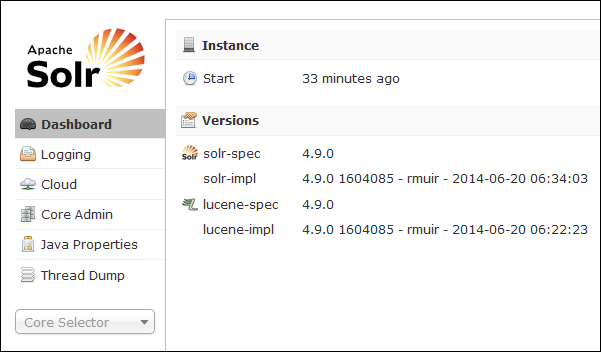
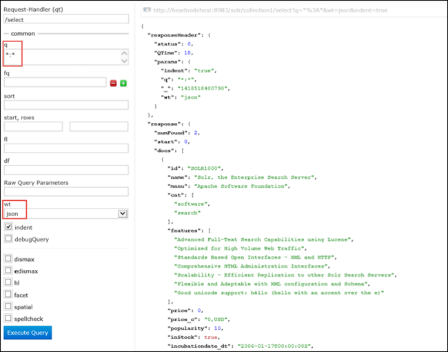

<properties
	pageTitle="Use Script Action to install Solr on Linux-based HDInsight | Microsoft Azure"
	description="Learn how to install Solr on Linux-based HDInsight Hadoop clusters using Script Actions."
	services="hdinsight"
	documentationCenter=""
	authors="Blackmist"
	manager="paulettm"
	editor="cgronlun"
	tags="azure-portal"/>

<tags
	ms.service="hdinsight"
	ms.workload="big-data"
	ms.tgt_pltfrm="na"
	ms.devlang="na"
	ms.topic="article"
	ms.date="07/27/2016"
	ms.author="larryfr"/>

# Install and use Solr on HDInsight Hadoop clusters

In this topic, you will learn how to install Solr on Azure HDInsight by using Script Action. Solr is a powerful search platform and provides enterprise-level search capabilities on data managed by Hadoop. Once you have installed Solr on HDInsight cluster, you'll also learn how to search data by using Solr.

> [AZURE.NOTE] The steps in this document require a Linux-based HDInsight cluster. For information on using Solr with a Windows-based cluster, see [Install and use Solr on HDinsight Hadoop clusters (Windows)](hdinsight-hadoop-solr-install.md)

The sample script used in this topic creates a Solr cluster with a specific configuration. If you want to configure the Solr cluster with different collections, shards, schemas, replicas, etc., you must modify the script and Solr binaries accordingly.

## What is Solr?

[Apache Solr](http://lucene.apache.org/solr/features.html) is an enterprise search platform that enables powerful full-text search on data. While Hadoop enables storing and managing vast amounts of data, Apache Solr provides the search capabilities to quickly retrieve the data. This topic provides instructions on how to customize an HDInsight cluster to install Solr.

> [AZURE.WARNING] Components provided with the HDInsight cluster are fully supported and Microsoft Support will help to isolate and resolve issues related to these components.
>
> Custom components, such as Solr, receive commercially reasonable support to help you to further troubleshoot the issue. This might result in resolving the issue OR asking you to engage available channels for the open source technologies where deep expertise for that technology is found. For example, there are many community sites that can be used, like: [MSDN forum for HDInsight](https://social.msdn.microsoft.com/Forums/azure/en-US/home?forum=hdinsight), [http://stackoverflow.com](http://stackoverflow.com). Also Apache projects have project sites on [http://apache.org](http://apache.org), for example: [Hadoop](http://hadoop.apache.org/).

## What the script does

This script makes the following changes to the HDInsight cluster:

* Installs Solr into `/usr/hdp/current/solr`
* Creates a new user, __solrusr__, which is used to run the Solr service
* Sets __solruser__ as the owner of `/usr/hdp/current/solr`
* Adds an [Upstart](http://upstart.ubuntu.com/) configuration that will start Solr if a cluster node restarts. Solr is also automatically started on the cluster nodes after installation

## Install Solr using Script Actions

A sample script to install Solr on an HDInsight cluster is available at the following location.

    https://hdiconfigactions.blob.core.windows.net/linuxsolrconfigactionv01/solr-installer-v01.sh

This section provides instructions on how to use the sample script when creating a new cluster by using the Azure portal. 

> [AZURE.NOTE] Azure PowerShell, the Azure CLI, the HDInsight .NET SDK, or Azure Resource Manager templates can also be used to apply script actions. You can also apply script actions to already running clusters. For more information, see [Customize HDInsight clusters with Script Actions](hdinsight-hadoop-customize-cluster-linux.md).

1. Start provisioning a cluster by using the steps in [Provision Linux-based HDInsight clusters](hdinsight-provision-linux-clusters.md#portal), but do not complete provisioning.

2. On the **Optional Configuration** blade, select **Script Actions**, and provide the information below:

	* __NAME__: Enter a friendly name for the script action.
	* __SCRIPT URI__: https://hdiconfigactions.blob.core.windows.net/linuxsolrconfigactionv01/solr-installer-v01.sh
	* __HEAD__: Check this option
	* __WORKER__: Check this option
	* __ZOOKEEPER__: Check this option to install on the Zookeeper node
	* __PARAMETERS__: Leave this field blank

3. At the bottom of the **Script Actions**, use the **Select** button to save the configuration. Finally, use the **Select** button at the bottom of the **Optional Configuration** blade to save the optional configuration information.

4. Continue provisioning the cluster as described in [Provision Linux-based HDInsight clusters](hdinsight-hadoop-create-linux-clusters-portal.md).

## How do I use Solr in HDInsight?

### Indexing data

You must start with indexing Solr with some data files. You can then use Solr to run search queries on the indexed data. Use the following steps to add some example data to Solr, and then query it:

1. Connect to the HDInsight cluster using SSH:

		ssh USERNAME@CLUSTERNAME-ssh.azurehdinsight.net

	For more information on using SSH with HDInsight, see the following:

	* [Use SSH with Linux-based Hadoop on HDInsight from Linux, Unix, or OS X](hdinsight-hadoop-linux-use-ssh-unix.md)

	* [Use SSH with Linux-based Hadoop on HDInsight from Windows](hdinsight-hadoop-linux-use-ssh-windows.md)

	> [AZURE.IMPORTANT] Steps later in this document make use of an SSL tunnel to connect to the Solr web UI. In order to use these steps, you must establish an SSL tunnel and then configure your browser to use it.
	>
	> For more information, see [Use SSH Tunneling to access Ambari web UI, ResourceManager, JobHistory, NameNode, Oozie, and other web UI's](hdinsight-linux-ambari-ssh-tunnel.md)

2. Use the following commands to have Solr index sample data:

		cd /usr/hdp/current/solr/example/exampledocs
		java -jar post.jar solr.xml monitor.xml

	You'll see the following output on the console:

		POSTing file solr.xml
		POSTing file monitor.xml
		2 files indexed.
		COMMITting Solr index changes to http://localhost:8983/solr/update..
		Time spent: 0:00:01.624

	The post.jar utility indexes Solr with two sample documents, **solr.xml** and **monitor.xml**. These will be stored in __collection1__ within Solr.

3. Use the following to query the REST API exposed by Solr:

		curl "http://localhost:8983/solr/collection1/select?q=*%3A*&wt=json&indent=true"

	This issues a query against __collection1__ for any documents matching __\*:\*__ (encoded as \*%3A\* in the query string,) and that the response should be returned as JSON. The response should appear similar to the following:

			"response": {
			    "numFound": 2,
			    "start": 0,
			    "maxScore": 1,
			    "docs": [
			      {
			        "id": "SOLR1000",
			        "name": "Solr, the Enterprise Search Server",
			        "manu": "Apache Software Foundation",
			        "cat": [
			          "software",
			          "search"
			        ],
			        "features": [
			          "Advanced Full-Text Search Capabilities using Lucene",
			          "Optimized for High Volume Web Traffic",
			          "Standards Based Open Interfaces - XML and HTTP",
			          "Comprehensive HTML Administration Interfaces",
			          "Scalability - Efficient Replication to other Solr Search Servers",
			          "Flexible and Adaptable with XML configuration and Schema",
			          "Good unicode support: héllo (hello with an accent over the e)"
			        ],
			        "price": 0,
			        "price_c": "0,USD",
			        "popularity": 10,
			        "inStock": true,
			        "incubationdate_dt": "2006-01-17T00:00:00Z",
			        "_version_": 1486960636996878300
			      },
			      {
			        "id": "3007WFP",
			        "name": "Dell Widescreen UltraSharp 3007WFP",
			        "manu": "Dell, Inc.",
			        "manu_id_s": "dell",
			        "cat": [
			          "electronics and computer1"
			        ],
			        "features": [
			          "30\" TFT active matrix LCD, 2560 x 1600, .25mm dot pitch, 700:1 contrast"
			        ],
			        "includes": "USB cable",
			        "weight": 401.6,
			        "price": 2199,
			        "price_c": "2199,USD",
			        "popularity": 6,
			        "inStock": true,
			        "store": "43.17614,-90.57341",
			        "_version_": 1486960637584081000
			      }
			    ]
			  }

### Using the Solr dashboard

The Solr dashboard is a web UI that allows you to work with Solr through your web browser. The Solr dashboard is not exposed directly on the Internet from your HDInsight cluster, but must be accessed using an SSH tunnel. For more information on using an SSH tunnel, see [Use SSH Tunneling to access Ambari web UI, ResourceManager, JobHistory, NameNode, Oozie, and other web UI's](hdinsight-linux-ambari-ssh-tunnel.md)

Once you have established an SSH tunnel, use the following steps to use the Solr dashboard:

1. Determine the host name for the head node:

    1. In a browser, go to https://CLUSTERNAME.azurehdinsight.net. When prompted, use the Admin username and password to authenticate to the site.
    
    2. From the menu at the top of the page, select __Hosts__.
    
    3. Select the entry that begins with __hn0__. When the page opens, the host name will be displayed at the top. The format of the host name is __hn0-PARTOFCLUSTERNAME.randomcharacters.cx.internal.cloudapp.net__. This is the host name you must use when connecting to the Solr dashboard.
    
1. In your browser, connect to __http://HOSTNAME:8983/solr/#/__, where __HOSTNAME__ is the name you determined in the previous steps. 

    The request should be routed through the SSH tunnel to the head node for your HDInsight cluster. You should see a page similar to the following:

	

2. From the left pane, use the **Core Selector** drop-down to select **collection1**. Several entries should them appear below __collection1__.

3. From the entries below __collection1__, select __Query__. Use the following values to populate the search page:

	* In the **q** text box, enter **\*:**\*. This will return all the documents that are indexed in Solr. If you want to search for a specific string within the documents, you can enter that string here.

	* In the **wt** text box, select the output format. Default is **json**.

	Finally, select the **Execute Query** button at the bottom of the search pate.

	

	The output returns the two docs that we used for indexing Solr. The output resembles the following:

			"response": {
			    "numFound": 2,
			    "start": 0,
			    "maxScore": 1,
			    "docs": [
			      {
			        "id": "SOLR1000",
			        "name": "Solr, the Enterprise Search Server",
			        "manu": "Apache Software Foundation",
			        "cat": [
			          "software",
			          "search"
			        ],
			        "features": [
			          "Advanced Full-Text Search Capabilities using Lucene",
			          "Optimized for High Volume Web Traffic",
			          "Standards Based Open Interfaces - XML and HTTP",
			          "Comprehensive HTML Administration Interfaces",
			          "Scalability - Efficient Replication to other Solr Search Servers",
			          "Flexible and Adaptable with XML configuration and Schema",
			          "Good unicode support: héllo (hello with an accent over the e)"
			        ],
			        "price": 0,
			        "price_c": "0,USD",
			        "popularity": 10,
			        "inStock": true,
			        "incubationdate_dt": "2006-01-17T00:00:00Z",
			        "_version_": 1486960636996878300
			      },
			      {
			        "id": "3007WFP",
			        "name": "Dell Widescreen UltraSharp 3007WFP",
			        "manu": "Dell, Inc.",
			        "manu_id_s": "dell",
			        "cat": [
			          "electronics and computer1"
			        ],
			        "features": [
			          "30\" TFT active matrix LCD, 2560 x 1600, .25mm dot pitch, 700:1 contrast"
			        ],
			        "includes": "USB cable",
			        "weight": 401.6,
			        "price": 2199,
			        "price_c": "2199,USD",
			        "popularity": 6,
			        "inStock": true,
			        "store": "43.17614,-90.57341",
			        "_version_": 1486960637584081000
			      }
			    ]
			  }

### Starting and stopping Solr

If you need to manually stop or start Solar, use the following commands:

	sudo stop solr

	sudo start solr

## Backup indexed data

As a good practice, you should back up the indexed data from the Solr cluster nodes onto Azure Blob storage. Perform the following steps to do so:

1. Connect to the cluster using SSH, then use the following command to get the host name for the head node:

        hostname -f
        
2. Use the following to create a snapshot of the indexed data. Replace __HOSTNAME__ with the name returned from the previous command:

		curl http://HOSTNAME:8983/solr/replication?command=backup

	You should see a response like this:

		<?xml version="1.0" encoding="UTF-8"?>
		<response>
		  <lst name="responseHeader">
		    <int name="status">0</int>
		    <int name="QTime">9</int>
		  </lst>
		  <str name="status">OK</str>
		</response>

2. Next, change directories to __/usr/hdp/current/solr/example/solr__. There will be a subdirectory here for each collection. Each collection directory contains a __data__ directory, which is where the snapshot for that collection is located.

	For example, if you used the steps earlier to index the sample documents, the __/usr/hdp/current/solr/example/solr/collection1/data__ directory should now contain a directory named __snapshot.###########__ where the #'s are the date and time of the snapshot.

3. Create a compressed archive of the snapshot folder using a command similar to the following:

		tar -zcf snapshot.20150806185338855.tgz snapshot.20150806185338855

	This will create a new archive named __snapshot.20150806185338855.tgz__, which contains the contents of the __snapshot.20150806185338855__ directory.

3. You can then store the archive to the cluster's primary storage using the following command:

	hadoop fs -copyFromLocal snapshot.20150806185338855.tgz /example/data

	> [AZURE.NOTE] You may want to create a dedicated directory for storing Solr snapshots. For example, `hadoop fs -mkdir /solrbackup`.

For more information on working with Solr backup and restores, see [Making and restoring backups of SolrCores](https://cwiki.apache.org/confluence/display/solr/Making+and+Restoring+Backups+of+SolrCores).

## See also

- [Install and use Hue on HDInsight clusters](hdinsight-hadoop-hue-linux.md). Hue is a web UI that makes it easy to create, run and save Pig and Hive jobs, as well as browse the default storage for your HDInsight cluster.

- [Install R on HDInsight clusters][hdinsight-install-r]. Use cluster customization to install R on HDInsight Hadoop clusters. R is an open-source language and environment for statistical computing. It provides hundreds of built-in statistical functions and its own programming language that combines aspects of functional and object-oriented programming. It also provides extensive graphical capabilities.

- [Install Giraph on HDInsight clusters](hdinsight-hadoop-giraph-install-linux.md). Use cluster customization to install Giraph on HDInsight Hadoop clusters. Giraph allows you to perform graph processing by using Hadoop, and can be used with Azure HDInsight.

- [Install Hue on HDInsight clusters](hdinsight-hadoop-hue-linux.md). Use cluster customization to install Hue on HDInsight Hadoop clusters. Hue is a set of Web applications used to interact with a Hadoop cluster.

[hdinsight-install-r]: hdinsight-hadoop-r-scripts-linux.md
[hdinsight-cluster-customize]: hdinsight-hadoop-customize-cluster-linux.md
