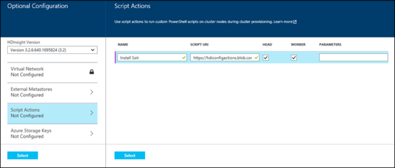
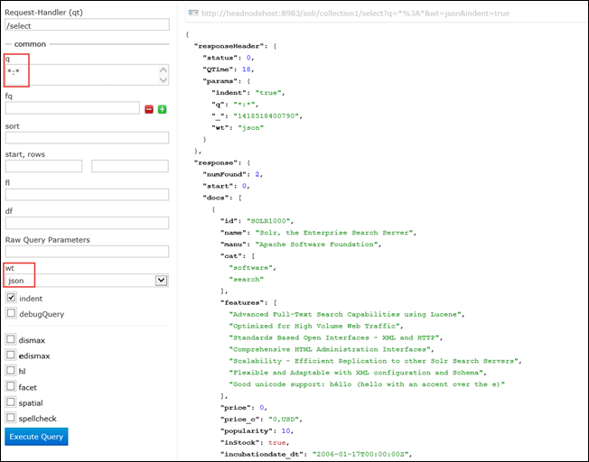

# Install and use Solr on Windows-based HDInsight clusters

Learn how to customize Windows-based HDInsight cluster with Solr using Script Action, and how to use Solr to search data.

> [!IMPORTANT]
> The steps in this document only work with Windows-based HDInsight clusters. HDInsight is only available on Windows for versions lower than HDInsight 3.4. Linux is the only operating system used on HDInsight version 3.4 or greater. For more information, see [HDInsight retirement on Windows](hdinsight-component-versioning.md#hdinsight-windows-retirement). For information on using Solr with a Linux-based cluster, see [Install and use Solr on HDinsight Hadoop clusters (Linux)](hdinsight-hadoop-solr-install-linux.md).


You can install Solr on any type of cluster (Hadoop, Storm, HBase, Spark) on Azure HDInsight by using *Script Action*. A sample script to install Solr on an HDInsight cluster is available from a read-only Azure storage blob at [https://hdiconfigactions.blob.core.windows.net/solrconfigactionv01/solr-installer-v01.ps1](https://hdiconfigactions.blob.core.windows.net/solrconfigactionv01/solr-installer-v01.ps1).

The sample script works only with HDInsight cluster version 3.1. For more information on HDInsight cluster versions, see [HDInsight cluster versions](hdinsight-component-versioning.md).

The sample script used in this topic creates a Windows-based Solr cluster with a specific configuration. If you want to configure the Solr cluster with different collections, shards, schemas, replicas, etc., you must modify the script and Solr binaries accordingly.

**Related articles**

* [Install and use Solr on HDinsight Hadoop clusters (Linux)](hdinsight-hadoop-solr-install-linux.md)
* [Create Hadoop clusters in HDInsight](hdinsight-provision-clusters.md): general information on creating HDInsight clusters.
* [Customize HDInsight cluster using Script Action][hdinsight-cluster-customize]: general information on customizing HDInsight clusters using Script Action.
* [Develop Script Action scripts for HDInsight](hdinsight-hadoop-script-actions.md).

## What is Solr?
<a href="http://lucene.apache.org/solr/features.html" target="_blank">Apache Solr</a> is an enterprise search platform that enables powerful full-text search on data. While Hadoop enables storing and managing vast amounts of data, Apache Solr provides the search capabilities to quickly retrieve the data.

## Install Solr using portal
1. Start creating a cluster by using the **CUSTOM CREATE** option, as described at [Create Hadoop clusters in HDInsight](hdinsight-provision-clusters.md).
2. On the **Script Actions** page of the wizard, click **add script action** to provide details about the script action, as shown below:

    

    <table border='1'>
        <tr><th>Property</th><th>Value</th></tr>
        <tr><td>Name</td>
            <td>Specify a name for the script action. For example, <b>Install Solr</b>.</td></tr>
        <tr><td>Script URI</td>
            <td>Specify the Uniform Resource Identifier (URI) to the script that is invoked to customize the cluster. For example, <i>https://hdiconfigactions.blob.core.windows.net/solrconfigactionv01/solr-installer-v01.ps1</i></td></tr>
        <tr><td>Node Type</td>
            <td>Specify the nodes on which the customization script is run. You can choose <b>All nodes</b>, <b>Head nodes only</b>, or <b>Worker nodes only</b>.
        <tr><td>Parameters</td>
            <td>Specify the parameters, if required by the script. The script to install Solr does not require any parameters, so you can leave this blank.</td></tr>
    </table>

    You can add more than one script action to install multiple components on the cluster. After you have added the scripts, click the checkmark to start creating the cluster.

## Use Solr
You must start with indexing Solr with some data files. You can then use Solr to run search queries on the indexed data. Perform the following steps to use Solr in an HDInsight cluster:

1. **Use Remote Desktop Protocol (RDP) to remote into the HDInsight cluster with Solr installed**. From the Azure portal, enable Remote Desktop for the cluster you created with Solr installed, and then remote into the cluster. For instructions, see [Connect to HDInsight clusters using RDP](hdinsight-administer-use-management-portal.md#connect-to-clusters-using-rdp).
2. **Index Solr by uploading data files**. When you index Solr, you put documents in it that you may need to search on. To index Solr, use RDP to remote into the cluster, navigate to the desktop, open the Hadoop command line, and navigate to **C:\apps\dist\solr-4.7.2\example\exampledocs**. Run the following command:

        java -jar post.jar solr.xml monitor.xml

    You'll see the following output on the console:

        POSTing file solr.xml
        POSTing file monitor.xml
        2 files indexed.
        COMMITting Solr index changes to http://localhost:8983/solr/update..
        Time spent: 0:00:01.624

    The post.jar utility indexes Solr with two sample documents, **solr.xml** and **monitor.xml**. The post.jar utility and the sample documents are available with Solr installation.
3. **Use the Solr dashboard to search within the indexed documents**. In the RDP session to the HDInsight cluster, open Internet Explorer, and launch the Solr dashboard at **http://headnodehost:8983/solr/#/**. From the left pane, from the **Core Selector** drop-down, select **collection1**, and within that, click **Query**. As an example, to select and return all the docs in Solr, provide the following values:

   * In the **q** text box, enter **\*:**\*. This will return all the documents that are indexed in Solr. If you want to search for a specific string within the documents, you can enter that string here.
   * In the **wt** text box, select the output format. Default is **json**. Click **Execute Query**.

     

     The output returns the two docs that we used for indexing Solr. The output resembles the following:

           "response": {
               "numFound": 2,
               "start": 0,
               "maxScore": 1,
               "docs": [
                 {
                   "id": "SOLR1000",
                   "name": "Solr, the Enterprise Search Server",
                   "manu": "Apache Software Foundation",
                   "cat": [
                     "software",
                     "search"
                   ],
                   "features": [
                     "Advanced Full-Text Search Capabilities using Lucene",
                     "Optimized for High Volume Web Traffic",
                     "Standards Based Open Interfaces - XML and HTTP",
                     "Comprehensive HTML Administration Interfaces",
                     "Scalability - Efficient Replication to other Solr Search Servers",
                     "Flexible and Adaptable with XML configuration and Schema",
                     "Good unicode support: héllo (hello with an accent over the e)"
                   ],
                   "price": 0,
                   "price_c": "0,USD",
                   "popularity": 10,
                   "inStock": true,
                   "incubationdate_dt": "2006-01-17T00:00:00Z",
                   "_version_": 1486960636996878300
                 },
                 {
                   "id": "3007WFP",
                   "name": "Dell Widescreen UltraSharp 3007WFP",
                   "manu": "Dell, Inc.",
                   "manu_id_s": "dell",
                   "cat": [
                     "electronics and computer1"
                   ],
                   "features": [
                     "30\" TFT active matrix LCD, 2560 x 1600, .25mm dot pitch, 700:1 contrast"
                   ],
                   "includes": "USB cable",
                   "weight": 401.6,
                   "price": 2199,
                   "price_c": "2199,USD",
                   "popularity": 6,
                   "inStock": true,
                   "store": "43.17614,-90.57341",
                   "_version_": 1486960637584081000
                 }
               ]
             }
4. **Recommended: Back up the indexed data from Solr to Azure Blob storage associated with the HDInsight cluster**. As a good practice, you should back up the indexed data from the Solr cluster nodes onto Azure Blob storage. Perform the following steps to do so:

   1. From the RDP session, open Internet Explorer, and point to the following URL:

           http://localhost:8983/solr/replication?command=backup

       You should see a response like this:
            
      ```xml
      <?xml version="1.0" encoding="UTF-8"?>
          <response>
             <lst name="responseHeader">
               <int name="status">0</int>
               <int name="QTime">9</int>
             </lst>
            <str name="status">OK</str>
          </response>
      ```
      
   2. In the remote session, navigate to {SOLR_HOME}\{Collection}\data. For the cluster created via the sample script, this should be `C:\apps\dist\solr-4.7.2\example\solr\collection1\data`. At this location, you should see a snapshot folder created with a name similar to **snapshot.*timestamp***.
   
   3. Zip the snapshot folder and upload it to Azure Blob storage. From the Hadoop command line, navigate to the location of the snapshot folder by using the following command:

      ```
      hadoop fs -CopyFromLocal snapshot._timestamp_.zip /example/data
      ```

   This command copies the snapshot to /example/data/ under the container within the default Storage account associated with the cluster.

## Install Solr using Aure PowerShell
See [Customize HDInsight clusters using Script Action](hdinsight-hadoop-customize-cluster.md#call-scripts-using-azure-powershell).  The sample demonstrates how to install Spark using Azure PowerShell. You need to customize the script to use [https://hdiconfigactions.blob.core.windows.net/solrconfigactionv01/solr-installer-v01.ps1](https://hdiconfigactions.blob.core.windows.net/solrconfigactionv01/solr-installer-v01.ps1).

## Install Solr using .NET SDK
See [Customize HDInsight clusters using Script Action](hdinsight-hadoop-customize-cluster.md#call-scripts-using-azure-powershell). The sample demonstrates how to install Spark using the .NET SDK. You need to customize the script to use [https://hdiconfigactions.blob.core.windows.net/solrconfigactionv01/solr-installer-v01.ps1](https://hdiconfigactions.blob.core.windows.net/solrconfigactionv01/solr-installer-v01.ps1).

## See also
* [Install and use Solr on HDinsight Hadoop clusters (Linux)](hdinsight-hadoop-solr-install-linux.md)
* [Create Hadoop clusters in HDInsight](hdinsight-provision-clusters.md): general information on creating HDInsight clusters.
* [Customize HDInsight cluster using Script Action][hdinsight-cluster-customize]: general information on customizing HDInsight clusters using Script Action.
* [Develop Script Action scripts for HDInsight](hdinsight-hadoop-script-actions.md).
* [Install and use Spark on HDInsight clusters][hdinsight-install-spark]: Script Action sample about installing Spark.
* [Install Giraph on HDInsight clusters](hdinsight-hadoop-giraph-install.md): Script Action sample about installing Giraph.

[powershell-install-configure]: /powershell/azureps-cmdlets-docs
[hdinsight-provision]: hdinsight-provision-clusters.md
[hdinsight-install-spark]: hdinsight-hadoop-spark-install.md
[hdinsight-cluster-customize]: hdinsight-hadoop-customize-cluster.md
