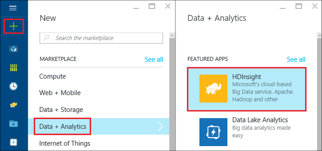
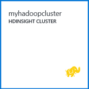
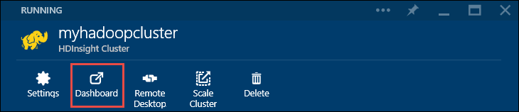

<properties
   pageTitle="Hadoop tutorial: Get started with Hadoop on Windows | Microsoft Azure"
   description="Get started with Hadoop in HDInsight. Learn how to create Hadoop clusters on Windows, run a Hive query on data, and analyze output in Excel."
   keywords="hadoop tutorial,hadoop on windows,hadoop cluster,learn hadoop, hive query"
   services="hdinsight"
   documentationCenter=""
   authors="nitinme"
   manager="paulettm"
   editor="cgronlun"
   tags="azure-portal"/>

<tags
   ms.service="hdinsight"
   ms.devlang="na"
   ms.topic="article"
   ms.tgt_pltfrm="na"
   ms.workload="big-data"
   ms.date="03/07/2016"
   ms.author="nitinme"/>

# Hadoop tutorial: Get started using Hadoop in HDInsight on Windows

> [AZURE.SELECTOR]
- [Linux-based](../hdinsight-hadoop-linux-tutorial-get-started.md)
- [Windows-based](../hdinsight-hadoop-tutorial-get-started-windows.md)

To help you learn Hadoop on Windows and start using HDInsight, this tutorial shows you 
how to run a Hive query on unstructured data in a Hadoop cluster and then analyze the 
results in Microsoft Excel.

>[AZURE.NOTE] The information in this document is specific to Windows-based HDInsight clusters. For information on Linux-based clusters, see [Hadoop tutorial: Get started using Linux-based Hadoop in HDInsight](hdinsight-hadoop-linux-tutorial-get-started.md).

Assume you have a large unstructured data set and you want to run a Hive query on it 
to extract some meaningful information. That's exactly what you are going to do in this 
tutorial. Here's how you achieve this:

   !["Hadoop tutorial: Create an account; create a Hadoop cluster; submit a Hive query; analyze data in Excel.][image-hdi-getstarted-flow]

Watch a demo video of this tutorial to learn Hadoop on HDInsight:

![Video of a first Hadoop tutorial: Submit a Hive query on a Hadoop cluster, and analyze results in Excel.][img-hdi-getstarted-video]

**[Watch the Hadoop tutorial for HDInsight on YouTube](https://www.youtube.com/watch?v=Y4aNjnoeaHA&list=PLDrz-Fkcb9WWdY-Yp6D4fTC1ll_3lU-QS)**

In conjunction with the general availability of Azure HDInsight, Microsoft also provides 
HDInsight Emulator for Azure, formerly known as *Microsoft HDInsight Developer Preview*. 
The Emulator targets developer scenarios and only supports single-node deployments. For 
information about using HDInsight Emulator, see [Get Started with the HDInsight Emulator][hdinsight-emulator].

[AZURE.INCLUDE [delete-cluster-warning](../../includes/hdinsight-delete-cluster-warning.md)]

### Prerequisites

Before you begin this tutorial for Hadoop on Windows, you must have the following:

- **An Azure subscription**. See [Get Azure free trial](https://azure.microsoft.com/documentation/videos/get-azure-free-trial-for-testing-hadoop-in-hdinsight/).
- **A workstation computer** with Office 2013 Professional Plus, Office 365 Pro Plus, Excel 2013 Standalone, or Office 2010 Professional Plus.

##Create Hadoop clusters

When you create a cluster, you create Azure compute resources that contain Hadoop 
and related applications. In this section, you create an HDInsight version 3.2 cluster. 
You can also create Hadoop clusters for other versions. For instructions, see 
[Create HDInsight clusters using custom options][hdinsight-provision]. For information 
about HDInsight versions and their SLAs, see 
[HDInsight component versioning](hdinsight-component-versioning.md).

**To create a Hadoop cluster**

1. Sign in to the [Azure Portal](https://portal.azure.com/).
2. Click **NEW**, Click **Data Analytics**, and then click **HDInsight**. The portal opens a **New HDInsight Cluster** blade.

    

3. Enter or select the following:

	
	
	|Field name| Value|
	|----------|------|
	|Cluster Name| A unique name for identifying the cluster|
	|Cluster Type| Select **Hadoop** for this tutorial. |
	|Cluster Operating System| Select **Windows Server 2012 R2 Datacenter** for this tutorial.|
	|HDInsight Version| Select the latest version for this tutorial.|
	|Subscription| Select the Azure subscription that will be used for the cluster.|
	|Resource Group | Select an existing Azure resource group or create a new resource group. A basic HDInsight cluster contains a cluster and its default storage account.  You can group the two into a resource group for easy management.|
	|Credentials| Enter the cluster login username and password. Windows based cluster can have 2 user accounts.  The cluster user (or HTTP user) is used to manage the cluster and submit jobs.  You can optionally create a remote desktop (RDP) user account to remote connect to the cluster. If you choose to enable remote desktop, you will create the RDP user account.|
	|Data Source| Click Create New to create a new default Azure storage account. Use the cluster name as the default container name. Every HDinsight cluster has a default Blob container on an Azure storage accont.  The location of the default Azure storage account determines the location of the HDInsight cluster.|
	|Node Pricing Tiers| Use 1 or 2 worker nodes with the default worker node and head note pricing tier for this tutorial.|
	|Optional Configuration| Skip this part.|

9. On the **New HDInsight Cluster** blade, ensure that **Pin to Startboard** is selected, and then click **Create**. This will create the cluster and add a tile for it to the Startboard of your Azure Portal. The icon will indicate that the cluster is creating, and will change to display the HDInsight icon once creation has completed.

	| During creation | Creation complete |
	| ------------------ | --------------------- |
	|  |  |

	> [AZURE.NOTE] It will take some time for the cluster to be created, usually around 15 minutes. Use the tile on the Startboard, or the **Notifications** entry on the left of the page to check on the creation process.

10. Once the creation completes, click the tile for the cluster from the Startboard to launch the cluster blade.

## Run a Hive query from the portal
Now that you have created an HDInsight cluster, the next step is to run a Hive job to query a sample Hive table. We will use *hivesampletable*, which comes with HDInsight clusters. The table contains data about mobile device manufacturers, platforms, and models. A Hive query on this table retrieves data for mobile devices by a specific manufacturer.

> [AZURE.NOTE] HDInsight Tools for Visual Studio comes with the Azure SDK for .NET version 2.5 or later. By using the tools in Visual Studio, you can connect to HDInsight cluster, create Hive tables, and run Hive queries. For more information, see [Get started using HDInsight Hadoop Tools for Visual Studio][1].

**To run a Hive job from the cluster dashboard**

1. Sign in to the [Azure Portal](https://portal.azure.com/).
2. Click **BROWSE ALL** and then click **HDInsight Clusters** to see a list of clusters, including the cluster you just created in the previous section.
3. Click the name of the cluster that you want to use to run the Hive job, and then click **Dashboard** at the top of the blade.
4. A webpage opens in a different browser tab. Enter the Hadoop user account and password. The default user name is **admin**; the password is what you entered while creating the cluster.
5. From the dashboard, click the **Hive Editor** tab. The following web page opens.

	![Hive Editor tab in the HDInsight cluster dashboard.][img-hdi-dashboard]

	There are several tabs at the top of the page. The default tab is **Hive Editor**, and the other tabs are **Job History** and **File Browser**. By using the dashboard, you can submit Hive queries, check Hadoop job logs, and browse files in storage.

	> [AZURE.NOTE] Note that the URL of the webpage is *&lt;ClusterName&gt;.azurehdinsight.net*. So instead of opening the dashboard from the portal, you can open the dashboard from a web browser by using the URL.

6. On the **Hive Editor** tab, for **Query Name**, enter **HTC20**.  The query name is the job title. In the query pane, enter the Hive query as shown in the image:

	![Hive query entered in the query pane of the Hive Editor.][img-hdi-dashboard-query-select]

4. Click **Submit**. It takes a few moments to get the results back. The screen refreshes every 30 seconds. You can also click **Refresh** to refresh the screen.

    ![Results from a Hive query in listed at the bottom of the cluster dashboard.][img-hdi-dashboard-query-select-result]

5. After the status shows that the job is completed, click the query name on the screen to see the output. Make a note of **Job Start Time (UTC)**. You will need it later.

    ![Job Start Time listed in the Job History tab of the HDInsight cluster dashboard.][img-hdi-dashboard-query-select-result-output]

    The page also shows the **Job Output** and the **Job Log**. You also have the option to download the output file (\_stdout) and the log file \(_stderr).

**To browse to the output file**

1. On the cluster dashboard, click **File Browser**.
2. Click your storage account name, click your container name (which is the same as your cluster name), and then click **user**.
3. Click **admin** and then click the GUID that has the last modified time (a little after the job start time you noted earlier). Copy this GUID. You will need it in the next section.

   	![The Hive query output file GUID listed in the File Browser tab.][img-hdi-dashboard-query-browse-output]

##Connect to Microsoft business intelligence tools for Excel

You can use the Power Query add-in for Microsoft Excel to import the job output from HDInsight into Excel, where Microsoft business intelligence tools can be used to further analyze the results.

You must have Excel 2013 or 2010 installed to complete this part of the tutorial.

**To download Microsoft Power Query for Excel**

- Download Microsoft Power Query for Microsoft Excel from the [Microsoft Download Center](http://www.microsoft.com/download/details.aspx?id=39379) and install it.

**To import HDInsight data**

1. Open Excel, and create a new workbook.
3. Click the **Power Query** menu, click **From Other Sources**, and then click **From Azure HDInsight**.

	![Excel PowerQuery Import menu open for Azure HDInsight.][image-hdi-gettingstarted-powerquery-importdata]

3. Enter the **Account Name** of the Azure Blob Storage account that is associated with your cluster, and then click **OK**. (This is the storage account you created earlier in the tutorial.)
4. Enter the **Account Key** for the Azure Blob Storage account, and then click **Save**.
5. In the right pane, double-click the blob name. By default the blob name is the same as the cluster name.

6. Locate **stdout** in the **Name** column. Verify that the GUID in the corresponding **Folder Path** column matches the GUID you copied earlier. A match suggests that the output data corresponds to the job you submitted. Click **Binary** in the column left of **stdout**.

	![Finding the data output by GUID in the list of content.][image-hdi-gettingstarted-powerquery-importdata2]

9. Click **Close & Load** in the upper-left corner to import the Hive job output into Excel.

##Run samples

HDInsight cluster provides a query console that includes a Getting Started gallery to run samples directly from the portal. You can use the samples to learn how to work with HDInsight by walking through some basic scenarios. These samples come with all the required components, such as the data to analyze and the queries to run on the data. To learn more about the samples in the Getting Started gallery, see [Learn Hadoop in HDInsight using the HDInsight Getting Started Gallery](hdinsight-learn-hadoop-use-sample-gallery.md).

**To run the sample**

1. From the Azure Portal startboard, click the tile for the cluster you just created.
 
2. On the new cluster blade, click **Dashboard**. When prompted, enter the admin username and password for the cluster.

	
 
3. From the webpage that opens, click the **Getting Started Gallery** tab, and then under the **Solutions with Sample Data** category, click the sample that you want to run. Follow the instructions on the Web page to finish the sample. The following table lists a couple of samples and provides more information about what each sample does.

Sample | What does it do?
------ | ---------------
[Sensor data analysis][hdinsight-sensor-data-sample] | Learn how to use HDInsight to process historical data that is produced by heating, ventilation, and air conditioning (HVAC) systems to identify systems that are not able to reliably maintain a set temperature.
[Website log analysis][hdinsight-weblogs-sample] | Learn how to use HDInsight to analyze website log files to get insight into the frequency of visits to the website in a day from external websites, and a summary of website errors that the users experience.
[Twitter trend analysis](hdinsight-analyze-twitter-data.md) | Learn how to use HDInsight to analyze trends in Twitter.

##Delete the cluster

[AZURE.INCLUDE [delete-cluster-warning](../../includes/hdinsight-delete-cluster-warning.md)]

##Next steps
In this Hadoop tutorial, you learned how to create a Hadoop cluster on Windows in HDInsight, run a Hive query on data, and import the results into Excel, where they can be further processed and graphically displayed with business intelligence tools. To learn more, see the following tutorials:

- [Get started using HDInsight Hadoop Tools for Visual Studio][1]
- [Get started with the HDInsight Emulator][hdinsight-emulator]
- [Use Azure Blob storage with HDInsight][hdinsight-storage]
- [Administer HDInsight using PowerShell][hdinsight-admin-powershell]
- [Upload data to HDInsight][hdinsight-upload-data]
- [Use MapReduce with HDInsight][hdinsight-use-mapreduce]
- [Use Hive with HDInsight][hdinsight-use-hive]
- [Use Pig with HDInsight][hdinsight-use-pig]
- [Use Oozie with HDInsight][hdinsight-use-oozie]
- [Develop Java MapReduce programs for HDInsight][hdinsight-develop-mapreduce]

[1]: ../HDInsight/hdinsight-hadoop-visual-studio-tools-get-started.md

[hdinsight-versions]: hdinsight-component-versioning.md

[hdinsight-provision]: hdinsight-provision-clusters.md
[hdinsight-admin-powershell]: hdinsight-administer-use-powershell.md
[hdinsight-upload-data]: hdinsight-upload-data.md
[hdinsight-use-mapreduce]: hdinsight-use-mapreduce.md
[hdinsight-use-hive]: hdinsight-use-hive.md
[hdinsight-use-pig]: hdinsight-use-pig.md
[hdinsight-use-oozie]: hdinsight-use-oozie.md
[hdinsight-storage]: hdinsight-hadoop-use-blob-storage.md
[hdinsight-emulator]: hdinsight-hadoop-emulator-get-started.md
[hdinsight-develop-mapreduce]: hdinsight-develop-deploy-java-mapreduce-linux.md
[hadoop-hdinsight-intro]: hdinsight-hadoop-introduction.md
[hdinsight-weblogs-sample]: hdinsight-hive-analyze-website-log.md
[hdinsight-sensor-data-sample]: hdinsight-hive-analyze-sensor-data.md

[azure-purchase-options]: http://azure.microsoft.com/pricing/purchase-options/
[azure-member-offers]: http://azure.microsoft.com/pricing/member-offers/
[azure-free-trial]: http://azure.microsoft.com/pricing/free-trial/
[azure-management-portal]: https://portal.azure.com/
[azure-create-storageaccount]: ../storage-create-storage-account.md

[apache-hadoop]: http://go.microsoft.com/fwlink/?LinkId=510084
[apache-hive]: http://go.microsoft.com/fwlink/?LinkId=510085
[apache-mapreduce]: http://go.microsoft.com/fwlink/?LinkId=510086
[apache-hdfs]: http://go.microsoft.com/fwlink/?LinkId=510087
[hdinsight-hbase-custom-provision]: hdinsight-hbase-tutorial-get-started.md

[powershell-download]: http://go.microsoft.com/fwlink/p/?linkid=320376&clcid=0x409
[powershell-install-configure]: powershell-install-configure.md
[powershell-open]: powershell-install-configure.md#step-1-install

[img-hdi-dashboard]: ./media/hdinsight-hadoop-tutorial-get-started-windows/HDI.dashboard.png
[img-hdi-dashboard-query-select]: ./media/hdinsight-hadoop-tutorial-get-started-windows/HDI.dashboard.query.select.png
[img-hdi-dashboard-query-select-result]: ./media/hdinsight-hadoop-tutorial-get-started-windows/HDI.dashboard.query.select.result.png
[img-hdi-dashboard-query-select-result-output]: ./media/hdinsight-hadoop-tutorial-get-started-windows/HDI.dashboard.query.select.result.output.png
[img-hdi-dashboard-query-browse-output]: ./media/hdinsight-hadoop-tutorial-get-started-windows/HDI.dashboard.query.browse.output.png

[img-hdi-getstarted-video]: ./media/hdinsight-hadoop-tutorial-get-started-windows/hdi-get-started-video.png

[image-hdi-storageaccount-quickcreate]: ./media/hdinsight-hadoop-tutorial-get-started-windows/HDI.StorageAccount.QuickCreate.png
[image-hdi-clusterstatus]: ./media/hdinsight-hadoop-tutorial-get-started-windows/HDI.ClusterStatus.png
[image-hdi-quickcreatecluster]: ./media/hdinsight-hadoop-tutorial-get-started-windows/HDI.QuickCreateCluster.png
[image-hdi-getstarted-flow]: ./media/hdinsight-hadoop-tutorial-get-started-windows/HDI.GetStartedFlow.png

[image-hdi-gettingstarted-powerquery-importdata]: ./media/hdinsight-hadoop-tutorial-get-started-windows/HDI.GettingStarted.PowerQuery.ImportData.png
[image-hdi-gettingstarted-powerquery-importdata2]: ./media/hdinsight-hadoop-tutorial-get-started-windows/HDI.GettingStarted.PowerQuery.ImportData2.png
 