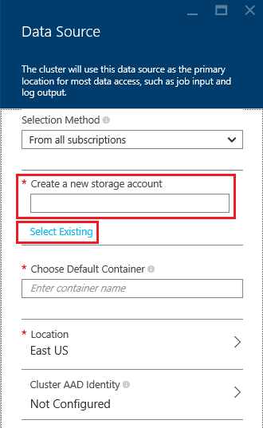

# Use Azure storage with Azure HDInsight clusters

To analyze data in HDInsight cluster, you can store the data either in Azure Storage, Azure Data Lake Store, or both. Both storage options enable you to safely delete HDInsight clusters that are used for computation without losing user data.

Hadoop supports a notion of the default file system. The default file system implies a default scheme and authority. It can also be used to resolve relative paths. During the HDInsight cluster creation process, you can specify a blob container in Azure Storage as the default file system, or with HDInsight 3.5, you can select either Azure Storage or Azure Data Lake Store as the default files system with a few exceptions. For the supportability of using Data Lake Store as both the default and linked storage, see [Availability for HDInsight cluster](./hdinsight-hadoop-use-data-lake-store.md#availability-for-hdinsight-clusters).

In this article, you learn how Azure Storage works with HDInsight clusters. To learn how Data Lake Store works with HDInsight clusters, see [Use Azure Data Lake Store with Azure HDInsight clusters](hdinsight-hadoop-use-data-lake-store.md). For more information about creating an HDInsight cluster, see [Create Hadoop clusters in HDInsight](hdinsight-hadoop-provision-linux-clusters.md).

Azure storage is a robust, general-purpose storage solution that integrates seamlessly with HDInsight. HDInsight can use a blob container in Azure Storage as the default file system for the cluster. Through a Hadoop distributed file system (HDFS) interface, the full set of components in HDInsight can operate directly on structured or unstructured data stored as blobs.

> [!WARNING]
> There are several options available when creating an Azure Storage account. The following table provides information on what options are supported with HDInsight:
> 
> | Storage account type | Storage tier | Supported with HDInsight |
> | ------- | ------- | ------- |
> | General-purpose Storage Account | Standard | __Yes__ |
> | &nbsp; | Premium | No |
> | Blob Storage Account | Hot | No |
> | &nbsp; | Cool | No |

We do not recommend that you use the default blob container for storing business data. Deleting the default blob container after each use to reduce storage cost is a good practice. Note that the default container contains application and system logs. Make sure to retrieve the logs before deleting the container.

Sharing one blob container as the default file system for multiple clusters is not supported.

## HDInsight storage architecture
The following diagram provides an abstract view of the HDInsight storage architecture of using Azure Storage:

HDInsight provides access to the distributed file system that is locally attached to the compute nodes. This file system can be accessed by using the fully qualified URI, for example:

    hdfs://<namenodehost>/<path>

In addition, HDInsight allows you to access data that is stored in Azure Storage. The syntax is:

    wasb[s]://<containername>@<accountname>.blob.core.windows.net/<path>

Here are some considerations when using Azure Storage account with HDInsight clusters.

* **Containers in the storage accounts that are connected to a cluster:** Because the account name and key are associated with the cluster during creation, you have full access to the blobs in those containers.

* **Public containers or public blobs in storage accounts that are NOT connected to a cluster:** You have read-only permission to the blobs in the containers.
  
  > [!NOTE]
  > Public containers allow you to get a list of all blobs that are available in that container and get container metadata. Public blobs allow you to access the blobs only if you know the exact URL. For more information, see <a href="https://docs.microsoft.com/en-us/azure/storage/blobs/storage-manage-access-to-resources">Manage access to containers and blobs</a>.
  > 
  > 
* **Private containers in storage accounts that are NOT connected to a cluster:** You can't access the blobs in the containers unless you define the storage account when you submit the WebHCat jobs. This is explained later in this article.

The storage accounts that are defined in the creation process and their keys are stored in %HADOOP_HOME%/conf/core-site.xml on the cluster nodes. The default behavior of HDInsight is to use the storage accounts defined in the core-site.xml file. You can modify this setting using [Ambari](./hdinsight-hadoop-manage-ambari.md)

Multiple WebHCat jobs, including Hive, MapReduce, Hadoop streaming, and Pig, can carry a description of storage accounts and metadata with them. (This currently works for Pig with storage accounts, but not for metadata.) For more information, see [Using an HDInsight Cluster with Alternate Storage Accounts and Metastores](http://social.technet.microsoft.com/wiki/contents/articles/23256.using-an-hdinsight-cluster-with-alternate-storage-accounts-and-metastores.aspx).

Blobs can be used for structured and unstructured data. Blob containers store data as key/value pairs, and there is no directory hierarchy. However the slash character ( / ) can be used within the key name to make it appear as if a file is stored within a directory structure. For example, a blob's key may be *input/log1.txt*. No actual *input* directory exists, but due to the presence of the slash character in the key name, it has the appearance of a file path.

## Benefits of Azure Storage
The implied performance cost of not co-locating compute clusters and storage resources is mitigated by the way the compute clusters are created close to the storage account resources inside the Azure region, where the high-speed network makes it efficient for the compute nodes to access the data inside Azure storage.

There are several benefits associated with storing the data in Azure storage instead of HDFS:

* **Data reuse and sharing:** The data in HDFS is located inside the compute cluster. Only the applications that have access to the compute cluster can use the data by using HDFS APIs. The data in Azure storage can be accessed either through the HDFS APIs or through the [Blob Storage REST APIs][blob-storage-restAPI]. Thus, a larger set of applications (including other HDInsight clusters) and tools can be used to produce and consume the data.
* **Data archiving:** Storing data in Azure storage enables the HDInsight clusters used for computation to be safely deleted without losing user data.
* **Data storage cost:** Storing data in DFS for the long term is more costly than storing the data in Azure storage because the cost of a compute cluster is higher than the cost of Azure storage. In addition, because the data does not have to be reloaded for every compute cluster generation, you are also saving data loading costs.
* **Elastic scale-out:** Although HDFS provides you with a scaled-out file system, the scale is determined by the number of nodes that you create for your cluster. Changing the scale can become a more complicated process than relying on the elastic scaling capabilities that you get automatically in Azure storage.
* **Geo-replication:** Your Azure storage can be geo-replicated. Although this gives you geographic recovery and data redundancy, a failover to the geo-replicated location severely impacts your performance, and it may incur additional costs. So our recommendation is to choose the geo-replication wisely and only if the value of the data is worth the additional cost.

Certain MapReduce jobs and packages may create intermediate results that you don't really want to store in Azure storage. In that case, you can elect to store the data in the local HDFS. In fact, HDInsight uses DFS for several of these intermediate results in Hive jobs and other processes.

> [!NOTE]
> Most HDFS commands (for example, <b>ls</b>, <b>copyFromLocal</b> and <b>mkdir</b>) still work as expected. Only the commands that are specific to the native HDFS implementation (which is referred to as DFS), such as <b>fschk</b> and <b>dfsadmin</b>, show different behavior in Azure storage.
> 
> 

## Create Blob containers
To use blobs, you first create an [Azure Storage account][azure-storage-create]. As part of this, you specify an Azure region where the storage account is created. The cluster and the storage account must be hosted in the same region. The Hive metastore SQL Server database and Oozie metastore SQL Server database must also be located in the same region.

Wherever it lives, each blob you create belongs to a container in your Azure Storage account. This container may be an existing blob that was created outside of HDInsight, or it may be a container that is created for an HDInsight cluster.

The default Blob container stores cluster-specific information such as job history and logs. Don't share a default Blob container with multiple HDInsight clusters. This might corrupt job history. It is recommended to use a different container for each cluster and put shared data on a linked storage account specified in deployment of all relevant clusters rather than the default storage account. For more information on configuring linked storage accounts, see [Create HDInsight clusters][hdinsight-creation]. However you can reuse a default storage container after the original HDInsight cluster has been deleted. For HBase clusters, you can actually retain the HBase table schema and data by creating a new HBase cluster using the default blob container that is used by an HBase cluster that has been deleted.

[!INCLUDE [secure-transfer-enabled-storage-account](../../includes/hdinsight-secure-transfer.md)]

### Use the Azure portal
When creating an HDInsight cluster from the Portal, you have the options (as shown below) to provide the storage account details. You can also specify whether you want an additional storage account associated with the cluster, and if so, choose from Data Lake Store or another Azure Storage blob as the additional storage.

> [!WARNING]
> Using an additional storage account in a different location than the HDInsight cluster is not supported.

### Use Azure PowerShell
If you [installed and configured Azure PowerShell][powershell-install], you can use the following from the Azure PowerShell prompt to create a storage account and container:

[!INCLUDE [upgrade-powershell](../../includes/hdinsight-use-latest-powershell.md)]

    $SubscriptionID = "<Your Azure Subscription ID>"
    $ResourceGroupName = "<New Azure Resource Group Name>"
    $Location = "EAST US 2"

    $StorageAccountName = "<New Azure Storage Account Name>"
    $containerName = "<New Azure Blob Container Name>"

    Connect-AzureRmAccount
    Select-AzureRmSubscription -SubscriptionId $SubscriptionID

    # Create resource group
    New-AzureRmResourceGroup -name $ResourceGroupName -Location $Location

    # Create default storage account
    New-AzureRmStorageAccount -ResourceGroupName $ResourceGroupName -Name $StorageAccountName -Location $Location -Type Standard_LRS 

    # Create default blob containers
    $storageAccountKey = (Get-AzureRmStorageAccountKey -ResourceGroupName $resourceGroupName -StorageAccountName $StorageAccountName)[0].Value
    $destContext = New-AzureStorageContext -StorageAccountName $storageAccountName -StorageAccountKey $storageAccountKey  
    New-AzureStorageContainer -Name $containerName -Context $destContext

### Use Azure Classic CLI

[!INCLUDE [classic-cli-warning](../../includes/requires-classic-cli.md)]

If you have [installed and configured the Azure Classic CLI](../cli-install-nodejs.md), the following command can be used to a storage account and container.

    azure storage account create <storageaccountname> --type LRS

> [!NOTE]
> The `--type` parameter indicates how the storage account is replicated. For more information, see [Azure Storage Replication](../storage/storage-redundancy.md). Don't use ZRS as ZRS doesn't support page blob, file, table, or queue.
> 
> 

You are prompted to specify the geographic region that the storage account is created in. You should create the storage account in the same region that you plan on creating your HDInsight cluster.

Once the storage account is created, use the following command to retrieve the storage account keys:

    azure storage account keys list <storageaccountname>

To create a container, use the following command:

    azure storage container create <containername> --account-name <storageaccountname> --account-key <storageaccountkey>

## Address files in Azure storage
The URI scheme for accessing files in Azure storage from HDInsight is:

    wasb[s]://<BlobStorageContainerName>@<StorageAccountName>.blob.core.windows.net/<path>

The URI scheme provides unencrypted access (with the *wasb:* prefix) and SSL encrypted access (with *wasbs*). We recommend using *wasbs* wherever possible, even when accessing data that lives inside the same region in Azure.

The &lt;BlobStorageContainerName&gt; identifies the name of the blob container in Azure storage.
The &lt;StorageAccountName&gt; identifies the Azure Storage account name. A fully qualified domain name (FQDN) is required.

If neither &lt;BlobStorageContainerName&gt; nor &lt;StorageAccountName&gt; has been specified, the default file system is used. For the files on the default file system, you can use a relative path or an absolute path. For example, the *hadoop-mapreduce-examples.jar* file that comes with HDInsight clusters can be referred to by using one of the following:

    wasb://mycontainer@myaccount.blob.core.windows.net/example/jars/hadoop-mapreduce-examples.jar
    wasb:///example/jars/hadoop-mapreduce-examples.jar
    /example/jars/hadoop-mapreduce-examples.jar

> [!NOTE]
> The file name is <i>hadoop-examples.jar</i> in HDInsight versions 2.1 and 1.6 clusters.
> 
> 

The &lt;path&gt; is the file or directory HDFS path name. Because containers in Azure storage are simply key-value stores, there is no true hierarchical file system. A slash character ( / ) inside a blob key is interpreted as a directory separator. For example, the blob name for *hadoop-mapreduce-examples.jar* is:

    example/jars/hadoop-mapreduce-examples.jar

> [!NOTE]
> When working with blobs outside of HDInsight, most utilities do not recognize the WASB format and instead expect a basic path format, such as `example/jars/hadoop-mapreduce-examples.jar`.
> 
> 

## Access blobs 

###  Use Azure PowerShell
> [!NOTE]
> The commands in this section provide a basic example of using PowerShell to access data stored in blobs. For a more full-featured example that is customized for working with HDInsight, see the [HDInsight Tools](https://github.com/Blackmist/hdinsight-tools).
> 
> 

Use the following command to list the blob-related cmdlets:

    Get-Command *blob*

![List of blob-related PowerShell cmdlets.][img-hdi-powershell-blobcommands]

#### Upload files
See [Upload data to HDInsight][hdinsight-upload-data].

#### Download files
The following script downloads a block blob to the current folder. Before running the script, change the directory to a folder where you have write permissions.

    $resourceGroupName = "<AzureResourceGroupName>"
    $storageAccountName = "<AzureStorageAccountName>"   # The storage account used for the default file system specified at creation.
    $containerName = "<BlobStorageContainerName>"  # The default file system container has the same name as the cluster.
    $blob = "example/data/sample.log" # The name of the blob to be downloaded.

    # Use Add-AzureAccount if you haven't connected to your Azure subscription
    Connect-AzureRmAccount 
    Select-AzureRmSubscription -SubscriptionID "<Your Azure Subscription ID>"

    Write-Host "Create a context object ... " -ForegroundColor Green
    $storageAccountKey = (Get-AzureRmStorageAccountKey -ResourceGroupName $resourceGroupName -Name $storageAccountName)[0].Value
    $storageContext = New-AzureStorageContext -StorageAccountName $storageAccountName -StorageAccountKey $storageAccountKey  

    Write-Host "Download the blob ..." -ForegroundColor Green
    Get-AzureStorageBlobContent -Container $ContainerName -Blob $blob -Context $storageContext -Force

    Write-Host "List the downloaded file ..." -ForegroundColor Green
    cat "./$blob"

Providing the resource group name and the cluster name, you can use the following code:

    $resourceGroupName = "<AzureResourceGroupName>"
    $clusterName = "<HDInsightClusterName>"
    $blob = "example/data/sample.log" # The name of the blob to be downloaded.

    $cluster = Get-AzureRmHDInsightCluster -ResourceGroupName $resourceGroupName -ClusterName $clusterName
    $defaultStorageAccount = $cluster.DefaultStorageAccount -replace '.blob.core.windows.net'
    $defaultStorageAccountKey = (Get-AzureRmStorageAccountKey -ResourceGroupName $resourceGroupName -Name $defaultStorageAccount)[0].Value
    $defaultStorageContainer = $cluster.DefaultStorageContainer
    $storageContext = New-AzureStorageContext -StorageAccountName $defaultStorageAccount -StorageAccountKey $defaultStorageAccountKey 

    Write-Host "Download the blob ..." -ForegroundColor Green
    Get-AzureStorageBlobContent -Container $defaultStorageContainer -Blob $blob -Context $storageContext -Force

#### Delete files
    Remove-AzureStorageBlob -Container $containerName -Context $storageContext -blob $blob

#### List files
    Get-AzureStorageBlob -Container $containerName -Context $storageContext -prefix "example/data/"

#### Run Hive queries using an undefined storage account
This example shows how to list a folder from storage account that is not defined during the creating process.
    $clusterName = "<HDInsightClusterName>"

    $undefinedStorageAccount = "<UnboundedStorageAccountUnderTheSameSubscription>"
    $undefinedContainer = "<UnboundedBlobContainerAssociatedWithTheStorageAccount>"

    $undefinedStorageKey = Get-AzureStorageKey $undefinedStorageAccount | %{ $_.Primary }

    Use-AzureRmHDInsightCluster $clusterName

    $defines = @{}
    $defines.Add("fs.azure.account.key.$undefinedStorageAccount.blob.core.windows.net", $undefinedStorageKey)

    Invoke-AzureRmHDInsightHiveJob -Defines $defines -Query "dfs -ls wasb://$undefinedContainer@$undefinedStorageAccount.blob.core.windows.net/;"

### Use Azure Classic CLI
Use the following command to list the blob-related commands:

    azure storage blob

**Example of using Azure Classic CLI to upload a file**

    azure storage blob upload <sourcefilename> <containername> <blobname> --account-name <storageaccountname> --account-key <storageaccountkey>

**Example of using Azure Classic CLI to download a file**

    azure storage blob download <containername> <blobname> <destinationfilename> --account-name <storageaccountname> --account-key <storageaccountkey>

**Example of using Azure Classic CLI to delete a file**

    azure storage blob delete <containername> <blobname> --account-name <storageaccountname> --account-key <storageaccountkey>

**Example of using Azure Classic CLI to list files**

    azure storage blob list <containername> <blobname|prefix> --account-name <storageaccountname> --account-key <storageaccountkey>

## Use additional storage accounts

While creating an HDInsight cluster, you specify the Azure Storage account you want to associate with it. In addition to this storage account, you can add additional storage accounts from the same Azure subscription or different Azure subscriptions during the creation process or after a cluster has been created. For instructions about adding additional storage accounts, see [Create HDInsight clusters](hdinsight-hadoop-provision-linux-clusters.md).

> [!WARNING]
> Using an additional storage account in a different location than the HDInsight cluster is not supported.

## Next steps
In this article, you learned how to use HDFS-compatible Azure storage with HDInsight. This allows you to build scalable, long-term, archiving data acquisition solutions and use HDInsight to unlock the information inside the stored structured and unstructured data.

For more information, see:

* [Get started with Azure HDInsight][hdinsight-get-started]
* [Get started with Azure Data Lake Store](../data-lake-store/data-lake-store-get-started-portal.md)
* [Upload data to HDInsight][hdinsight-upload-data]
* [Use Hive with HDInsight][hdinsight-use-hive]
* [Use Pig with HDInsight][hdinsight-use-pig]
* [Use Azure Storage Shared Access Signatures to restrict access to data with HDInsight][hdinsight-use-sas]

[hdinsight-use-sas]: hdinsight-storage-sharedaccesssignature-permissions.md
[powershell-install]: /powershell/azureps-cmdlets-docs
[hdinsight-creation]: hdinsight-hadoop-provision-linux-clusters.md
[hdinsight-get-started]:hadoop/apache-hadoop-linux-tutorial-get-started.md
[hdinsight-upload-data]: hdinsight-upload-data.md
[hdinsight-use-hive]:hadoop/hdinsight-use-hive.md
[hdinsight-use-pig]:hadoop/hdinsight-use-pig.md

[blob-storage-restAPI]: http://msdn.microsoft.com/library/windowsazure/dd135733.aspx
[azure-storage-create]:../storage/common/storage-create-storage-account.md

[img-hdi-powershell-blobcommands]: ./media/hdinsight-hadoop-use-blob-storage/HDI.PowerShell.BlobCommands.png
[img-hdi-quick-create]: ./media/hdinsight-hadoop-use-blob-storage/HDI.QuickCreateCluster.png
[img-hdi-custom-create-storage-account]: ./media/hdinsight-hadoop-use-blob-storage/HDI.CustomCreateStorageAccount.png  
