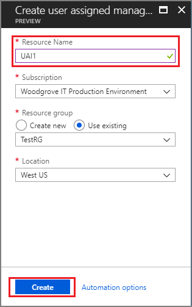
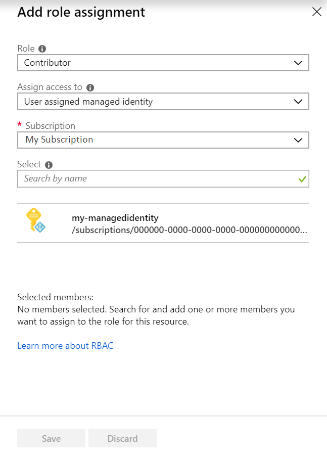

# Use Azure Data Lake Storage Gen2 with Azure HDInsight clusters

Azure Data Lake Storage (Data Lake Storage) Gen2 is a set of capabilities dedicated to big data analytics, built on Azure Blob storage. Data Lake Storage Gen2 is the result of combining the capabilities of Azure Blob storage and Azure Data Lake Storage Gen1. The result is a service that offers features from Azure Data Lake Storage Gen1, such as file system semantics, directory, and file level security and scale along with low-cost, tiered storage, high availability/disaster recovery capabilities from Azure Blob storage.

## Data Lake Storage Gen2 availability

Azure Data Lake Storage Gen2 is available as a storage option for almost all Azure HDInsight cluster types as both a default and an additional storage account. HBase, however, can only have one Data Lake Storage Gen2 account.

> [!Note] 
> Once you select Data Lake Storage Gen2 as your **primary storage type**, you cannot select an Data Lake Storage Gen1 account as additional storage.

## Creating an HDInsight cluster with Data Lake Storage Gen2

To create a HDInsight cluster, which uses Data Lake Storage Gen2 for storage, use the following steps to create an Data Lake Storage Gen2 account that is configured correctly.

1. Create a user-assigned managed identity, if you don’t already have one. See [Create, list, delete or assign a role to a user-assigned managed identity using the Azure portal](/../active-directory/managed-identities-azure-resources/how-to-manage-ua-identity-portal#create-a-user-assigned-managed-identity.md).

    

1. Create an Azure Data Lake Storage Gen2 storage account. Ensure that the **Hierarchical filesystem** option is enabled. See [Quickstart: Create an Azure Data Lake Storage Gen2 storage account](/../storage/blobs/data-lake-storage-quickstart-create-account.md) for more details.

    
 
1. Assign the managed identity to the **Storage Blob Data Contributor (Preview)** role on the storage account. See [Manage access rights to Azure Blob and Queue data with RBAC (Preview)](/../storage/common/storage-auth-aad-rbac#assign-a-role-scoped-to-the-storage-account-in-the-azure-portal.md)

    1. In the [Azure portal](https://portal.azure.com), navigate to your storage account.
    1. Select your storage account, then select **Access control (IAM)** to display access control settings for the account. Select the **Role assignments** tab to see the list of role assignments.
    
        
    
    1. Click the **Add role assignment** button to add a new role.
    1. In the **Add role assignment** window, select the **Storage Blob Data Contributor (Preview)** role. Then, select the subscription that has the managed identity and storage account. Next, search to locate the user-assigned managed identity that you created previously. Finally, select the managed identity and it will be listed under **Selected members**.
    
        
    
    1. Click **Save**. The user-assigned identity that you selected is now listed under the **Contributor** role.

    1. After this initial setup is complete, you can create a cluster through the portal. The cluster must be in the same Azure region as the storage account. In the **Storage** section of the cluster creation menu, select the following options:
        
        * For **Primary storage type**, Click **Azure Data Lake Storage Gen2**.
        * Under **Select a Storage Account**, search for and select the newly created Data Lake Storage Gen2 storage account.
        
            
        
        * Under **Identity** select the correct subscription and the newly created user-assigned managed Identity.
        
            

## Access Control for Data Lake Storage Gen2 in HDInsight

### What kinds of permissions does Data Lake Storage Gen2 support?

Azure Data Lake Storage Gen2 implements an access control model that supports both Azure Role Based Access Control (RBAC) and POSIX-like access control lists (ACLs). Data Lake Storage Gen1 only supported access control lists for controlling access to data.

Azure Role-based Access Control (RBAC) uses role assignments to effectively apply sets of permissions to users, groups, and service principals for Azure resources. Typically, those Azure resources are constrained to top-level resources (for example, Azure Storage accounts). For Azure Storage, and also Azure Data Lake Storage Gen2, this mechanism has been extended to the file system resource.

 For more information on file permissions with RBAC, see [Azure Role-based Access Control (RBAC)](/../storage/blobs/data-lake-storage-access-control#azure-role-based-access-control-rbac.md).

For more information on file permissions with ACLs, see [Access control lists on files and directories](/../storage/blobs/data-lake-storage-access-control#access-control-lists-on-files-and-directories.md).

### How do I control access to my data in Gen2?

The ability for your HDInsight cluster to access files in Data Lake Storage Gen2 is controlled through managed identities. A managed identity is an identity registered in Azure AD whose credentials are managed by Azure. You don't need to register service principals in Azure AD and maintain credentials such as certificates.

There are two types of Managed identities for Azure services: system-assigned and user-assigned. Azure HDInsight uses user-assigned managed identities to access Azure Data Lake Storage Gen2. A user-assigned managed identity is created as a standalone Azure resource. Through a create process, Azure creates an identity in the Azure AD tenant that's trusted by the subscription in use. After the identity is created, the identity can be assigned to one or more Azure service instances. The lifecycle of a user-assigned identity is managed separately from the lifecycle of the Azure service instances to which it's assigned. For more information on managed identities, see [How does the managed identities for Azure resources work](/../active-directory/managed-identities-azure-resources/overview#how-does-the-managed-identities-for-azure-resources-worka-namehow-does-it-worka.md).

### How do I set permissions for Azure AD users to query data in Data Lake Storage Gen2 using Hive or other services?

Use Azure AD security groups as the assigned principal in ACLs. Don't directly assign individual users or service principals with file access permissions. When you use AD security groups to control the flow of permissions, you can add and remove users or service principals without reapplying ACLs to an entire directory structure. You only have to add or remove the users from the appropriate Azure AD security group. ACLs are not inherited, and so reapplying ACLs requires updating the ACL on every file and subdirectory.

## Next steps

* [Use Azure Data Lake Storage Gen2 Preview with Azure HDInsight clusters](/../storage/blobs/data-lake-storage-use-hdi-cluster.md)
* [Azure HDInsight integration with Data Lake Storage Gen2 preview - ACL and security update](https://azure.microsoft.com/blog/azure-hdinsight-integration-with-data-lake-storage-gen-2-preview-acl-and-security-update/)
* [Introduction to Azure Data Lake Storage Gen2 Preview](/../storage/blobs/data-lake-storage-introduction.md)