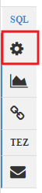
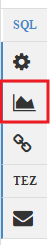
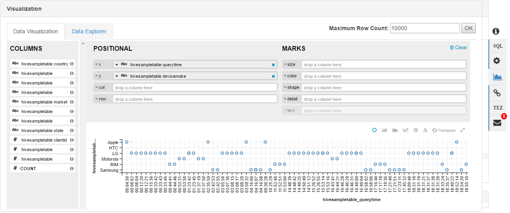
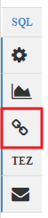
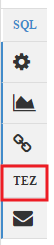
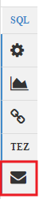

# Use the Hive View with Hadoop in HDInsight

[!INCLUDE [hive-selector](../../includes/hdinsight-selector-use-hive.md)]

Ambari is a management and monitoring utility provided with Linux-based HDInsight clusters. One of the features provided through Ambari is a Web UI that can be used to run Hive queries. This is the **Hive View**, part of the Ambari Views provided with your HDInsight cluster.

> [!NOTE]
> Ambari has many capabilities that are not discussed in this document. For more information, see [Manage HDInsight clusters by using the Ambari Web UI](hdinsight-hadoop-manage-ambari.md).

## Prerequisites

* A Linux-based HDInsight cluster. For information on creating cluster, see [Get started with Linux-based HDInsight](hdinsight-hadoop-linux-tutorial-get-started.md).

> [!IMPORTANT]
> The steps in this document require an HDInsight cluster that uses Linux. Linux is the only operating system used on HDInsight version 3.4 or greater. For more information, see [HDInsight Deprecation on Windows](hdinsight-component-versioning.md#hdi-version-33-nearing-deprecation-date).

## Open the Hive view

You can Ambari Views from the Azure portal; select your HDInsight cluster and then select **Ambari Views** from the **Quick Links** section.


You can also navigate directly to Ambari by going to https://CLUSTERNAME.azurehdinsight.net in a web browser. Replace **CLUSTERNAME** with the name of your HDInsight cluster. Select the set of squares from the page menu next to the **Admin** link to list available views. Select the **Hive view**.

.

> [!NOTE]
> When accessing Ambari, you are prompted to authenticate to the site. Enter the admin (default `admin`,) account name and password you used when creating the cluster.

You should see a page similar to the following:


## View tables
In the **Database Explorer** section of the page, select the **default** entry on the **Databases** tab. This displays a list of tables in the default database. For a new HDInsight cluster, only one table should exist; **hivesampletable**.


As tables are added through the steps in this document, you can use the refresh icon in the upper right corner of the Database Explorer to refresh the list.

## <a name="hivequery"></a>Query editor

Use the following steps from the Hive view to execute a Hive query.

1. In the **Query Editor** section of the page, paste the following HiveQL statements into the worksheet:

    ```hiveql
    DROP TABLE log4jLogs;
    CREATE EXTERNAL TABLE log4jLogs(t1 string, t2 string, t3 string, t4 string, t5 string, t6 string, t7 string)
    ROW FORMAT DELIMITED FIELDS TERMINATED BY ' '
    STORED AS TEXTFILE LOCATION '/example/data/';
    SELECT t4 AS sev, COUNT(*) AS cnt FROM log4jLogs WHERE t4 = '[ERROR]' GROUP BY t4;
    ```

    These statements perform the following actions:

   * **DROP TABLE** - Deletes the table and the data file, in case the table already exists.

   * **CREATE EXTERNAL TABLE** - Creates a new "external" table in Hive.
   External tables store only the table definition in Hive. The data is left in the original location.

   * **ROW FORMAT** - Tells Hive how the data is formatted. In this case, the fields in each log are separated by a space.

   * **STORED AS TEXTFILE LOCATION** - Tells Hive where the data is stored (the example/data directory), and that it is stored as text.

   * **SELECT** - Selects a count of all rows where column t4 contains the value [ERROR].

     > [!NOTE]
     > External tables should be used when you expect the underlying data to be updated by an external source. For example, an automated data upload process, or by another MapReduce operation. Dropping an external table does *not* delete the data, only the table definition.

2. To start the query, use the **Execute** button at the bottom of the Query Editor. It turns orange and the text changes to **Stop execution**. A **Query Process Results** section should appear beneath the Query Editor and display information about the job.

   > [!IMPORTANT]
   > Some browsers may not correctly refresh the log or results information. If you run a job and it appears to run forever without updating the log or returning results, try using Mozilla FireFox or Google Chrome instead.

3. Once the query has finished, The **Query Process Results** section displays the results of the operation. The **Stop execution** button also changes back to a green **Execute** button when the query completes. The **Results** tab should contain the following information:

        sev       cnt
        [ERROR]   3

    The **Logs** tab can be used to view the logging information created by the job.

   > [!TIP]
   > T **Save results** drop-down dialog in the upper left of the **Query Process Results** section allows you to download or save results.

4. Select the first four lines of this query, then select **Execute**. Notice that there are no results when the job completes. Using the **Execute** button when part of the query is selected only runs the selected statements. In this case, the selection didn't include the final statement that retrieves rows from the table. If you select just that line and use **Execute**, you should see the expected results.

5.To add a new worksheet, use the **New Worksheet** button at the bottom of the **Query Editor**. In the new worksheet, enter the following HiveQL statements:

    ```hiveql
    CREATE TABLE IF NOT EXISTS errorLogs (t1 string, t2 string, t3 string, t4 string, t5 string, t6 string, t7 string) STORED AS ORC;
    INSERT OVERWRITE TABLE errorLogs SELECT t1, t2, t3, t4, t5, t6, t7 FROM log4jLogs WHERE t4 = '[ERROR]';
    ```

  These statements perform the following actions:

   * **CREATE TABLE IF NOT EXISTS** - Creates a table, if it does not already exist. Since the **EXTERNAL** keyword is not used, an internal table is created. An internal table is stored in the Hive data warehouse and is managed completely by Hive. Unlike external tables, dropping an internal table deletes the underlying data as well.

   * **STORED AS ORC** - Stores the data in Optimized Row Columnar (ORC) format. This is a highly optimized and efficient format for storing Hive data.

   * **INSERT OVERWRITE ... SELECT** - Selects rows from the **log4jLogs** table that contain [ERROR], and then inserts the data into the **errorLogs** table.

     Use the **Execute** button to run this query. The **Results** tab does not contain any information when the query returns zero rows. The status should show as **SUCCEEDED** once the query completes.

### Hive settings

Select the **Settings** icon to the right of the editor.



Settings can be used to change various Hive settings, such as changing the execution engine for Hive from Tez (the default) to MapReduce.

### Visualization

Select the __Visualization__ icon to the right of the editor.



This opens the visualization interface, where you can create visualizations of the data returned from the query. The following is an example visualization using data from the `hivesampletable` included with HDInsight.



### Visual explain

Select the **Visual Explain** icon to the right of the editor.



This is the **Visual Explain** view of the query, which can be helpful in understanding the flow of complex queries. You can view a textual equivalent of this view by using the **Explain** button in the Query Editor.


### Tez

Select the **Tez** icon to the right of the editor.



This displays the Directed Acyclic Graph (DAG) used by Tez for this query, if one is available. If you want to view the DAG for queries you've ran in the past, or debug the Tez process, use the [Tez View](hdinsight-debug-ambari-tez-view.md) instead.

### Notifications

Select the **Notifications** icon to the right of the editor.



Notifications are messages that are generated when running queries. For example, you receive a notification when a query is submitted, or when an error occurs.

## Saved queries

1. From the Query Editor, create a worksheet and enter the following query:

    ```hiveql
    SELECT * from errorLogs;
    ```

    Execute the query to verify that it works. The results are similar to the following example:

        errorlogs.t1     errorlogs.t2     errorlogs.t3     errorlogs.t4     errorlogs.t5     errorlogs.t6     errorlogs.t7
        2012-02-03     18:35:34     SampleClass0     [ERROR]     incorrect     id     
        2012-02-03     18:55:54     SampleClass1     [ERROR]     incorrect     id     
        2012-02-03     19:25:27     SampleClass4     [ERROR]     incorrect     id

2. Use the **Save as** button at the bottom of the editor. Name this query **Errorlogs** and select **OK**. The name of the worksheet changes to **Errorlogs**.

3. Select the **Saved Queries** tab at the top of the Hive View page. **Errorlogs** is now listed as a saved query. It remains in this list until you remove it. Selecting the name opens the query in the Query Editor.

## Query history

The **History** button at the top of the Hive View allows you to view queries you have ran previously. Use it now and select some of the queries you have ran previously. When you select a query, it opens it in the Query Editor.

## User Defined Functions (UDF)

Hive can also be extended through **user-defined functions (UDF)**. A UDF allows you to implement functionality or logic that isn't easily modeled in HiveQL.

The UDF tab at the top of the Hive View allows you to declare and save a set of UDFs that can be used with the **Query Editor**.

Once you have added a UDF to the Hive View, an **Insert udfs** button appears at the bottom of the **Query Editor**. Selecting this displays a drop-down list of the UDFs defined in the Hive View. Selecting a UDF adds HiveQL statements to your query to enable the UDF.

For example, if you have defined a UDF with the following properties:

* Resource name: myudfs

* Resource path: /myudfs.jar

* UDF name: myawesomeudf

* UDF class name: com.myudfs.Awesome

Using the **Insert udfs** button displays an entry named **myudfs**, with another drop-down for each UDF defined for that resource. In this case, **myawesomeudf**. Selecting this entry adds the following to the beginning of the query:

```hiveql
add jar /myudfs.jar;
create temporary function myawesomeudf as 'com.myudfs.Awesome';
```

You can then use the UDF in your query. For example, `SELECT myawesomeudf(name) FROM people;`.

For more information on using UDFs with Hive on HDInsight, see the following:

* [Using Python with Hive and Pig in HDInsight](hdinsight-python.md)
* [How to add a custom Hive UDF to HDInsight](http://blogs.msdn.com/b/bigdatasupport/archive/2014/01/14/how-to-add-custom-hive-udfs-to-hdinsight.aspx)

## <a id="nextsteps"></a>Next steps
For general information on Hive in HDInsight:

* [Use Hive with Hadoop on HDInsight](hdinsight-use-hive.md)

For information on other ways you can work with Hadoop on HDInsight:

* [Use Pig with Hadoop on HDInsight](hdinsight-use-pig.md)
* [Use MapReduce with Hadoop on HDInsight](hdinsight-use-mapreduce.md)
