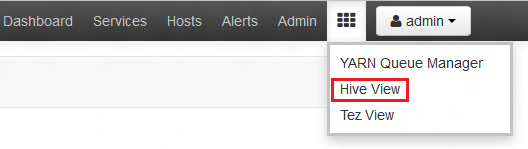
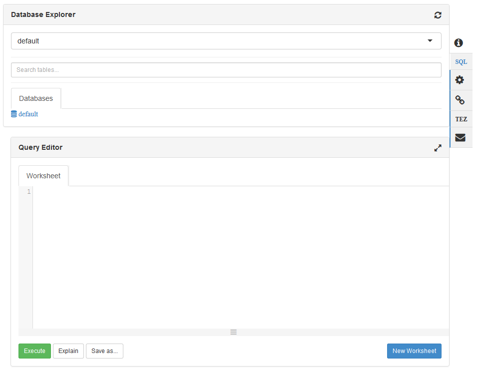
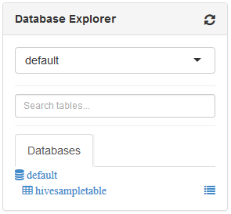
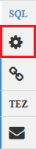
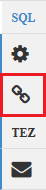
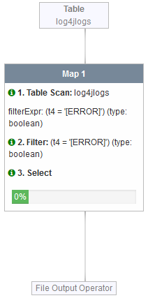
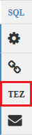

<properties
   pageTitle="Use Ambari Views to work with Hive on HDInsight (Hadoop) | Microsoft Azure"
   description="Learn how to use the Hive View from your web browser to submit Hive queries. The Hive View is part of the Ambari Web UI provided with your Linux-based HDInsight cluster."
   services="hdinsight"
   documentationCenter=""
   authors="Blackmist"
   manager="paulettm"
   editor="cgronlun"
	tags="azure-portal"/>

<tags
   ms.service="hdinsight"
   ms.devlang="na"
   ms.topic="article"
   ms.tgt_pltfrm="na"
   ms.workload="big-data"
   ms.date="08/09/2016"
   ms.author="larryfr"/>

#Use the Hive View with Hadoop in HDInsight

[AZURE.INCLUDE [hive-selector](../../includes/hdinsight-selector-use-hive.md)]

Ambari is a management and monitoring utility provided with Linux-based HDInsight clusters. One of the features provided through Ambari is a Web UI that can be used to run Hive queries. This is the __Hive View__, part of the Ambari Views provided with your HDInsight cluster.

> [AZURE.NOTE] Ambari has a lot of capabilities that won't be discussed in this document. For more information, see [Manage HDInsight clusters by using the Ambari Web UI](hdinsight-hadoop-manage-ambari.md).

##Prerequisites

- A Linux-based HDInsight cluster. For information on creating a new cluster, see [Get started with Linux-based HDInsight](hdinsight-hadoop-linux-tutorial-get-started.md).

##Open the Hive view

You can Ambari Views from the Azure Portal; select your HDInsight cluster and then select __Ambari Views__ from the __Quick Links__ section.

You can also navigate directly to Ambari by going to https://CLUSTERNAME.azurehdinsight.net in a web browser (where __CLUSTERNAME__ is the name of your HDInsight cluster,) and then select the set of squares from the page menu (next to the __Admin__ link and button on the left of the page,) to list available views. Select the __Hive view__.

.

> [AZURE.NOTE] When accessing Ambari, you will be prompted to authenticate to the site. Enter the admin (default `admin`,) account name and password you used when creating the cluster.

You should see a page similar to the following:

##View tables

In the __Database Explorer__ section of the page, select the __default__ entry on the __Databases__ tab. This will display a list of tables in the default database. For a new HDInsight cluster, only one table should exist; __hivesampletable__.

As new tables are added through the steps in this document, you can use the refresh icon in the upper right corner of the Database Explorer to refresh the list of available tables.

##Query editor

Use the following steps from the Hive view to run a Hive query against data included with the cluster.

1. In the __Query Editor__ section of the page, paste the following HiveQL statements into the worksheet:

		DROP TABLE log4jLogs;
		CREATE EXTERNAL TABLE log4jLogs(t1 string, t2 string, t3 string, t4 string, t5 string, t6 string, t7 string)
		ROW FORMAT DELIMITED FIELDS TERMINATED BY ' '
		STORED AS TEXTFILE LOCATION 'wasbs:///example/data/';
		SELECT t4 AS sev, COUNT(*) AS cnt FROM log4jLogs WHERE t4 = '[ERROR]' GROUP BY t4;

	These statements perform the following actions:

	- **DROP TABLE** - Deletes the table and the data file, in case the table already exists.
	- **CREATE EXTERNAL TABLE** - Creates a new "external" table in Hive. External tables store only the table definition in Hive; the data is left in the original location.
	- **ROW FORMAT** - Tells Hive how the data is formatted. In this case, the fields in each log are separated by a space.
	- **STORED AS TEXTFILE LOCATION** - Tells Hive where the data is stored (the example/data directory), and that it is stored as text.
	- **SELECT** - Selects a count of all rows where column t4 contains the value [ERROR].

	>[AZURE.NOTE] External tables should be used when you expect the underlying data to be updated by an external source, such as an automated data upload process, or by another MapReduce operation, but you always want Hive queries to use the latest data. Dropping an external table does *not* delete the data, only the table definition.

2. Use the __Execute__ button at the bottom of the Query Editor to start the query. It should turn orange and the text will change to __Stop execution__. A __Query Process Results__ section should appear beneath the Query Editor and display information about the job.

    > [AZURE.IMPORTANT] Some browsers may not correctly refresh the log or results information. If you run a job and it appears to run forever without updating the log or returning results, try using Mozilla FireFox or Google Chrome instead.

3. Once the query has finished, The __Query Process Results__ section will display the results of the operation. The __Stop execution__ button will also change back to a green __Execute__ button. The __Results__ tab should contain the following information:

        sev       cnt
        [ERROR]   3

    The __Logs__ tab can be used to view the logging information created by the job. You can use this for troubleshooting if there are problems with a query.

    > [AZURE.TIP] Note the __Save results__ drop-down dialog in the upper left of the __Query Process Results__ section; you can use this to either download the results, or save them to HDInsight storage as a CSV file.

3. Select the first four lines of this query, then select __Execute__. Notice that there are no results when the job completes. This is because using the __Execute__ button when part of the query is selected will only run the selected statements. In this case, the selection didn't include the final statement that retrieves rows from the table. If you select just that line and use __Execute__, you should see the expected results.

3. Use the __New Worksheet__ button at the bottom of the __Query Editor__ to create a new worksheet. In the new worksheet, enter the following HiveQL statements:

		CREATE TABLE IF NOT EXISTS errorLogs (t1 string, t2 string, t3 string, t4 string, t5 string, t6 string, t7 string) STORED AS ORC;
		INSERT OVERWRITE TABLE errorLogs SELECT t1, t2, t3, t4, t5, t6, t7 FROM log4jLogs WHERE t4 = '[ERROR]';

	These statements perform the following actions:

	- **CREATE TABLE IF NOT EXISTS** - Creates a table, if it does not already exist. Since the **EXTERNAL** keyword is not used, this is an internal table, which is stored in the Hive data warehouse and is managed completely by Hive. Unlike external tables, dropping an internal table will delete the underlying data as well.
	- **STORED AS ORC** - Stores the data in Optimized Row Columnar (ORC) format. This is a highly optimized and efficient format for storing Hive data.
	- **INSERT OVERWRITE ... SELECT** - Selects rows from the **log4jLogs** table that contain [ERROR], and then inserts the data into the **errorLogs** table.

    Use the __Execute__ button to run this query. The __Results__ tab will not contain any information as no rows are returned by this query, but the status should show as __SUCCEEDED__.

###Hive settings

Select the __Settings__ icon to the right of the editor.

Settings can be used to change various Hive settings, such as changing the execution engine for Hive from Tez (the default,) to MapReduce.

###Visual explain

Select the __Visual Explain__ icon to the right of the editor.

This is the __Visual Explain__ view of the query, which can be helpful in understanding the flow of complex queries. You can view a textual equivalent of this view by using the __Explain__ button in the Query Editor.

###Tez

Select the __Tez__ icon to the right of the editor.

This will display the Directed Acyclic Graph (DAG) used by Tez for this query, if one is available. If you want to view the DAG for queries you've ran in the past, or debug the Tez process, use the [Tez View](hdinsight-debug-ambari-tez-view.md) instead.

###Notifications

Select the __Notifications__ icon to the right of the editor.

Notifications are messages that are generated when running queries. For example, you will receive a notification when a query is submitted, or when an error occurs.

##Saved queries

1. From the Query Editor, create a new worksheet and enter the following query:

        SELECT * from errorLogs;

    Execute the query to verify that it works. The results will be as follows:

        errorlogs.t1 	errorlogs.t2 	errorlogs.t3 	errorlogs.t4 	errorlogs.t5 	errorlogs.t6 	errorlogs.t7
        2012-02-03 	18:35:34 	SampleClass0 	[ERROR] 	incorrect 	id 	
        2012-02-03 	18:55:54 	SampleClass1 	[ERROR] 	incorrect 	id 	
        2012-02-03 	19:25:27 	SampleClass4 	[ERROR] 	incorrect 	id

2. Use the __Save as__ button at the bottom of the editor. Name this query __Errorlogs__ and select __OK__. Note that the name of the worksheet changes to __Errorlogs__.

3. Select the __Saved Queries__ tab at the top of the Hive View page. Note that __Errorlogs__ is now listed as a saved query. It will remain in this list until you remove it. Selecting the name will open the query in the Query Editor.

##Query history

The __History__ button at the top of the Hive View allows you to view queries you have ran previously. Use it now and select some of the queries you have ran previously. When you select a query, it opens it in the Query Editor.

##User Defined Functions (UDF)

Hive can also be extended through **user-defined functions (UDF)**. A UDF allows you to implement functionality or logic that isn't easily modeled in HiveQL.

While you can add a UDF as part of the HiveQL statements in your query, the UDF tab at the top of the Hive View allows you to declare and save a set of UDFs that can be used with the __Query Editor__.

Once you have added a UDF to the Hive View, an __Insert udfs__ button will appear at the bottom of the __Query Editor__. Selecting this will display a drop-down list of the UDFs defined in the Hive View. Selecting a UDF will add HiveQL statements to your query to enable the UDF.

For example, if you have defined a UDF with the following properties:

* Resource name: myudfs
* Resource path: wasbs:///myudfs.jar
* UDF name: myawesomeudf
* UDF class name: com.myudfs.Awesome

Using the __Insert udfs__ button will display an entry named __myudfs__, with another drop-down for each UDF defined for that resource. In this case, __myawesomeudf__. Selecting this entry will add the following to the beginning of the query:

    add jar wasbs:///myudfs.jar;

    create temporary function myawesomeudf as 'com.myudfs.Awesome';

You can then use the UDF in your query. For example, `SELECT myawesomeudf(name) FROM people;`.

For more information on using UDFs with Hive on HDInsight, see the following:

* [Using Python with Hive and Pig in HDInsight](hdinsight-python.md)

* [How to add a custom Hive UDF to HDInsight](http://blogs.msdn.com/b/bigdatasupport/archive/2014/01/14/how-to-add-custom-hive-udfs-to-hdinsight.aspx)

##Next steps

For general information on Hive in HDInsight:

* [Use Hive with Hadoop on HDInsight](hdinsight-use-hive.md)

For information on other ways you can work with Hadoop on HDInsight:

* [Use Pig with Hadoop on HDInsight](hdinsight-use-pig.md)

* [Use MapReduce with Hadoop on HDInsight](hdinsight-use-mapreduce.md)
