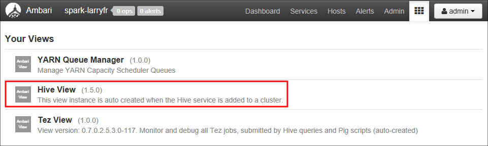
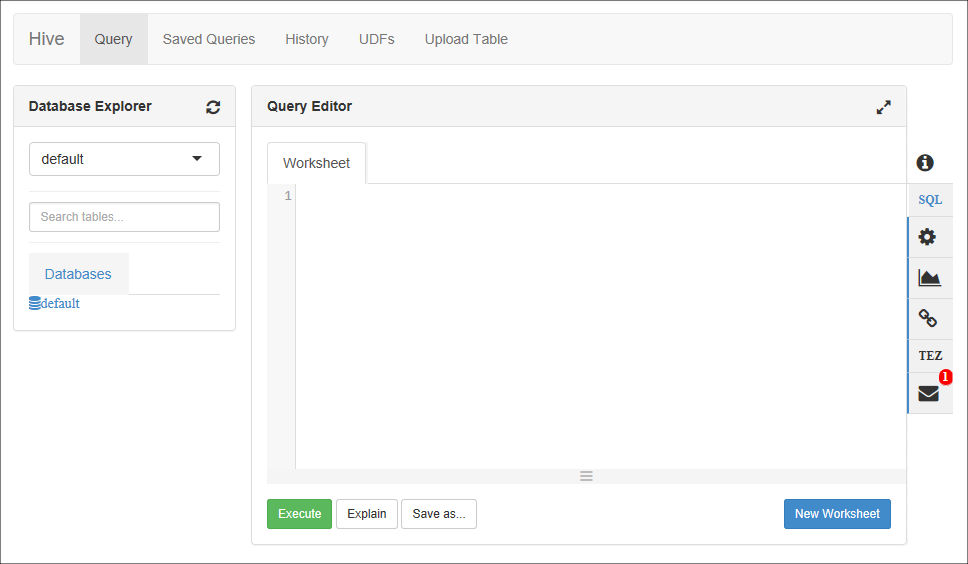
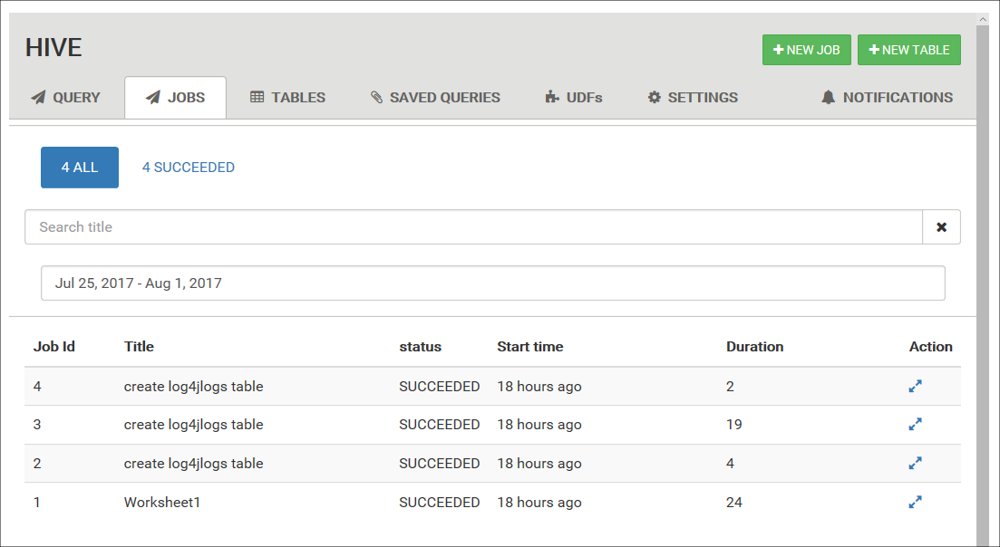
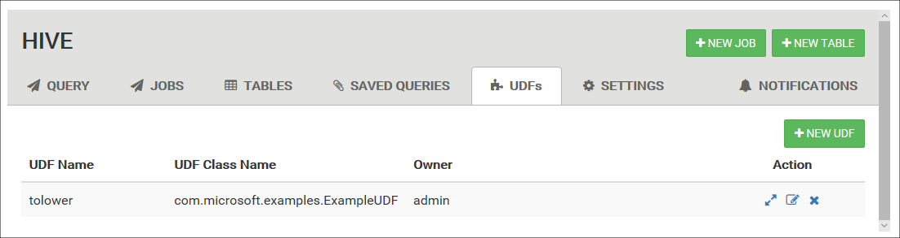

# Use Ambari Hive View with Hadoop in HDInsight

[!INCLUDE [hive-selector](../../includes/hdinsight-selector-use-hive.md)]

Learn how to run Hive queries by using Ambari Hive View. Ambari is a management and monitoring utility provided with Linux-based HDInsight clusters. One of the features provided through Ambari is a Web UI that can be used to run Hive queries.

> [!NOTE]
> Ambari has many capabilities that are not discussed in this document. For more information, see [Manage HDInsight clusters by using the Ambari Web UI](hdinsight-hadoop-manage-ambari.md).

## Prerequisites

* A Linux-based HDInsight cluster. For information on creating clusters, see [Get started using Hadoop in HDInsight](hdinsight-hadoop-linux-tutorial-get-started.md).

> [!IMPORTANT]
> The steps in this document require an Azure HDInsight cluster that uses Linux. Linux is the only operating system used on HDInsight version 3.4 or later. For more information, see [HDInsight retirement on Windows](hdinsight-component-versioning.md#hdinsight-windows-retirement).

## Open the Hive View

You can open Ambari Views from the Azure portal. Select your HDInsight cluster, and then select **Ambari Views** from the **Quick Links** section.


From the list of views, select __Hive View__.



> [!NOTE]
> When you're accessing Ambari, you're prompted to authenticate to the site. Enter the admin (default `admin`) account name and password that you used when you created the cluster.

You should see a page similar to the following image:



## Run a query

To run a Hive query, use the following steps from the Hive view.

1. From the __Query__ tab, paste the following HiveQL statements into the worksheet:

    ```hiveql
    DROP TABLE log4jLogs;
    CREATE EXTERNAL TABLE log4jLogs(t1 string, t2 string, t3 string, t4 string, t5 string, t6 string, t7 string)
    ROW FORMAT DELIMITED FIELDS TERMINATED BY ' '
    STORED AS TEXTFILE LOCATION '/example/data/';
    SELECT t4 AS sev, COUNT(*) AS cnt FROM log4jLogs WHERE t4 = '[ERROR]' GROUP BY t4;
    ```

    These statements perform the following actions:

   * `DROP TABLE`: Deletes the table and the data file, in case the table already exists.

   * `CREATE EXTERNAL TABLE`: Creates a new "external" table in Hive.
   External tables store only the table definition in Hive. The data is left in the original location.

   * `ROW FORMAT`: Shows how the data is formatted. In this case, the fields in each log are separated by a space.

   * `STORED AS TEXTFILE LOCATION`: Shows where the data is stored, and that it's stored as text.

   * `SELECT`: Selects a count of all rows where column t4 contains the value [ERROR].

     > [!NOTE]
     > Use external tables when you expect the underlying data to be updated by an external source, such as an automated data upload process or another MapReduce operation. Dropping an external table does *not* delete the data, only the table definition.

    > [!IMPORTANT]
    > Leave the __Database__ selection at __default__. The examples in this document use the default database included with HDInsight.

2. To start the query, use the **Execute** button below the worksheet. The button turns orange and the text changes to **Stop**.

3. After the query has finished, the **Results** tab displays the results of the operation. The following text is the result of the query:

        sev       cnt
        [ERROR]   3

    You can use the **Logs** tab to view the logging information that the job created.

   > [!TIP]
   > Download or save results from the **Save results** drop-down dialog box in the upper left of the **Query Process Results** section.

4. Select the first four lines of this query, and then select **Execute**. Notice that there are no results when the job finishes. Using the **Execute** button when part of the query is selected only runs the selected statements. In this case, the selection didn't include the final statement that retrieves rows from the table. If you select just that line and use **Execute**, you should see the expected results.

5. To add a worksheet, use the **New Worksheet** button at the bottom of the **Query Editor**. In the new worksheet, enter the following HiveQL statements:

    ```hiveql
    CREATE TABLE IF NOT EXISTS errorLogs (t1 string, t2 string, t3 string, t4 string, t5 string, t6 string, t7 string) STORED AS ORC;
    INSERT OVERWRITE TABLE errorLogs SELECT t1, t2, t3, t4, t5, t6, t7 FROM log4jLogs WHERE t4 = '[ERROR]';
    ```

  These statements perform the following actions:

   * **CREATE TABLE IF NOT EXISTS**: Creates a table if one does not already exist. Because the **EXTERNAL** keyword is not used, an internal table is created. An internal table is stored in the Hive data warehouse and is managed completely by Hive. Unlike with external tables, dropping an internal table deletes the underlying data as well.

   * **STORED AS ORC**: Stores the data in Optimized Row Columnar (ORC) format. ORC is a highly optimized and efficient format for storing Hive data.

   * **INSERT OVERWRITE ... SELECT**: Selects rows from the **log4jLogs** table that contain `[ERROR]`, and then inserts the data into the **errorLogs** table.

Use the **Execute** button to run this query. The **Results** tab does not contain any information when the query returns zero rows. The status should show as **SUCCEEDED** after the query finishes.

### Visual explain

To display a visualization of the query plan, select the **Visual Explain** tab below the worksheet.

The **Visual Explain** view of the query can be helpful in understanding the flow of complex queries. You can see a textual equivalent of this view by using the **Explain** button in the Query Editor.

### Tez UI

To display the Tez UI for the query, select the **Tez** tab below the worksheet.

> [!IMPORTANT]
> Tez is not used to resolve all queries. You can resolve many queries without using Tez. 

If Tez was used to resolve the query, the Directed Acyclic Graph (DAG) is displayed. If you want to view the DAG for queries you've run in the past, or if you want to debug the Tez process, use the [Tez View](hdinsight-debug-ambari-tez-view.md) instead.

## View job history

The __Jobs__ tab displays a history of Hive queries.



## Database tables

You can use the __Tables__ tab to work with tables within a Hive database.


## Saved queries

From the **Query** tab, you can optionally save queries. After you save a query, you can reuse it from the __Saved Queries__ tab.


## User-defined functions

You can also extend Hive through user-defined functions (UDF). Use a UDF to implement functionality or logic that isn't easily modeled in HiveQL.

Declare and save a set of UDFs by using the **UDF** tab at the top of the Hive View. These UDFs can be used with the **Query Editor**.



After you've added a UDF to the Hive View, an **Insert udfs** button appears at the bottom of the **Query Editor**. Selecting this entry displays a drop-down list of the UDFs defined in the Hive View. Selecting a UDF adds HiveQL statements to your query to enable the UDF.

For example, if you have defined a UDF with the following properties:

* Resource name: myudfs

* Resource path: /myudfs.jar

* UDF name: myawesomeudf

* UDF class name: com.myudfs.Awesome

Using the **Insert udfs** button displays an entry named **myudfs**, with another drop-down list for each UDF defined for that resource. In this case, it's **myawesomeudf**. Selecting this entry adds the following to the beginning of the query:

```hiveql
add jar /myudfs.jar;
create temporary function myawesomeudf as 'com.myudfs.Awesome';
```

You can then use the UDF in your query. For example, `SELECT myawesomeudf(name) FROM people;`.

For more information on using UDFs with Hive on HDInsight, see the following articles:

* [Using Python with Hive and Pig in HDInsight](hdinsight-python.md)
* [How to add a custom Hive UDF to HDInsight](http://blogs.msdn.com/b/bigdatasupport/archive/2014/01/14/how-to-add-custom-hive-udfs-to-hdinsight.aspx)

## Hive settings

You can change various Hive settings, such as changing the execution engine for Hive from Tez (the default) to MapReduce.

## <a id="nextsteps"></a>Next steps

For general information on Hive on HDInsight:

* [Use Hive with Hadoop on HDInsight](hdinsight-use-hive.md)

For information on other ways you can work with Hadoop on HDInsight:

* [Use Pig with Hadoop on HDInsight](hdinsight-use-pig.md)
* [Use MapReduce with Hadoop on HDInsight](hdinsight-use-mapreduce.md)
