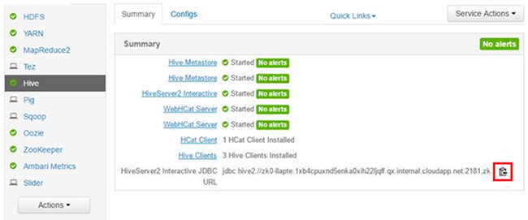

# Use Interactive Hive in HDInsight (Preview)
Interactive Hive (A.K.A. [Live Long and Process](https://cwiki.apache.org/confluence/display/Hive/LLAP)) is a new HDInsight [cluster type](hdinsight-hadoop-provision-linux-clusters.md#cluster-types).  Interactive Hive allows in memory caching that makes Hive queries much more interactive and faster. This new feature makes HDInsight one of the world’s most performant, flexible, and open Big Data solutions on the cloud with in-memory caches (using Hive and Spark) and advanced analytics through deep integration with R Services. 

The Interactive Hive cluster is different from the Hadoop cluster. It only contains the Hive service. 

> [!NOTE]
> MapReduce, Pig, Sqoop, Oozie, and other services will be removed from this cluster type soon.
> The Hive service in the Interactive Hive cluster is only accessible via the Ambari Hive view, Beeline, and Hive ODBC. It can’t be accessed via Hive console, Templeton, Azure CLI, and Azure PowerShell. 
> 
> 

## Create an Interactive Hive cluster
Interactive Hive cluster is only supported on Linux-based clusters. For information about creating HDInsight clusters, see [Create Linux-based Hadoop clusters in HDInsight](hdinsight-hadoop-provision-linux-clusters.md).

## Execute Hive from Interactive Hive
There are different options how you can execute Hive queries:

* Run Hive using the Ambari Hive view
  
    For the information about using the Hive View, see [Use the Hive View with Hadoop in HDInsight](hdinsight-hadoop-use-hive-ambari-view.md).
* Run Hive using Beeline
  
    For the information on using Beeline on HDInsight, see [Use Hive with Hadoop in HDInsight with Beeline](hdinsight-hadoop-use-hive-beeline.md).
  
    You use Beeline from either the headnode or an empty edge node.  Using Beeline from an empty edge node is recommended.  For information on creating an HDInsight cluster with an empty edgenode, see [Use empty edge nodes in HDInsight](hdinsight-apps-use-edge-node.md).
* Run Hive using Hive ODBC
  
    For the information on using Hive ODBC, see [Connect Excel to Hadoop with the Microsoft Hive ODBC driver](hdinsight-connect-excel-hive-odbc-driver.md).

**To find the JDBC connection string:**

1. Sign on to Ambari using the following URL: https://<ClusterName>.AzureHDInsight.net.
2. Click **Hive** from the left menu.
3. Click the highlighted icon to copy the URL:
   
   

## See also
* [Create Linux-based Hadoop clusters in HDInsight](hdinsight-hadoop-provision-linux-clusters.md): Learn how to create Interactive Hive clusters in HDInsight.
* [Use Hive with Hadoop in HDInsight with Beeline](hdinsight-hadoop-use-hive-beeline.md): Learn how to use Beeline to submit Hive queries.
* [Connect Excel to Hadoop with the Microsoft Hive ODBC driver](hdinsight-connect-excel-hive-odbc-driver.md): learn how to connect Excel to Hive.

