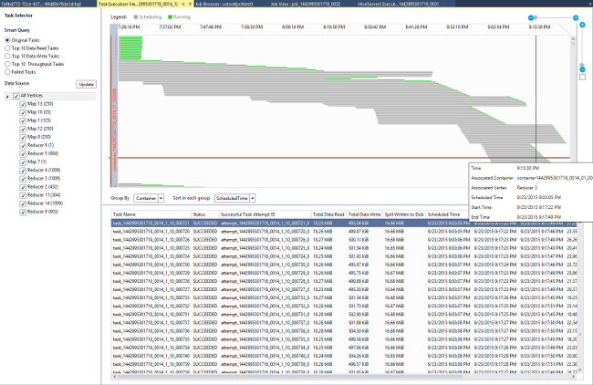

<properties
	pageTitle="Learn to use Visual Studio Hadoop tools for HDInsight | Microsoft Azure"
	description="Learn how to install and use Visual Studio Hadoop tools for HDInsight to connect to a Hadoop cluster and run a Hive query."
	keywords="hadoop tools,hive query,visual studio"
	services="HDInsight"
	documentationCenter=""
	tags="azure-portal"
	authors="mumian"
	manager="paulettm"
	editor="cgronlun"/>

<tags
	ms.service="hdinsight"
	ms.devlang="na"
	ms.topic="get-started-article"
	ms.tgt_pltfrm="na"
	ms.workload="big-data"
	ms.date="08/10/2016"
	ms.author="jgao"/>

# Get started using Visual Studio Hadoop tools for HDInsight to run a Hive query

Learn how to use HDInsight Tools for Visual Studio to connect to HDInsight clusters and submit Hive queries. For more information about using HDInsight, see [Introduction to HDInsight][hdinsight.introduction] and [Get started with HDInsight][hdinsight.get.started]. For more information about connecting to a Storm cluster, see [Develop C# topologies for Apache Storm on HDInsight using Visual Studio][hdinsight.storm.visual.studio.tools].

**Prerequisites**

To complete this tutorial and use the Hadoop tools in Visual Studio, you'll need the following:

- An Azure HDInsight cluster: Either a Linux-based or Windows-based cluster will work with the steps in this document. See one of the following for information on creating a cluster:

	- [Get started using Linux-based HDInsight](hdinsight-hadoop-linux-tutorial-get-started.md)
	- [Get started using Windows-based HDInsight](hdinsight-hadoop-tutorial-get-started-windows.md)

- A workstation with the following software:

	- Windows 8.1, Windows 8, or Windows 7
	- Visual Studio (one of the following versions):
		- Visual Studio 2013 Community/Professional/Premium/Ultimate with [Update 4](https://www.microsoft.com/download/details.aspx?id=44921)
		- Visual Studio 2015 (Community/Enterprise)

	>[AZURE.NOTE] Currently, the HDInsight Tools for Visual Studio only come with the English version.

## Install HDInsight tools for Visual Studio

HDInsight Tools for Visual Studio and Microsoft Hive ODBC Driver are packaged with Microsoft Azure SDK for .NET version 2.5.1 or later. You can install it using the [Web Platform Installer](http://go.microsoft.com/fwlink/?LinkId=255386). You must choose the one that matches your version of Visual Studio. If you don't have Visual Studio installed, you can install the latest Visual Studio Community and Azure SDK using the [Web Platform Installer](http://go.microsoft.com/fwlink/?LinkId=255386) or using the following links:

- [Visual Studio Community 2015 with Microsoft Azure SDK](https://www.microsoft.com/web/handlers/webpi.ashx/getinstaller/VS2015CommunityAzurePack.appids)
- [Visual Studio Community 2013 with Microsoft Azure SDK](https://www.microsoft.com/web/handlers/webpi.ashx/getinstaller/VS2013CommunityAzurePack.appids)
- [Microsoft Azure SDK for .NET (VS 2015)](https://www.microsoft.com/web/handlers/webpi.ashx/getinstaller/VWDOrVs2015AzurePack.appids)
- [Microsoft Azure SDK for .NET (VS 2013)](https://www.microsoft.com/web/handlers/webpi.ashx/getinstaller/VWDOrVs2013AzurePack.appids)

![Hadoop tools: HDinsight Tools for Visual Studio Web Platform installer.][1]

## Connect to Azure subscriptions
The HDInsight Tools for Visual Studio allows you to connect to your HDInsight clusters, perform some basic management operations, and run Hive queries.

>[AZURE.NOTE] For information on connecting to a generic Hadoop cluster, see [Write and submit Hive queries using Visual Studio](http://blogs.msdn.com/b/xiaoyong/archive/2015/05/04/how-to-write-and-submit-hive-queries-using-visual-studio.aspx).

**To connect to your Azure subscription**

1.	Open Visual Studio.
2.	From the **View** menu, click **Server Explorer** to open the Server Explorer window.
3.	Expand **Azure**, and then expand **HDInsight**.

	>[AZURE.NOTE]Notice the **HDInsight Task List** window should be open. If you don't see it, click **Other Windows** from the **View** menu, and then click **HDInsight Task List Window**.  
4.	Enter your Azure subscription credentials, and then click **Sign In**. This is only required if you have never connected to the Azure subscription from Visual Studio on this workstation.
5.	In Server Explorer, you'll see a list of existing HDInsight clusters. If you don't have any clusters, you can provision one by using the Azure Portal, Azure PowerShell, or the HDInsight SDK. For more information, see [Provision HDInsight clusters][hdinsight-provision].

	![Hadoop tools: HDInsight Tools for Visual Studio Server Explorer cluster list][5]
6.	Expand an HDInsight cluster. You'll see **Hive Databases**, a default storage account, linked storage accounts, and **Hadoop Service log**. You can further expand the entities.

After you've connected to your Azure subscription, you'll be able to do the following:

**To connect to the Azure portal from Visual Studio**

- From Server Explorer, expand **Azure** > **HDInsight**, right-click an HDInsight cluster, and then click **Manage Cluster in Azure Portal**.

**To ask questions and provide feedback from Visual Studio**

- From the **Tools** menu, click **HDInsight**, and then click **MSDN Forum** to ask questions, or click **Give Feedback**.

## Navigate the linked resources

From Server Explorer, you can see the default storage account and any linked storage accounts. If you expand the default storage account, you can see the containers on the storage account. The default storage account and the default container are marked. You can also right-click any of the containers to view the contents.

![HDInsight Tools for Visual Studio server explorer cluster list][2]

After openning a container, you can using the following buttons to upload, delete, and download blobs:

## Run a Hive query
[Apache Hive][apache.hive] is a data warehouse infrastructure built on Hadoop for providing data summarization, queries, and analysis. HDInsight Tools for Visual Studio supports running Hive queries from Visual Studio. For more information about Hive, see [Use Hive with HDInsight][hdinsight.hive].

It is time consuming to test Hive script against an HDInsight cluster. It could take several minutes or more. HDInsight Tools for Visual Studio is capable of validating Hive script locally without connecting to a live cluster.

HDInsight Tools for Visual Studio also enables users to see what’s inside the Hive job by collecting and surfacing the YARN logs of certain Hive jobs.

### View the **hivesampletable**
All HDInsight clusters come with a sample Hive table called *hivesampletable*. We'll use this table to show you how to list Hive tables, view the table schemas, and list the rows in the Hive table.

**To list Hive tables and view Hive table schema**

1.	From **Server Explorer**, expand **Azure** > **HDInsight** > the cluster of your choice > **Hive Databases** > **Default** > **hivesampletable** to see the table schema.
4.	Right-click **hivesampletable**, and then click **View Top 100 Rows** to list the rows. It is equivalent to running the following Hive query using Hive ODBC driver:

		SELECT * FROM hivesampletable LIMIT 100

	You can customize the row count.

	![Hadoop tools: HDinsight Hive Visual Studio schema query][6]

### Create Hive tables

You can use the GUI to create a Hive table or use Hive queries. For information about using Hive queries, see [Run Hive queries](#run.queries).

**To create a Hive table**

1. From **Server Explorer**, expand **Azure** > **HDInsight Clusters** an HDInsight cluster > **Hive Databases**, then right-click **default**, and click **Create Table**.
2. Configure the table.
3. Click **Create Table** to submit the job to create the new Hive table.

	![Hadoop tools: hdinsight visual studio tools create hive table][7]

### Validate and run Hive queries
There are two ways to create and run Hive queries:

- Create ad-hoc queries
- Create a Hive application

**To create, validate, and run ad-hoc queries**

1. From **Server Explorer**, expand **Azure**, and then expand **HDInsight Clusters**.
2. Right-click the cluster where you want to run the query, and then click **Write a Hive Query**.
3. Enter the Hive queries. Notice the Hive editor supports IntelliSense. HDInsight Tools for Visual Studio supports loading the remote metadata when you are editing your Hive script. For example, when you type "SELECT * FROM", the IntelliSense lists all the suggested table names. When a table name is specified, the column names are listed by the IntelliSense. The tool supports almost all Hive DML statements, subqueries, and the built-in UDFs.

	![Hadoop tools: HDInsight Visual Studio Tools IntelliSense][13]

	![Hadoop tools: HDInsight Visual Studio Tools IntelliSense][14]

	> [AZURE.NOTE] Only the metadata of the clusters that is selected in HDInsight Toolbar will be suggested.
4. (Optional): Click **Validate Script** to check the script syntax errors.

	![Hadoop tools: hdinsight tools for Visual Studio local validation][10]

4. Click **Submit** or **Submit (Advanced)**. With the advanced submit option, you'll configure **Job Name**, **Arguments**, **Additional Configurations**, and **Status Directory** for the script:

	![hdinsight hadoop hive query][9]

	After you submit the job, you see a **Hive Job Summary** window.

	![Summary of an HDInsight Hadoop Hive query][8]
5. Use the **Refresh** button to update the status until the job status changes to **Completed**.
6. Click the links at the bottom to see the following: **Job Query**, **Job Output**, **Job log**, or **Yarn log**.

**To create and run a Hive solution**

1. From the **FILE** menu, click **New**, and then click **Project**.
2. Select **HDInsight** from the left pane, select **Hive Application** in the middle pane, enter the properties, and then click **OK**.

	![Hadoop tools: hdinsight visual studio tools new hive project][11]
3. From **Solution Explorer**, double-click **Script.hql** to open it.
4. To validate the Hive script, you can click the **Validate Script** button, or right-click the script in the Hive editor, and then click **Validate Script** from the context menu.

### View Hive jobs
You can view job queries, job output, job logs, and Yarn logs for Hive jobs. For more information, see the previous screenshot.

The most recent release of the tool allows you to see what’s inside your Hive jobs by collecting and surfacing  YARN logs. A YARN log can help you investigating performance issues. For more information about how HDInsight collects YARN logs, see [Access HDInsight Application Logs Programmatically][hdinsight.access.application.logs].

**To view Hive jobs**

1. From **Server Explorer**, expand **Azure**, and then expand **HDInsight**.
2. Right-click an HDInsight cluster, and then click **View Jobs**. You'll see a list of the Hive jobs that ran on the cluster.
3. Click a job in the job list to select it, and then use the **Hive Job Summary** window to open **Job Query**, **Job Output**, **Job Log**, or **Yarn log**.

	![Hadoop tools: HDInsight Visual Studio Tools view Hive jobs][12]

### Faster path Hive execution via HiveServer2

>[AZURE.NOTE] This feature only works on HDInsight cluster version 3.2 and newer.

The HDInsight Tools used to submit Hive jobs via [WebHCat](https://cwiki.apache.org/confluence/display/Hive/WebHCat) (also known as Templeton). It took a long time to return job details and error information.
In order to solve this performance issue, the HDInsight Tools executes Hive jobs directly in the cluster through HiveServer2, so that it bypasses RDP/SSH.
In addition to better performance, users can also view Hive on Tez graphs, and the Task details.

For HDInsight cluster version 3.2 or later, you can see a **Execute via HiveServer2** button:

And you can see the logs streamed back in realtime and see the job graphs if the Hive query is executed in Tez.

**Difference between executing queries via HiveServer2 and Submitting Queries via WebHCat**

Even though executing queries via HiveServer2 has many performance benefits, it has several limitations. Some of the limitations are not suitable for production usage. The following table shows the differences:

| |Executing via HiveServer2 |Submitting via WebHCat|
|---|---|---|
|Execute queries|Eliminates the overhead in WebHCat (which launches a MapReduce Job named “TempletonControllerJob”).|As long as a query is executed via WebHCat, WebHCat will launch a MapReduce job which introduces additional latency.|
|Stream logs back|In near real-time.|The job execution logs are available only when the job is finished.|
|View job history|If a query is executed via HiveServer2, it’s job history (job log, job output) is not preserved. The application can be viewed in YARN UI with limited information.|If a query is executed via WebHCat, it’s job history (job log, job output) is preserved and can be viewed using Visual Studio/HDInsight SDK/PowerShell. |
|Close window| 	Executing via HiveServer2 is a “synchronous” way so you must keep the windows open; if the windows are closed then the query execution will be cancelled.|Submitting via WebHCat is a “asynchronous” way so you can submit the query via WebHCat and close Visual Studio. You can come back and see the results at any time.|

### Tez Hive job performance graph

The HDInsight Visual Studio Tools support showing performance graphs for the Hive jobs ran by the Tez execution engine. For information on enabling Tez, see [use Hive in HDInsight][hdinsight.hive]. After you submit a Hive job in Visual Studio, Visual Studio shows you the graph when the job is completed.  You might need to click the **Refresh** button to get the latest job status.

> [AZURE.NOTE] This feature is only available for HDInsight cluster version above 3.2.4.593, and can only work for completed jobs (if you submitted your job through WebHCat; this graph will show when you execute your query through HiveServer2). This works for both Windows and Linux based clusters.

To help you understand your Hive query better, the tool add the Hive Operator view in this release. You just need to double click on the vertices of the job graph and you can see all the operators inside the vertex. You can also hover on a particular operator to view more details of this operator.

### Task execution view for Hive on Tez jobs

The Task execution view for Hive on Tez jobs can be used to get structured & visualized information for Hive jobs, and get more job details. When
there are performance issues, you can use the view to get further details. For example, how each task operates and the detailed information about each task
(data read/write, schedule/start/end time, etc.), so that you can tune job configurations or system architecture based on the visualized information.

## Run Pig scripts

HDInsight Tools for Visual Studio supports creating and submit Pig scripts to HDInsight clusters. Users can create a Pig project from template, and then submit the script to HDInsight clusters.

## Feedbacks & Known issues

- Currently HiveServer2 results are displayed in pure text fashion which is not ideal. We are working on fixing that.

- If the results are started with NULL values, currently the results are not shown. We have fixed this issue and if you are blocked on this issue, feel free to drop us an email or contact support team.

- The HQL script created by Visual Studio is encoded depending on user’s local region setting. It may not execute correctly if user uploads the script to cluster as binary.

If you have any suggestions or feedbacks, or if you encounter any problems when using this tool, feel free to drop us an email at hdivstool at microsoft dot com.

## Next steps
In this article, you learned how to connect to HDInsight clusters from Visual Studio, using the Hadoop tools package, and how to run a Hive query. For more information, see:

- [Use Hadoop Hive in HDInsight][hdinsight.hive]
- [Get started using Hadoop in HDInsight][hdinsight.get.started]
- [Submit Hadoop jobs in HDInsight][hdinsight.submit.jobs]
- [Analyze Twitter data with Hadoop in HDInsight][hdinsight.analyze.twitter.data]

<!--Anchors-->
[Installation]: #installation
[Connect to your Azure subscription]: #connect-to-your-azure-subscription
[Navigate the linked resources]: #navigate-the-linked-resources
[Run Hive queries]: #run-hive-queries
[Next steps]: #next-steps

<!--Image references-->
[1]: ./media/hdinsight-hadoop-visual-studio-tools-get-started/hdinsight.visual.studio.tools.wpi.png
[2]: ./media/hdinsight-hadoop-visual-studio-tools-get-started/hdinsight.visual.studio.tools.linked.resources.png
[5]: ./media/hdinsight-hadoop-visual-studio-tools-get-started/hdinsight.visual.studio.tools.server.explorer.png
[6]: ./media/hdinsight-hadoop-visual-studio-tools-get-started/hdinsight.visual.studio.tools.hive.schema.png
[7]: ./media/hdinsight-hadoop-visual-studio-tools-get-started/hdinsight.visual.studio.tools.create.hive.table.png
[8]: ./media/hdinsight-hadoop-visual-studio-tools-get-started/hdinsight.visual.studio.tools.run.hive.job.summary.png
[9]: ./media/hdinsight-hadoop-visual-studio-tools-get-started/hdinsight.visual.studio.tools.submit.jobs.advanced.png
[10]: ./media/hdinsight-hadoop-visual-studio-tools-get-started/hdinsight.visual.studio.tools.validate.hive.script.png
[11]: ./media/hdinsight-hadoop-visual-studio-tools-get-started/hdinsight.visual.studio.tools.new.hive.project.png
[12]: ./media/hdinsight-hadoop-visual-studio-tools-get-started/hdinsight.visual.studio.tools.view.hive.jobs.png
[13]: ./media/hdinsight-hadoop-visual-studio-tools-get-started/hdinsight.visual.studio.tools.intellisense.table.names.png
[14]: ./media/hdinsight-hadoop-visual-studio-tools-get-started/hdinsight.visual.studio.tools.intellisense.column.names.png

<!--Link references-->
[hdinsight-provision]: hdinsight-provision-clusters.md
[hdinsight.introduction]: hdinsight-hadoop-introduction.md
[hdinsight.get.started]: hdinsight-hadoop-linux-tutorial-get-started.md
[hdinsight.hive]: hdinsight-use-hive.md
[hdinsight.submit.jobs]: hdinsight-submit-hadoop-jobs-programmatically.md
[hdinsight.analyze.twitter.data]: hdinsight-analyze-twitter-data.md
[hdinsight.storm.visual.studio.tools]: hdinsight-storm-develop-csharp-visual-studio-topology.md
[hdinsight.access.application.logs]: hdinsight-hadoop-access-yarn-app-logs.md

[apache.hive]: http://hive.apache.org
