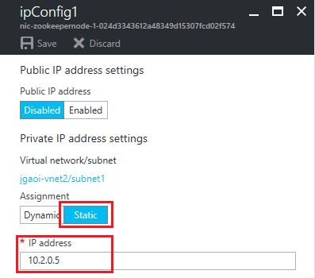

---
title: Configure HBase replication | Microsoft Docs
description: Learn how to configure HBase replication for load balancing, high availability, zero-downtime migration/update from one HDInsight version to another, and disaster recovery.
services: hdinsight,virtual-network
documentationcenter: ''
author: mumian
manager: jhubbard
editor: cgronlun

ms.service: hdinsight
ms.custom: hdinsightactive
ms.devlang: na
ms.topic: article
ms.tgt_pltfrm: na
ms.workload: big-data
ms.date: 02/22/2017
ms.author: jgao

---
# Configure HBase replication

Learn how to configure HBase replication within one virtual network (VNet) or between two virtual networks.

Cluster replication uses a source-push methodology. An HBase cluster can be a source or a destination, or it can fulfill both roles at once. Replication is asynchronous, and the goal of replication is eventual consistency. When the source receives an edit to a column family with replication enabled, that edit is propagated to all destination clusters. When data is replicated from one cluster to another, the source cluster and all clusters that have already consumed the data are tracked to prevent replication loops.

In this tutorial, you will configure a source-destination replication. For other cluster topologies, see [Apache HBase Reference Guide](http://hbase.apache.org/book.html#_cluster_replication).

HBase replication usage cases for a single virtual network:

* Load balancing--for example, running scans or MapReduce jobs on the destination cluster and ingesting data on the source cluster
* High availability
* Migrating data from one HBase cluster to another
* Upgrading an Azure HDInsight cluster from one version to another

HBase replication usage cases for two virtual networks:

* Disaster recovery
* Load balancing and partitioning the application
* High availability

You replicate clusters by using [script action](hdinsight-hadoop-customize-cluster-linux.md) scripts located at [GitHub](https://github.com/Azure/hbase-utils/tree/master/replication).

## Prerequisites
Before you begin this tutorial, you must have an Azure subscription. See [Get Azure free trial](https://azure.microsoft.com/documentation/videos/get-azure-free-trial-for-testing-hadoop-in-hdinsight/).

## Configure the environments

There are three possible configurations:

- Two HBase clusters in one Azure virtual network
- Two HBase clusters in two different virtual networks in the same region
- Two HBase clusters in two different virtual networks in two different regions (geo-replication)

To make it easier to configure the environments, we have created some [Azure Resource Manager templates](../azure-resource-manager/resource-group-overview.md). If you prefer to configure the environments by using other methods, see:

- [Create Linux-based Hadoop clusters in HDInsight](hdinsight-hadoop-provision-linux-clusters.md)
- [Create HBase clusters in Azure Virtual Network](hdinsight-hbase-provision-vnet.md)

### Configure one virtual network

Click the following image to create two HBase clusters in the same virtual network. The template is stored in [Azure QuickStart Templates](https://azure.microsoft.com/resources/templates/101-hdinsight-hbase-replication-one-vnet/).

### Configure two virtual networks in the same region

Click the following image to create two virtual networks with VNet peering and two HBase clusters in the same region. The template is stored in [Azure QuickStart Templates](https://azure.microsoft.com/resources/templates/101-hdinsight-hbase-replication-two-vnets-same-region/).

This scenario requires [VNet peering](../virtual-network/virtual-network-peering-overview.md). The template enables VNet peering.   

HBase replication uses IP addresses of the ZooKeeper VMs. You must configure static IP addresses for the destination HBase ZooKeeper nodes.

**To configure static IP addresses**

1. Sign in to the [Azure portal](https://portal.azure.com).
2. From the left menu, click **Resource Groups**.
3. Click your resource group that contains the destination HBase cluster. This is the resource group that you specified when you used the Resource Manager template to create the environment. You can use the filter to narrow down the list. You can see a list of resources that contains the two virtual networks.
4. Click the virtual network that contains the destination HBase cluster. For example, click **xxxx-vnet2**. You can see three devices with names that start with **nic-zookeepermode-**. Those devices are the three ZooKeeper VMs.
5. Click one of the ZooKeeper VMs.
6. Click **IP configurations**.
7. Click **ipConfig1** from the list.
8. Click **Static**, and write down the actual IP address. You will need the IP address when you run the script action to enable replication.

  

9. Repeat step 6 to set the static IP address for the other two ZooKeeper nodes.

For the cross-VNet scenario, you must use the **-ip** switch when calling the **hdi_enable_replication.sh** script action.

### Configure two virtual networks in two different regions

Click the following image to create two virtual networks in two different regions. The template is stored in a public Azure Blob container.

Create a VPN gateway between the two virtual networks. For instructions, see [Create a VNet with a site-to-site connection](../vpn-gateway/vpn-gateway-howto-site-to-site-resource-manager-portal.md).

HBase replication uses IP addresses of the ZooKeeper VMs. You must configure static IP addresses for the destination HBase ZooKeeper nodes. To configure static IP, see the "Configure two virtual networks in the same region" section in this article.

For the cross-VNet scenario, you must use the **-ip** switch when calling the **hdi_enable_replication.sh** script action.

## Load test data

When you replicate a cluster, you must specify the tables to replicate. In this section, you will load some data into the source cluster. In the next section, you will enable replication between the two clusters.

Follow the instructions in [HBase tutorial: Get started using Apache HBase with Linux-based Hadoop in HDInsight](hdinsight-hbase-tutorial-get-started-linux.md) to create a **Contacts** table and insert some data into the table.

## Enable replication

The following steps show how to call the script action script from the Azure portal. For running a script action by using Azure PowerShell and the Azure command-line interface (CLI), see [Customize Linux-based HDInsight clusters using script action](hdinsight-hadoop-customize-cluster-linux.md).

**To enable HBase replication from the Azure portal**

1. Sign in to the [Azure portal](https://portal.azure.com).
2. Open the source HBase cluster.
3. From the cluster menu, click **Script Actions**.
4. Click **Submit New** from the top of the blade.
5. Select or enter the following information:

  - **Name**: Enter **Enable replication**.
  - **Bash Script URL**: Enter **https://raw.githubusercontent.com/Azure/hbase-utils/master/replication/hdi_enable_replication.sh**.
  - **Head**: Selected. Clear the other node types.
  - **Parameters**: The following sample parameters enable replication for all the existing tables and copy all the data from the source cluster to the destination cluster:

            -m hn1 -s <source cluster DNS name> -d <destination cluster DNS name> -sp <source cluster Ambari password> -dp <destination cluster Ambari password> -copydata

6. Click **Create**. The script can take some time, especially when the -copydata argument is used.

Required arguments:

|Name|Description|
|----|-----------|
|-s, --src-cluster | Specify the DNS name of the source HBase cluster. For example: -s hbsrccluster, --src-cluster=hbsrccluster |
|-d, --dst-cluster | Specify the DNS name of the destination (replica) HBase cluster. For example: -s dsthbcluster, --src-cluster=dsthbcluster |
|-sp, --src-ambari-password | Specify the admin password for Ambari on the source HBase cluster. |
|-dp, --dst-ambari-password | Specify the admin password for Ambari on the destination HBase cluster.|

Optional arguments:

|Name|Description|
|----|-----------|
|-su, --src-ambari-user | Specify the admin username for Ambari on the source HBase cluster. The default value is **admin**. |
|-du, --dst-ambari-user | Specify the admin username for Ambari on the destination HBase cluster. The default value is **admin**. |
|-t, --table-list | Specify the tables to be replicated. For example: --table-list="table1;table2;table3". If you don't specify tables, all existing HBase tables are replicated.|
|-m, --machine | Specify the head node where the script action will run. The value is either hn1 or hn0. Because hn0 is usually busier, we recommend using hn1. You use this option when you're running the $0 script as a script action from the HDInsight portal or Azure PowerShell.|
|-ip | This argument is required when you're enabling replication between two virtual networks. This argument acts as a switch to use the static IPs of ZooKeeper nodes from replica clusters instead of FQDN names. The static IPs need to be preconfigured before you enable replication. |
|-cp, -copydata | Enable the migration of existing data on the tables where replication is enabled. |
|-rpm, -replicate-phoenix-meta | Enable replication on Phoenix system tables.   *Use this option with caution.* We recommend that you re-create Phoenix tables on replica clusters before you use this script. |
|-h, --help | Display usage information. |

The print_usage() section of the [script](https://github.com/Azure/hbase-utils/blob/master/replication/hdi_enable_replication.sh) provides a detailed explanation of parameters.

After the script action is successfully deployed, you can use SSH to connect to the destination HBase cluster, and verify the data has been replicated.

### Replication scenarios

The following list shows you some general usage cases and their parameter settings:

- **Enable replication on all tables between the two clusters**. This scenario does not require the copy/migration of existing data on the tables, and it does not use Phoenix tables. Use the following parameters:

        -m hn1 -s <source cluster DNS name> -d <destination cluster DNS name> -sp <source cluster Ambari password> -dp <destination cluster Ambari password>  

- **Enable replication on specific tables**. Use the following parameters to enable replication on table1, table2, and table3:

        -m hn1 -s <source cluster DNS name> -d <destination cluster DNS name> -sp <source cluster Ambari password> -dp <destination cluster Ambari password> -t "table1;table2;table3"

- **Enable replication on specific tables and copy the existing data**. Use the following parameters to enable replication on table1, table2, and table3:

        -m hn1 -s <source cluster DNS name> -d <destination cluster DNS name> -sp <source cluster Ambari password> -dp <destination cluster Ambari password> -t "table1;table2;table3" -copydata

- **Enable replication on all tables with replicating phoenix metadata from source to destination**. Phoenix metadata replication is not perfect and should be enabled with caution.

        -m hn1 -s <source cluster DNS name> -d <destination cluster DNS name> -sp <source cluster Ambari password> -dp <destination cluster Ambari password> -t "table1;table2;table3" -replicate-phoenix-meta

## Copy and migrate data

There are two separate script action scripts for copying/migrating data after replication is enabled:

- [Script for small tables](https://raw.githubusercontent.com/Azure/hbase-utils/master/replication/hdi_copy_table.sh) (a few gigabytes in size, and overall copy is expected to finish in less than one hour)

- [Script for large tables](https://raw.githubusercontent.com/Azure/hbase-utils/master/replication/nohup_hdi_copy_table.sh) (expected to take longer than one hour to copy)

You can follow the same procedure in [Enable replication](#enable-replication) to call the script action with the following parameters:

    -m hn1 -t <table1:start_timestamp:end_timestamp;table2:start_timestamp:end_timestamp;...> -p <replication_peer> [-everythingTillNow]

The print_usage() section of the [script](https://github.com/Azure/hbase-utils/blob/master/replication/hdi_copy_table.sh) provides a detailed description of parameters.

### Scenarios

- **Copy specific tables (test1, test2, and test3) for all rows edited till now (current time stamp)**:

        -m hn1 -t "test1::;test2::;test3::" -p "zk5-hbrpl2;zk1-hbrpl2;zk5-hbrpl2:2181:/hbase-unsecure" -everythingTillNow
  or

        -m hn1 -t "test1::;test2::;test3::" --replication-peer="zk5-hbrpl2;zk1-hbrpl2;zk5-hbrpl2:2181:/hbase-unsecure" -everythingTillNow

- **Copy specific tables with specified time range**:

        -m hn1 -t "table1:0:452256397;table2:14141444:452256397" -p "zk5-hbrpl2;zk1-hbrpl2;zk5-hbrpl2:2181:/hbase-unsecure"

## Disable replication

To disable replication, you use another script action script located at [GitHub](https://raw.githubusercontent.com/Azure/hbase-utils/master/replication/hdi_disable_replication.sh). You can follow the same procedure in [Enable replication](#enable-replication) to call the script action with the following parameters:

    -m hn1 -s <source cluster DNS name> -sp <source cluster Ambari Password> <-all|-t "table1;table2;...">  

The print_usage() section of the [script](https://raw.githubusercontent.com/Azure/hbase-utils/master/replication/hdi_disable_replication.sh) provides a detailed explanation of parameters.

### Scenarios

- **Disable replication on all tables**:

        -m hn1 -s <source cluster DNS name> -sp Mypassword\!789 -all
  or

        --src-cluster=<source cluster DNS name> --dst-cluster=<destination cluster DNS name> --src-ambari-user=<source cluster Ambari username> --src-ambari-password=<source cluster Ambari password>

- **Disable replication on specified tables (table1, table2, and table3)**:

        -m hn1 -s <source cluster DNS name> -sp <source cluster Ambari password> -t "table1;table2;table3"

## Next steps

In this tutorial, you learned how to configure HBase replication across two datacenters. To learn more about HDInsight and HBase, see:

* [Get started with Apache HBase in HDInsight][hdinsight-hbase-get-started]
* [HDInsight HBase overview][hdinsight-hbase-overview]
* [Create HBase clusters in Azure Virtual Network][hdinsight-hbase-provision-vnet]
* [Analyze real-time Twitter sentiment with HBase][hdinsight-hbase-twitter-sentiment]
* [Analyzing sensor data with Storm and HBase in HDInsight (Hadoop)][hdinsight-sensor-data]

[hdinsight-hbase-geo-replication-vnet]: hdinsight-hbase-geo-replication-configure-vnets.md
[hdinsight-hbase-geo-replication-dns]: ../hdinsight-hbase-geo-replication-configure-VNet.md

[img-vnet-diagram]: ./media/hdinsight-hbase-geo-replication/HDInsight.HBase.Replication.Network.diagram.png

[powershell-install]: /powershell/azureps-cmdlets-docs
[hdinsight-hbase-get-started]: hdinsight-hbase-tutorial-get-started-linux.md
[hdinsight-manage-portal]: hdinsight-administer-use-management-portal.md
[hdinsight-provision]: hdinsight-hadoop-provision-linux-clusters.md
[hdinsight-hbase-twitter-sentiment]: hdinsight-hbase-analyze-twitter-sentiment.md
[hdinsight-sensor-data]: hdinsight-storm-sensor-data-analysis.md
[hdinsight-hbase-overview]: hdinsight-hbase-overview.md
[hdinsight-hbase-provision-vnet]: hdinsight-hbase-provision-vnet.md
