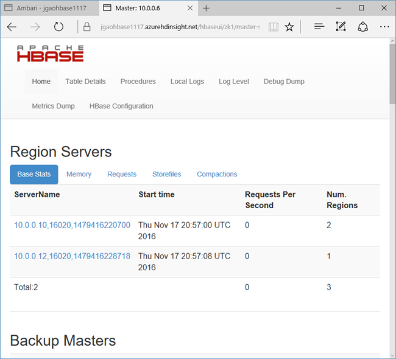

# Get started with an Apache HBase example in HDInsight

Learn how to create an HBase cluster in HDInsight, create HBase tables, and query tables by using Hive. For general HBase information, see [HDInsight HBase overview][hdinsight-hbase-overview].

[!INCLUDE [delete-cluster-warning](../../includes/hdinsight-delete-cluster-warning.md)]

## Prerequisites
Before you begin trying this HBase example, you must have the following items:

* **An Azure subscription**. See [Get Azure free trial](https://azure.microsoft.com/documentation/videos/get-azure-free-trial-for-testing-hadoop-in-hdinsight/).
* [Secure Shell(SSH)](hdinsight-hadoop-linux-use-ssh-unix.md). 
* [curl](http://curl.haxx.se/download.html).

## Create HBase cluster
The following procedure uses an Azure Resource Manager template to create a version 3.4 Linux-based HBase cluster and the dependent default Azure Storage account. To understand the parameters used in the procedure and other cluster creation methods, see [Create Linux-based Hadoop clusters in HDInsight](hdinsight-hadoop-provision-linux-clusters.md).

1. Click the following image to open the template in the Azure portal. The template is located in a public blob container. 
   
    <a href="https://portal.azure.com/#create/Microsoft.Template/uri/https%3A%2F%2Fraw.githubusercontent.com%2FAzure%2Fazure-quickstart-templates%2Fmaster%2F101-hdinsight-hbase-linux%2Fazuredeploy.json" target="_blank"></a>
2. From the **Custom deployment** blade, enter the following values:
   
   * **Subscription**: Select your Azure subscription that is used to create the cluster.
   * **Resource group**: Create an Azure Resource Management group or use an existing one.
   * **Location**: Specify the location of the resource group. 
   * **ClusterName**: Enter a name for the HBase cluster.
   * **Cluster login name and password**: The default login name is **admin**.
   * **SSH username and password**: The default username is **sshuser**.  You can rename it.
     
     Other parameters are optional.  
     
     Each cluster has an Azure Storage account dependency. After you delete a cluster, the data retains in the storage account. The cluster default storage account name is the cluster name with "store" appended. It is hardcoded in the template variables section.
3. Select **I agree to the terms and conditions stated above**, and then click **Purchase**. It takes about 20 minutes to create a cluster.

> [!NOTE]
> After an HBase cluster is deleted, you can create another HBase cluster by using the same default blob container. The new cluster picks up the HBase tables you created in the original cluster. To avoid inconsistencies, we recommend that you disable the HBase tables before you delete the cluster.
> 
> 

## Create tables and insert data
You can use SSH to connect to HBase clusters and then use HBase Shell to create HBase tables, insert data, and query data. For more information, see [Use SSH with HDInsight](hdinsight-hadoop-linux-use-ssh-unix.md).

For most people, data appears in the tabular format:

![HDInsight HBase tabular data][img-hbase-sample-data-tabular]

In HBase (an implementation of BigTable), the same data looks like:

![HDInsight HBase BigTable data][img-hbase-sample-data-bigtable]


**To use the HBase shell**

1. From SSH, run the following HBase command:
   
    ```bash
    hbase shell
    ```

2. Create an HBase with two-column families:

    ```hbaseshell   
    create 'Contacts', 'Personal', 'Office'
    list
    ```
3. Insert some data:
    
    ```hbaseshell   
    put 'Contacts', '1000', 'Personal:Name', 'John Dole'
    put 'Contacts', '1000', 'Personal:Phone', '1-425-000-0001'
    put 'Contacts', '1000', 'Office:Phone', '1-425-000-0002'
    put 'Contacts', '1000', 'Office:Address', '1111 San Gabriel Dr.'
    scan 'Contacts'
    ```
   
    ![HDInsight Hadoop HBase shell][img-hbase-shell]
4. Get a single row
   
    ```hbaseshell
    get 'Contacts', '1000'
    ```
   
    You shall see the same results as using the scan command because there is only one row.
   
    For more information about the HBase table schema, see [Introduction to HBase Schema Design][hbase-schema]. For more HBase commands, see [Apache HBase reference guide][hbase-quick-start].
5. Exit the shell
   
    ```hbaseshell
    exit
    ```

**To bulk load data into the contacts HBase table**

HBase includes several methods of loading data into tables.  For more information, see [Bulk loading](http://hbase.apache.org/book.html#arch.bulk.load).

A sample data file can be found in a public blob container, *wasb://hbasecontacts@hditutorialdata.blob.core.windows.net/contacts.txt*.  The content of the data file is:

    8396    Calvin Raji      230-555-0191    230-555-0191    5415 San Gabriel Dr.
    16600   Karen Wu         646-555-0113    230-555-0192    9265 La Paz
    4324    Karl Xie         508-555-0163    230-555-0193    4912 La Vuelta
    16891   Jonn Jackson     674-555-0110    230-555-0194    40 Ellis St.
    3273    Miguel Miller    397-555-0155    230-555-0195    6696 Anchor Drive
    3588    Osa Agbonile     592-555-0152    230-555-0196    1873 Lion Circle
    10272   Julia Lee        870-555-0110    230-555-0197    3148 Rose Street
    4868    Jose Hayes       599-555-0171    230-555-0198    793 Crawford Street
    4761    Caleb Alexander  670-555-0141    230-555-0199    4775 Kentucky Dr.
    16443   Terry Chander    998-555-0171    230-555-0200    771 Northridge Drive

You can optionally create a text file and upload the file to your own storage account. For the instructions, see [Upload data for Hadoop jobs in HDInsight][hdinsight-upload-data].

> [!NOTE]
> This procedure uses the Contacts HBase table you have created in the last procedure.
> 

1. From SSH, run the following command to transform the data file to StoreFiles and store at a relative path specified by Dimporttsv.bulk.output.  If you are in HBase Shell, use the exit command to exit.

    ```bash   
    hbase org.apache.hadoop.hbase.mapreduce.ImportTsv -Dimporttsv.columns="HBASE_ROW_KEY,Personal:Name,Personal:Phone,Office:Phone,Office:Address" -Dimporttsv.bulk.output="/example/data/storeDataFileOutput" Contacts wasb://hbasecontacts@hditutorialdata.blob.core.windows.net/contacts.txt
    ```

2. Run the following command to upload the data from  /example/data/storeDataFileOutput to the HBase table:
   
    ```bash
    hbase org.apache.hadoop.hbase.mapreduce.LoadIncrementalHFiles /example/data/storeDataFileOutput Contacts
    ```

3. You can open the HBase shell, and use the scan command to list the table content.

## Use Hive to query HBase

You can query data in HBase tables by using Hive. In this section, you create a Hive table that maps to the HBase table and uses it to query the data in your HBase table.

1. Open **PuTTY**, and connect to the cluster.  See the instructions in the previous procedure.
2. From the SSH session, use the following command to start Beeline:

    ```bash
    beeline -u 'jdbc:hive2://localhost:10001/;transportMode=http' -n admin
    ```

    For more information about Beeline, see [Use Hive with Hadoop in HDInsight with Beeline](hdinsight-hadoop-use-hive-beeline.md).
       
3. Run the following HiveQL script  to create a Hive table that maps to the HBase table. Make sure that you have created the sample table referenced earlier in this tutorial by using the HBase shell before you run this statement.

    ```hiveql   
    CREATE EXTERNAL TABLE hbasecontacts(rowkey STRING, name STRING, homephone STRING, officephone STRING, officeaddress STRING)
    STORED BY 'org.apache.hadoop.hive.hbase.HBaseStorageHandler'
    WITH SERDEPROPERTIES ('hbase.columns.mapping' = ':key,Personal:Name,Personal:Phone,Office:Phone,Office:Address')
    TBLPROPERTIES ('hbase.table.name' = 'Contacts');
    ```

4. Run the following HiveQL script to query the data in the HBase table:

    ```hiveql   
    SELECT count(rowkey) FROM hbasecontacts;
    ```

## Use HBase REST APIs using Curl

The REST API is secured via [basic authentication](http://en.wikipedia.org/wiki/Basic_access_authentication). You shall always make requests by using Secure HTTP (HTTPS) to help ensure that your credentials are securely sent to the server.

2. Use the following command to list the existing HBase tables:

    ```bash
    curl -u <UserName>:<Password> \
    -G https://<ClusterName>.azurehdinsight.net/hbaserest/
    ```

3. Use the following command to create a new HBase table with two-column families:

    ```bash   
    curl -u <UserName>:<Password> \
    -X PUT "https://<ClusterName>.azurehdinsight.net/hbaserest/Contacts1/schema" \
    -H "Accept: application/json" \
    -H "Content-Type: application/json" \
    -d "{\"@name\":\"Contact1\",\"ColumnSchema\":[{\"name\":\"Personal\"},{\"name\":\"Office\"}]}" \
    -v
    ```

    The schema is provided in the JSon format.
4. Use the following command to insert some data:

    ```bash   
    curl -u <UserName>:<Password> \
    -X PUT "https://<ClusterName>.azurehdinsight.net/hbaserest/Contacts1/false-row-key" \
    -H "Accept: application/json" \
    -H "Content-Type: application/json" \
    -d "{\"Row\":[{\"key\":\"MTAwMA==\",\"Cell\": [{\"column\":\"UGVyc29uYWw6TmFtZQ==\", \"$\":\"Sm9obiBEb2xl\"}]}]}" \
    -v
    ```
   
    You must base64 encode the values specified in the -d switch. In the example:
   
   * MTAwMA==: 1000
   * UGVyc29uYWw6TmFtZQ==: Personal:Name
   * Sm9obiBEb2xl: John Dole
     
     [false-row-key](https://hbase.apache.org/apidocs/org/apache/hadoop/hbase/rest/package-summary.html#operation_cell_store_single) allows you to insert multiple (batched) values.
5. Use the following command to get a row:
   
    ```bash 
    curl -u <UserName>:<Password> \
    -X GET "https://<ClusterName>.azurehdinsight.net/hbaserest/Contacts1/1000" \
    -H "Accept: application/json" \
    -v
    ```

For more information about HBase Rest, see [Apache HBase Reference Guide](https://hbase.apache.org/book.html#_rest).

> [!NOTE]
> Thrift is not supported by HBase in HDInsight.
>
> When using Curl or any other REST communication with WebHCat, you must authenticate the requests by providing the user name and password for the HDInsight cluster administrator. You must also use the cluster name as part of the Uniform Resource Identifier (URI) used to send the requests to the server:
> 
>   
>        curl -u <UserName>:<Password> \
>        -G https://<ClusterName>.azurehdinsight.net/templeton/v1/status
>   
>    You should receive a response similar to the following response:
>   
>        {"status":"ok","version":"v1"}
   


## Check cluster status
HBase in HDInsight ships with a Web UI for monitoring clusters. Using the Web UI, you can request statistics or information about regions.

**To access the HBase Master UI**

1. Sign into the the Ambari Web UI at https://&lt;Clustername>.azurehdinsight.net.
2. Click **HBase** from the left menu.
3. Click **Quick links** on the top of the page, point to the active Zookeeper node link, and then click **HBase Master UI**.  The UI is opened in another browser tab:

  

  The HBase Master UI contains the following sections:

  - region servers
  - backup masters
  - tables
  - tasks
  - software attributes

## Delete the cluster
To avoid inconsistencies, we recommend that you disable the HBase tables before you delete the cluster.

[!INCLUDE [delete-cluster-warning](../../includes/hdinsight-delete-cluster-warning.md)]

## Troubleshoot

If you run into issues with creating HDInsight clusters, see [access control requirements](hdinsight-administer-use-portal-linux.md#create-clusters).

## Next steps
In this article, you learned how to create an HBase cluster and how to create tables and view the data in those tables from the HBase shell. You also learned how to use a Hive query on data in HBase tables and how to use the HBase C# REST APIs to create an HBase table and retrieve data from the table.

To learn more, see:

* [HDInsight HBase overview][hdinsight-hbase-overview]:
  HBase is an Apache, open-source, NoSQL database built on Hadoop that provides random access and strong consistency for large amounts of unstructured and semistructured data.

[hdinsight-manage-portal]: hdinsight-administer-use-management-portal.md
[hdinsight-upload-data]: hdinsight-upload-data.md
[hbase-reference]: http://hbase.apache.org/book.html#importtsv
[hbase-schema]: http://0b4af6cdc2f0c5998459-c0245c5c937c5dedcca3f1764ecc9b2f.r43.cf2.rackcdn.com/9353-login1210_khurana.pdf
[hbase-quick-start]: http://hbase.apache.org/book.html#quickstart


[hdinsight-hbase-overview]: hdinsight-hbase-overview.md
[hdinsight-hbase-provision-vnet]: hdinsight-hbase-provision-vnet.md
[hdinsight-versions]: hdinsight-component-versioning.md
[hbase-twitter-sentiment]: hdinsight-hbase-analyze-twitter-sentiment.md
[azure-purchase-options]: http://azure.microsoft.com/pricing/purchase-options/
[azure-member-offers]: http://azure.microsoft.com/pricing/member-offers/
[azure-free-trial]: http://azure.microsoft.com/pricing/free-trial/
[azure-portal]: https://portal.azure.com/
[azure-create-storageaccount]: http://azure.microsoft.com/documentation/articles/storage-create-storage-account/

[img-hdinsight-hbase-cluster-quick-create]: ./media/hdinsight-hbase-tutorial-get-started-linux/hdinsight-hbase-quick-create.png
[img-hdinsight-hbase-hive-editor]: ./media/hdinsight-hbase-tutorial-get-started-linux/hdinsight-hbase-hive-editor.png
[img-hdinsight-hbase-file-browser]: ./media/hdinsight-hbase-tutorial-get-started-linux/hdinsight-hbase-file-browser.png
[img-hbase-shell]: ./media/hdinsight-hbase-tutorial-get-started-linux/hdinsight-hbase-shell.png
[img-hbase-sample-data-tabular]: ./media/hdinsight-hbase-tutorial-get-started-linux/hdinsight-hbase-contacts-tabular.png
[img-hbase-sample-data-bigtable]: ./media/hdinsight-hbase-tutorial-get-started-linux/hdinsight-hbase-contacts-bigtable.png
