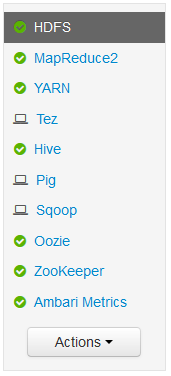
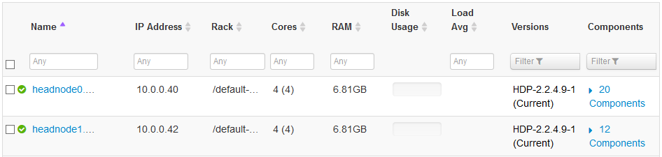
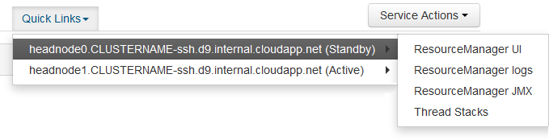
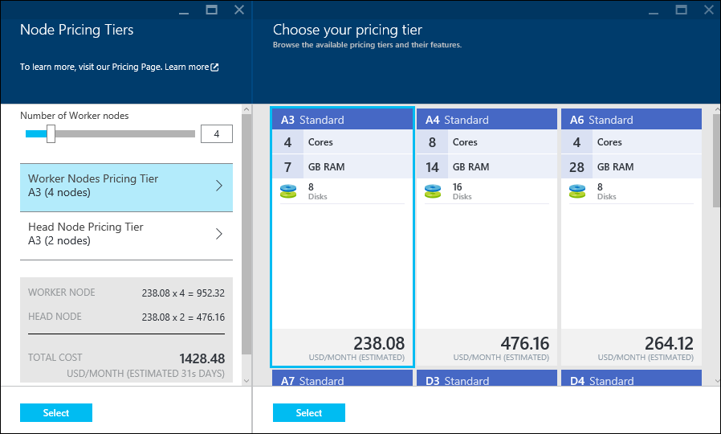

# Availability and reliability of Hadoop clusters in HDInsight

HDInsight clusters provide two head nodes to increase the availability and reliability of Hadoop services and jobs running.

Hadoop achieves high availability and reliability by replicating services and data across multiple nodes in a cluster. However standard distributions of Hadoop typically have only a single head node. Any outage of the single head node can cause the cluster to stop working. HDInsight provides two headnodes to improve Hadoop's availability and reliability.

> [!IMPORTANT]
> Linux is the only operating system used on HDInsight version 3.4 or greater. For more information, see [HDInsight retirement on Windows](hdinsight-component-versioning.md#hdinsight-windows-retirement).

## Availability and reliability of nodes

Nodes in an HDInsight cluster are implemented using Azure Virtual Machines. The following sections discuss the individual node types used with HDInsight. 

> [!NOTE]
> Not all node types are used for a cluster type. For example, a Hadoop cluster type does not have any Nimbus nodes. For more information on nodes used by HDInsight cluster types, see the Cluster types section of the [Create Linux-based Hadoop clusters in HDInsight](hdinsight-hadoop-provision-linux-clusters.md#cluster-types) document.

### Head nodes

To ensure high availability of Hadoop services, HDInsight provides two head nodes. Both head nodes are active and running within the HDInsight cluster simultaneously. Some services, such as HDFS or YARN, are only 'active' on one head node at any given time. Other services such as HiveServer2 or Hive MetaStore are active on both head nodes at the same time.

Head nodes (and other nodes in HDInsight) have a numeric value as part of the hostname of the node. For example, `hn0-CLUSTERNAME` or `hn4-CLUSTERNAME`.

> [!IMPORTANT]
> Do not associate the numeric value with whether a node is primary or secondary. The numeric value is only present to provide a unique name for each node.

### Nimbus Nodes

Nimbus nodes are available with Storm clusters. The Nimbus nodes provide similar functionality to the Hadoop JobTracker by distributing and monitoring processing across worker nodes. HDInsight provides two Nimbus nodes for Storm clusters

### Zookeeper nodes

[ZooKeeper](http://zookeeper.apache.org/) nodes are used for leader election of master services on head nodes. They are also used to insure that services, data (worker) nodes, and gateways know which head node a master service is active on. By default, HDInsight provides three ZooKeeper nodes.

### Worker nodes

Worker nodes perform the actual data analysis when a job is submitted to the cluster. If a worker node fails, the task that it was performing is submitted to another worker node. By default, HDInsight creates four worker nodes. You can change this number to suit your needs both during and after cluster creation.

### Edge node

An edge node does not actively participate in data analysis within the cluster. It is used by developers or data scientists when working with Hadoop. The edge node lives in the same Azure Virtual Network as the other nodes in the cluster, and can directly access all other nodes. The edge node can be used without taking resources away from critical Hadoop services or analysis jobs.

Currently, ML Services on HDInsight is the only cluster type that provides an edge node by default. For ML Services on HDInsight, the edge node is used test R code locally on the node before submitting it to the cluster for distributed processing.

For information on using an edge node with other cluster types, see the [Use edge nodes in HDInsight](hdinsight-apps-use-edge-node.md) document.

## Accessing the nodes

Access to the cluster over the internet is provided through a public gateway. Access is limited to connecting to the head nodes and (if one exists) the edge node. Access to services running on the head nodes is not effected by having multiple head nodes. The public gateway routes requests to the head node that hosts the requested service. For example, if Ambari is currently hosted on the secondary head node, the gateway routes incoming requests for Ambari to that node.

Access over the public gateway is limited to port 443 (HTTPS), 22, and 23.

* Port __443__ is used to access Ambari and other web UI or REST APIs hosted on the head nodes.

* Port __22__ is used to access the primary head node or edge node with SSH.

* Port __23__ is used to access the secondary head node with SSH. For example, `ssh username@mycluster-ssh.azurehdinsight.net` connects to the primary head node of the cluster named **mycluster**.

For more information on using SSH, see the [Use SSH with HDInsight](hdinsight-hadoop-linux-use-ssh-unix.md) document.

### Internal fully qualified domain names (FQDN)

Nodes in an HDInsight cluster have an internal IP address and FQDN that can only be accessed from the cluster. When accessing services on the cluster using the internal FQDN or IP address, you should use Ambari to verify the IP or FQDN to use when accessing the service.

For example, the Oozie service can only run on one head node, and using the `oozie` command from an SSH session requires the URL to the service. This URL can be retrieved from Ambari by using the following command:

    curl -u admin:PASSWORD "https://CLUSTERNAME.azurehdinsight.net/api/v1/clusters/CLUSTERNAME/configurations?type=oozie-site&tag=TOPOLOGY_RESOLVED" | grep oozie.base.url

This command returns a value similar to the following command, which contains the internal URL to use with the `oozie` command:

    "oozie.base.url": "http://hn0-CLUSTERNAME-randomcharacters.cx.internal.cloudapp.net:11000/oozie"

For more information on working with the Ambari REST API, see [Monitor and Manage HDInsight using the Ambari REST API](hdinsight-hadoop-manage-ambari-rest-api.md).

### Accessing other node types

You can connect to nodes that are not directly accessible over the internet by using the following methods:

* **SSH**: Once connected to a head node using SSH, you can then use SSH from the head node to connect to other nodes in the cluster. For more information, see the [Use SSH with HDInsight](hdinsight-hadoop-linux-use-ssh-unix.md) document.

* **SSH Tunnel**: If you need to access a web service hosted on one of the nodes that is not exposed to the internet, you must use an SSH tunnel. For more information, see the [Use an SSH tunnel with HDInsight](hdinsight-linux-ambari-ssh-tunnel.md) document.

* **Azure Virtual Network**: If your HDInsight cluster is part of an Azure Virtual Network, any resource on the same Virtual Network can directly access all nodes in the cluster. For more information, see the [Extend HDInsight using Azure Virtual Network](hdinsight-extend-hadoop-virtual-network.md) document.

## How to check on a service status

To check the status of services that run on the head nodes, use the Ambari Web UI or the Ambari REST API.

### Ambari Web UI

The Ambari Web UI is viewable at https://CLUSTERNAME.azurehdinsight.net. Replace **CLUSTERNAME** with the name of your cluster. If prompted, enter the HTTP user credentials for your cluster. The default HTTP user name is **admin** and the password is the password you entered when creating the cluster.

When you arrive on the Ambari page, the installed services are listed on the left of the page.

There are a series of icons that may appear next to a service to indicate status. Any alerts related to a service can be viewed using the **Alerts** link at the top of the page. You can select each service to view more information on it.

While the service page provides information on the status and configuration of each service, it does not provide information on which head node the service is running on. To view this information, use the **Hosts** link at the top of the page. This page displays hosts within the cluster, including the head nodes.

Selecting the link for one of the head nodes displays the services and components running on that node.

For more information on using Ambari, see [Monitor and manage HDInsight using the Ambari Web UI](hdinsight-hadoop-manage-ambari.md).

### Ambari REST API

The Ambari REST API is available over the internet. The HDInsight public gateway handles routing requests to the head node that is currently hosting the REST API.

You can use the following command to check the state of a service through the Ambari REST API:

    curl -u admin:PASSWORD https://CLUSTERNAME.azurehdinsight.net/api/v1/clusters/CLUSTERNAME/services/SERVICENAME?fields=ServiceInfo/state

* Replace **PASSWORD** with the HTTP user (admin) account password.
* Replace **CLUSTERNAME** with the name of the cluster.
* Replace **SERVICENAME** with the name of the service you want to check the status of.

For example, to check the status of the **HDFS** service on a cluster named **mycluster**, with a password of **password**, you would use the following command:

    curl -u admin:password https://mycluster.azurehdinsight.net/api/v1/clusters/mycluster/services/HDFS?fields=ServiceInfo/state

The response is similar to the following JSON:

    {
      "href" : "http://hn0-CLUSTERNAME.randomcharacters.cx.internal.cloudapp.net:8080/api/v1/clusters/mycluster/services/HDFS?fields=ServiceInfo/state",
      "ServiceInfo" : {
        "cluster_name" : "mycluster",
        "service_name" : "HDFS",
        "state" : "STARTED"
      }
    }

The URL tells us that the service is currently running on a head node named **hn0-CLUSTERNAME**.

The state tells us that the service is currently running, or **STARTED**.

If you do not know what services are installed on the cluster, you can use the following command to retrieve a list:

    curl -u admin:PASSWORD https://CLUSTERNAME.azurehdinsight.net/api/v1/clusters/CLUSTERNAME/services

For more information on working with the Ambari REST API, see [Monitor and Manage HDInsight using the Ambari REST API](hdinsight-hadoop-manage-ambari-rest-api.md).

#### Service components

Services may contain components that you wish to check the status of individually. For example, HDFS contains the NameNode component. To view information on a component, the command would be:

    curl -u admin:PASSWORD https://CLUSTERNAME.azurehdinsight.net/api/v1/clusters/CLUSTERNAME/services/SERVICE/components/component

If you do not know what components are provided by a service, you can use the following command to retrieve a list:

    curl -u admin:PASSWORD https://CLUSTERNAME.azurehdinsight.net/api/v1/clusters/CLUSTERNAME/services/SERVICE/components/component

## How to access log files on the head nodes

### SSH

While connected to a head node through SSH, log files can be found under **/var/log**. For example, **/var/log/hadoop-yarn/yarn** contain logs for YARN.

Each head node can have unique log entries, so you should check the logs on both.

### SFTP

You can also connect to the head node using the SSH File Transfer Protocol or Secure File Transfer Protocol (SFTP), and download the log files directly.

Similar to using an SSH client, when connecting to the cluster you must provide the SSH user account name and the SSH address of the cluster. For example, `sftp username@mycluster-ssh.azurehdinsight.net`. Provide the password for the account when prompted, or provide a public key using the `-i` parameter.

Once connected, you are presented with a `sftp>` prompt. From this prompt, you can change directories, upload, and download files. For example, the following commands change directories to the **/var/log/hadoop/hdfs** directory and then download all files in the directory.

    cd /var/log/hadoop/hdfs
    get *

For a list of available commands, enter `help` at the `sftp>` prompt.

> [!NOTE]
> There are also graphical interfaces that allow you to visualize the file system when connected using SFTP. For example, [MobaXTerm](http://mobaxterm.mobatek.net/) allows you to browse the file system using an interface similar to Windows Explorer.

### Ambari

> [!NOTE]
> To access log files using Ambari, you must use an SSH tunnel. The web interfaces for the individual services are not exposed publicly on the Internet. For information on using an SSH tunnel, see the [Use SSH Tunneling](hdinsight-linux-ambari-ssh-tunnel.md) document.

From the Ambari Web UI, select the service you wish to view logs for (for example, YARN). Then use **Quick Links** to select which head node to view the logs for.

## How to configure the node size

The size of a node can only be selected during cluster creation. You can find a list of the different VM sizes available for HDInsight on the [HDInsight pricing page](https://azure.microsoft.com/pricing/details/hdinsight/).

When creating a cluster, you can specify the size of the nodes. The following information provides guidance on how to specify the size using the [Azure portal][preview-portal], [Azure PowerShell][azure-powershell], and the [Azure Classic CLI][azure-cli]:

* **Azure portal**: When creating a cluster, you can set the size of the nodes used by the cluster:

    

* **Azure Classic CLI**: When using the `azure hdinsight cluster create` command, you can set the size of the head, worker, and ZooKeeper nodes by using the `--headNodeSize`, `--workerNodeSize`, and `--zookeeperNodeSize` parameters.

* **Azure PowerShell**: When using the `New-AzureRmHDInsightCluster` cmdlet, you can set the size of the head, worker, and ZooKeeper nodes by using the `-HeadNodeVMSize`, `-WorkerNodeSize`, and `-ZookeeperNodeSize` parameters.

## Next steps

Use the following links to learn more about things mentioned in this document.

* [Ambari REST Reference](https://github.com/apache/ambari/blob/trunk/ambari-server/docs/api/v1/index.md)
* [Install and configure the Azure Classic CLI](../cli-install-nodejs.md)
* [Install and configure Azure PowerShell](/powershell/azure/overview)
* [Manage HDInsight using Ambari](hdinsight-hadoop-manage-ambari.md)
* [Provision Linux-based HDInsight clusters](hdinsight-hadoop-provision-linux-clusters.md)

[preview-portal]: https://portal.azure.com/
[azure-powershell]: /powershell/azureps-cmdlets-docs
[azure-cli]: ../cli-install-nodejs.md
