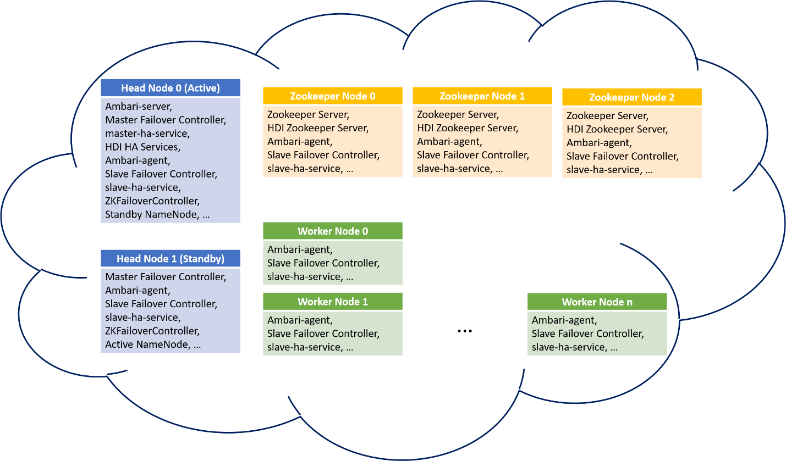

## **HDInsight Components High Availability**

The HA components in an HDInsight cluster are distributed as:

### **Overview**
HdInsight provides following components with high availability (HA), HA components may differ with respect to cluster type:

•	Ambari server \
•	Application Timeline Server for YARN \
•	Job History Server for MapReduce \
•	Livy for Spark2 Server

HDInsight utilizes HDInsight zookeeper to determine status of HA services and does failover accordingly. The HDI zookeeper is another quorum of zookeeper server running on zookeeper nodes in parallel with Apache zookeeper, which is used to decide the active headnode. The HDI HA services only run on headnodes. They should always be running only on the active headnode and should be stopped and put in maintenance mode on the standby headnode.

### **Startup**
During deployment, HDInsight agent starts HA-service-related components in the order of HDI zookeeper, master failover controller, and slave failover controller.

### **Slave failover controller**

The slave failover controller runs on every node of the cluster. It is responsible for starting Ambari agent and slave-ha-service, which is an HA service handler, on each node. It also periodically queries HDI zookeeper about the active headnode. If there is a change in the active/standby headnodes, the slave failover controller updates the hosts configuration file, restarts Ambari agent and slave-ha-service. The slave-ha-service is responsible for stopping HDI HA services on standby headnode.

### **Master failover controller**
The master failover controller runs on both head nodes. Both master failover controllers communicate with HDI zookeeper to elect the headnode they are running on as the active headnode. If a master failover controller wins the election, for example, the one on headnode 0, then headnode 0 becomes active and master failover controller starts Ambari server and master-ha-service on headnode 0. The other master failover controller stops Ambari server and master-ha-service on headnode 1. The master-ha-service only runs on active headnode, it stops HDI HA services on standby headnode and starts HA services on active headnode.

### **The failover process**
There is a health monitor, which is a daemon, running along with each master failover controller to periodically heartbeats with the headnodes. The headnode is regarded as an HA service in this scenario. The health monitor checks if the HA service is healthy and if it is ready to join in the leadership election, if yes, this HA service will compete in the election, otherwise, it will quit the election until it becomes ready again. In the case of active headnode failures, such as headnode crash, unresponsive, rebooting, etc., if the standby headnode achieves the leadership and becomes active, its master failover controller will start all HDI HA services on it and stop these services on the other headnode. In case of HDI HA service failures, such as service down, unhealthy, etc., master failover controller should be able to automatically restart or stop the services according to the headnode status. Users should not manually start HDI HA services on both head nodes, instead, allow automatic or manual failover to recover the problem.

### **HDFS NameNode high availability**
HDInsight clusters based on Hadoop 2.0 or higher provide NameNode high availability. There are two namenodes running on two headnodes, respectively, which are configured for automatic failover. The namenodes utilize ZKFailoverController to communicate with Apache zookeeper to elect for active/standby status. ZKFailoverController runs on both headnodes and works in the same way as the master failover controller above. Please notices that Apache zookeeper is independent of HDI zookeeper, thus, active namenode may not run on active headnode. When the active namenode is dead or unhealthy, the standby namenode will win the election and become active.

### **YARN ResourceManager high availability**
HDInsight clusters based on Hadoop 2.4 or higher support YARN ResourceManager high availability. There are two resource managers, rm1 and rm2, running on headnode-0 and headnode-1, respectively. Like NameNode, ResourceManager is also configured for automatic failover, i.e., when the active ResourceManager goes down or unresponsive, another ResourceManager is automatically elected to be the active one. ResourceManager uses its embedded ActiveStandbyElector as a failure detector and leader elector, thus, unlike HDFS NodeManager, ResourceManager does not need a separate ZKFC deamon. The active resource manager writes its states into Apache zookeeper. ResourceManager high availability is independent from NameNode and HDI HA services, i.e., active ResourceManager may not run on active headnode or headnode that the active NameNode is running. Refer to [this doc](https://hadoop.apache.org/docs/current/hadoop-yarn/hadoop-yarn-site/ResourceManagerHA.html) for more information about YARN ResourceManager high availability.

### **Gaps and Issues due to inadvertent manual intervention**
It is expected that HDI HA services should only be running on active headnode and should be automatically restarted when necessary. However, since individual HA service does not have its own health monitor, failover cannot be triggered at single service level. In essence failover and availability of HDI HA services is at a node level and not at a service level.

### **Some known issues**
1. When manually start an HA service on the standby headnode, it will not stop until next failover happens.
2. When an HA service on the active headnode stops, it will not restart until next failover happens or the master-ha-service restarts.
