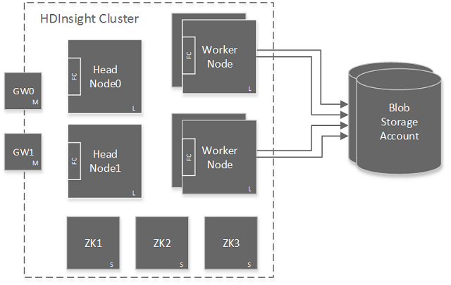
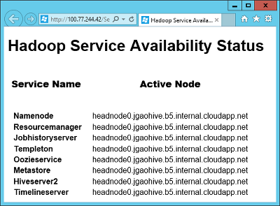
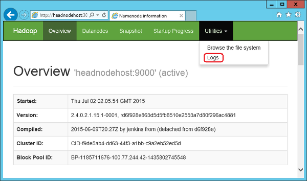

<properties
	pageTitle="Availability of Hadoop clusters in HDInsight | Microsoft Azure"
	description="HDInsight deploys highly available and reliable clusters with an addtional head node."
	services="hdinsight"
	tags="azure-portal"
	editor="cgronlun"
	manager="paulettm"
	authors="mumian"
	documentationCenter=""/>

<tags
	ms.service="hdinsight"
	ms.workload="big-data"
	ms.tgt_pltfrm="na"
	ms.devlang="multiple"
	ms.topic="article"
	ms.date="07/25/2016"
	ms.author="jgao"/>

#Availability and reliability of Windows-based Hadoop clusters in HDInsight

>[AZURE.NOTE] The steps used in this document are specific to Windows-based HDInsight clusters. If you are using a Linux-based cluster, see [Availability and reliability of Linux-based Hadoop clusters in HDInsight](hdinsight-high-availability-linux.md) for Linux-specific information.

HDInsight allows customers to deploy a variety of cluster types, for different data analytics workloads. Cluster types offered today are Hadoop clusters for query and analysis workloads, HBase clusters for NoSQL workloads, and Storm clusters for real time event processing workloads. Within a given cluster type, there are different roles for the various nodes. For example:

- Hadoop clusters for HDInsight are deployed with two roles:
	- Head node (2 nodes)
	- Data node (at least 1 node)

- HBase clusters for HDInsight are deployed with three roles:
	- Head servers (2 nodes)
	- Region servers (at least 1 node)
	- Master/Zookeeper nodes (3 nodes)

- Storm clusters for HDInsight are deployed with three roles:
	- Nimbus nodes (2 nodes)
	- Supervisor servers (at least 1 node)
	- Zookeeper nodes (3 nodes)

Standard implementations of Hadoop clusters typically have a single head node. HDInsight removes this single point of failure with the addition of a secondary head node /head server/Nimbus node to increase the availability and reliability of the service needed to manage workloads. These head  nodes/head servers/Nimbus nodes are designed to manage the failure of worker nodes smoothly, but any outages of master services running on the head node would cause the cluster to cease to work.

[ZooKeeper](http://zookeeper.apache.org/ ) nodes (ZKs) have been added and are used for leader election of head nodes and to insure that worker nodes and gateways (GWs) know when to fail over to the secondary head node (Head Node1) when the active head node (Head Node0) becomes inactive.

## Check active head node service status
To determine which head node is active and to check on the status of the services running on that head node, you must connect to the Hadoop cluster by using the Remote Desktop Protocol (RDP). For the RDP instructions, see [Manage Hadoop clusters in HDInsight by using the Azure Portal](hdinsight-administer-use-management-portal.md#connect-to-hdinsight-clusters-by-using-rdp). Once you have remoted into the cluster, double-click on the **Hadoop Service Available ** icon located on the desktop to obtain status about which head node the Namenode, Jobtracker, Templeton, Oozieservice, Metastore, and Hiveserver2 services are running, or for HDI 3.0, the Namenode, Resource Manager, History Server, Templeton, Oozieservice, Metastore, and Hiveserver2 services.

On the screenshot, the active head node is *headnode0*.

## Access log files on the secondary head node

To access job logs on the secondary head node in the event that it has become the active head node, browsing the JobTracker UI still works as it does for the primary active node. To access JobTracker, you must connect to the Hadoop cluster by using RDP as described in the previous section. Once you have remoted into the cluster, double-click on the **Hadoop Name Node Status** icon located on the desktop and then click on the **NameNode logs** to get to the directory of logs on the secondary head node.

## Configure head node size
The head nodes are allocated as large virtual machines (VMs) by default. This size is adequate for the management of most Hadoop jobs run on the cluster. But there are scenarios that may require extra-large VMs for the head nodes. One example is when the cluster has to manage a large number of small Oozie jobs.

Extra-large VMs can be configured by using either Azure PowerShell cmdlets or the HDInsight SDK.

The creation and provisioning of a cluster by using Azure PowerShell is documented in [Administer HDInsight using PowerShell](hdinsight-administer-use-powershell.md). The configuration of an extra-large head node requires the addition of the `-HeadNodeVMSize ExtraLarge` parameter to the `New-AzureRmHDInsightcluster` cmdlet used in this code.

    # Create a new HDInsight cluster in Azure PowerShell
	# Configured with an ExtraLarge head-node VM
    New-AzureRmHDInsightCluster `
				-ResourceGroupName $resourceGroupName `
				-ClusterName $clusterName ` 
				-Location $location `
				-HeadNodeVMSize ExtraLarge `
				-DefaultStorageAccountName "$storageAccountName.blob.core.windows.net" `
				-DefaultStorageAccountKey $storageAccountKey `
				-DefaultStorageContainerName $containerName  `
				-ClusterSizeInNodes $clusterNodes

For the SDK, the story is similar. The creation and provisioning of a cluster by using the SDK is documented in [Using HDInsight .NET SDK](hdinsight-provision-clusters.md#sdk). The configuration of an extra-large head node requires the addition of the `HeadNodeSize = NodeVMSize.ExtraLarge` parameter to the `ClusterCreateParameters()` method used in this code.

    # Create a new HDInsight cluster with the HDInsight SDK
	# Configured with an ExtraLarge head-node VM
    ClusterCreateParameters clusterInfo = new ClusterCreateParameters()
    {
		Name = clustername,
		Location = location,
		HeadNodeSize = NodeVMSize.ExtraLarge,
		DefaultStorageAccountName = storageaccountname,
		DefaultStorageAccountKey = storageaccountkey,
		DefaultStorageContainer = containername,
		UserName = username,
		Password = password,
		ClusterSizeInNodes = clustersize
    };

## Next Steps

- [Apache ZooKeeper](http://zookeeper.apache.org/ )
- [Connect to HDInsight clusters using RDP](hdinsight-administer-use-management-portal.md#rdp)
- [Using HDInsight .NET SDK](hdinsight-provision-clusters.md#sdk)
