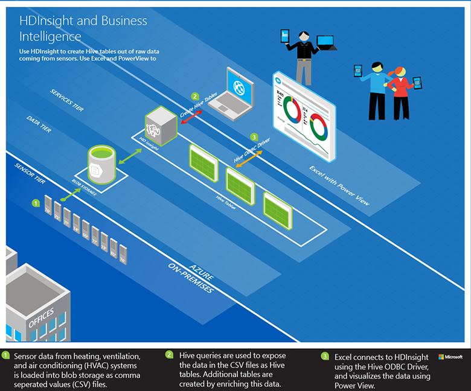

<properties
	pageTitle="Analyze sensor data using Hive and Hadoop | Microsoft Azure"
	description="Learn how to analyze sensor data by using the Hive Query Console with HDInsight (Hadoop), then visualize the data in Microsoft Excel with PowerView."
	services="hdinsight"
	documentationCenter=""
	authors="Blackmist"
	manager="paulettm"
	editor="cgronlun"
	tags="azure-portal"/>

<tags
	ms.service="hdinsight"
	ms.workload="big-data"
	ms.tgt_pltfrm="na"
	ms.devlang="na"
	ms.topic="article"
	ms.date="07/12/2016" 
	ms.author="larryfr"/>

#Analyze sensor data using the Hive Query Console on Hadoop in HDInsight

Learn how to analyze sensor data by using the Hive Query Console with HDInsight (Hadoop), then visualize the data in Microsoft Excel by using Power View.

> [AZURE.NOTE] The steps in this document only work with Windows-based HDInsight clusters.

In this sample, you'll use Hive to process historical data produced by heating, ventilation, and air conditioning (HVAC) systems to identify systems that are not able to reliably maintain a set temperature. You will learn how to:

- Create HIVE tables to query data stored in comma separated value (CSV) files.
- Create HIVE queries to analyze the data.
- Use Microsoft Excel to connect to HDInsight (using open database connectivity (ODBC) to retrieve the analyzed data.
- Use Power View to visualize the data.

##Prerequisites

* An HDInsight (Hadoop) cluster: See [Provision Hadoop clusters in HDInsight](hdinsight-provision-clusters.md) for information about creating a cluster.

* Microsoft Excel 2013

	> [AZURE.NOTE] Microsoft Excel is used for data visualization with [Power View](https://support.office.com/Article/Power-View-Explore-visualize-and-present-your-data-98268d31-97e2-42aa-a52b-a68cf460472e?ui=en-US&rs=en-US&ad=US).

* [Microsoft Hive ODBC Driver](http://www.microsoft.com/download/details.aspx?id=40886)

##To run the sample

1. From your web browser, navigate to the following URL. Replace `<clustername>` with the name of your HDInsight cluster.

	 	https://<clustername>.azurehdinsight.net

	When prompted, authenticate by using the administrator user name and password you used when provisioning this cluster.

2. From the web page that opens, click the **Getting Started Gallery** tab, and then under the **Solutions with Sample Data** category, click the **Sensor Data Analysis** sample.

3. Follow the instructions provided on the web page to finish the sample.
