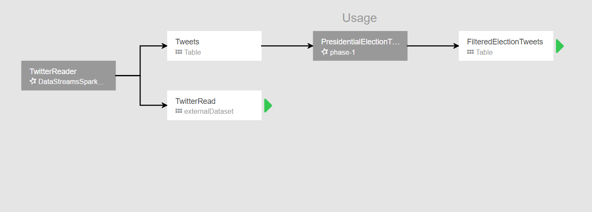
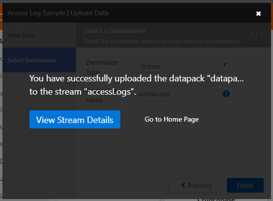
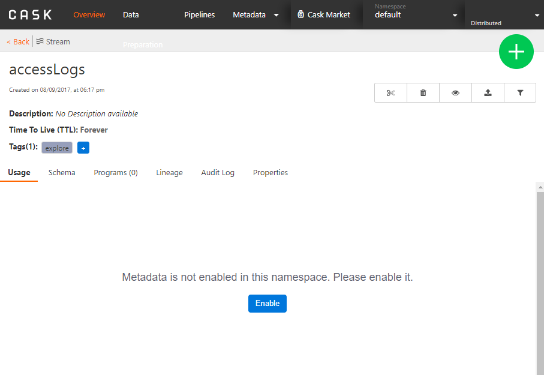
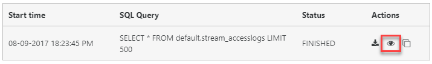
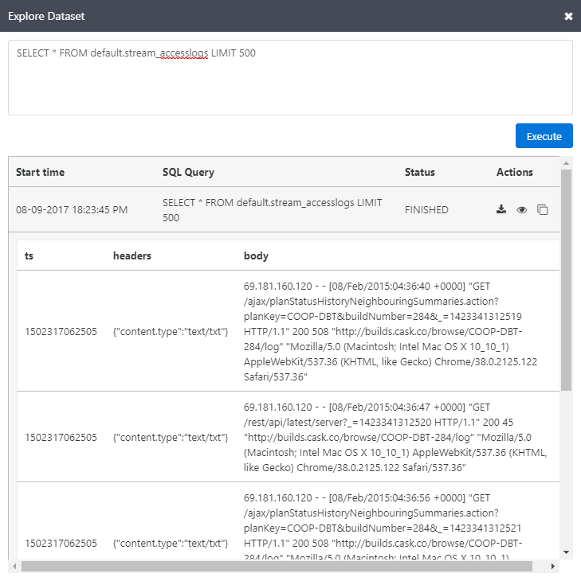

# Install published application - Cask Data Application Platform (CDAP) on Azure HDInsight

In this article, you will learn how to install the [CDAP](http://cask.co/products/cdap/) published Hadoop application on Azure HDInsight. Read [Install third-party Hadoop applications](hdinsight-apps-install-applications.md) for a list of available Independent Software Vendor (ISV) applications, as well as an overview of the HDInsight application platform. For instructions on installing your own application, see [Install custom HDInsight applications](hdinsight-apps-install-custom-applications.md).

## About CDAP

Developing applications in the traditional Hadoop world is a not an easy task. Listed below are some key aspects that add to the challenges faced by a Hadoop developer: -

* Over the past few years, the increased interest in the Big Data space has resulted in a technology explosion in the Hadoop ecosystem. It has become progressively difficult to keep track of all the existing technologies as well as new ones come up.
* Simple processes like data ingestion and ETL require a complicated setup which is not generally extensible or reusable.
* Apart from the significant learning curve involved in using each of the different Hadoop technologies, there is a substantial amount of time spent in integrating all of them to form a data processing solution.
* Moving from a proof-of-concept solution to a production-ready one is far from a trivial step involving multiple iterations and can lead to an increased unpredictability in delivery times.
* It is hard to locate data and trace its flow in an application. Collecting metrics and auditing is generally a challenge and often requires building a separate solution.

### How does CDAP help?

CDAP (Cask Data Application Platform) is a unified integration platform for big data. The highlight of CDAP is that a user can focus on building applications rather than its underlying infrastructure and integration.

CDAP works using high-level concepts and abstractions which are familiar to developers and empowers them to use their existing skills to build new solutions. These abstractions hide the complexities of internal systems and encourage re-usability of solutions.

An extension called [Cask Hydrator](http://cask.co/products/hydrator/) is available in CDAP, which provides a rich user interface to develop and manage data pipelines. A data pipeline is composed of various plugins which perform several tasks like data acquisition, transformation, analysis, and post-run operations.

Each CDAP **plugin** has well-defined interfaces which essentially means that evaluating different technologies would just be a matter of replacing a plugin with another one – there is no need to touch the rest of the application.

CDAP **pipelines** provide a high-level pictorial flow of the data in your application which enables developers to easily visualize the end-to-end flow of the data and all the steps involved in the processing starting from its ingestion, to the various transformations and analyses performed on the data followed by the eventual writing into an external data store.

Here is an example of a data pipeline which ingests twitter data in real time, filters out some tweets based on some pre-defined criteria, transforms, and projects the data into a more readable format, groups them according to a set of values and writes the results into an HBase store.

The end-to-end pipeline was completely built using the **Cask Hydrator UI**, utilizing its plugin interface and drag-and-drop functionality to form connections between each stage. It is easy to isolate and modify the functionality of each plugin independent of the rest of the pipeline. Using CDAP, similar pipelines can be built and validated in less than a couple of hours. In the traditional Hadoop world, constructing such solutions could easily take a few days.

Additionally, CDAP provides an extension called [Cask Tracker](http://cask.co/products/tracker/) where you can visually trace the data as it flows through the application. Cask tracker adds **data governance** to the system so that data assets are formally managed throughout the application. You can track its lineage, collect relevant metrics, and audit the data trail throughout the process.

Here is an illustration of how data is flowing in the above pipeline:

## Installing the CDAP published application

For step-by-step instructions on installing this and other available ISV applications, please read [Install third-party Hadoop applications](hdinsight-apps-install-applications.md#how-to-install-a-published-application).

## Prerequisites

When creating a new HDInsight cluster, or to install on an existing one, you must have the following configuration to install this app:

* Cluster tier: Standard
* Cluster type: HBase
* Cluster version: 3.4, 3.5

## Launching CDAP for the first time

After installation, you can launch CDAP from your cluster in Azure portal by going to the **Settings** pane, then clicking **Applications** under the **General** category. The Installed Apps pane lists all the installed applications.

When you select CDAP, you'll see a link to the web page, HTTP Endpoint, as well as the SSH endpoint path. Select the WEBPAGE link.

When prompted, enter your cluster admin credentials.

After signing in, you will be presented with the Cask CDAP GUI home page.

To get an idea of using the CDAP interface, click the **Cask Market** menu link on top of the page.

Select the **Access Log Sample** from the list.

Click **Load** to confirm.

A sample view of the included data will be displayed. Click **Next**.

Select **Stream** as the Destination Type, enter a Destination Name, then click **Finish**.

Once the datapack has been successfully loaded, click **View Stream Details**.

On the Access Log details page, click **Enable** within the Usage tab to enable metadata for the namespace.

You will see a graph displaying audit message information, once metadata has been enabled.

To explore the log data, click the **Explore** icon on top of the page.

You will  see a sample SQL query. Feel free to modify, if desired, then click **Execute**.

After the query has finished, click the **View** icon under the Actions column.

You will now see the query results.

## Next steps
* Read the Cask [documentation](http://cask.co/resources/documentation/)
* [Install custom HDInsight applications](../hdinsight-apps-install-custom-applications.md): learn how to deploy an un-published HDInsight application to HDInsight.
* [Publish HDInsight applications](../hdinsight-apps-publish-applications.md): Learn how to publish your custom HDInsight applications to Azure Marketplace.
* [MSDN: Install an HDInsight application](https://msdn.microsoft.com/library/mt706515.aspx): Learn how to define HDInsight applications.
* [Customize Linux-based HDInsight clusters using Script Action](hdinsight-hadoop-customize-cluster-linux.md): learn how to use Script Action to install additional applications.
* [Use empty edge nodes in HDInsight](../hdinsight-apps-use-edge-node.md): learn how to use an empty edge node for accessing HDInsight cluster, testing HDInsight applications, and hosting HDInsight applications.

