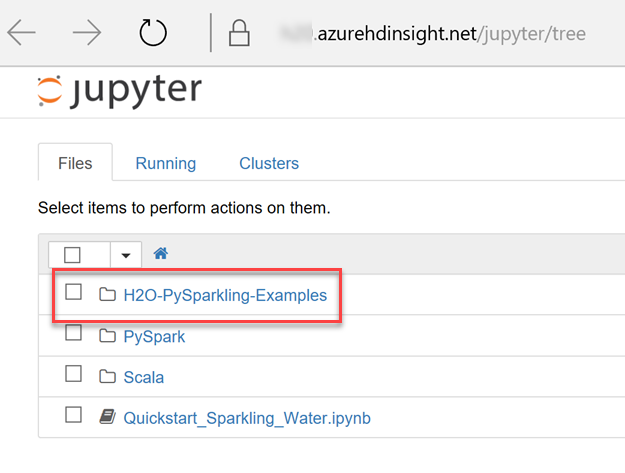
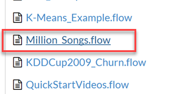
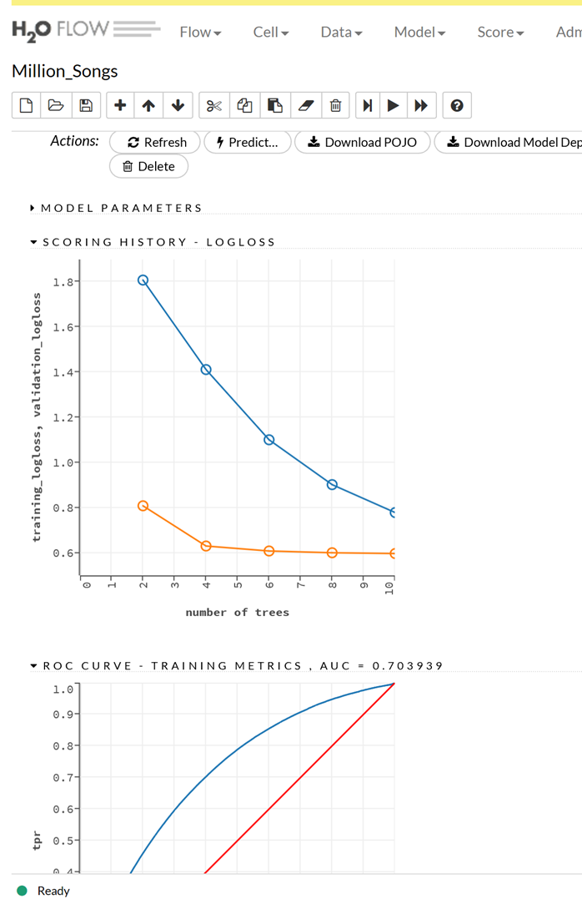

# Install published application - H2O Sparkling Water on Azure HDInsight

In this article, you will learn how to install the [H20 Sparkling Water](http://www.h2o.ai/) published Hadoop application on Azure HDInsight. Read [Install third-party Hadoop applications](hdinsight-apps-install-applications.md) for a list of available Independent Software Vendor (ISV) applications, as well as an overview of the HDInsight application platform. For instructions on installing your own application, see [Install custom HDInsight applications](../hdinsight-apps-install-custom-applications.md).

## About H2O Sparkling Water

H2O Sparkling Water is a 100% open source, fully distributed in-memory machine learning platform with linear scalability. It allows users to combine the fast, scalable machine learning algorithms of H2O with the capabilities of Spark. With Sparkling Water, users can drive computation from Scala/R/Python and utilize the H2O Flow UI, providing an ideal machine learning platform for application developers.

H2O Sparkling Water intelligently combines the following features:

* **Best of Breed Open Source Technology** – Enjoy the freedom that comes with big data science powered by open source technology.
* **Easy-to-use WebUI and Familiar Interfaces** – Set up and get started quickly using either H2O’s intuitive web-based Flow GUI or familiar programming environments like R, Python, Java, Scala, JSON, and through our powerful APIs.
* **Data Agnostic Support for all Common Database and File Types** – Easily explore and model big data from within Microsoft Excel, R Studio, Tableau and more. Connect to data from HDFS, S3, SQL and NoSQL data sources.
* **Massively Scalable Big Data Munging and Analysis** – H2O Big Joins performs 7x faster than R data.table in a benchmark, and linearly scales to 10 billion x 10 billion row joins.
* **Real-time Data Scoring** – Rapidly deploy models to production using plain-old Java objects (POJO), model-optimized Java objects (MOJO), or the REST API.

### Resource links

* [H2O.ai Engineering Roadmap](https://jira.h2o.ai/)
* [H2O.ai Home](http://www.h2o.ai/)
* [H2O.ai Documentation](http://docs.h2o.ai/)
* [H2O.ai Support](https://support.h2o.ai/)
* [H2O.ai Open Source Codebase](https://github.com/h2oai/)

## Installing the H2O Sparkling Water published application

For step-by-step instructions on installing this and other available ISV applications, please read [Install third-party Hadoop applications](hdinsight-apps-install-applications.md#how-to-install-a-published-application).

## Prerequisites

When creating a new HDInsight cluster, or to install on an existing one, you must have the following configuration to install this app:

* Cluster tier(s): Standard or Premium
* Cluster type: Spark
* Cluster version(s): 3.5 or 3.6

## Launching H2O Sparkling Water for the first time

After installation, you can start using H2O Sparkling Water (h2o-sparklingwater) from your cluster in Azure portal by opening Jupyter Notebooks (`https://<ClusterName>.azurehdinsight.net/jupyter`). An alternate way to get to Jupyter is by selecting **Cluster dashboard** from your cluster blade in the portal, then selecting **Jupyter Notebook**. You will be prompted to enter your credentials. Enter the cluster's hadoop credentials you specified on cluster creation.

In Jupyter, you will see 3 folders: H2O-PySparkling-Examples, PySpark Examples, and Scala Examples. Select the **H2O-PySparkling-Examples** folder.

Now that you've logged into Jupyter Notebook and selected the H2O folder, please follow these steps for a "Hello World" demonstration:

* The first step when creating a new notebook is to configure the Spark environment. This information is included in the **Sentiment_analysis_with_Sparkling_Water** example. When configuring the Spark environment, be sure to use the correct jar, and specify the IP address provided by the output of the first cell.

    

* Start the H2O Cluster.

    

* Once the H2O Cluster is up and running, open H2O Flow by going to **`https://<ClusterName>-h2o.apps.azurehdinsight.net:443`**.

    > Note: If you are unable to open H2O Flow (it just redirects you to a help page), try clearing your browser cache. If still unable to reach it, you likely do not have enough resources on your cluster. Try increasing the number of Worker nodes under the **Scale cluster** option in your cluster blade.

    

* Select the **Million_Songs.flow** example from the menu on the right. When prompted with a warning, click **Load Notebook**. This demo is designed to run in a few minutes using real data. The goal is to predict from the data whether the song was released before or after 2004 using binary classification. 

    

* Find the path containing **milsongs-cls-train.csv.gz**, and replace the entire path with **https://h2o-public-test-data.s3.amazonaws.com/bigdata/laptop/milsongs/milsongs-cls-train.csv.gz**.

* Find the path containing **milsongs-cls-test.csv.gz** and replace with **https://h2o-public-test-data.s3.amazonaws.com/bigdata/laptop/milsongs/milsongs-cls-test.csv.gz**.

* Click the **Run All** button on the toolbar to execute all statements within the notebook cells.

    

* After several minutes, you should see an output similar to the following:

    

That's it! You've harnessed artificial intelligence in Spark within a matter of minutes. Feel free to explore more examples in H2O Flow to get a feel for the different types of machine learning algorithms you can use.

## Next steps
* Read the H2O [documentation](http://docs.h2o.ai/h2o/latest-stable/h2o-docs/index.html)
* [Install custom HDInsight applications](../hdinsight-apps-install-custom-applications.md): learn how to deploy an un-published HDInsight application to HDInsight.
* [Publish HDInsight applications](../hdinsight-apps-publish-applications.md): Learn how to publish your custom HDInsight applications to Azure Marketplace.
* [MSDN: Install an HDInsight application](https://msdn.microsoft.com/library/mt706515.aspx): Learn how to define HDInsight applications.
* [Customize Linux-based HDInsight clusters using Script Action](hdinsight-hadoop-customize-cluster-linux.md): learn how to use Script Action to install additional applications.
* [Use empty edge nodes in HDInsight](../hdinsight-apps-use-edge-node.md): learn how to use an empty edge node for accessing HDInsight cluster, testing HDInsight applications, and hosting HDInsight applications.

