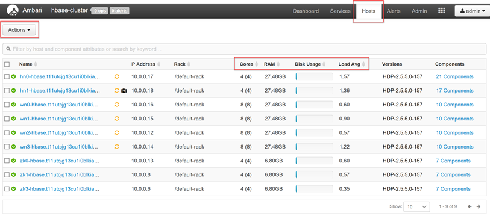
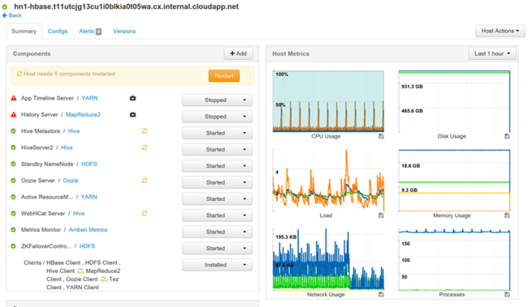
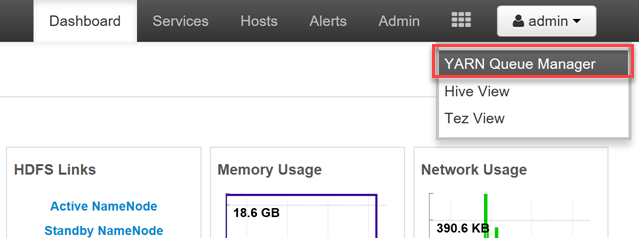
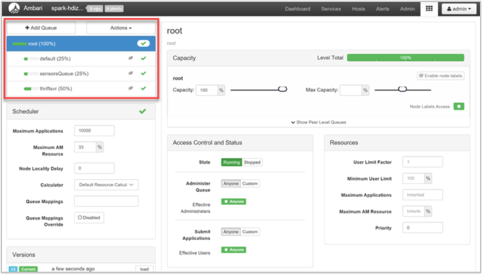
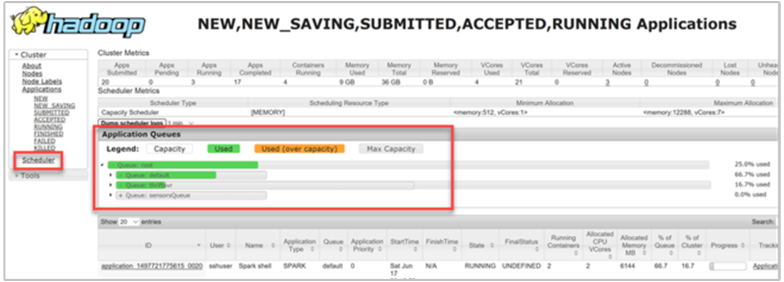
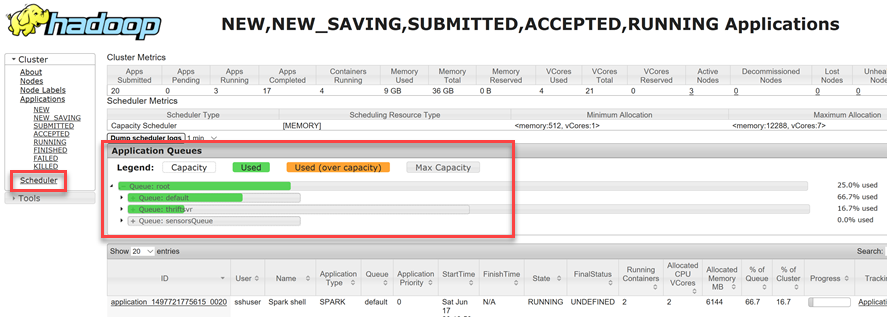

# Monitor cluster performance

Monitoring the health and performance of an HDInsight cluster is essential for maintaining maximum performance and resource utilization. Monitoring can also help you address possible coding or cluster configuration errors.

The following sections describe how to optimize cluster loading, YARN queue efficiency, and storage accessibility.

## Cluster loading

Hadoop clusters should balance loading across the nodes of the cluster. This balancing prevents processing tasks from being constrained by RAM, CPU, or disk resources.

To get a high-level look at the nodes of your cluster and their loading, log in to the [Ambari Web UI](hdinsight-hadoop-manage-ambari.md), then select the **Hosts** tab. Your hosts are listed by their fully qualified domain names. Each host's operating status is shown by a colored health indicator:

| Color | Description |
| --- | --- |
| Red | At least one master component on the host is down. Hover to see a tooltip that lists affected components. |
| Orange | At least one slave component on the host is down. Hover to see a tooltip that lists affected components. |
| Yellow | Ambari Server has not received a heartbeat from the host for more than 3 minutes. |
| Green | Normal running state. |

You'll also see columns showing the number of cores and amount of RAM for each host, and the disk usage and load average.

Select any of the host names for a detailed look at components running on that host and their metrics. The metrics are shown as a selectable timeline of CPU usage, load, disk usage, memory usage, network usage, and numbers of processes.

See [Manage HDInsight clusters by using the Ambari Web UI](hdinsight-hadoop-manage-ambari.md) for details on setting alerts and viewing metrics.

## YARN queue configuration

Hadoop has various services running across its distributed platform. YARN (Yet Another Resource Negotiator) coordinates these services, allocates cluster resources, and manages access to a common data set.

YARN divides the two responsibilities of the JobTracker, resource management and job scheduling/monitoring, into two daemons: a global ResourceManager, and a per-application ApplicationMaster (AM).

The ResourceManager is a *pure scheduler*, and solely arbitrates available resources between all competing applications. The ResourceManager ensures that all resources are always in use, optimizing for various constants such as SLAs, capacity guarantees, and so forth. The ApplicationMaster negotiates resources from the ResourceManager, and works with the NodeManager(s) to execute and monitor the containers and their resource consumption.

When multiple tenants share a large cluster, there is competition for the cluster's resources. The CapacityScheduler is a pluggable scheduler that assists in resource sharing by queueing up requests. The CapacityScheduler also supports *hierarchical queues* to ensure that resources are shared between the sub-queues of an organization, before other applications' queues are allowed to use free resources.

YARN allows us to allocate resources to these queues, and shows you whether all of your available resources are assigned. To view information about your queues, log in to the Ambari Web UI, then select **YARN Queue Manager** from the top menu.

The YARN Queue Manager page shows a list of your queues on the left, along with the percentage of capacity assigned to each.

For a more detailed look at your queues, from the Ambari dashboard, select the **YARN** service from the list on the left. Then under the **Quick Links** dropdown menu, select **ResourceManager UI** underneath your active node.

In the ResourceManager UI, select **Scheduler** from the left-hand menu. You see a list of your queues underneath *Application Queues*. Here you can see the capacity used for each of your queues, how well the jobs are distributed between them, and whether any jobs are resource-constrained.

## Storage throttling

A cluster's performance bottleneck can happen at the storage level. This type of bottleneck is most often due to *blocking* input/output (IO) operations, which happen when your running tasks send more IO than the storage service can handle. This blocking creates a queue of IO requests waiting to be processed until after current IOs are processed. The blocks are due to *storage throttling*, which is not a physical limit, but rather a limit imposed by the storage service by a service level agreement (SLA). This limit ensures that no single client or tenant can monopolize the service. The SLA limits the number of IOs per second (IOPS) for Azure Storage - for details, see [Azure Storage Scalability and Performance Targets](https://docs.microsoft.com/azure/storage/storage-scalability-targets).

If you are using Azure Storage, for information on monitoring storage-related issues, including throttling, see [Monitor, diagnose, and troubleshoot Microsoft Azure Storage](https://docs.microsoft.com/azure/storage/storage-monitoring-diagnosing-troubleshooting).

If your cluster's backing store is Azure Data Lake Store (ADLS), your throttling is most likely due to bandwidth limits. Throttling in this case could be identified by observing throttling errors in task logs. For ADLS, see the throttling section for the appropriate service in these articles:

* [Performance tuning guidance for Hive on HDInsight and Azure Data Lake Store](../data-lake-store/data-lake-store-performance-tuning-hive.md)
* [Performance tuning guidance for MapReduce on HDInsight and Azure Data Lake Store](../data-lake-store/data-lake-store-performance-tuning-mapreduce.md)
* [Performance tuning guidance for Storm on HDInsight and Azure Data Lake Store](../data-lake-store/data-lake-store-performance-tuning-storm.md)

## Next steps

Visit the following links for more information about troubleshooting and monitoring your clusters:

* [Analyze HDInsight logs](hdinsight-debug-jobs.md)
* [Debug apps with YARN logs](hdinsight-hadoop-access-yarn-app-logs-linux.md)
* [Enable heap dumps for Hadoop services on Linux-based HDInsight](hdinsight-hadoop-collect-debug-heap-dump-linux.md)
